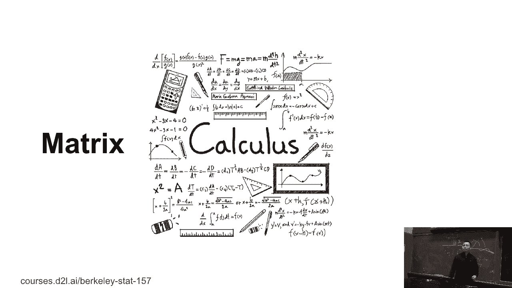
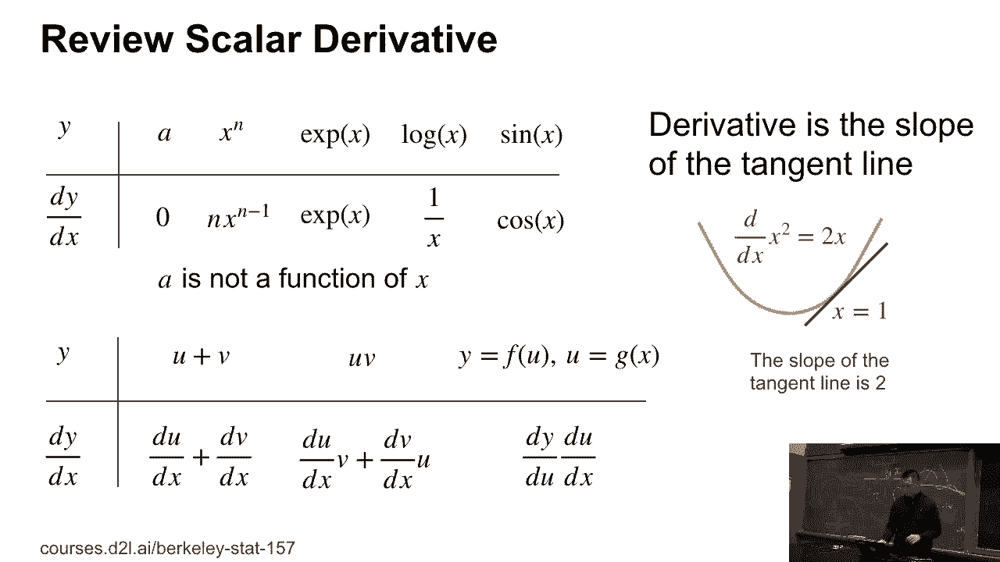
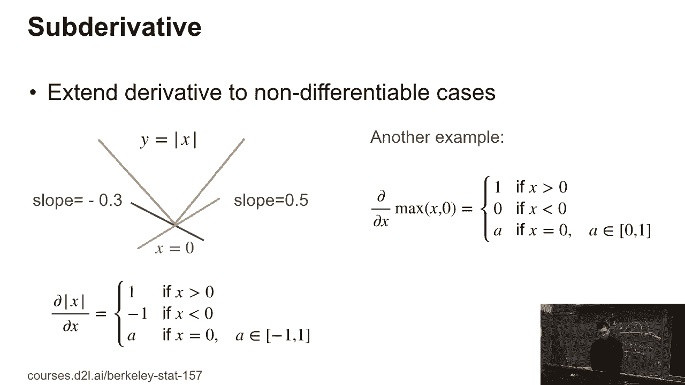
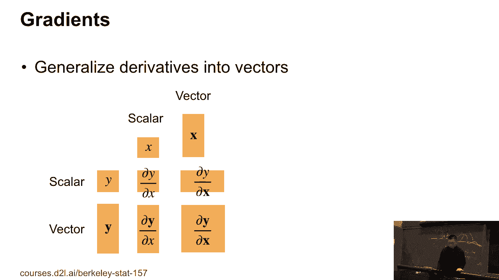
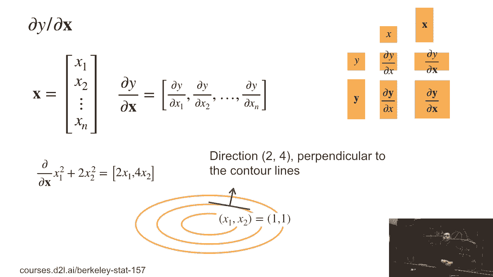
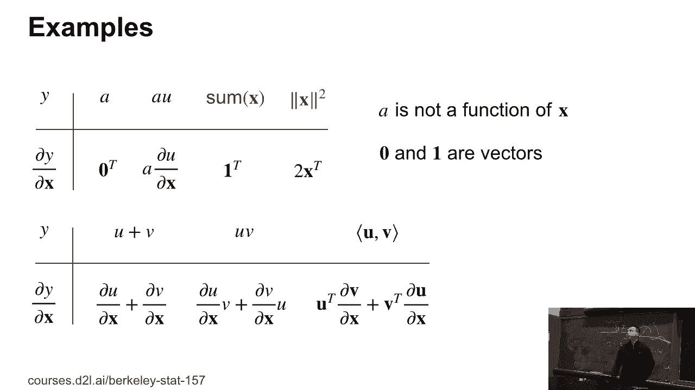
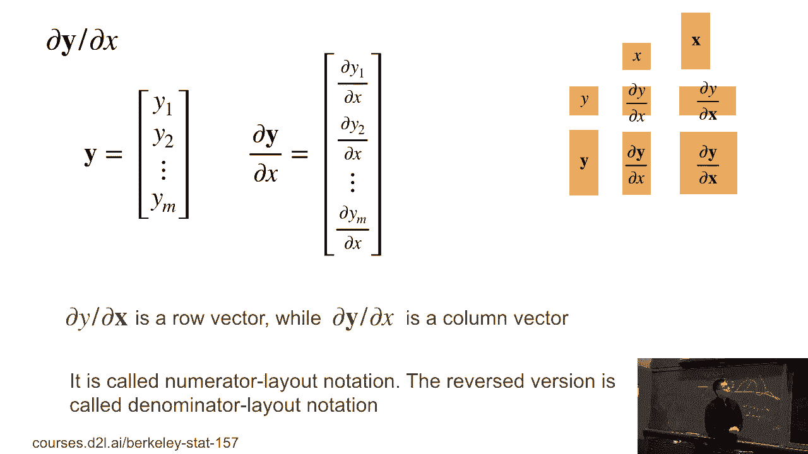
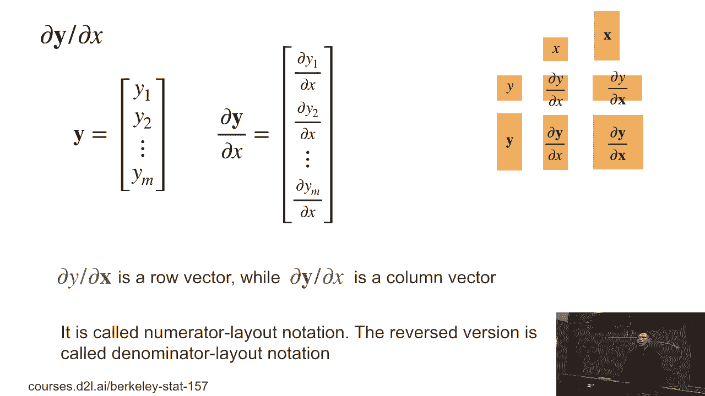
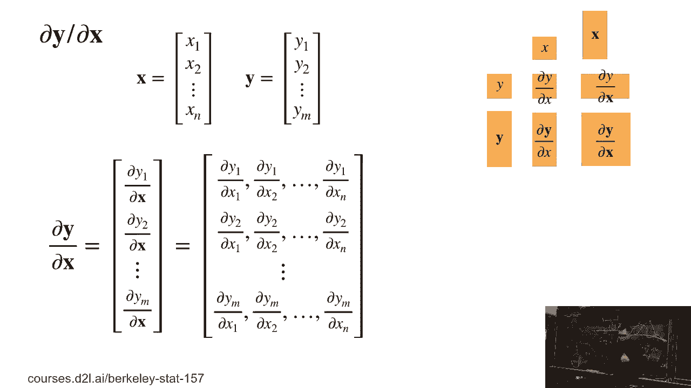
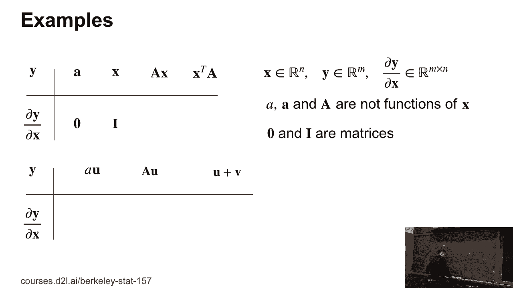

# 15：L3_4 自动微分 🧮

在本节课中，我们将要学习自动微分的基础知识。我们将从标量导数开始，逐步推广到向量和矩阵的导数，并理解梯度、雅可比矩阵等核心概念。这些知识是理解深度学习优化算法（如梯度下降）的基础。

---

## 标量导数 📈

上一节我们介绍了课程概述，本节中我们来看看最基础的标量导数。

给定一个标量函数 **y = f(x)**，其中 **x** 和 **y** 都是标量，我们计算导数 **dy/dx**。

以下是基本的导数规则：
*   如果 **a** 不是 **x** 的函数，则 **da/dx = 0**。
*   如果 **y = x^m**，则 **dy/dx = m * x^(m-1)**。
*   如果 **y = exp(x)**，则 **dy/dx = exp(x)**。
*   如果 **y = log(x)**，则 **dy/dx = 1/x**。
*   如果 **y = sin(x)**，则 **dy/dx = cos(x)**。

对于复合函数，我们有运算法则：
*   加法法则：如果 **y = u + v**，则 **dy/dx = du/dx + dv/dx**。
*   乘法法则：如果 **y = u * v**，则 **dy/dx = du/dx * v + dv/dx * u**。
*   链式法则：如果 **y** 是 **u** 的函数，而 **u** 是 **x** 的函数，则 **dy/dx = (dy/du) * (du/dx)**。

导数的几何意义是函数在某一点切线的斜率。例如，对于函数 **y = x^2**，在 **x=1** 处的导数为 **2**，这意味着该点切线的斜率为 **2**。

---

## 不可微函数与次导数 ⚠️

上一节我们介绍了可微函数的导数，本节中我们来看看不可微函数的情况。

并非所有函数在所有点都可微。例如，在第一节课中提到的 **L1** 范数，其简化版本是绝对值函数 **y = |x|**。在 **x=0** 这一点，函数不可微。

对于不可微的点，我们可以使用**次导数**的概念，它是导数概念的推广。次导数是所有可能切线斜率的集合。

以下是两个重要例子：
*   绝对值函数 **|x|** 的次导数：
    *   当 **x > 0** 时，次导数为 **{1}**。
    *   当 **x < 0** 时，次导数为 **{-1}**。
    *   当 **x = 0** 时，次导数为区间 **[-1, 1]** 内的任意值。实践中，我们常选择 **0**、**1** 或 **-1**。
*   最大值函数 **max(x, 0)** 的次导数：
    *   当 **x > 0** 时，次导数为 **{1}**。
    *   当 **x < 0** 时，次导数为 **{0}**。
    *   当 **x = 0** 时，次导数为区间 **[0, 1]** 内的任意值。实践中，我们常选择 **0** 或 **1**。

---

## 从标量到向量：梯度 🧭

上一节我们讨论了标量，本节中我们来看看如何将导数概念推广到向量，这是机器学习和神经网络中的关键。

当输入 **x** 是向量，输出 **y** 是标量时，导数推广为**梯度**。

设 **x** 是一个 **n** 维列向量：**x = [x1, x2, ..., xn]^T**，**y** 是一个标量。那么 **y** 关于 **x** 的梯度是一个行向量：
**∇_x y = [∂y/∂x1, ∂y/∂x2, ..., ∂y/∂xn]**

例如，若 **y = x1^2 + 2*x2^2**，则梯度为：
**∇_x y = [2*x1, 4*x2]**

梯度指向函数值增加最快的方向。在点 **(x1=1, x2=1)**，梯度为 **[2, 4]**。如果我们沿着这个方向移动，**y** 值会增加；反之，沿着反方向移动（梯度下降），**y** 值会减少。这是优化算法的基础。

以下是向量梯度的一些规则（假设 **u** 和 **v** 是 **x** 的函数，**a** 是常数）：
*   **∇_x a = 0** （零行向量）
*   **∇_x (a*u) = a * ∇_x u**
*   **∇_x (sum(x)) = 1^T** （全1行向量）
*   **∇_x (||x||_2^2) = 2 * x^T**
*   加法法则：**∇_x (u+v) = ∇_x u + ∇_x v**
*   乘法法则：**∇_x (u*v) = (∇_x u) * v + u * (∇_x v)** （注意维度匹配）

---

## 向量对向量：雅可比矩阵 🔢

上一节我们介绍了标量对向量的梯度，本节中我们来看看更一般的情况：向量对向量的导数。

当输入 **x** 是标量，输出 **y** 是 **m** 维向量时，导数是列向量：
**∂y/∂x = [∂y1/∂x, ∂y2/∂x, ..., ∂ym/∂x]^T**

当输入 **x** 是 **n** 维向量，输出 **y** 是 **m** 维向量时，导数是一个矩阵，称为**雅可比矩阵**：
**J = ∂y/∂x**， 其中第 **i** 行第 **j** 列元素为 **∂yi/∂xj**。

雅可比矩阵的维度是 **m × n**。

以下是雅可比矩阵的例子：
*   若 **y = a**（常向量），则 **∂y/∂x = 0**（零矩阵）。
*   若 **y = x**（恒等映射），则 **∂y/∂x = I**（单位矩阵）。
*   若 **y = A * x**，其中 **A** 是矩阵，**x** 是向量，则 **∂y/∂x = A**。
*   若 **y = A^T * x**，则 **∂y/∂x = A^T**。

运算法则与之前类似：
*   **∂(a*u)/∂x = a * ∂u/∂x** （**a** 为常数标量或矩阵）
*   **∂(u+v)/∂x = ∂u/∂x + ∂v/∂x**

---

## 扩展到矩阵与张量 📊

上一节我们讨论了向量的情况，本节中我们简要看看当输入或输出是矩阵时的形状规律。

当 **x** 和 **y** 是更高维的张量（如矩阵）时，导数的计算更复杂，但我们可以关注其形状规律。

设 **y** 的形状为 **S(y)**，**x** 的形状为 **S(x)**。那么导数 **∂y/∂x** 的形状通常为：**S(y) + reverse(S(x))**，其中 `+` 表示形状的拼接，`reverse` 表示将形状顺序反转。

例如：
*   **y** 是标量，**x** 是 **n×k** 矩阵：导数形状为 **k×n**（即 **x** 形状的转置）。
*   **y** 是 **m** 维向量，**x** 是 **n×k** 矩阵：导数形状为 **m×k×n**（一个三维张量）。
*   **y** 是 **m×l** 矩阵，**x** 是 **n** 维向量：导数形状为 **m×l×n**。
*   **y** 和 **x** 都是矩阵：导数是一个四维张量。

理解这些形状规律有助于我们在实现自动微分时管理数据的维度。

---

## 总结 🎯

本节课中我们一起学习了自动微分的基础数学概念。
1.  我们回顾了**标量导数**的基本规则和几何意义。
2.  我们认识了**不可微函数**，并学习了**次导数**这一推广概念。
3.  我们将导数推广到向量，引入了**梯度**的概念，并理解了其指向函数值最快增长方向的重要性。
4.  我们学习了**雅可比矩阵**，用于描述向量对向量的导数。
5.  最后，我们了解了当输入输出是矩阵或更高维张量时，导数结果的**形状规律**。

掌握这些知识是理解后续深度学习模型如何通过梯度下降等算法进行训练的关键。