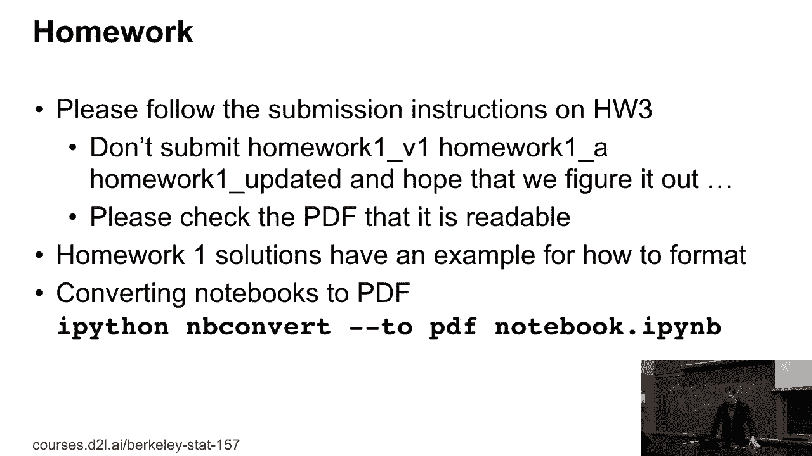
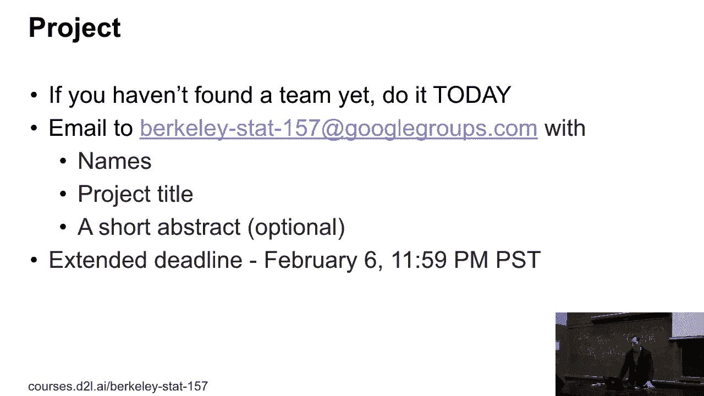
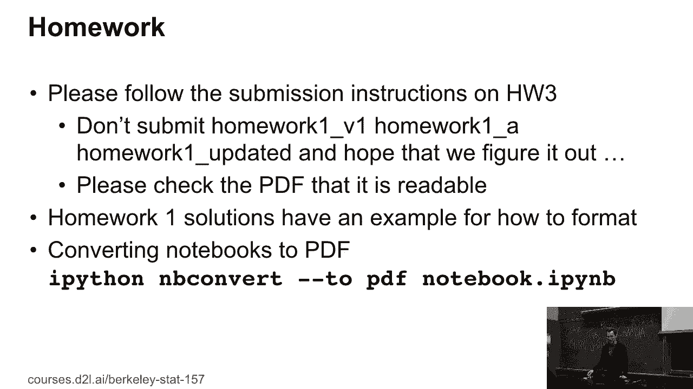
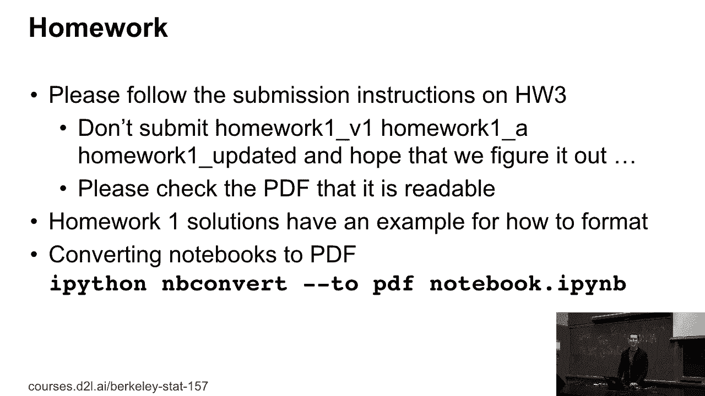

# 17：L5_1 作业和项目后勤 📋


在本节课中，我们将要学习关于课程作业提交和项目管理的具体后勤安排。我们将明确项目注册的截止日期、团队组建要求、作业提交的格式规范，并解答一些常见问题。



---

## 项目注册与团队组建

上一节我们介绍了课程的整体安排，本节中我们来看看项目注册的具体要求。

首先，项目注册的截止日期是昨天。如果你还没有注册项目，你需要在明天之前完成注册。

如果你还没有找到团队，请按照以下步骤操作：

以下是项目注册的补救措施：
*   给指定邮箱发送邮件。
*   邮件内容需包含你和团队成员的名字、项目标题以及简短的摘要。
*   项目本应在昨天提交，但我们会给予宽限期至明天。

关于团队规模，我们有以下建议：
*   如果你目前是三人团队，可以考虑在课后招募更多队员。
*   如果你已经是四人团队，同样可以接纳希望加入学习的同学。

项目标题目前可以自由拟定，例如 `"看油漆干"`。但这主要是为了确保你有一个团队。一个月后，将有一次简短的进展展示，届时你需要一个更正式的项目标题。

如果你缺乏项目想法，可以寻求以下帮助：
*   参加助教的办公时间进行讨论。
*   与你的导师或其他同学交流。
*   我们也可以提供帮助，但不会强制要求你采用特定格式。

---

## 项目中期要求与时间规划

在接下来的一个月内，你需要完成比确定标题更多的工作。

四周后，你需要提交一份项目计划文档。该文档的要求如下：
*   长度：至少一页，最多两页。
*   内容：描述你计划做什么以及大致的实施思路。
*   目的：这相当于一次项目推介，你需要说明数据来源或项目重要性。

届时还将进行口头展示，具体要求是：
*   时间：每人约四分钟。
*   形式：相当于最多两张幻灯片的内容。



我们强烈建议你尽早开始项目工作。随着学期推进，所有课程的任务量都会增加，提前规划可以减轻期末时的压力。


---




## 作业提交格式规范

上一节我们讨论了项目安排，本节中我们来看看作业提交的具体格式要求。

我们注意到大家在提交作业时，对文件的命名方式各不相同。这给助教批改带来了困扰。

请避免出现以下情况：
*   在提交的文件夹中存放多个版本的文件，例如 `作业版本1`、`作业A`、`作业更新`。
*   这迫使助教需要猜测哪一份是你真正打算提交的最终版本。

为了规范提交，第三次作业的指示将更加明确。同时，我们将发布作业1的参考解决方案，该方案综合了提交作业中的优秀部分。

---

## 作业转换为PDF的解决方案


关于将Jupyter笔记本转换为PDF提交，我们提供以下方法和注意事项。

一种常见的方法是使用 `nbconvert` 工具。你可以在命令行中执行类似以下的代码：
```bash
jupyter nbconvert --to pdf 你的笔记本.ipynb
```

你也可以在Stack Overflow等平台搜索“IPython notebook to PDF”来找到更多解决方案。


请注意以下关键点：
1.  **公式渲染**：用于转换的MathJax并非完整的LaTeX，某些复杂的公式环境可能不被支持。
2.  **内容长度**：如果你的作业解答长达16页，说明你可能投入了远超预期的时间。虽然值得称赞，但通常一个问题的解答可以更精炼。
3.  **提交前检查**：务必在提交前打开生成的PDF文件，确保其内容清晰、完整、可读。这是提交任何文件（如会议论文、工作申请）时应养成的好习惯。
4.  **图表问题**：正常情况下，转换工具不应将图表导出为单独的PDF文件。如果遇到此问题，可能是你的转换工具配置有误，需要检查。

如果遇到上述公式不支持的问题，可以考虑：
*   将该特定解答单独以LaTeX格式提交。
*   尝试直接从Jupyter笔记本通过浏览器的“打印”功能生成PDF，有时效果更好。

---

## 总结


本节课中我们一起学习了课程项目与作业的后勤管理要点。



我们明确了项目注册的宽限期、团队组建的建议以及项目中期检查的要求。在作业方面，我们强调了规范命名和提交单一最终版本的重要性，并详细介绍了将Jupyter笔记本正确转换为PDF格式的方法与常见问题解决方案。


请务必遵循这些指南，以确保你和助教都能高效地完成课程任务。