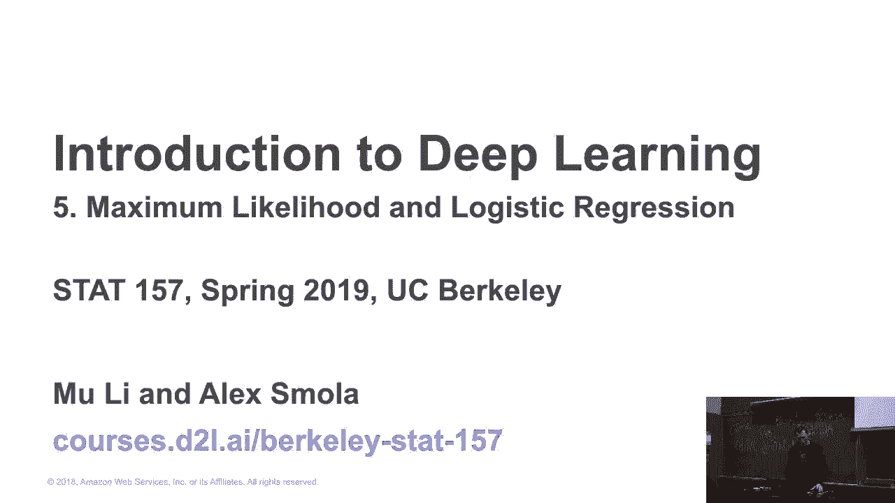
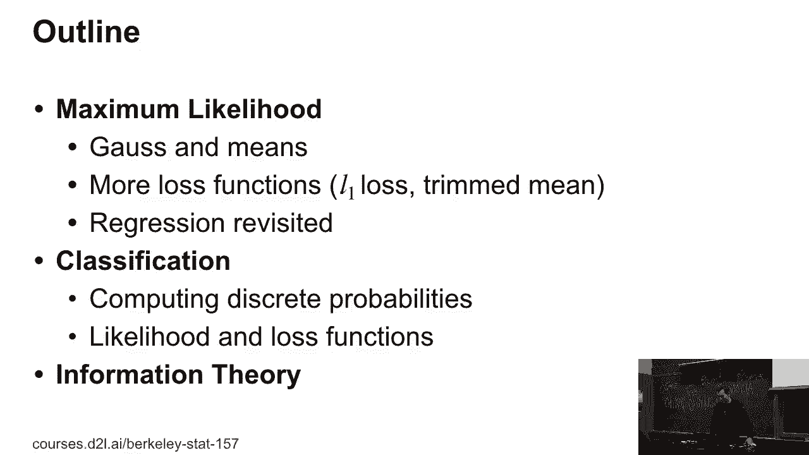
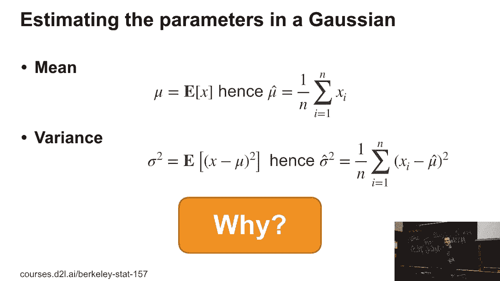
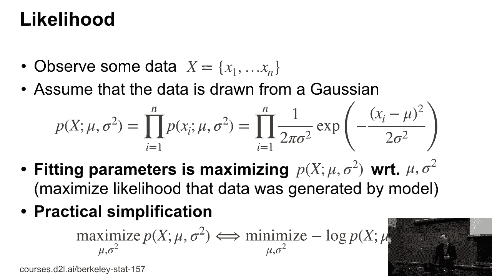
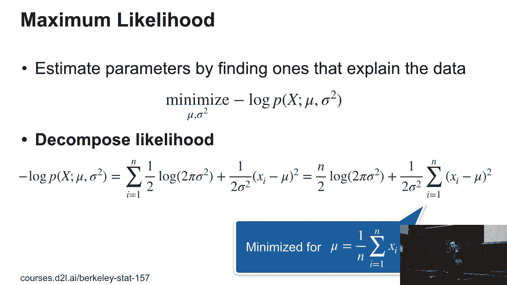
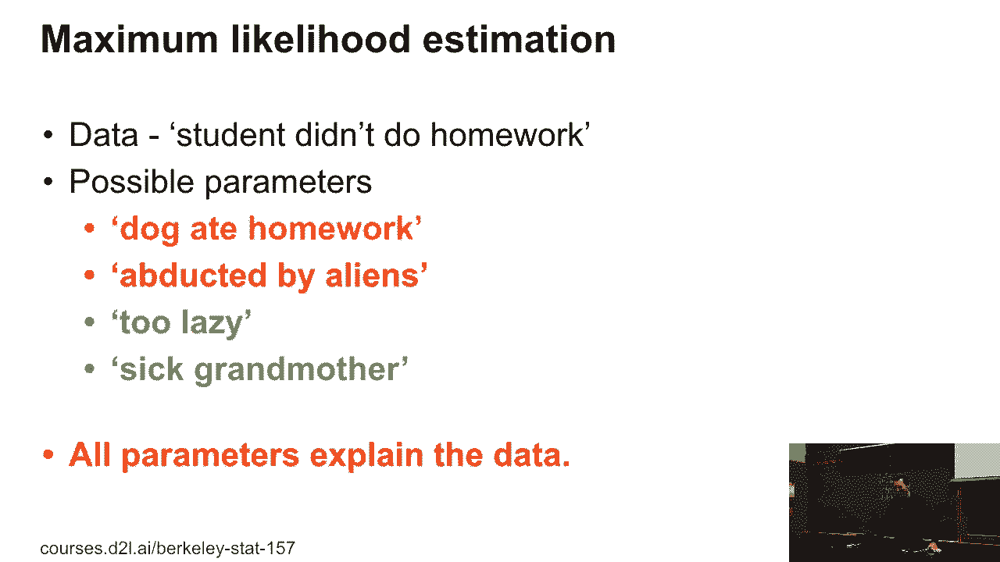
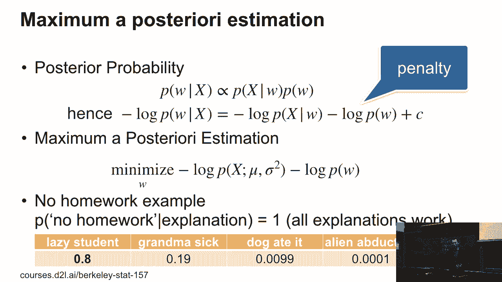
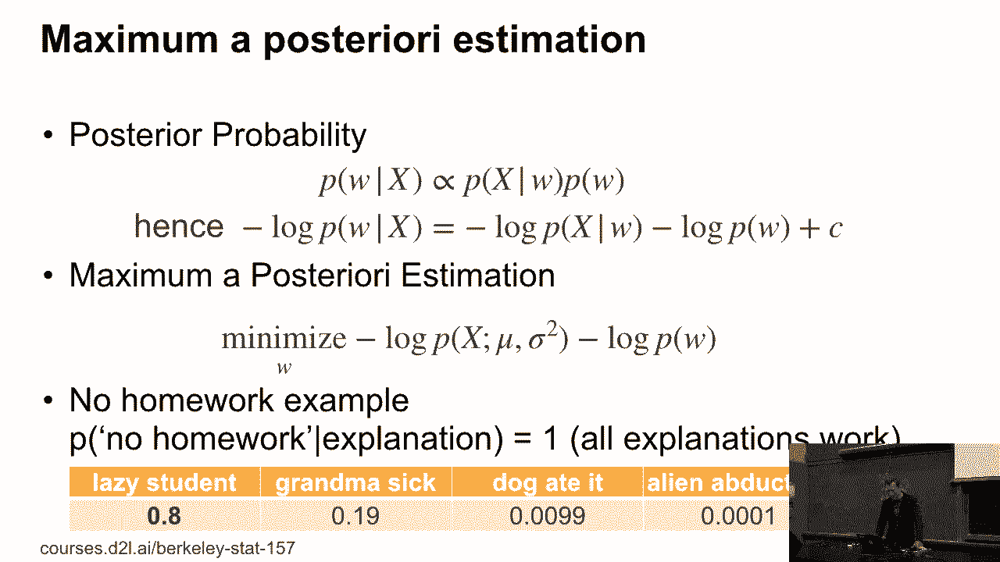
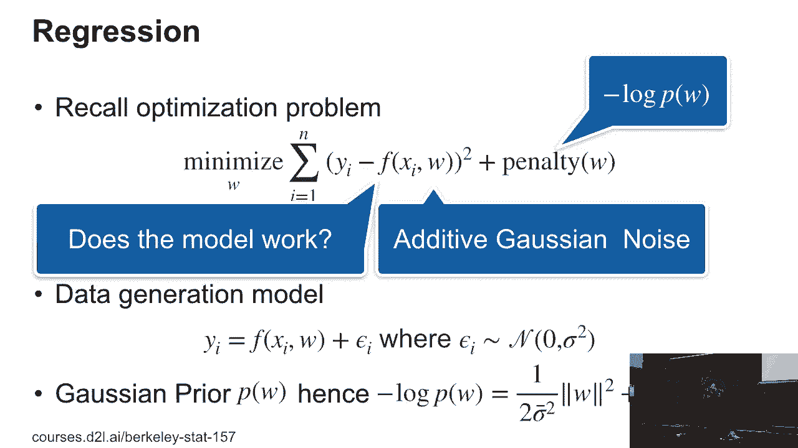
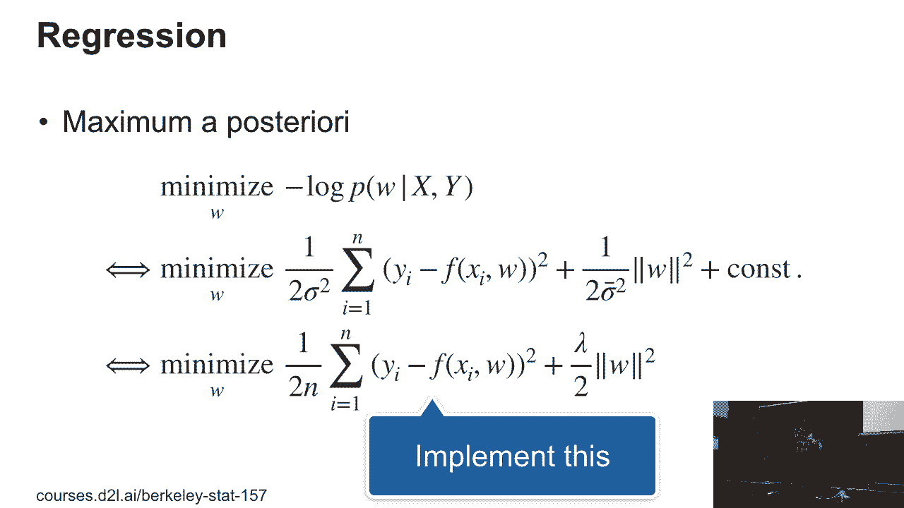

# 18：最大似然估计与最大后验估计 📊






在本节课中，我们将学习两种重要的参数估计方法：**最大似然估计**和**最大后验估计**。我们将从基本原理出发，推导出高斯分布的均值和方差公式，并探讨这两种方法在回归分析中的应用与区别。课程内容力求简单直白，适合初学者理解。

---

## 从高斯分布到参数估计

上一节我们提到了逻辑回归，现在让我们回到参数估计的基础概念。为了理解为什么某些常见的估计方法是有效的，我们需要从概率分布的基本原理开始推导。



假设我们有一组数据 `X1, X2, ..., Xn`，它们是从一个高斯（正态）分布中独立抽取的。这个分布由均值 `μ` 和方差 `σ²` 两个参数决定。其概率密度函数为：

**公式：**
```
P(X) = 1 / √(2πσ²) * exp( -(X - μ)² / (2σ²) )
```

我们的目标是，找到最能“解释”当前观测数据的参数 `μ` 和 `σ²`。一种直观的思路是：选择能使当前数据出现“可能性”最大的参数。这就是**最大似然估计**的核心思想。

---

## 最大似然估计的推导



在最大似然估计中，我们将参数 `μ` 和 `σ²` 视为固定的数值（而非随机变量）。我们定义**似然函数**为数据在给定参数下的联合概率（由于数据独立同分布，可表示为乘积）：

**公式：**
```
L(μ, σ²) = ∏_{i=1}^{n} P(Xi; μ, σ²)
```

直接最大化这个乘积在计算上可能遇到数值过小的问题。一个常见的技巧是取其对数的相反数，即**负对数似然**，并转而最小化它。这样做不会改变最优解的位置，但能让优化过程更稳定。

**公式：**
```
NLL(μ, σ²) = -∑_{i=1}^{n} log P(Xi; μ, σ²)
           = (n/2) log(2πσ²) + (1/(2σ²)) ∑_{i=1}^{n} (Xi - μ)²
```



接下来，我们分别对 `μ` 和 `σ²` 求导并令导数为零，即可找到使负对数似然最小的参数值。

*   **对 `μ` 求导并优化**，我们得到熟悉的样本均值公式：
    **公式：**
    ```
    μ_MLE = (1/n) ∑_{i=1}^{n} Xi
    ```

*   **对 `σ²` 求导并优化**，我们得到样本方差公式：
    **公式：**
    ```
    σ²_MLE = (1/n) ∑_{i=1}^{n} (Xi - μ_MLE)²
    ```

通过这个推导，我们证明了小学就学到的“求平均”方法，实际上是在高斯分布假设下最优的参数估计方法。

---

## 最大似然估计的局限性



最大似然估计虽然直观，但有时会得出反直觉的结论。考虑一个例子：学生没交作业。以下四种原因都能完全“解释”数据（没交作业）：
1.  狗把作业吃了。
2.  被外星人绑架了。
3.  祖母生病了。
4.  自己太懒了。

从纯最大似然的角度看，这四个原因的似然值可能一样高（都能完美解释观测）。但显然，助教不会首先相信“外星人绑架”这个解释。这是为什么呢？因为最大似然估计忽略了我们对不同原因发生的**先验信念**。

---

## 引入先验：最大后验估计



为了解决上述问题，我们需要将参数 `θ`（例如，没交作业的原因）本身也视为具有某种概率分布。我们根据经验或常识，为不同的参数赋予一个**先验概率** `P(θ)`。例如：
*   `P(外星人)` 可能极低，如 0.01%。
*   `P(狗吃了)` 可能为 1%。
*   `P(祖母生病)` 可能为 20%。
*   `P(懒惰)` 可能高达 80%。


然后，我们利用贝叶斯定理，计算在观察到数据 `X` 后，参数的后验概率：
**公式：**
```
P(θ | X) ∝ P(X | θ) * P(θ)
```
其中，`P(X | θ)` 是似然，`P(θ)` 是先验。**最大后验估计**就是寻找使后验概率 `P(θ | X)` 最大的参数 `θ`。

取负对数后，最大后验估计的优化问题变为：
**公式：**
```
最小化：-log P(X | θ) - log P(θ)
```
这相当于在最大似然估计的目标函数上，增加了一个关于参数的**惩罚项** `-log P(θ)`。这个惩罚项会倾向于选择先验概率更高的参数（例如“懒惰”），从而避免选择那些虽然能拟合数据但本身极不合理的参数（例如“外星人”）。


---

## 在回归分析中的应用

现在，我们来看最大似然和最大后验估计如何应用于回归问题。一个典型的回归模型假设观测值 `yi` 由模型预测 `f(xi, w)` 加上高斯噪声 `εi` 构成：
**公式：**
```
yi = f(xi, w) + εi,  其中 εi ~ N(0, σ²)
```
*   如果采用**最大似然估计**，我们的目标是找到参数 `w`，使所有观测数据 `y` 的似然最大。这等价于最小化**均方误差**：
    **公式：**
    ```
    最小化：(1/n) ∑_{i=1}^{n} (yi - f(xi, w))²
    ```
*   如果采用**最大后验估计**，我们通常为参数 `w` 假设一个先验分布，例如高斯先验 `w ~ N(0, τ²)`。此时的目标函数变为：
    **公式：**
    ```
    最小化：(1/n) ∑_{i=1}^{n} (yi - f(xi, w))² + λ ||w||²
    ```
    这里的 `λ` 是一个超参数，控制着正则化的强度。这正是机器学习中常见的**L2正则化**或**岭回归**。





通过简单的代数变换（例如对目标函数乘以常数 `σ²/n`），我们可以发现，最大后验估计中的正则化系数 `λ` 与噪声方差 `σ²` 和先验方差 `τ²` 有关。这揭示了统计视角（贝叶斯先验）与优化视角（正则化惩罚）之间的深刻联系。

---

## 总结

本节课我们一起学习了参数估计的两种核心方法：
1.  **最大似然估计**：寻找能使观测数据出现概率最大的参数。它在假设参数为固定值时使用，常等价于最小化误差平方和。
2.  **最大后验估计**：在最大似然的基础上，引入了参数的先验分布。它寻找在观测数据下后验概率最大的参数，其优化目标通常包含一个正则化项，以防止过拟合和选择不合理的参数。



这两种方法为我们理解从简单的平均值计算到复杂的正则化回归模型，提供了统一的理论框架。理解它们有助于我们在面对不同问题时，选择更合适的建模与估计策略。