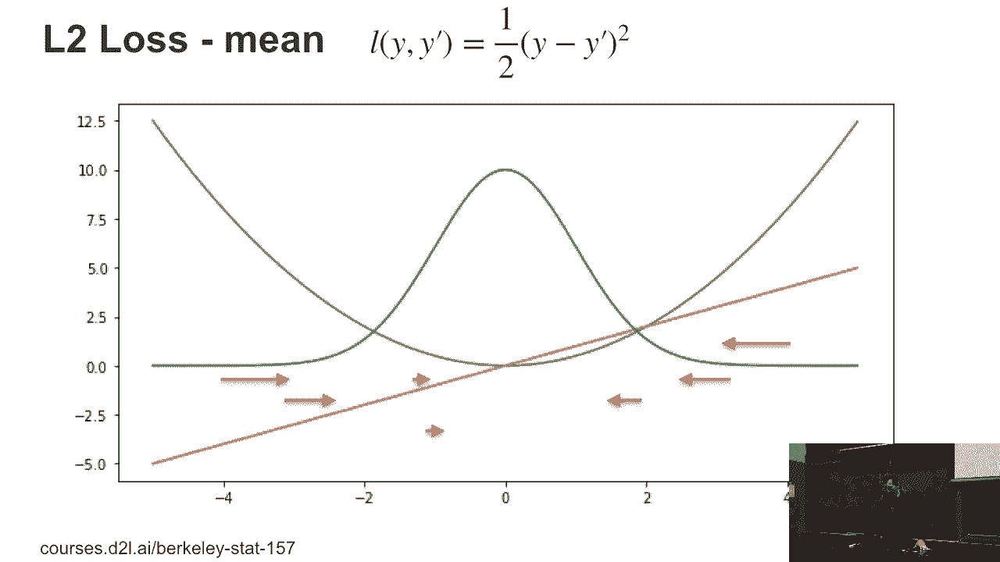
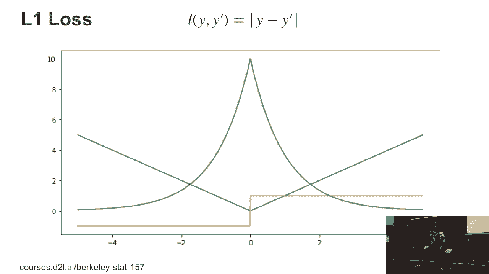
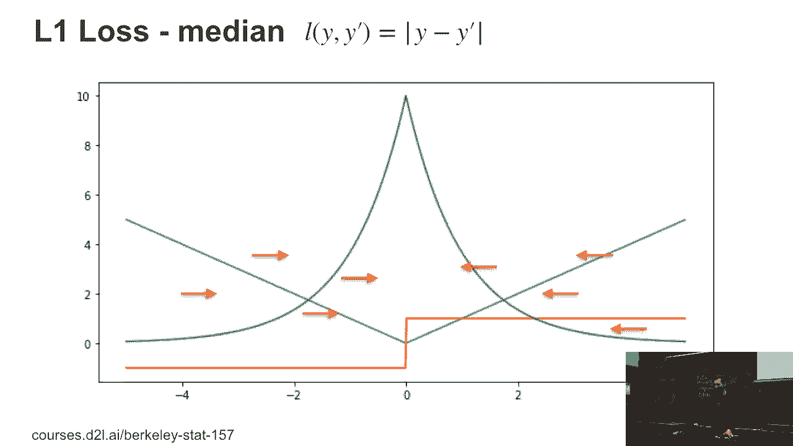
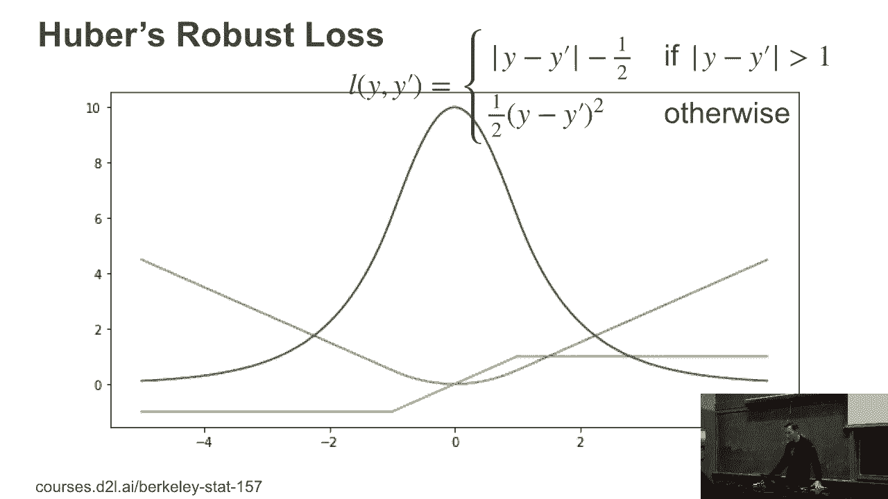
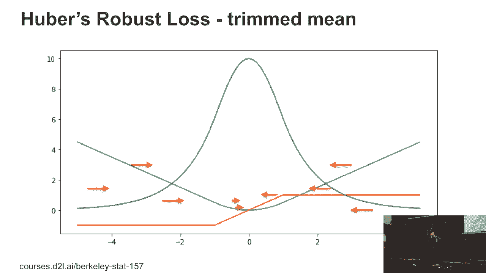

# 19：损失函数详解 📘

在本节课中，我们将学习损失函数的基本概念及其在机器学习中的作用。我们将探讨几种常见的损失函数，包括L2损失、L1损失和Huber损失，并通过直观的图像和公式来理解它们的特点和应用场景。

---

## 📊 什么是损失函数？

损失函数用于衡量模型预测值与真实值之间的差异。通过最小化损失函数，我们可以优化模型参数，使其预测更接近真实情况。

以下是一个简单的损失函数示例，它实际上是一个高斯分布。这些图像是直接在蓝色平台上生成的。

蓝色函数表示的是损失函数：
\[
L = \frac{1}{2}(y - \hat{y})^2
\]
绿色函数是指数化的损失函数：
\[
e^{-L}
\]
在这种情况下，我们将 \(\hat{y}\) 设为0。为了简化，我们将绿色函数归一化，使其在区间[-5, 5]内的积分为1。红线是蓝色函数的导数，由自动生成工具绘制。

作为练习，你将使用自动绘图工具来完成这一步。

---

## 🔵 L2损失函数

上一节我们介绍了损失函数的基本概念，本节中我们来看看L2损失函数。

L2损失函数的形式为：
\[
L = \frac{1}{2}(y - \hat{y})^2
\]
如果我们最小化L2损失，得到的结果恰好是均值。图中用红色箭头标出了梯度的大小，如果我们有多个观测值，优化过程会给出它们的均值。

---

## 🔶 L1损失函数

接下来，我们探讨L1损失函数。L1损失函数的形式为：
\[
L = |y - \hat{y}|
\]
我们绘制了蓝色线条表示绝对值函数，然后对其指数化得到绿色线条，同样归一化使其在[-5, 5]区间内积分为1。橙色线条是导数，由自动生成工具绘制。

L1损失函数有一个有趣的特性：它的梯度要么是-1，要么是1。如果我们通过优化找到梯度平衡点，需要左右两边的点数相等，这对应着中位数。如果点的数量是奇数，中位数是中间的点；如果是偶数，中位数是中间两个点之间的任意值。

---

## 🟢 Huber损失函数

现在，让我们选择一个稍微复杂一点的损失函数——Huber损失函数。Huber损失函数在分支上看起来像绝对值函数，外侧是直线，内侧是抛物线。它的形式是抛物线在一定范围内被直线延伸。

如果你绘制其导数（橙色曲线），可以清楚地看到交叉点。绿色线条是对应的密度函数。

以下是Huber损失函数的特点：

- Huber损失函数可以确保在存在异常值时，模型仍然保持稳定。
- 它通过修剪最大和最小的项来限制梯度的影响，而不是完全忽略异常值。
- 在深度学习中，这种技术称为梯度裁剪，用于防止优化过程发散。

---

## 🛠️ 损失函数的应用

我们刚刚看了不同的损失函数，这是因为在实际问题中，除了最小均方误差损失，我们可能还需要添加其他类型的损失函数来执行不同类型的估计。

我们首先讨论的是回归损失函数，因为它们可以通过图像直观理解。一旦涉及结构化多分类损失等内容，直观理解会变得更加困难。另一个原因是，我们想探讨梯度裁剪与其他方法之间的联系。

梯度裁剪通常通过限制损失向量的大小来防止优化过程发散。在本科生课程中，我们更注重直觉而非严格的数学推导，以便在有限的时间内覆盖更多内容。

---

## 📝 总结

本节课中，我们一起学习了损失函数的基本概念及其在机器学习中的应用。我们探讨了L2损失、L1损失和Huber损失函数的特点，并通过图像和公式直观理解了它们的作用。此外，我们还了解了梯度裁剪技术与损失函数之间的联系，以及如何通过损失函数优化模型参数。

希望这节课能帮助你更好地理解损失函数及其在实际问题中的应用！