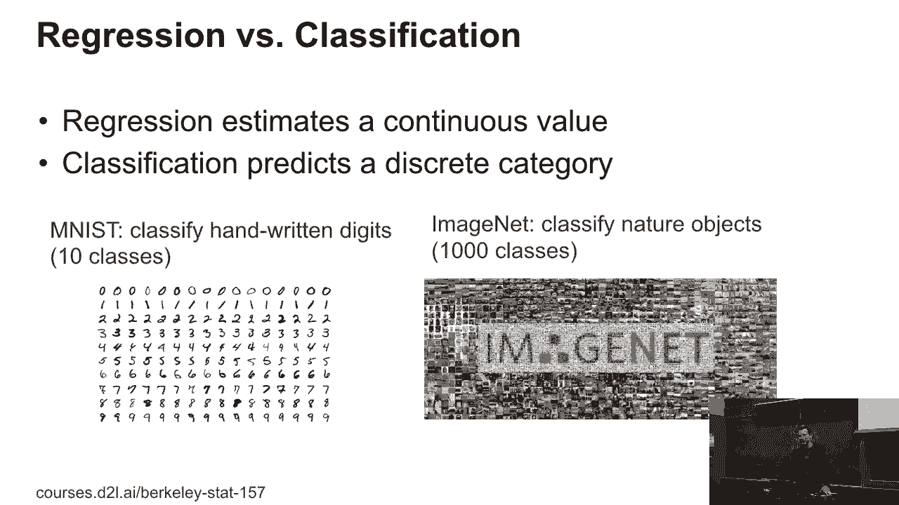
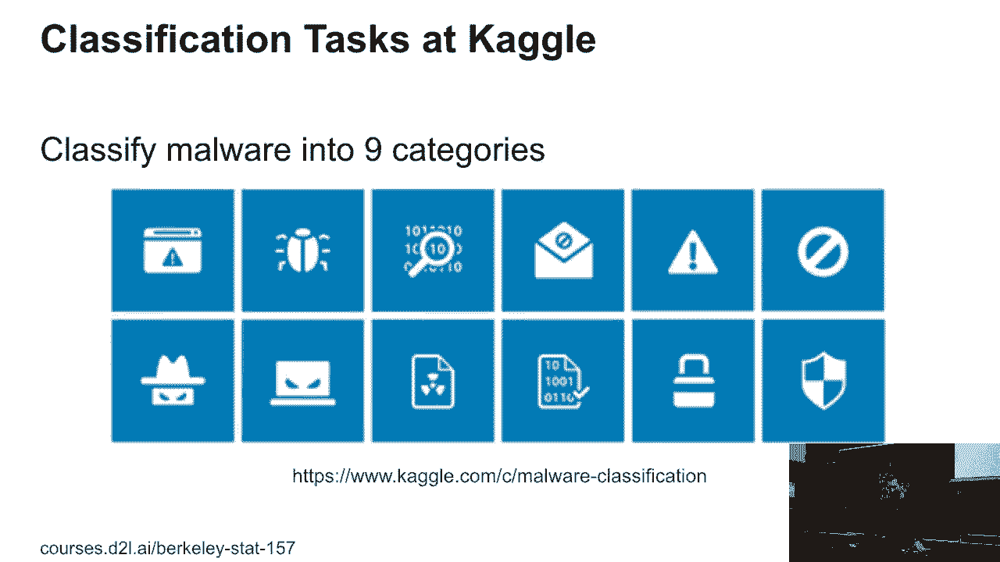
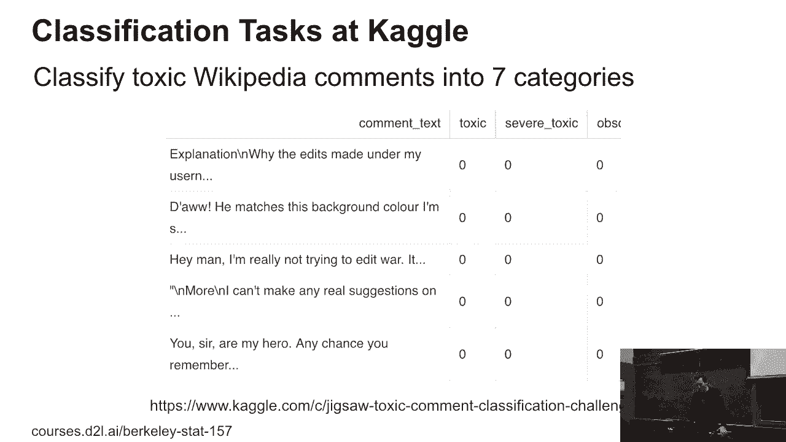
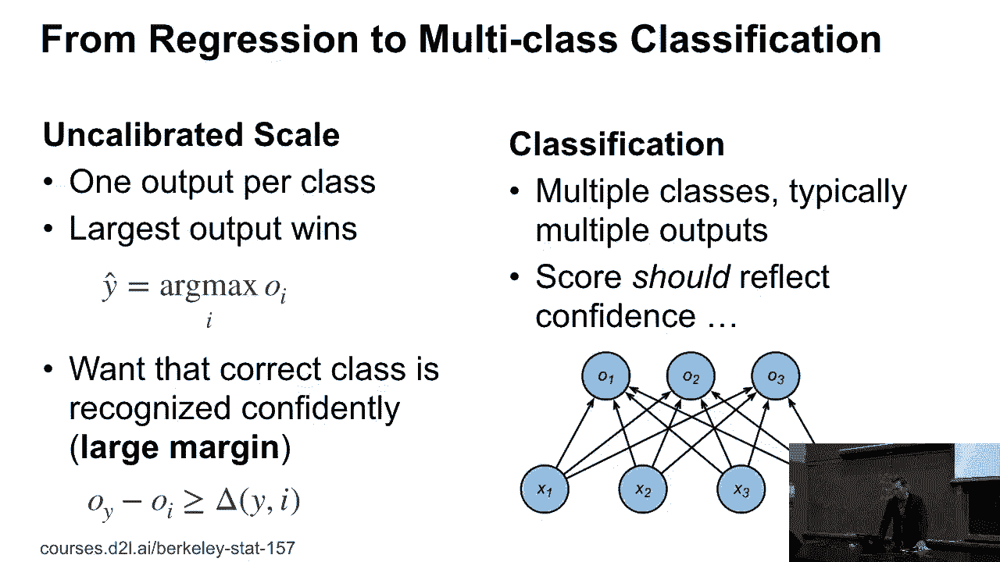
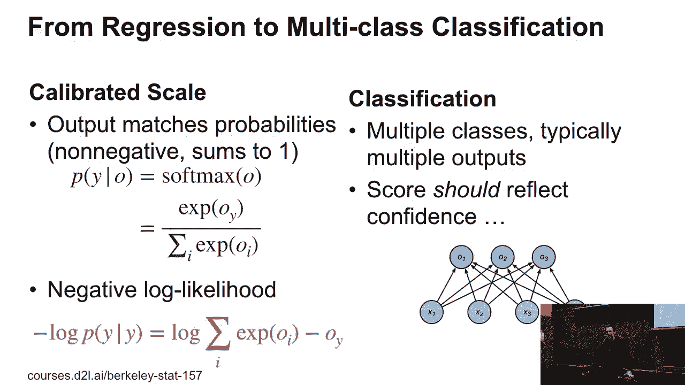
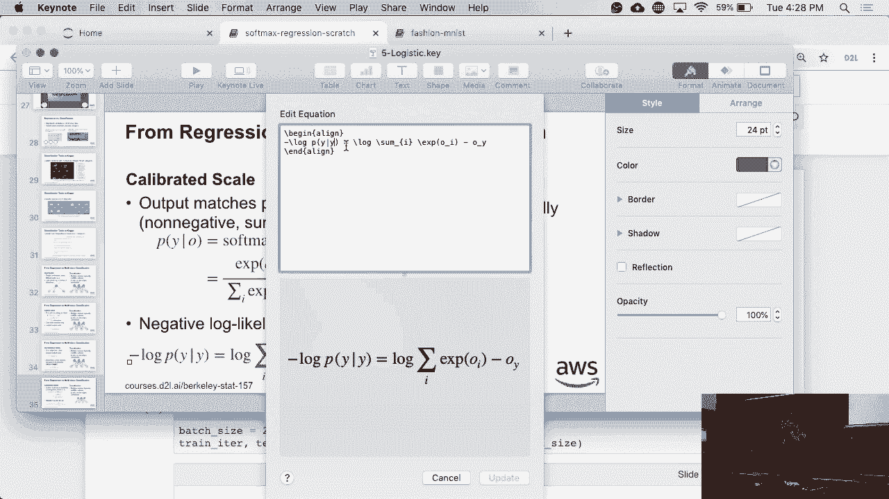
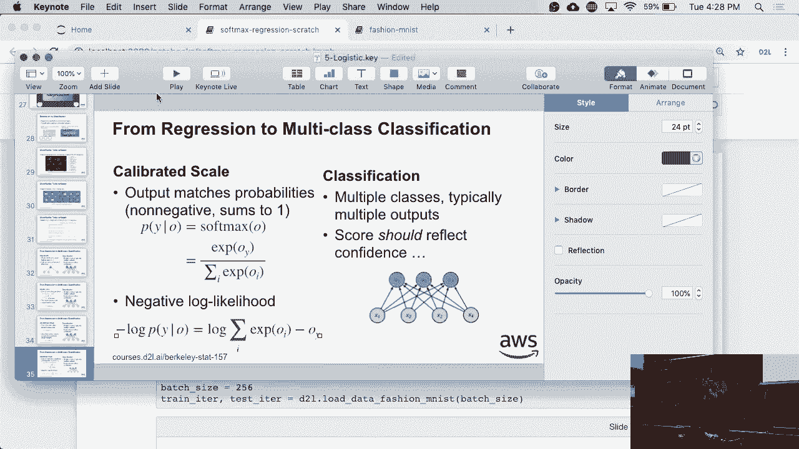
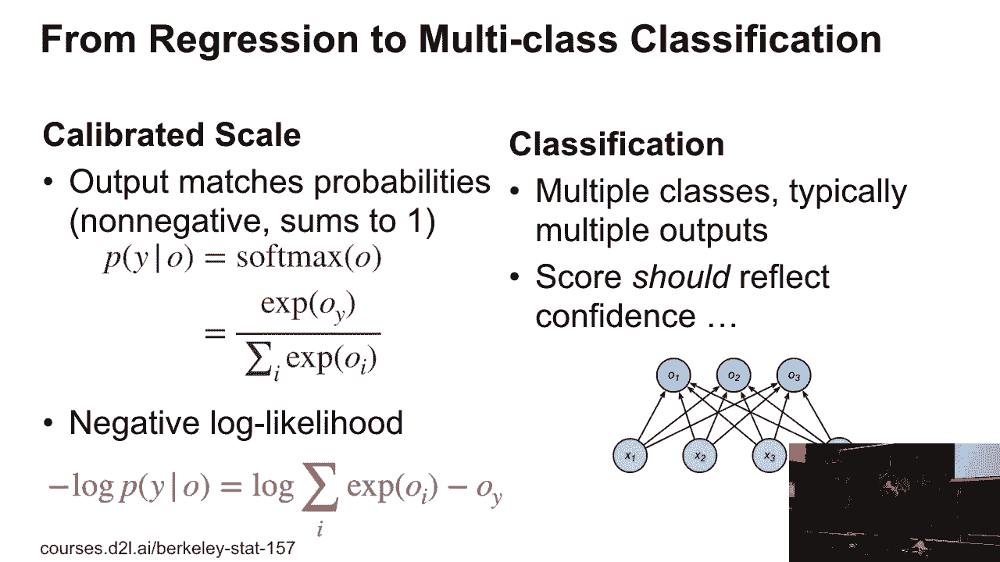
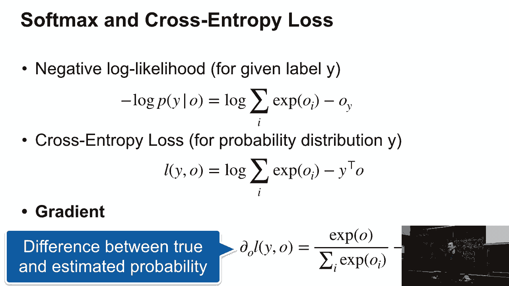

# 20：逻辑回归 🧠

在本节课中，我们将学习逻辑回归。逻辑回归是机器学习中用于解决分类问题的基础模型。我们将探讨它与回归问题的区别，理解其核心的损失函数，并学习如何通过梯度下降进行优化。



---





## 回归与分类的区别

上一节我们介绍了回归问题，本节中我们来看看分类问题与回归问题的核心区别。

回归问题旨在预测一个连续值。例如，预测房价、身高体重、每日阳光时长和温度，或是股票市场中多种证券的价值。这些都是典型的回归问题。

分类问题则需要预测一个离散的类别。例如，判断一张图片是猫还是狗，识别手写数字，或是将蛋白质、恶意软件、维基百科编辑命令划分到不同的类别中。

为了让概念更具体，我们来看两者的差异：
*   **回归**：输出通常有自然的数值尺度，损失函数常基于预测值 `Y_hat` 与真实值 `Y` 之间的差异（如平方差）。有时也会关注相对变化，例如使用对数差异。
*   **分类**：输出是离散的类别。模型需要输出能反映对每个类别置信度的分数。

---

## 分类问题的损失函数设计

理解了分类任务的目标后，我们来看看如何为它设计合适的损失函数。以下是几种可能的方法：



**1. 使用平方损失（不推荐）**
一种简单粗暴的方法是将类别编码为独热向量（例如，`[0, 1, 0]`），然后使用平方损失进行优化。虽然这种方法理论上可行，并且在某些历史场景中被使用过（如VW工具包），但它通常效果不佳，**强烈不建议**在实际中使用。

**2. 支持向量机（SVM）的思路**
支持向量机采用了一种“间隔最大化”的思想。它希望正确类别的输出分数 `O_Y` 远大于所有错误类别的输出分数 `O_i`，并且要超过一个设定的间隔 `Δ`。这个 `Δ` 可以根据错误的严重程度来调整。例如，在自动驾驶中，偏离到草坪（小损失）和偏离到悬崖（大损失）应有不同的容忍度。这种方法在21世纪初非常流行，涉及复杂的数学优化。

**3. 使用校准的损失尺度：Softmax与交叉熵**
我们将采用一种更直接且被广泛使用的方法，即使用 **Softmax** 函数将模型的原始输出转换为概率分布。

假设模型有 `n` 个输出神经元，对应 `n` 个类别，原始输出为 `O = [o1, o2, ..., on]`。Softmax 的计算公式如下：
```
p_i = exp(o_i) / sum(exp(o_j)) for j=1 to n
```
这个操作确保所有 `p_i` 非负，且和为1，形成一个合法的概率分布。



有了预测概率，我们使用 **负对数似然损失（Negative Log-Likelihood Loss）**，对于单个样本，其公式为：
```
Loss = -log(p_y)
```
其中 `p_y` 是模型预测的正确类别 `y` 的概率。这个公式是机器学习中最重要的公式之一。





更一般地，我们常使用 **交叉熵损失（Cross-Entropy Loss）**。当真实标签 `Y` 是独热编码时，交叉熵损失就等价于负对数似然。其一般形式为：
```
Loss = -sum(Y_i * log(p_i)) for i=1 to n
```
这里 `Y_i` 是真实分布（对于独热编码，只有正确类别为1），`p_i` 是预测概率。



几乎所有深度学习框架都提供了这个损失函数的高效、数值稳定的实现。

---

## 损失函数的梯度

现在我们有了损失函数，下一步就是理解如何优化它，这需要计算梯度。

对于使用Softmax和交叉熵损失的逻辑回归，其梯度具有一个优美且直观的形式。经过推导，损失函数 `L` 关于原始输出 `o` 的梯度为：
```
∇_o L = p - Y
```
其中：
*   `p` 是模型通过Softmax预测的概率分布向量。
*   `Y` 是真实的标签分布向量（如独热编码）。

**这意味着，梯度简单地等于我们“预测的概率”减去“观察到的真实概率”。** 这让我们仿佛回到了回归问题的设定：计算估计值与真实值之间的差异。这并非巧合，而是 **指数族分布（Exponential Family）** 的一个优美数学性质。在指数族中，损失函数的一阶导数给出期望的差异，二阶导数给出方差。

> **指数族旁注**：逻辑回归属于指数族分布。其概率形式可写为 `p(x|w) = exp(φ(x)^T w - g(w))`，其中 `g(w)` 是归一化项（即log-sum-exp）。指数族的性质使得其梯度计算非常简洁。如果这部分显得复杂，可以暂时忽略，它不影响后续核心内容的理解。

---

## 总结



本节课中我们一起学习了逻辑回归的核心概念：
1.  **区分了回归与分类**：回归预测连续值，分类预测离散类别。
2.  **介绍了分类的损失函数**：重点讲解了**Softmax函数**如何将模型输出转化为概率，以及**交叉熵损失**（或负对数似然损失）如何衡量预测概率与真实分布的差距。
3.  **推导了梯度公式**：得到了一个简洁的梯度表达式 `∇L = p - Y`，这揭示了优化过程本质是在缩小预测与真实的差距。
4.  **提到了理论基础**：简要说明了逻辑回归属于指数族分布，这解释了其梯度形式优美的数学原因。


逻辑回归是深度学习中分类任务的基础构件，理解其原理对于后续学习更复杂的神经网络模型至关重要。