# 21：在 Jupyter 中使用逻辑回归 👨‍💻

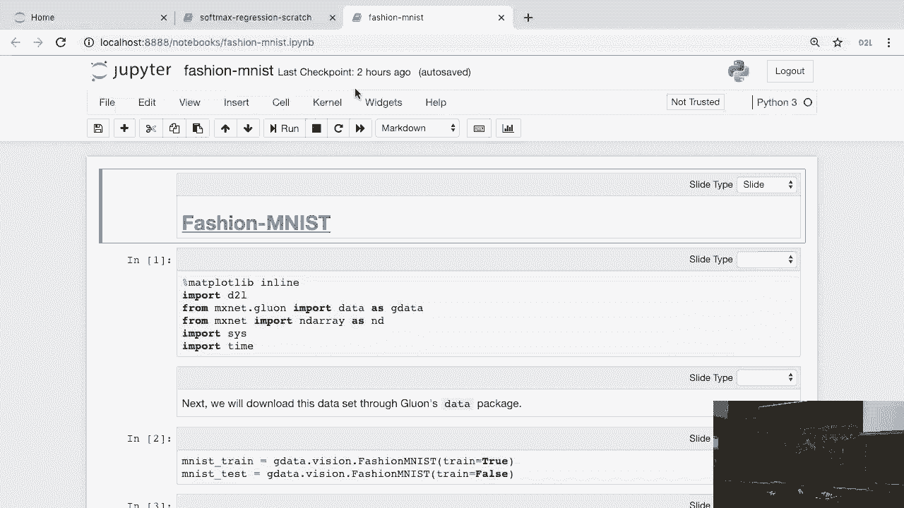

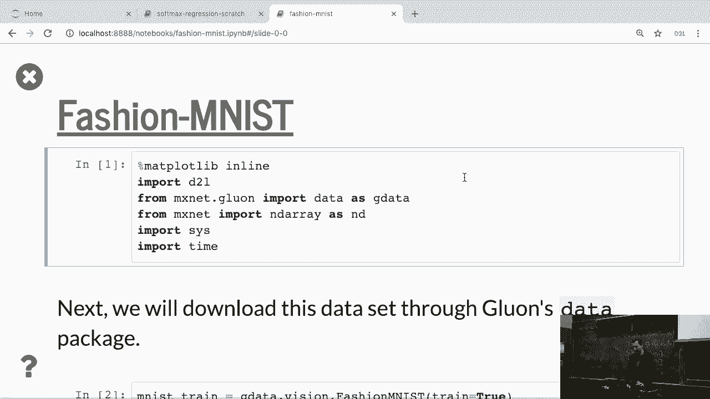

在本节课中，我们将学习如何在 Jupyter Notebook 环境中使用逻辑回归模型。我们将从一个名为“时尚 MNIST”的数据集开始，了解其结构，并演示如何加载和预处理数据，为后续的逻辑回归建模做准备。

---

## 数据集介绍：时尚 MNIST 👕

首先，我们将查看一个实际可用的数据集。在本课程中，我们将大量使用“时尚 MNIST”数据集。MNIST 是一个经典的手写数字数据集，包含 60,000 个训练样本和 10 个类别。由于 MNIST 已被研究得非常透彻，其错误率通常可以低于 1%，因此用它进行训练已不再那么具有挑战性。

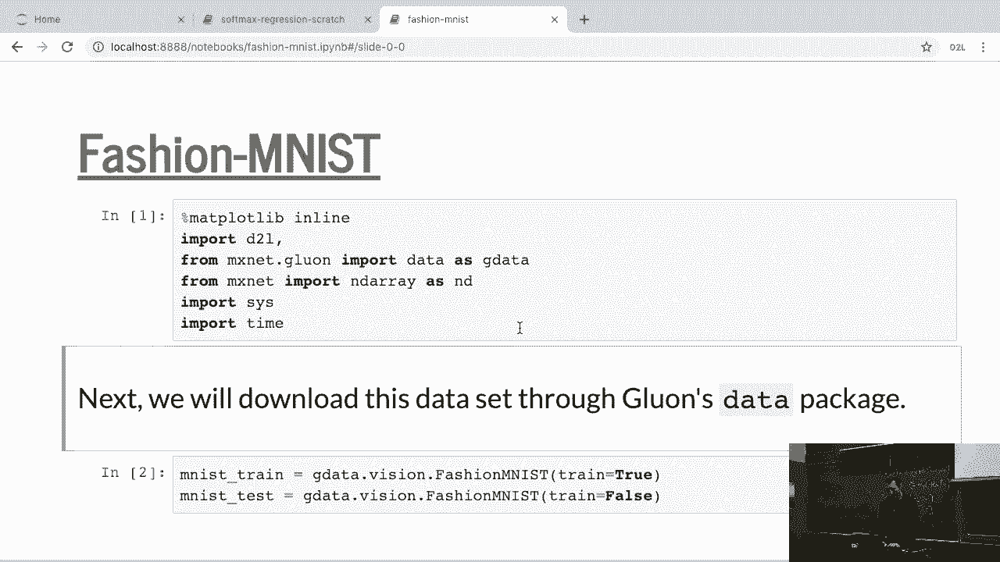

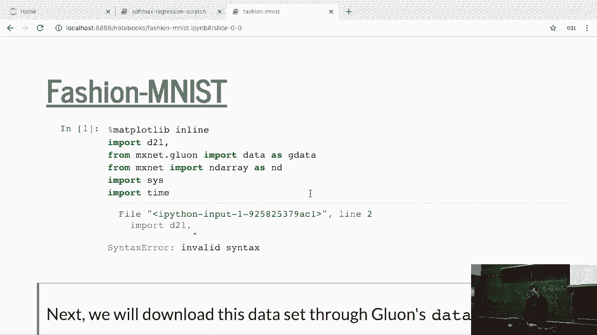

为了提供一个既易于操作又具有一定难度的替代方案，研究人员创建了“时尚 MNIST”数据集。这个数据集与 MNIST 的规模相同，但内容换成了衣物图片。

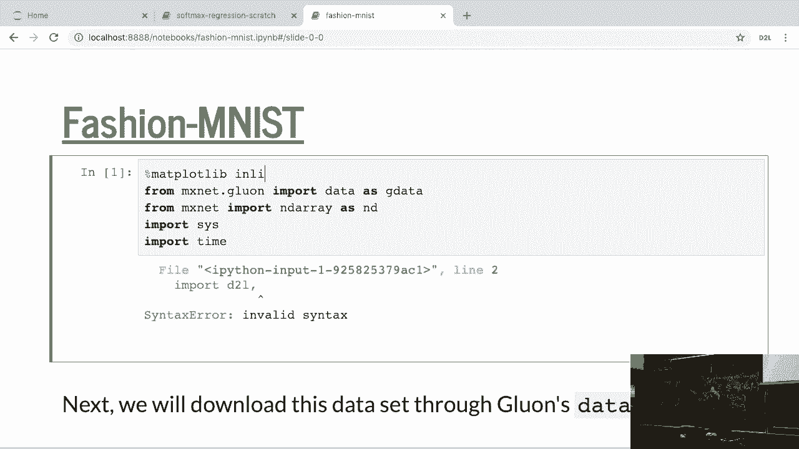

---

## 下载与加载数据 ⬇️

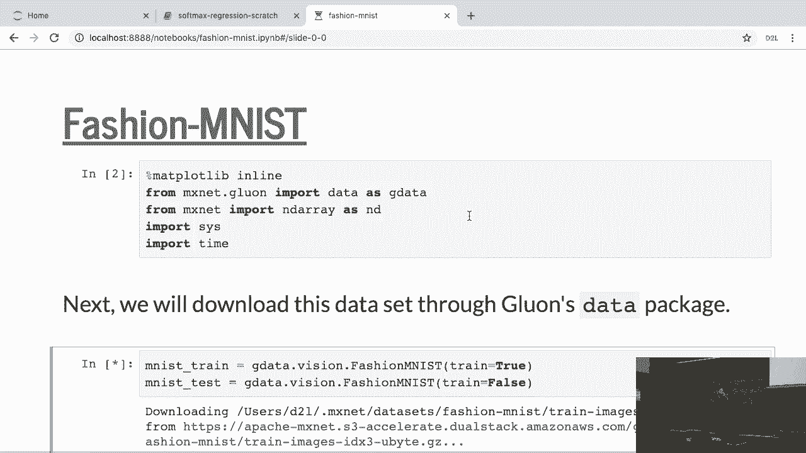

我们需要先下载这个数据集。代码会从亚马逊 S3 存储服务获取数据。请确保你的网络连接正常。

下载完成后，你会发现训练集包含 60,000 个样本，测试集包含 10,000 个样本，这与原始 MNIST 的规模一致。

熟悉 MXNet 的数据格式很重要。该格式包含特征（`features`）和标签（`labels`）。在本数据集中，特征的形状是 `Uint8` 类型的 NumPy 数组，标签也是一个数组。你可以像操作其他数据集一样对其进行索引。

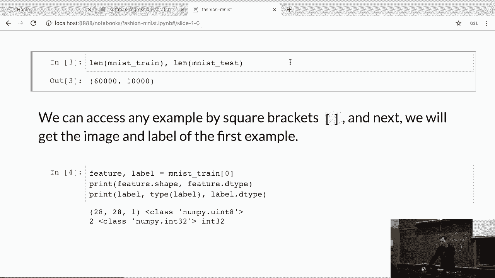

---

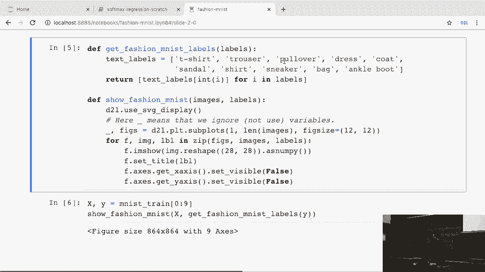

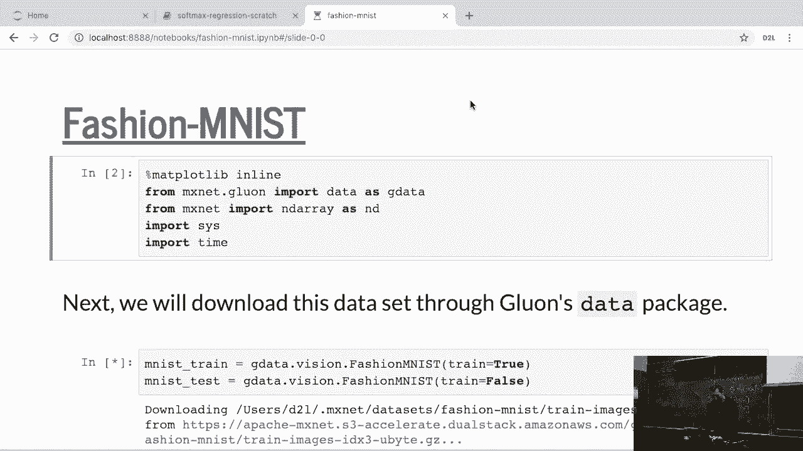

## 数据探索与可视化 🔍

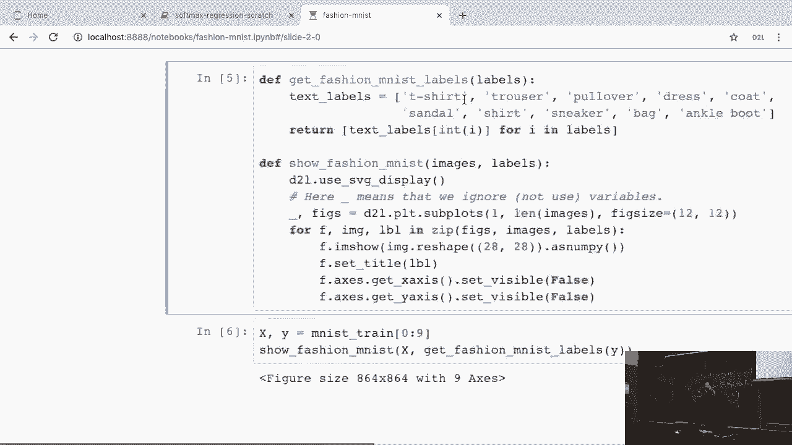

数据集中包含的类别有：运动鞋、包、踝靴、凉鞋等。我们可以使用简单的函数来转换标签并可视化图片。

以下是一个示例函数，用于将标签转换为可读文本并显示图片：

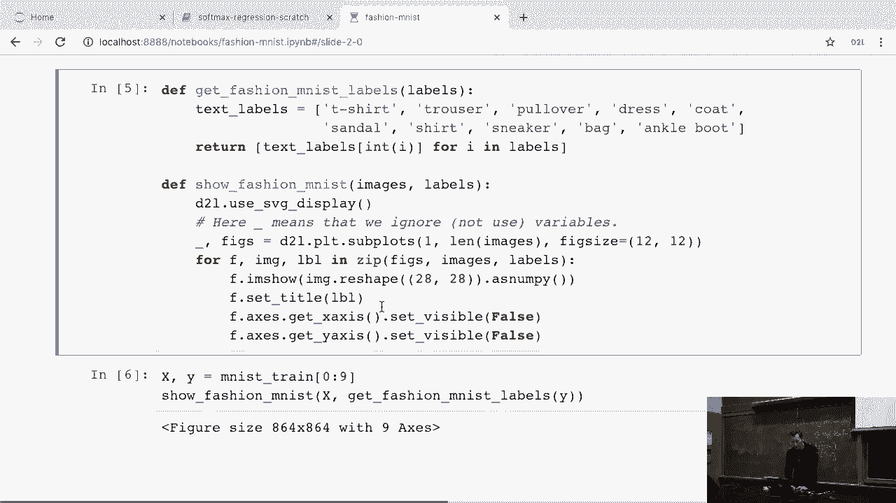

```python
def get_fashion_mnist_labels(labels):
    text_labels = ['t-shirt', 'trouser', 'pullover', 'dress', 'coat',
                   'sandal', 'shirt', 'sneaker', 'bag', 'ankle boot']
    return [text_labels[int(i)] for i in labels]

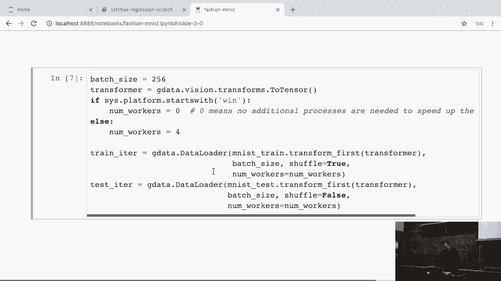

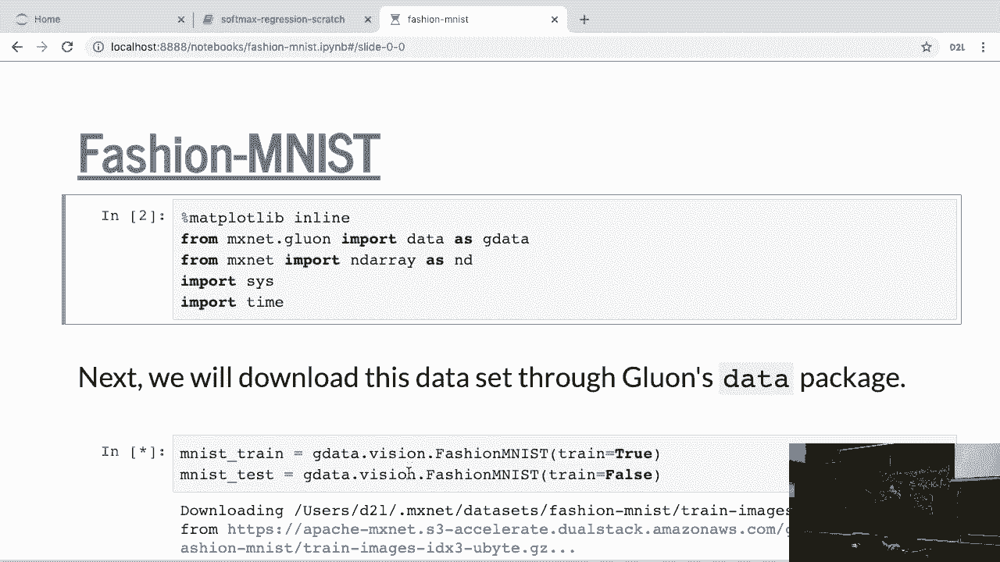

def show_images(imgs, num_rows, num_cols, titles=None, scale=1.5):
    figsize = (num_cols * scale, num_rows * scale)
    _, axes = d2l.plt.subplots(num_rows, num_cols, figsize=figsize)
    axes = axes.flatten()
    for i, (ax, img) in enumerate(zip(axes, imgs)):
        ax.imshow(img.asnumpy())
        if titles:
            ax.set_title(titles[i])
        ax.axes.get_xaxis().set_visible(False)
        ax.axes.get_yaxis().set_visible(False)
    return axes
```


运行这些代码，你将看到分辨率较低的衣物图片，例如运动鞋、凉鞋或夹克。

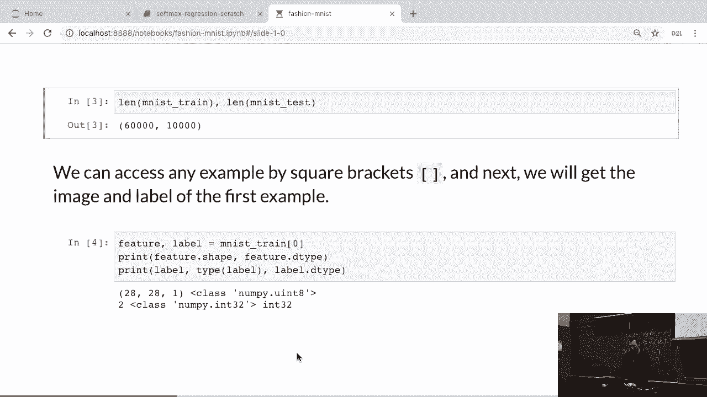

---

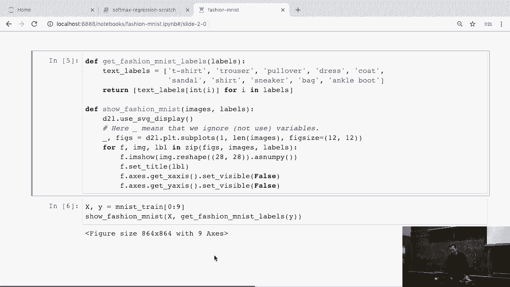

## 数据转换与加载器 🔄

在加载数据时，我们可以应用预定义的标准转换。例如，将数据转换为 MXNet 的张量格式（NDArray）。这样做的好处是，你可以在数据加载阶段方便地应用各种预处理操作，如裁剪、扭曲、重新标准化、降采样或升采样，而无需在训练循环中额外处理。

数据加载器（`DataLoader`）会负责这些后台操作。以下是如何使用转换器加载数据的示例：

```python
transformer = gluon.data.vision.transforms.ToTensor()
train_iter = gluon.data.DataLoader(mnist_train.transform_first(transformer),
                                   batch_size, shuffle=True)
test_iter = gluon.data.DataLoader(mnist_test.transform_first(transformer),
                                  batch_size, shuffle=False)
```

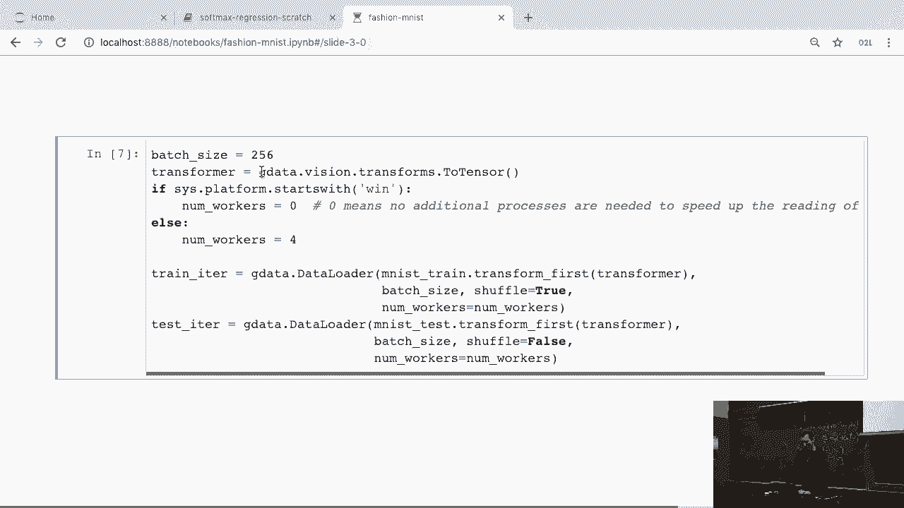

使用这台笔记本电脑，遍历所有数据大约需要三秒半的时间。

---

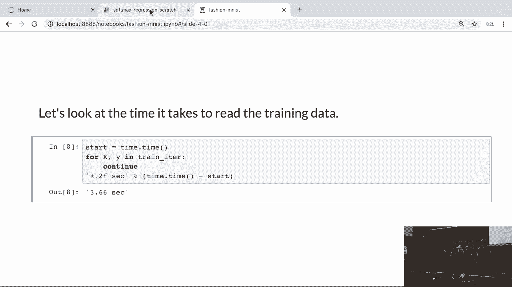

## 本节总结 📝

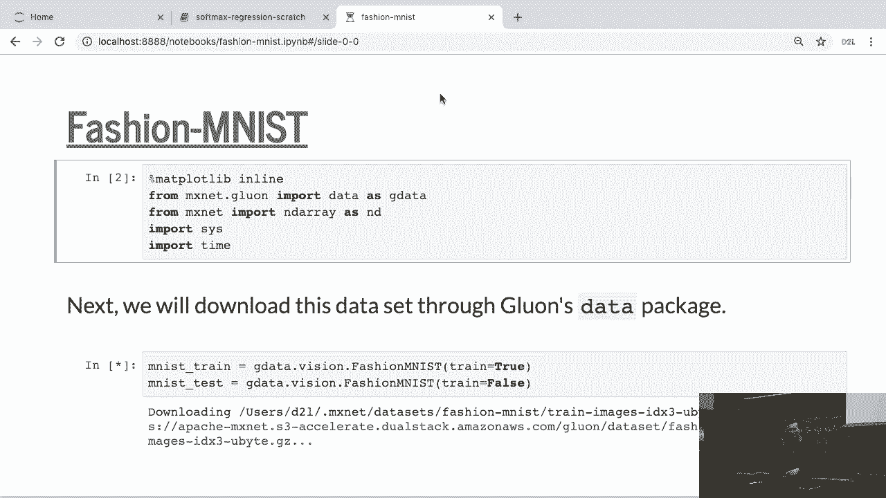

本节课中，我们一起学习了“时尚 MNIST”数据集的基本情况，包括其背景、规模与结构。我们演示了如何下载、加载该数据集，并介绍了如何使用数据转换器和加载器来预处理数据，为后续应用逻辑回归等机器学习模型做好准备。数据的正确加载与预处理是构建有效模型的第一步。