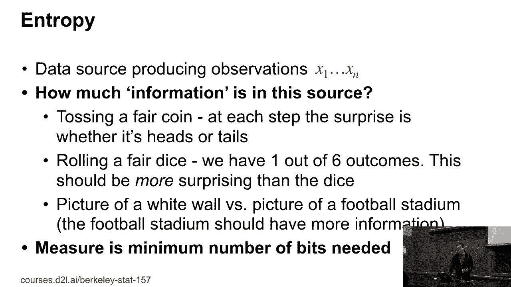
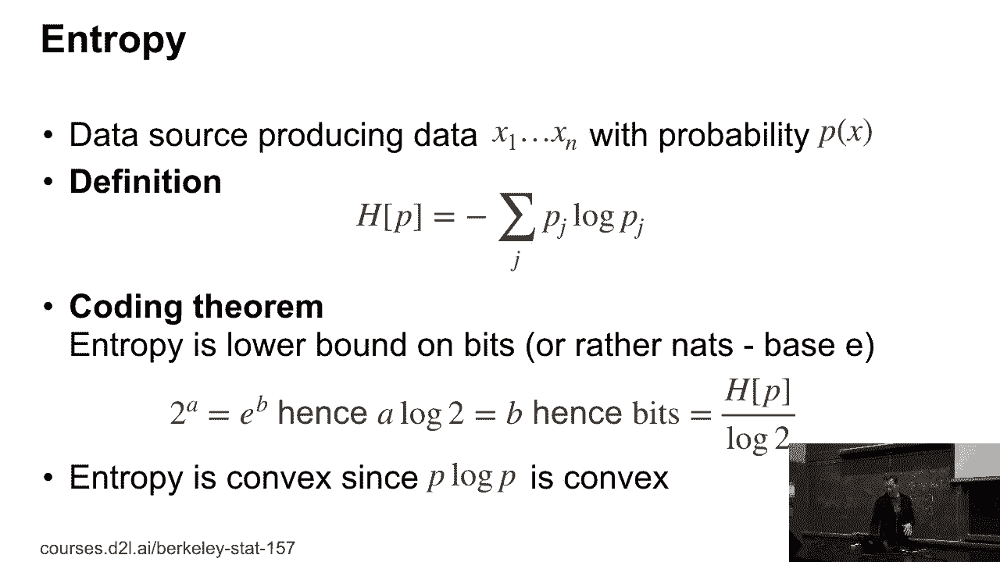
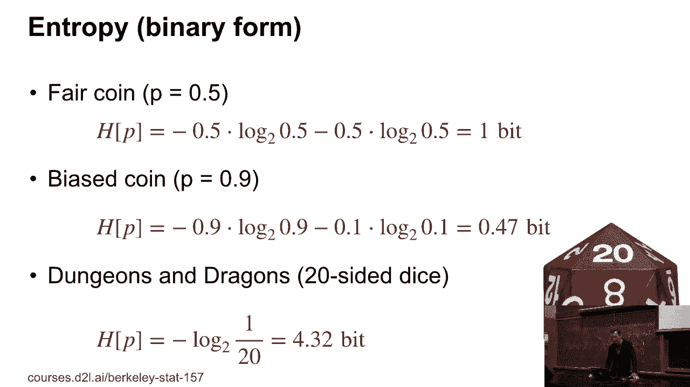
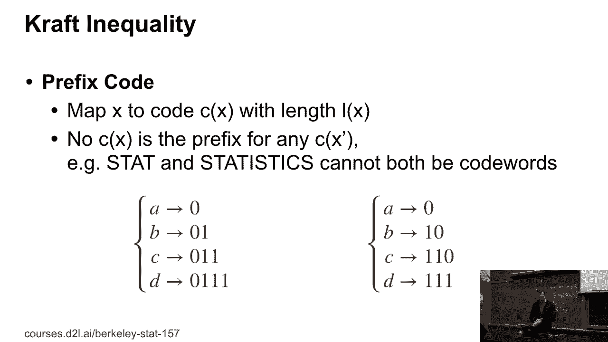
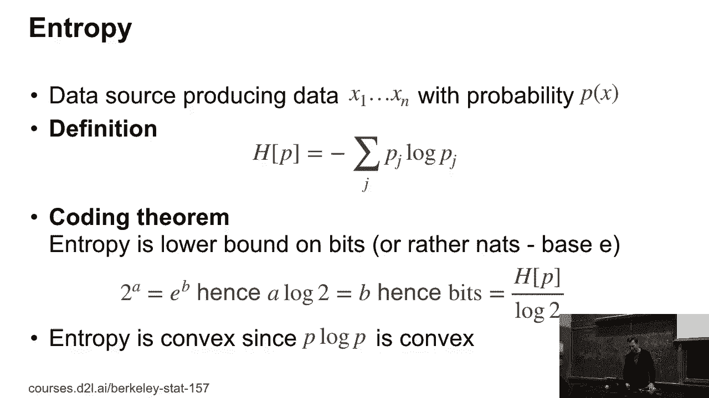
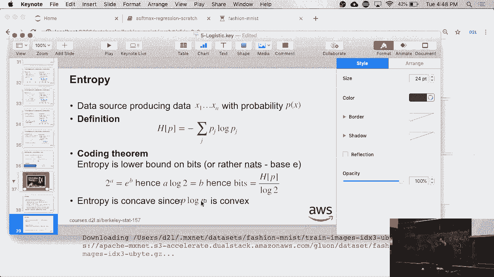
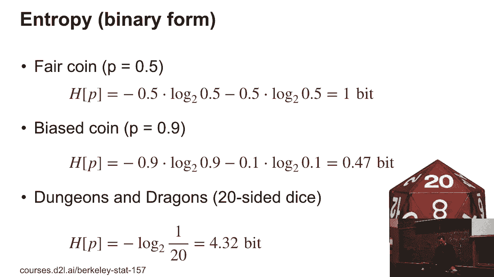
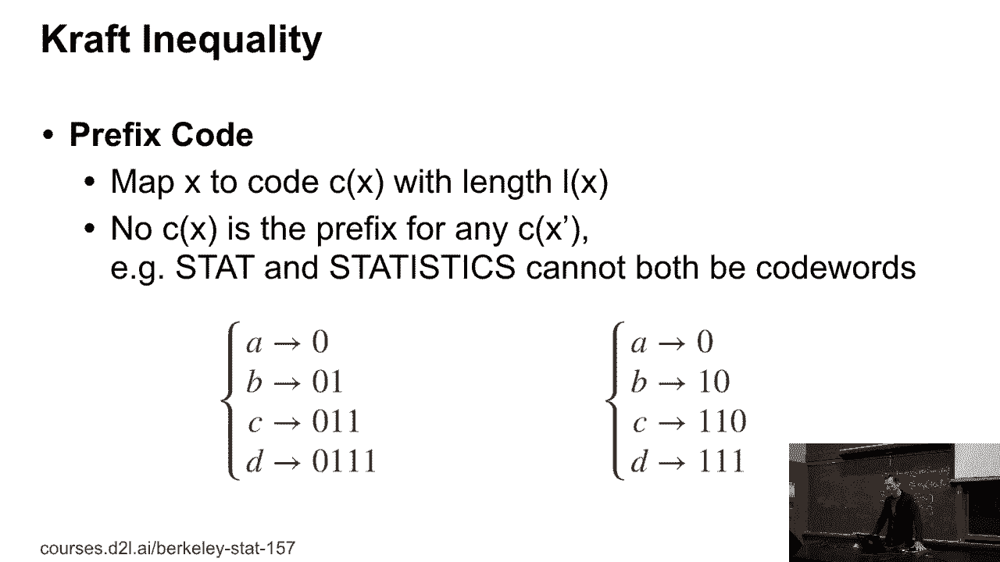
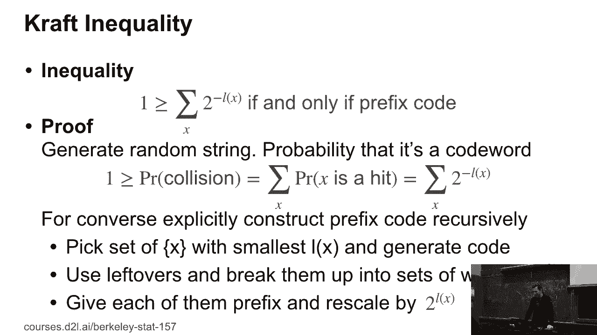
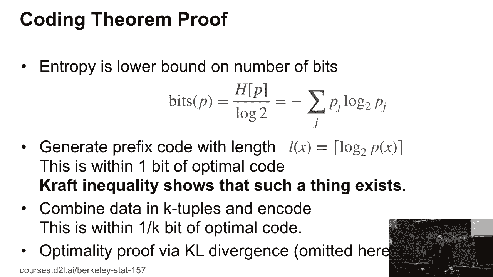

# 22：信息论入门 🧠

在本节课中，我们将学习信息论的基础概念，特别是**熵**。我们将了解如何量化信息，以及如何用最少的比特数来编码信息。课程将从直观的例子开始，逐步深入到香农熵的公式和编码定理的证明。

---

## 概述：什么是信息？

之前我们提到过一些术语，比如交叉熵损失。那么，这些术语到底是什么意思？本节内容是对信息论的一个超轻量级介绍，旨在帮助你理解后续课程中会涉及的其他概念。

香农最初思考的问题是：假设我有一个数据源，它产生从 X1 到 Xn 的观测数据。这个数据源包含了多少信息？我们能否以有意义的方式量化它？

例如，抛一枚公平的硬币，每次结果（正面或反面）带来的“惊讶”程度是固定的。掷一个公平的骰子，有六种可能的结果，显然比抛硬币包含了更多的信息。拍一张白墙的照片与拍一张满是人的讲座厅的照片相比，后者显然包含了更多的信息。

香农提出的一个巧妙方式是：**熵是存储这些信息所需的最少比特数**。

---

## 香农熵的定义 📐

我们如何将上述概念形式化呢？香农给出了一个精妙的定义。

他定义概率分布 **P** 的熵 **H(P)** 为：

**H(P) = - Σ_j P_j * log₂(P_j)**

换句话说，熵是 **-log₂(P)** 的期望值。有一个著名的编码定理指出，熵是编码所需比特数的下界，并且在某些情况下，这个下界是紧致的。

熵本身是凸函数，因为函数 **P * log(P)** 是凸的。

---

## 熵的计算示例 🧮

为了更好地理解熵，让我们看几个具体的例子。

以下是几个常见概率分布的熵值计算：

*   **公平的硬币**：概率 P(正面) = 0.5， P(反面) = 0.5。
    *   熵 H = -[0.5 * log₂(0.5) + 0.5 * log₂(0.5)] = 1 比特。
    *   直观上，编码十次抛硬币的结果正好需要10个比特的序列。

*   **有偏的硬币**：假设正面朝上的概率 P(正面) = 0.9， 反面 P(反面) = 0.1。
    *   熵 H ≈ -[0.9 * log₂(0.9) + 0.1 * log₂(0.1)] ≈ 0.41 比特。
    *   这表明，一个结果高度可预测的序列比随机序列更容易压缩存储。

*   **20面的骰子**：每个面出现的概率均为 1/20。
    *   熵 H = -20 * (1/20) * log₂(1/20) = log₂(20) ≈ 4.3 比特。
    *   每次掷骰子传递的信息量比抛一次硬币要多。

---

## 前缀码与克拉夫特不等式 🔗

为了证明编码定理，我们需要引入**前缀码**和**克拉夫特不等式**的概念。

**前缀码**是一种编码方式，其中任何一个码字都不是另一个码字的前缀。例如，不能将“dog”和“doghouse”同时作为码字，因为“dog”是“doghouse”的前缀。前缀码的好处是易于解码，无需分隔符。

**克拉夫特不等式**指出：对于一个前缀码，其码字长度集合 {L₁, L₂, ..., L_n} 必须满足以下条件：
**Σ_i 2^{-L_i} ≤ 1**
反之，如果一组长度满足这个不等式，我们总能构造出一个对应的前缀码。

**证明思路（简述）**：
1.  **必要性（前缀码 ⇒ 不等式成立）**：想象随机生成一个二进制字符串。它恰好是某个码字前缀的概率之和必须 ≤ 1（因为事件互斥）。这个概率就是 Σ 2^{-L_i}。
2.  **充分性（不等式成立 ⇒ 可构造前缀码）**：我们可以递归地构造码字。从最短的码长开始分配唯一的二进制串，然后将“剩余的概率空间”继续分配给更长的码字。由于不等式保证总“空间”不超过1，这个构造过程总能完成。

---

## 编码定理的证明 🛡️

上一节我们介绍了前缀码和克拉夫特不等式，本节我们来看看如何用它们证明核心的编码定理：**熵 H(P) 是编码所需平均比特数的下界**。

证明分为几个步骤：

1.  **构造一个可行的前缀码**：
    *   对于每个事件 x，我们将其码长 L(x) 设为 **⌈-log₂ P(x)⌉**，即对 -log₂ P(x) 向上取整。
    *   计算所有码字对应的“空间”总和：**Σ_x 2^{-L(x)} = Σ_x 2^{-⌈-log₂ P(x)⌉} ≤ Σ_x 2^{log₂ P(x)} = Σ_x P(x) = 1**。
    *   根据克拉夫特不等式，既然这个总和 ≤ 1，我们总能找到一组具有这些长度的前缀码。这个码的平均长度 **E[L]** 满足：**E[L] = Σ_x P(x) * ⌈-log₂ P(x)⌉ < H(P) + 1**。

2.  **证明下界（最优性）**：
    *   可以证明，**任何**唯一可解码码的平均长度 **E[L]** 都满足 **E[L] ≥ H(P)**。这通常通过引入**KL散度**（Kullback-Leibler Divergence）来证明，其值非负。
    *   因此，熵 H(P) 是最优平均码长的理论下界。

3.  **逼近下界**：
    *   我们构造的码长因为向上取整，可能比理论最优值多出最多1比特。为了逼近理论下界，我们可以对**符号块**（k个符号组成的序列）进行编码。
    *   对于k个符号的块，其熵是 k * H(P)。此时，由于取整带来的额外开销平均到每个符号上只有 1/k 比特。当 k 很大时，平均码长可以无限接近熵 H(P)。

---

## 总结与展望 🎯

本节课我们一起学习了信息论的核心基础：

1.  **熵**：定义为 **H(P) = - Σ P_i log₂(P_i)**，它量化了信息的不确定性或“惊讶”程度，并代表了存储信息所需的**最小平均比特数**。
2.  **前缀码与克拉夫特不等式**：前缀码是一种实用的无歧义编码方式，克拉夫特不等式 **Σ 2^{-L_i} ≤ 1** 是判断一组码长能否构成前缀码的充要条件。
3.  **香农编码定理**：我们证明了熵是最优编码长度的下界，并且可以通过对符号块编码来无限逼近这个下界。

你可能会问，既然理论最优编码存在，为什么现实中不直接使用？原因是，达到理论极限需要编码非常长的符号序列，这会导致编码和解码过程计算复杂度过高。因此，在实际应用中（如通信领域的Turbo码、LDPC码），我们使用更巧妙的、接近最优且可实现的编码方案。这些内容会在更高级的信息论课程中深入探讨。

---
**作业将在今晚发布，并包含两周前的习题解答。祝你好运，我们周四再见！**