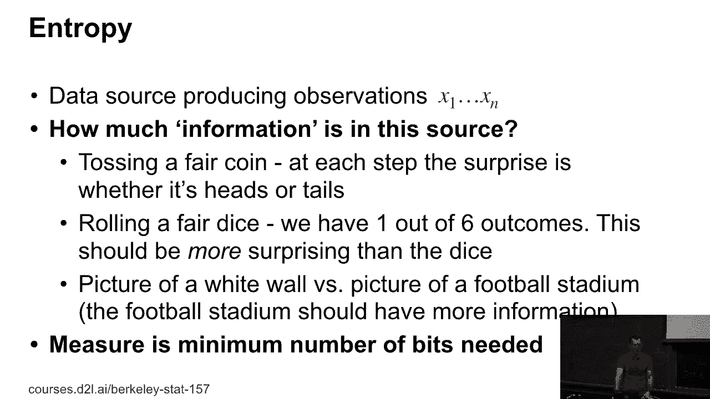
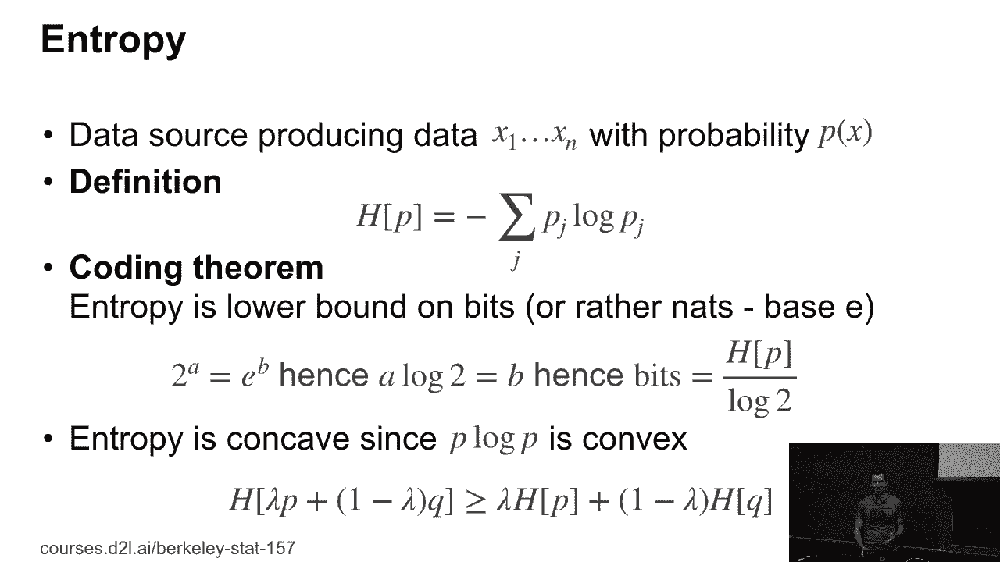
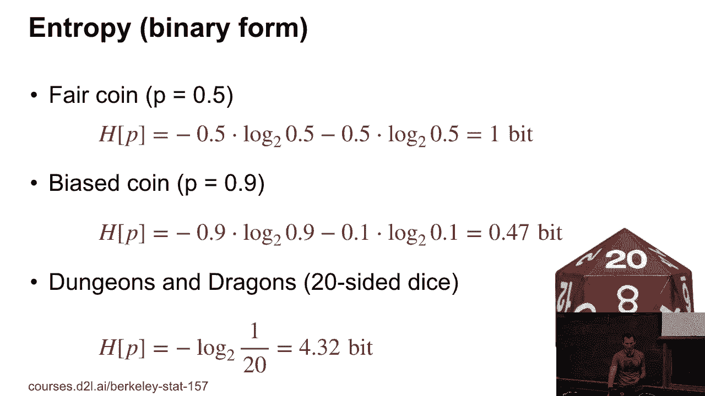
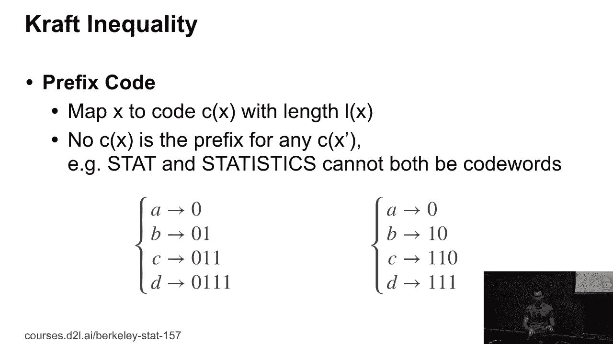
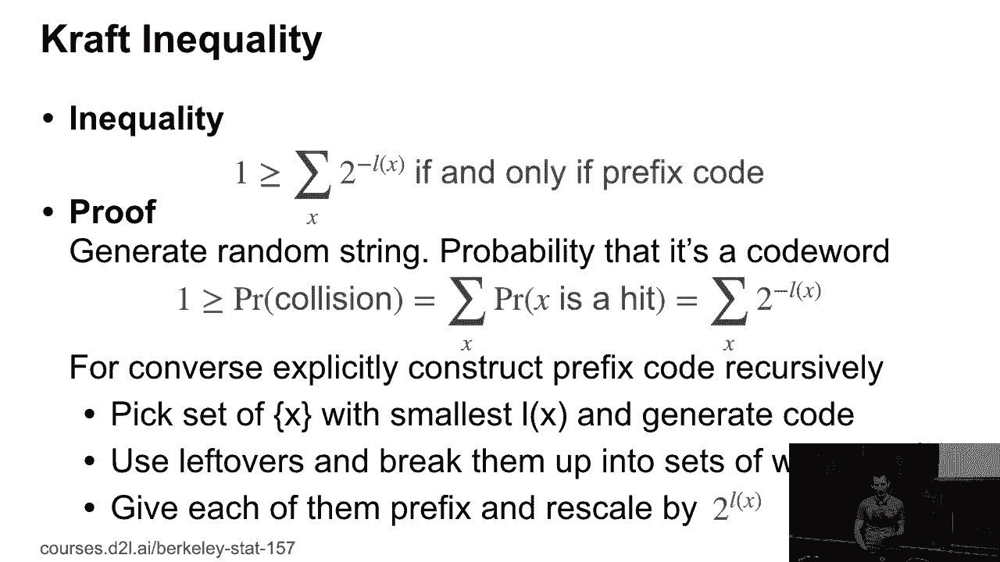
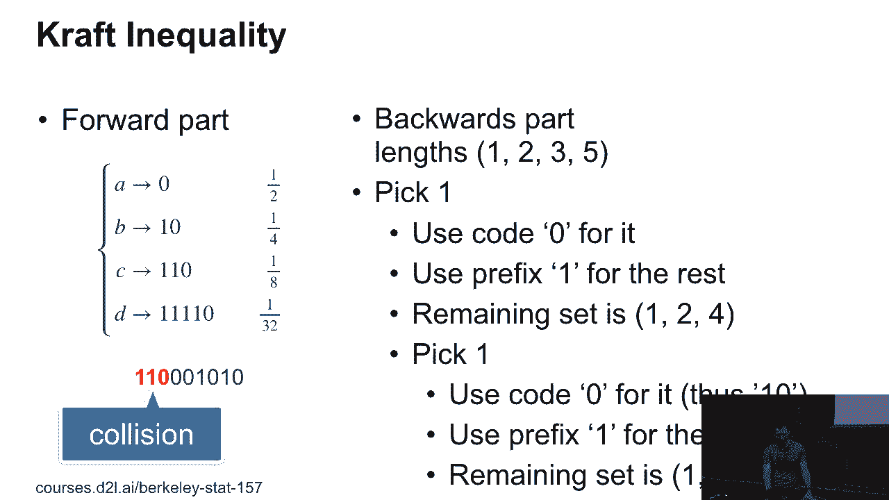
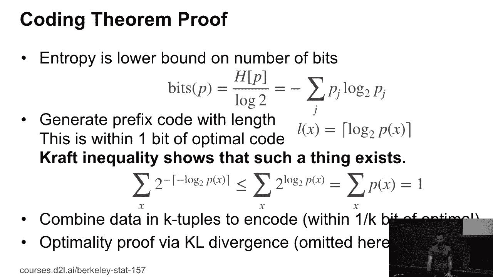
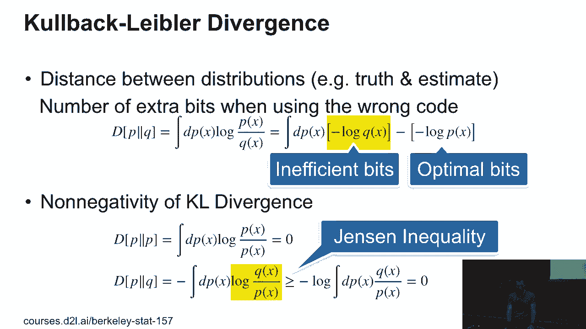
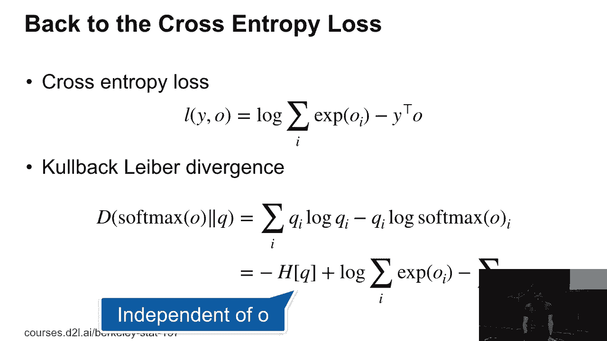
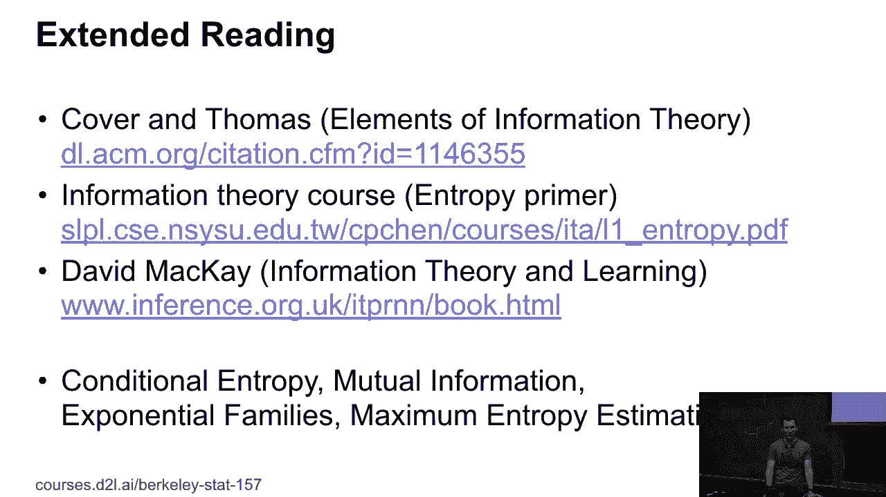

# 23：信息论回顾 📚

在本节课中，我们将回顾信息论中的核心概念，包括熵、前缀码、克拉夫不等式以及KL散度。我们将了解这些概念如何与编码理论及机器学习中的交叉熵损失联系起来。

***

## 熵与信息量 🔢

上一节我们介绍了课程背景，本节中我们来看看信息论的基础——熵。

熵是信息量的度量标准，它表示存储或传输数据所需符号的平均数量。熵的公式定义为：

**H(p) = - Σ p(x) log₂ p(x)**

其中，p(x)是事件x发生的概率。熵是凹函数，因为 `-p log p` 是凸函数。这意味着两个分布的混合熵总是大于或等于各自熵的混合。换句话说，混合数据源只会增加不确定性。

***

## 前缀码与克拉夫不等式 🔗

理解了熵的概念后，我们来看看如何有效地编码信息，这引出了前缀码的概念。

前缀码是一种编码方式，其中没有任何一个码字是另一个码字的前缀。这使得解码过程可以在读取到完整码字时立即停止，而无需等待后续字符。

以下是前缀码的一个例子：
*   A 映射到 `0`
*   B 映射到 `10`
*   C 映射到 `110`
*   D 映射到 `111`

***

### 克拉夫不等式

克拉夫不等式为前缀码的存在性提供了充要条件。对于一个码字长度集合 `{l₁, l₂, ..., lₙ}`，存在对应前缀码的充要条件是：

**Σ 2^(-lᵢ) ≤ 1**

这个不等式有两个方向：
1.  **正向**：任何前缀码都满足此不等式。
2.  **反向**：任何满足此不等式的长度集合，都可以构造出一个前缀码。

反向的构造性证明思路如下：假设我们有一个满足不等式的长度集合（例如 `{1, 2, 3, 5}`）。我们可以通过迭代地分配最短的可用码字（如 `0`），然后将其前缀（如 `1`）保留给剩余的长度（这些长度在后续步骤中会减1），从而系统地构建出一个前缀码。

***

## KL散度：衡量分布间的“距离” 📏

上一节我们讨论了如何构造编码，本节中我们来看看如果使用了“错误”的编码会怎样，这引出了KL散度的概念。

KL散度用于衡量两个概率分布 `p` 和 `q` 之间的差异。其直观解释是：当我们使用基于分布 `q` 的最优编码来编码来自真实分布 `p` 的数据时，所额外付出的平均比特数。

KL散度的公式为：

**D_KL(p || q) = Σ p(x) log (p(x) / q(x))**

KL散度具有以下重要性质：
*   **非负性**：`D_KL(p || q) ≥ 0`。
*   **非对称性**：`D_KL(p || q) ≠ D_KL(q || p)`，因此它不是严格意义上的距离度量。
*   **同一性**：当且仅当 `p = q` 时，`D_KL(p || q) = 0`。

非负性的证明利用了 `-log` 是凸函数这一性质，通过詹森不等式即可推导得出。

***

## 从KL散度到交叉熵损失 🎯

理解了KL散度后，我们就能理解它在机器学习，特别是分类任务中的核心应用。

在分类问题中，真实标签 `y` 可以看作一个概率分布（如one-hot向量），模型预测的 `softmax(o)` 是另一个分布。我们希望这两个分布尽可能接近，即最小化它们之间的KL散度：

**D_KL(y || softmax(o)) = Σ y_i log y_i - Σ y_i log softmax(o_i)**

由于第一项 `Σ y_i log y_i`（真实分布的熵）是常数，最小化KL散度就等价于最小化第二项的负值，即：

**Loss = - Σ y_i log softmax(o_i)**

这正是我们熟悉的**交叉熵损失**。因此，最小化交叉熵损失的本质就是最小化模型预测分布与真实分布之间的KL散度。

***

## 总结与延伸阅读 📖

本节课中我们一起学习了信息论的核心概念。我们从熵的定义出发，探讨了前缀码和克拉夫不等式，它们保证了高效编码的存在性。接着，我们引入了KL散度来衡量分布间的差异，并揭示了其与交叉熵损失的深刻联系。

信息论是一个博大精深的领域。若希望进一步探索，可以参考以下资源：
*   《信息论基础》（Thomas Cover 著）：经典教材，内容全面。
*   David MacKay 的《信息论、推理与学习算法》：将信息论与机器学习紧密结合的优秀著作。
*   Martin Wainwright 和 Michael Jordan 关于指数族和统计推断的研究工作。

希望本教程能帮助你清晰地理解这些基础但至关重要的概念。