# 24：Python中的Softmax分类 🧮

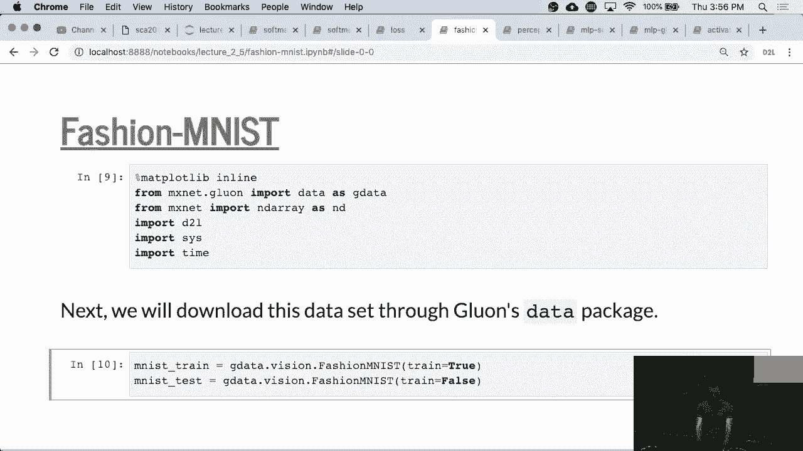

在本节课中，我们将学习如何使用Python实现Softmax回归，并将其应用于Fashion-MNIST数据集进行分类任务。我们将从零开始构建模型，理解Softmax函数和交叉熵损失，并训练一个简单的线性分类器。

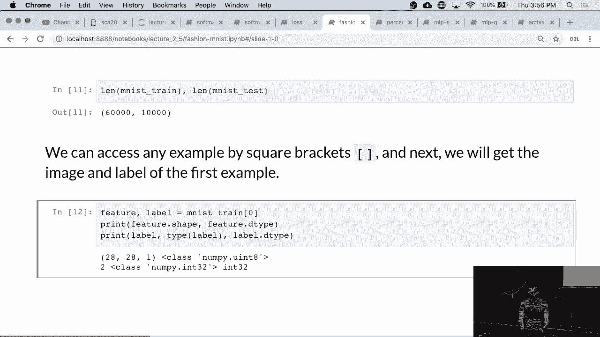

---

## 概述 📋

上一节我们讨论了数据加载和预处理。本节中，我们将重点介绍Softmax回归模型的原理与实现。我们将学习如何将线性模型的原始输出转换为概率分布，并定义一个可优化的损失函数。

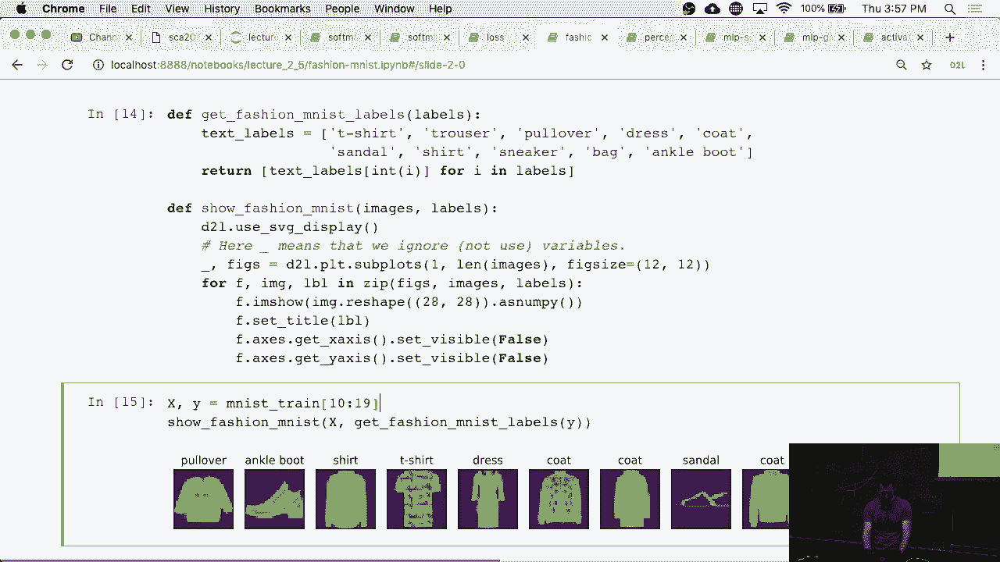

## 数据准备与回顾

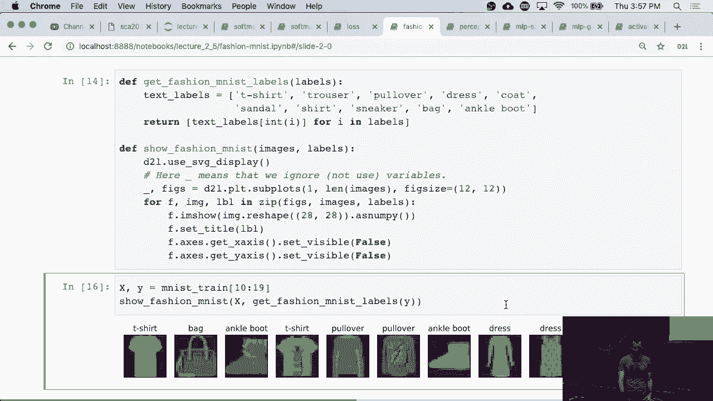

Fashion-MNIST数据集包含60,000张训练图像和10,000张测试图像，每张图像是28x28像素的灰度图。与手写数字MNIST相比，它对分类算法提出了稍高的挑战。

以下是加载和查看数据的一些便捷例程：

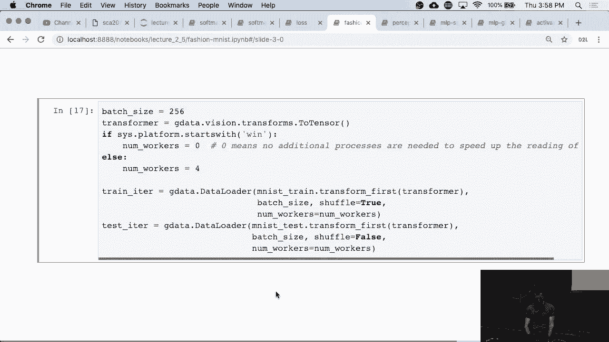

```python
# 示例代码：加载Fashion-MNIST数据集
train_iter, test_iter = d2l.load_data_fashion_mnist(batch_size=256)
```

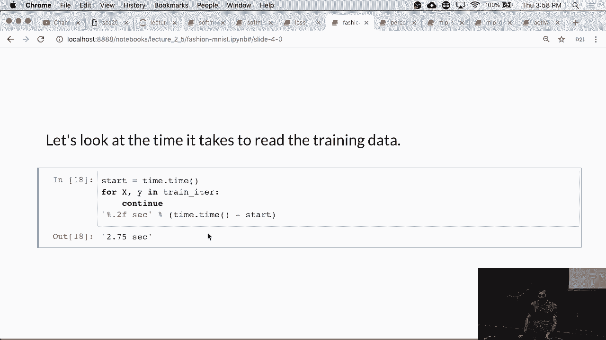

这些例程可以获取标签文本并用于绘图，帮助我们直观理解数据内容。

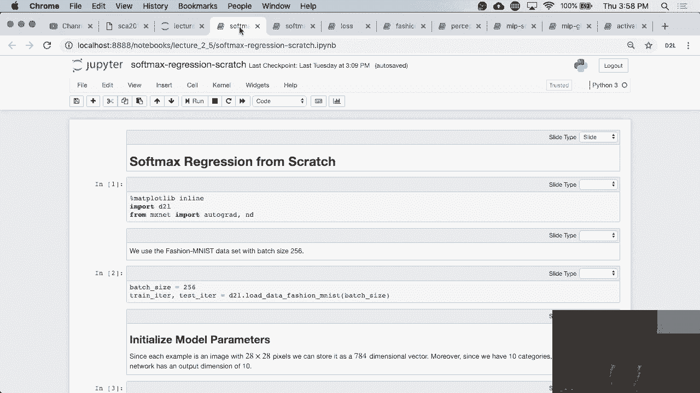

## Softmax函数原理

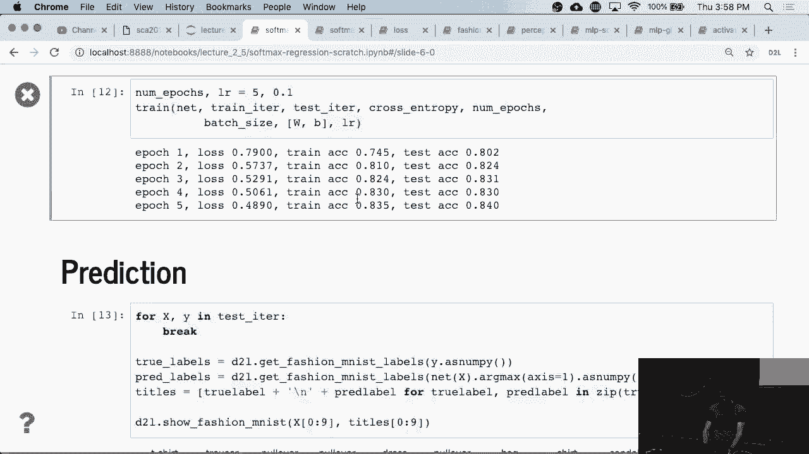

Softmax函数是“最大值函数”的一个“软化”版本。它的目标是将一组实数（模型的原始输出）转换为一个概率分布。

给定一个向量 **o**，Softmax计算第 *i* 个类别的概率为：

$$
\hat{y}_i = \text{softmax}(\mathbf{o})_i = \frac{\exp(o_i)}{\sum_j \exp(o_j)}
$$

这样，所有输出值都在0到1之间，且总和为1，可以解释为属于各个类别的概率。

如果我们对正确类别的预测概率取负对数，就得到了交叉熵损失：

$$
l(\mathbf{y}, \hat{\mathbf{y}}) = -\sum_j y_j \log \hat{y}_j
$$

由于 **y** 是独热编码（正确类别为1，其余为0），上式简化为正确类别预测概率的负对数：$-\log \hat{y}_{y}$。

## 从零实现Softmax回归

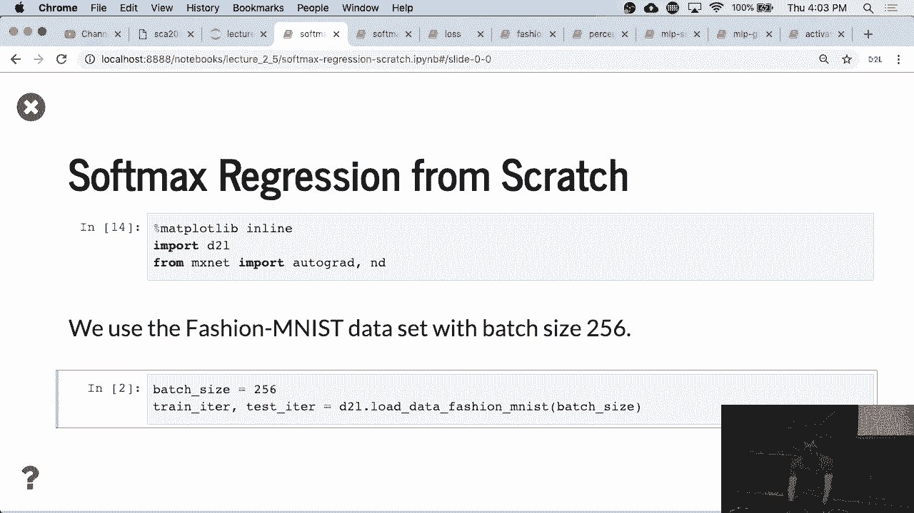

接下来，我们看看如何从零开始实现一个Softmax回归模型。

### 1. 初始化模型参数

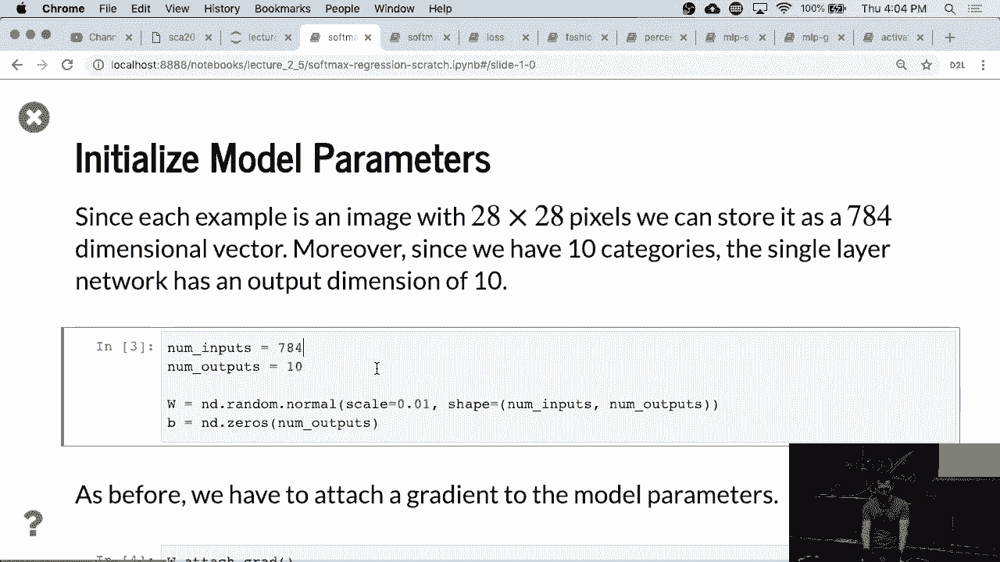

我们的输入是28x28=784维的向量，输出是10个类别。因此，我们需要一个784x10的权重矩阵 **W** 和一个10维的偏置向量 **b**。

```python
import torch
from torch import nn

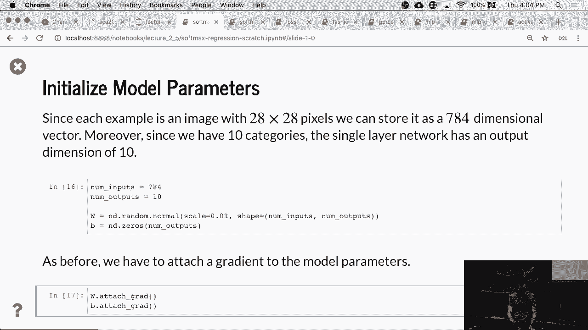

num_inputs = 784
num_outputs = 10

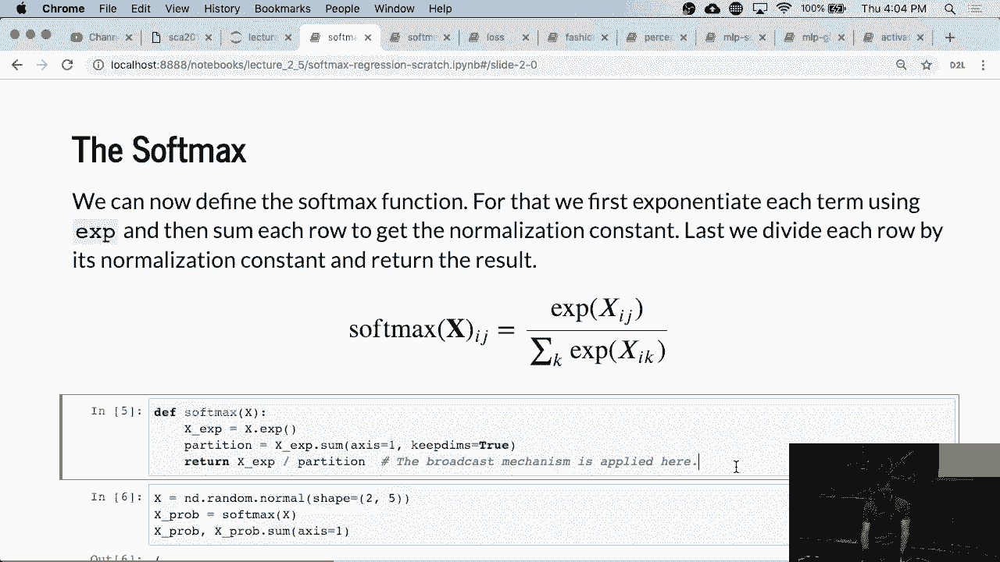

W = torch.normal(0, 0.01, size=(num_inputs, num_outputs), requires_grad=True)
b = torch.zeros(num_outputs, requires_grad=True)
```
`requires_grad=True` 会告知PyTorch需要为这些参数计算梯度，以便后续进行优化。

### 2. 实现Softmax运算

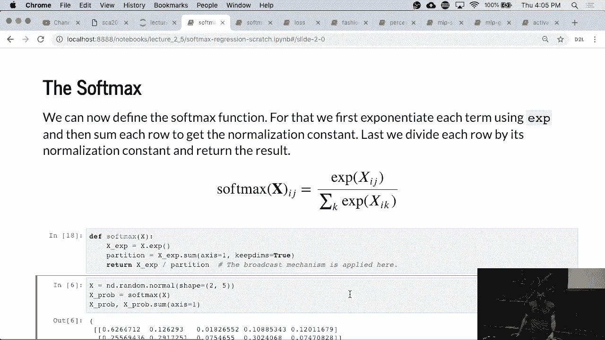

以下是Softmax函数的一个基础实现（注意：此实现数值上不稳定，仅用于演示）：

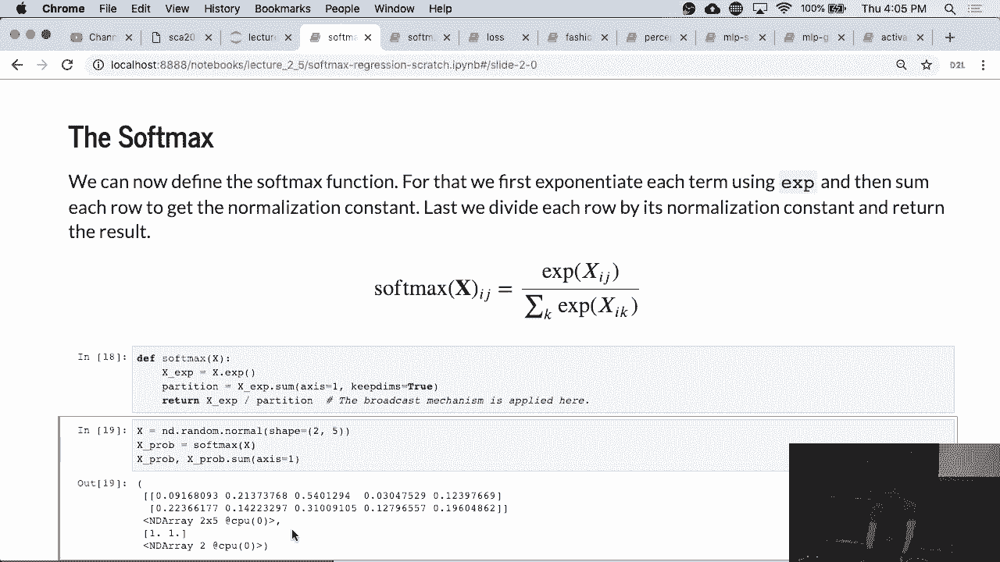

```python
def softmax(X):
    X_exp = torch.exp(X)
    partition = X_exp.sum(1, keepdim=True)
    return X_exp / partition  # 这里应用了广播机制
```

**重要提示**：在实际应用中，应使用框架内置的、经过数值稳定性优化的Softmax函数。

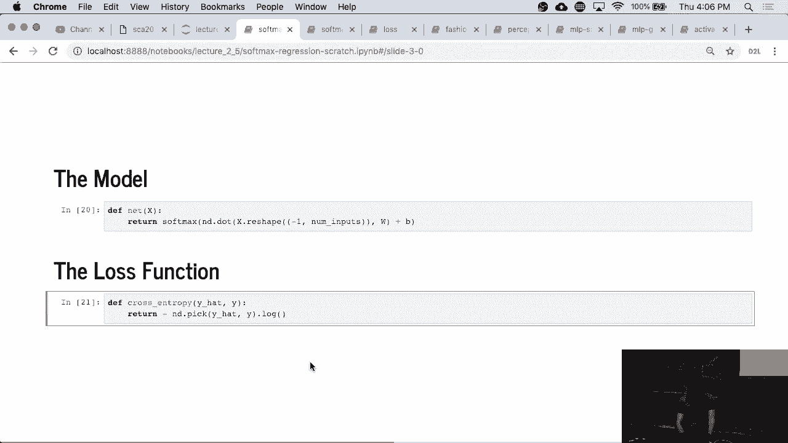

### 3. 定义模型

Softmax回归模型就是一个简单的线性变换后接Softmax函数。

```python
def net(X):
    # X的形状应为 (批量大小, 784)
    # 首先将图像展平
    return softmax(torch.matmul(X.reshape((-1, W.shape[0])), W) + b)
```

### 4. 定义损失函数

我们实现交叉熵损失函数。由于我们只关心正确类别的对数概率，实现可以简化。

```python
def cross_entropy(y_hat, y):
    # y_hat是预测的概率分布，y是真实标签的索引
    # gather函数选取y_hat中对应y索引处的值
    return -torch.log(y_hat[range(len(y_hat)), y])
```

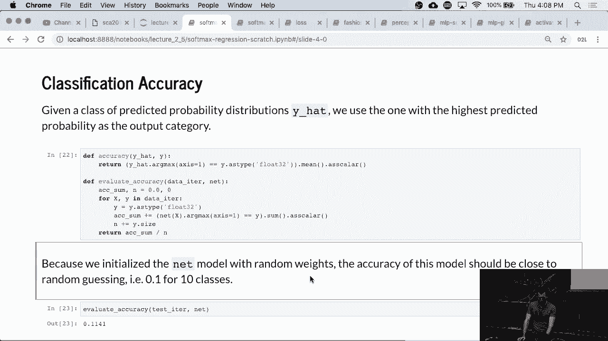

### 5. 定义评估指标

除了损失，我们更关心分类准确率。

```python
def accuracy(y_hat, y):
    """计算预测正确的数量"""
    if len(y_hat.shape) > 1 and y_hat.shape[1] > 1:
        y_hat = y_hat.argmax(axis=1) # 获取预测的类别索引
    cmp = y_hat.type(y.dtype) == y
    return float(cmp.type(y.dtype).sum())
```

## 训练模型

我们定义一个通用的训练函数，它将循环遍历数据，计算梯度并更新参数。

以下是训练过程的核心步骤：

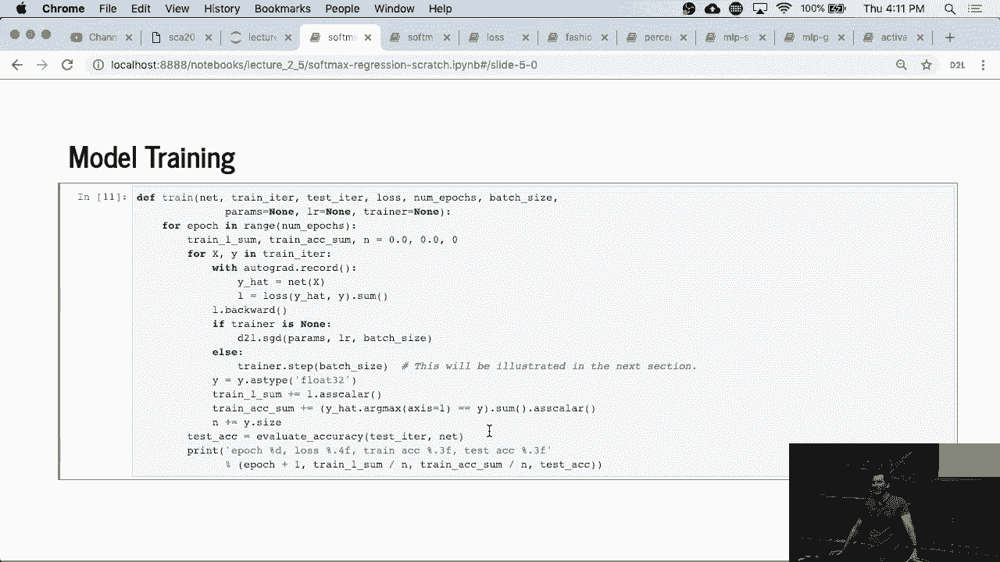

1.  初始化参数。
2.  对于每个迭代周期（epoch）：
    *   遍历训练数据集的每个小批量（minibatch）。
    *   计算模型输出和损失。
    *   计算损失关于模型参数的梯度。
    *   使用优化算法（如随机梯度下降SGD）更新参数。
3.  在测试集上评估模型性能。

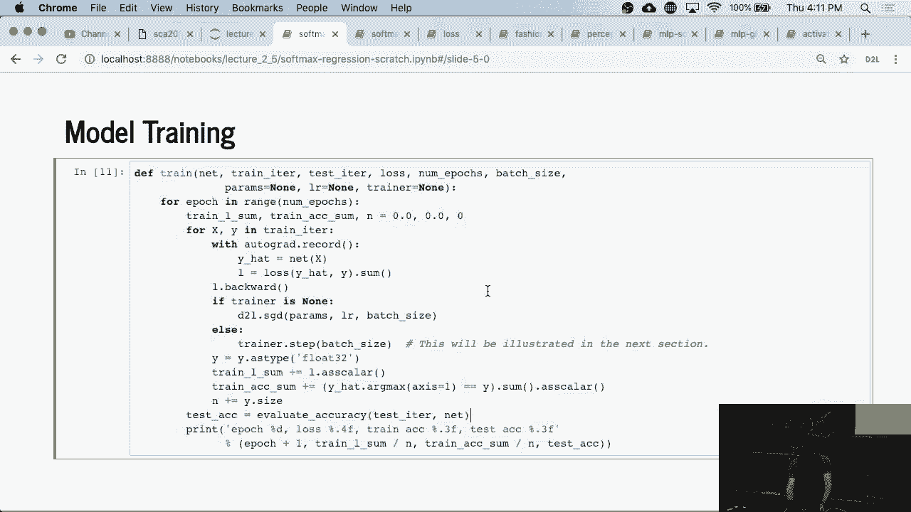

```python
def train_epoch_ch3(net, train_iter, loss, updater):
    """训练模型一个迭代周期"""
    # 将模型设置为训练模式
    if isinstance(net, torch.nn.Module):
        net.train()
    # 记录损失总和、正确预测数、样本数
    metric = d2l.Accumulator(3)
    for X, y in train_iter:
        # 计算梯度并更新参数
        y_hat = net(X)
        l = loss(y_hat, y)
        if isinstance(updater, torch.optim.Optimizer):
            # 使用PyTorch内置的优化器和损失函数
            updater.zero_grad()
            l.mean().backward()
            updater.step()
        else:
            # 使用定制的优化器和损失函数
            l.sum().backward()
            updater(X.shape[0])
        metric.add(float(l.sum()), accuracy(y_hat, y), y.numel())
    # 返回训练损失和训练准确率
    return metric[0] / metric[2], metric[1] / metric[2]
```

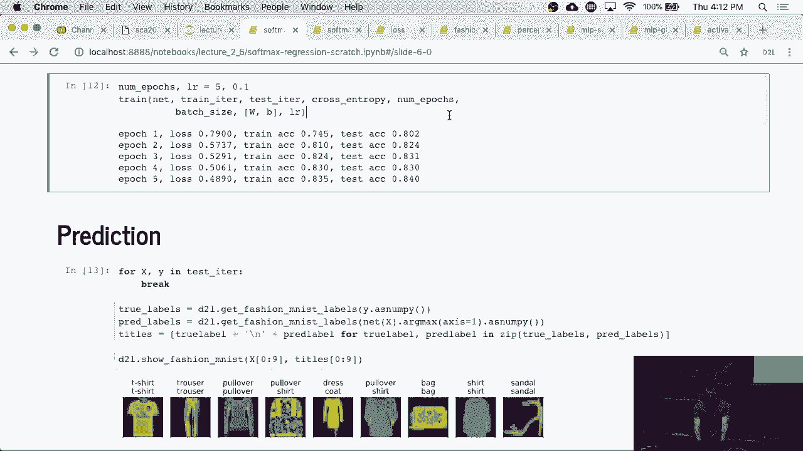

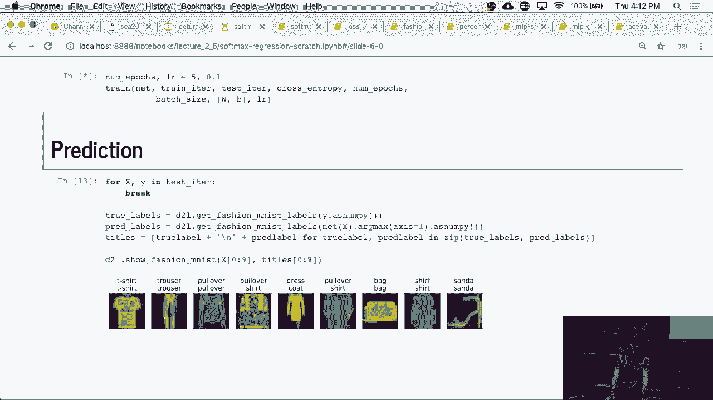

现在，我们可以使用这个函数来训练我们的Softmax回归模型。

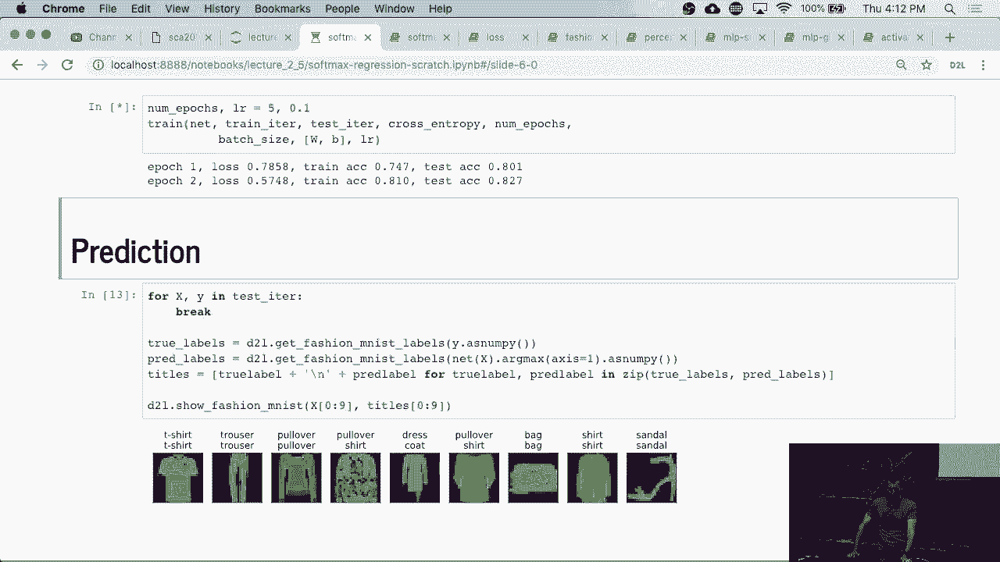

```python
lr = 0.1
num_epochs = 10

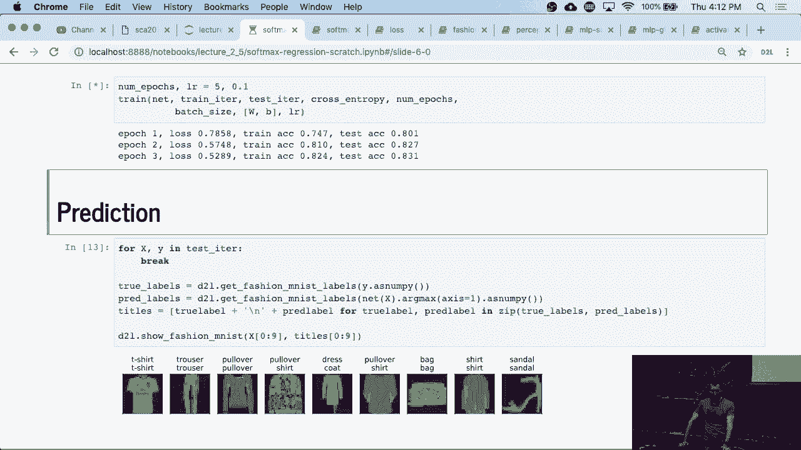

def updater(batch_size):
    d2l.sgd([W, b], lr, batch_size)

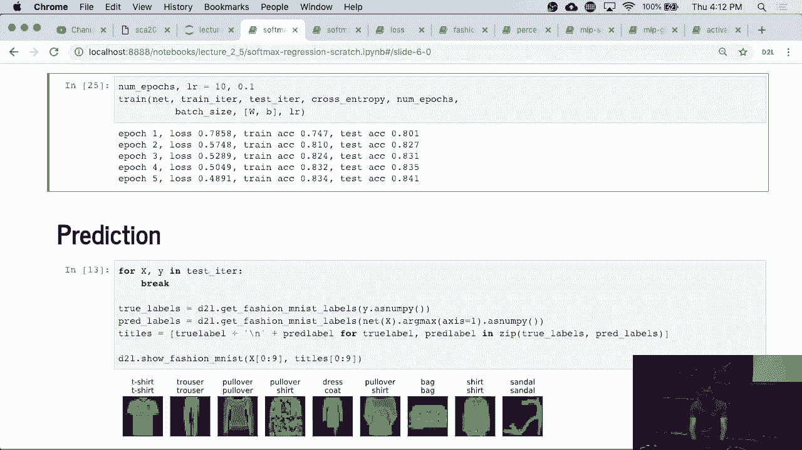

for epoch in range(num_epochs):
    train_metrics = train_epoch_ch3(net, train_iter, cross_entropy, updater)
    test_acc = d2l.evaluate_accuracy(net, test_iter)
    print(f‘Epoch {epoch + 1}, Train loss {train_metrics[0]:.3f}, ‘
          f‘Train acc {train_metrics[1]:.3f}, Test acc {test_acc:.3f}’)
```

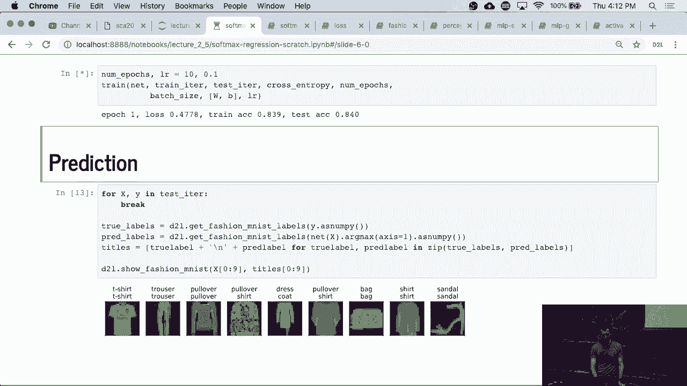

## 结果分析

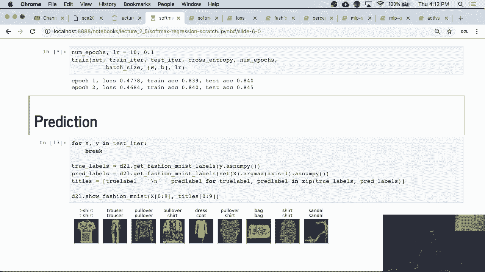

运行上述代码后，我们可以观察到：
*   训练损失随着迭代周期增加而稳步下降。
*   训练准确率和测试准确率同步上升。
*   最终，这个简单的线性模型在Fashion-MNIST测试集上能达到约83-85%的准确率。

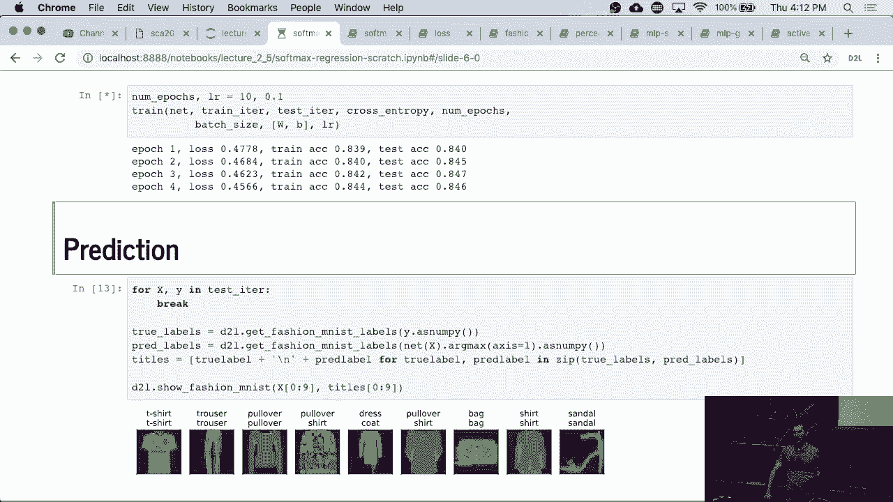

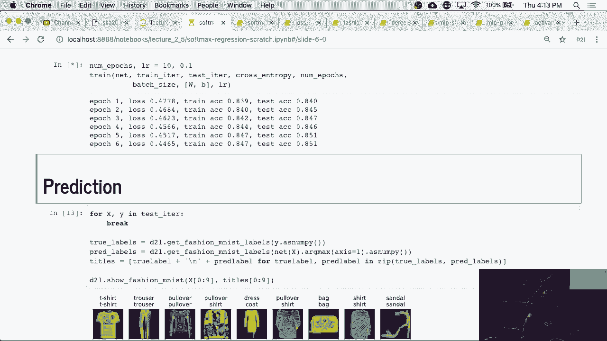

由于模型非常简单（仅约7850个参数），而训练数据量较大（60000个样本），因此不太容易出现严重的过拟合现象，测试准确率与训练准确率通常很接近。

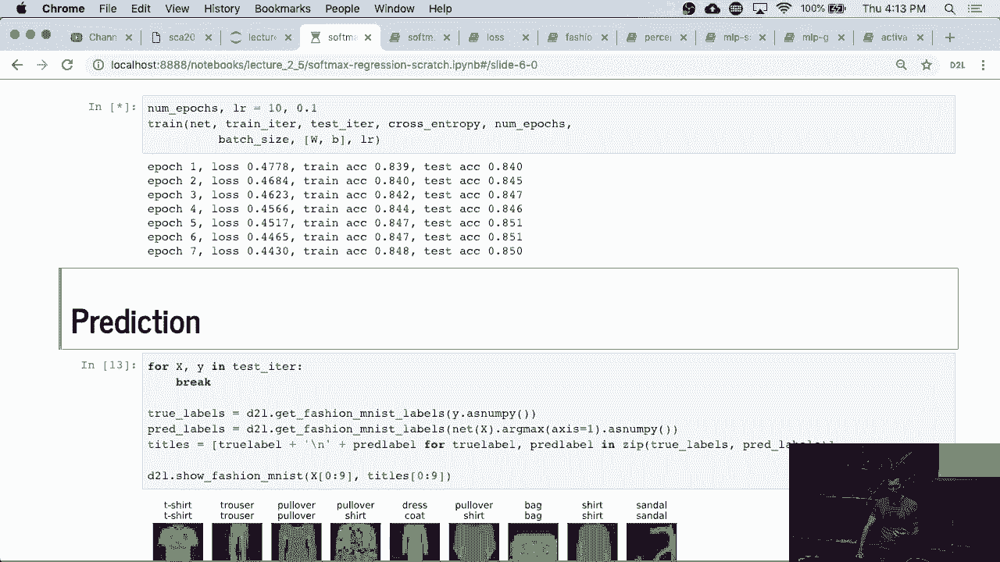

我们可以可视化一些模型的预测结果，会发现它能正确识别出如包包、凉鞋等特征明显的物品，但对于外形相似的类别（如衬衫、外套、裙子）有时会混淆。

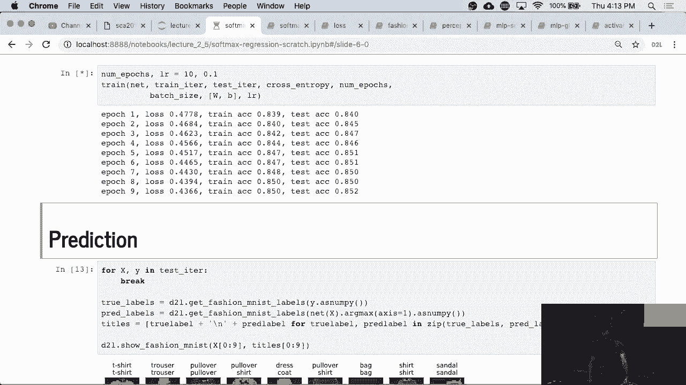

---

## 总结 🎯

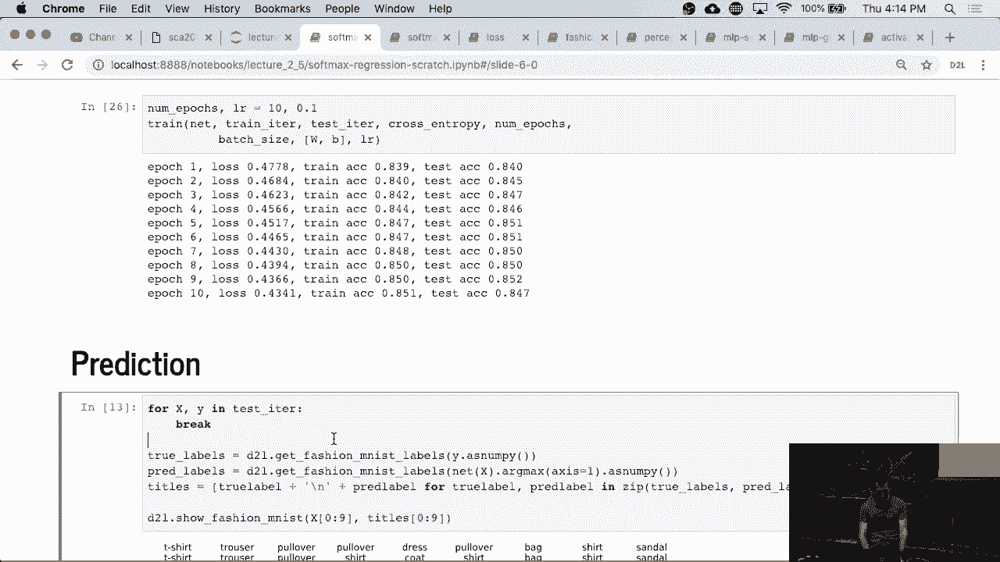

本节课中我们一起学习了Softmax回归的完整实现流程：

1.  **原理**：理解了Softmax函数如何将线性输出转化为概率分布，以及交叉熵损失作为优化目标。
2.  **实现**：从零开始初始化参数、实现了Softmax运算、定义了网络模型、损失函数和准确率计算。
3.  **训练**：构建了一个训练循环，使用小批量随机梯度下降来优化模型参数。
4.  **评估**：在独立的测试集上评估了模型性能，并分析了结果。

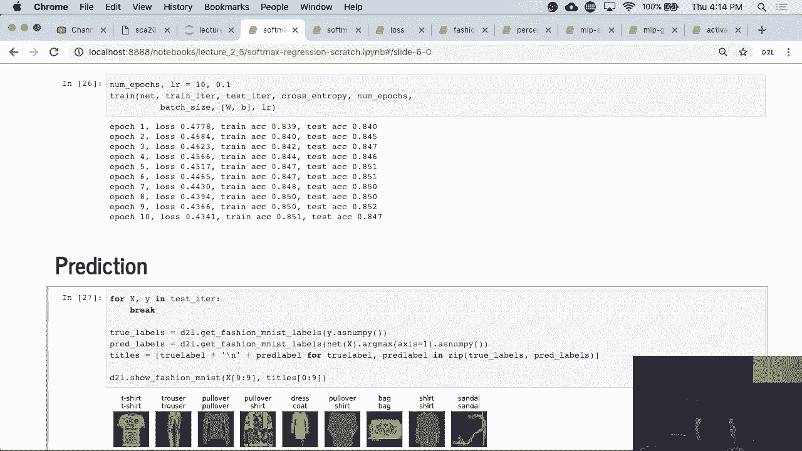

这个例子展示了仅使用线性代数运算和自动微分，就能构建并训练一个有效的多类分类器。这为后续学习更复杂的神经网络模型奠定了坚实的基础。