# 25：使用Gluon实现Softmax分类 🧠

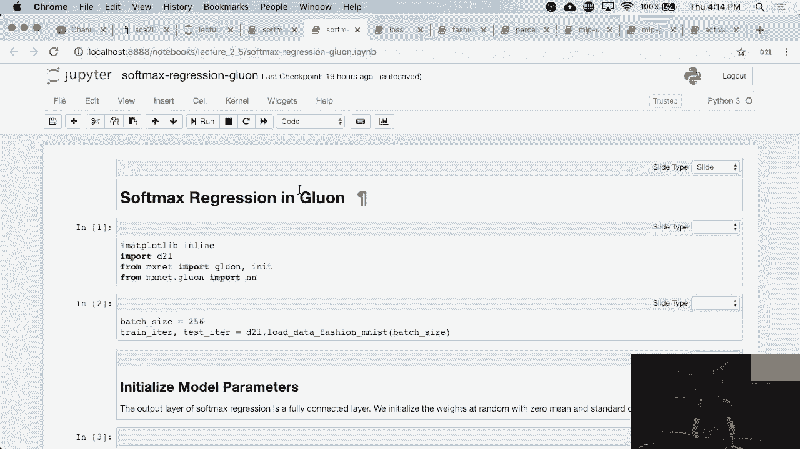

在本节课中，我们将学习如何使用深度学习框架Gluon来实现Softmax分类。我们将看到，相比于从零开始实现，使用Gluon可以极大地简化模型定义、参数初始化和训练过程。

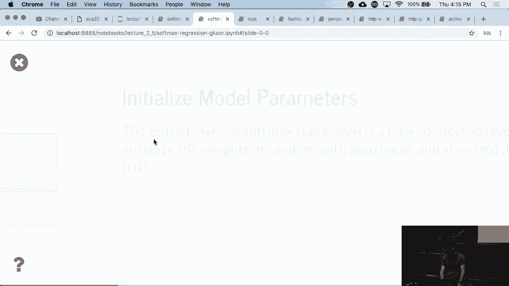

---

## 概述

我们将构建一个用于图像分类的Softmax回归模型。与手动实现不同，本节将利用Gluon的高级API，它能自动处理许多底层细节，例如参数初始化和维度推断，从而使代码更简洁、更易维护。

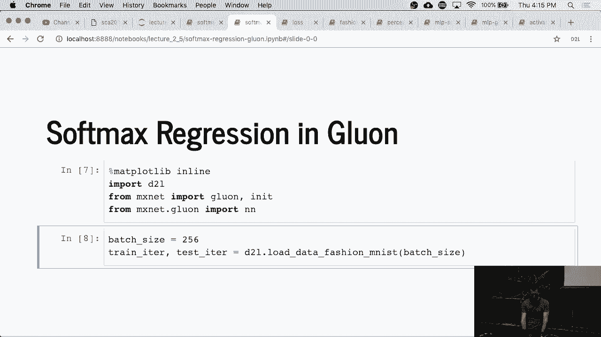

---

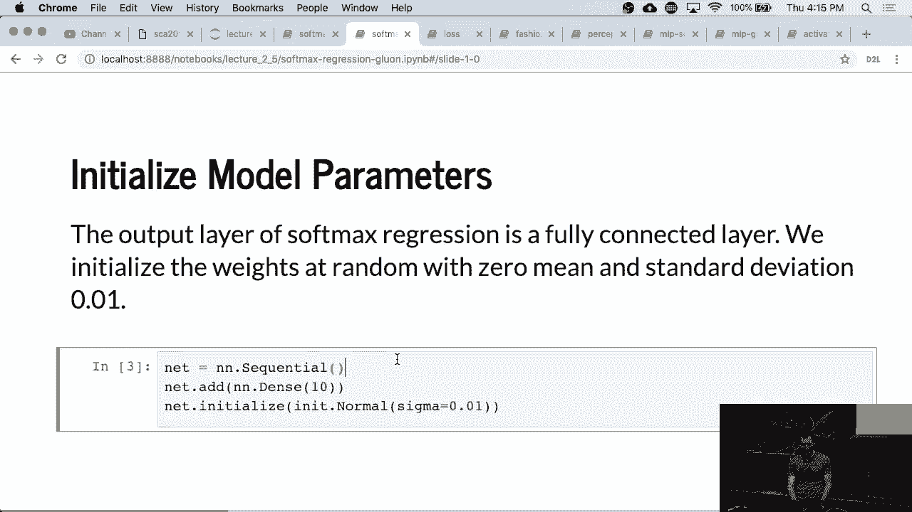

## 数据导入与准备

首先，我们需要导入数据。这部分代码与之前手动实现Softmax分类时完全相同。

```python
# 导入必要的库和数据
from mxnet import gluon, nd, autograd
from mxnet.gluon import nn
# ... 数据加载代码 ...
```


数据准备步骤保持不变，确保我们拥有正确格式的训练和测试数据集。

---

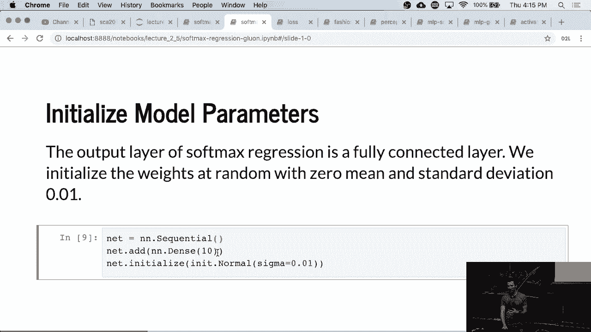

## 定义网络模型

上一节我们介绍了如何手动定义网络层和参数。本节中我们来看看如何使用Gluon简化这一过程。

使用Gluon定义网络非常简单。我们只需声明网络是一个顺序组合的层。在本例中，我们的网络只有一层。

```python
# 使用Sequential容器定义网络
net = nn.Sequential()
# 添加一个全连接层，输出单元数为10（对应10个分类）
net.add(nn.Dense(10))
```

**核心概念**：`nn.Sequential()` 是一个容器，用于按顺序组合网络层。`nn.Dense(10)` 定义了一个全连接层，其输出维度为10。

---

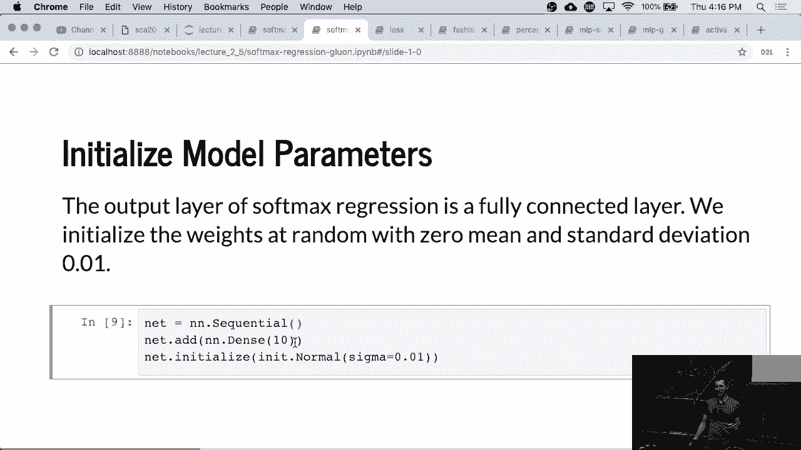

## 参数初始化

在Gluon中，我们可以方便地指定参数的初始化方式。这里，我们将权重初始化为均值为0、方差为0.01的正态分布。


```python
# 初始化网络参数
net.initialize(init=init.Normal(sigma=0.01))
```

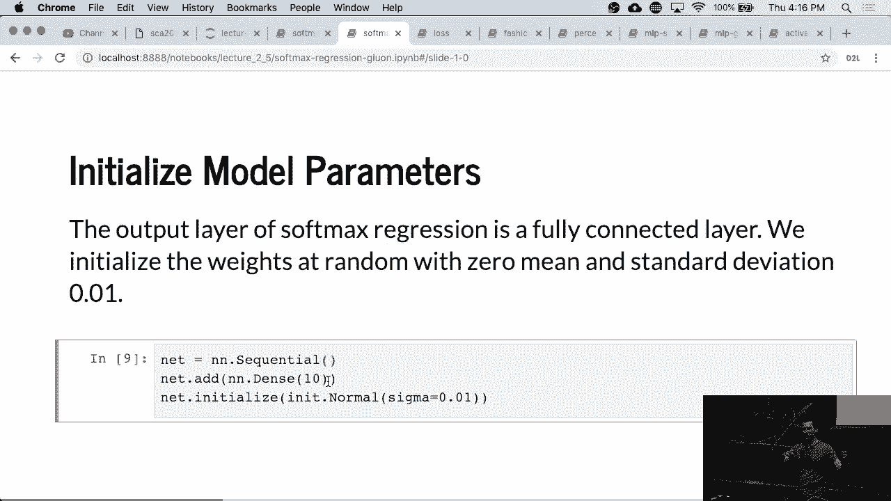

**核心概念**：`initialize()` 方法用于初始化网络中的所有参数。`init.Normal(sigma=0.01)` 指定了初始化分布。

---


## Gluon的自动维度推断

一个显著的优势是，我们不再需要手动指定输入维度。Gluon网络足够智能，能够在第一次前向传播时根据输入数据自动推断参数的数量和大小。

这意味着，如果输入图像尺寸从28x28变为30x30，网络依然能正常工作。然而，这种灵活性在实际应用中需要谨慎使用，因为过大的输入可能导致内存耗尽或计算缓慢。

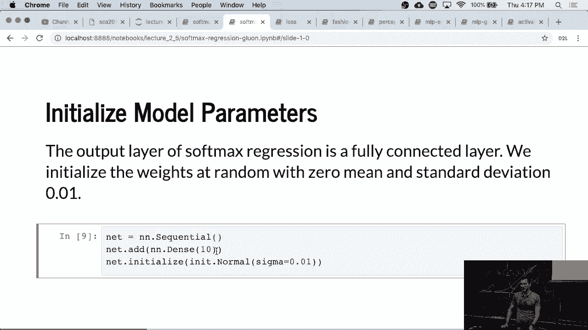

---

## 定义损失函数

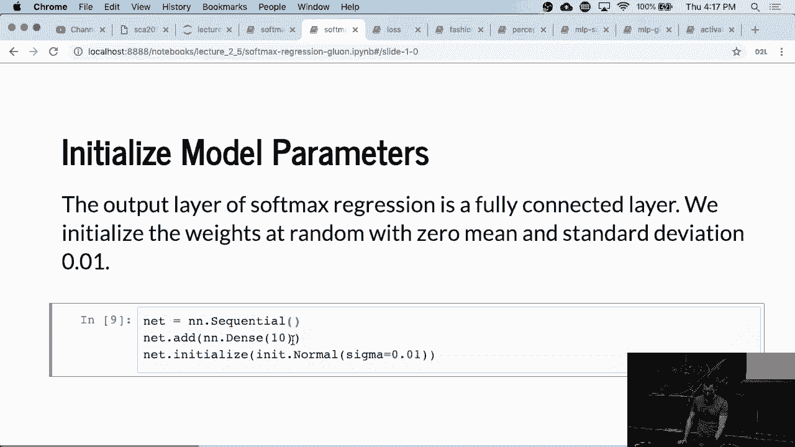

接下来，我们需要定义损失函数。Gluon提供了数值稳定的Softmax交叉熵损失函数。

```python
# 定义损失函数
loss = gluon.loss.SoftmaxCrossEntropyLoss()
```

**核心概念**：`SoftmaxCrossEntropyLoss()` 将Softmax运算和交叉熵损失计算结合在一起，并进行了数值优化以提高稳定性。

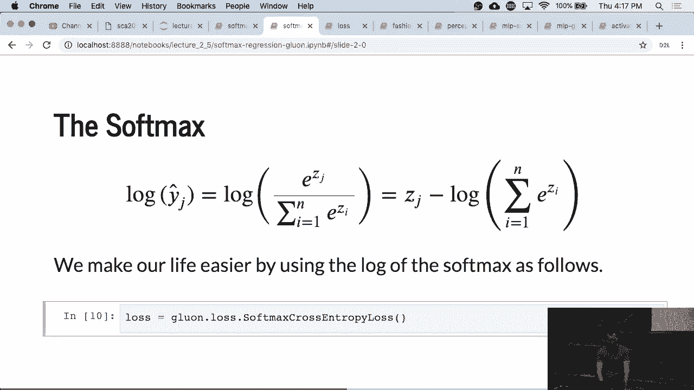

---

## 选择优化算法

我们将使用随机梯度下降（SGD）作为优化算法。Gluon中的`Trainer` API封装了SGD，并默认包含动量等优化技巧。

```python
# 定义优化器
trainer = gluon.Trainer(net.collect_params(), 'sgd', {'learning_rate': 0.1})
```

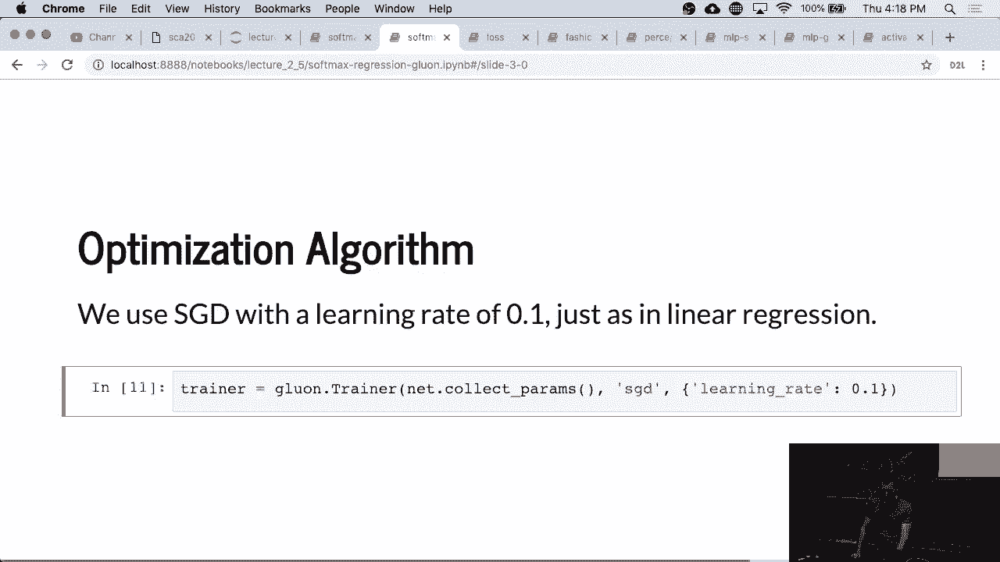

**核心概念**：`Trainer` 类用于更新网络参数。`net.collect_params()` 收集所有需要训练的参数，`’sgd’` 指定优化算法，字典 `{‘learning_rate’: 0.1}` 设置学习率。

---

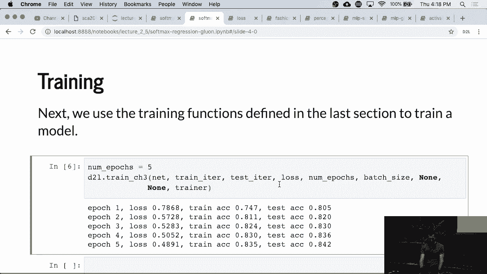

## 训练模型

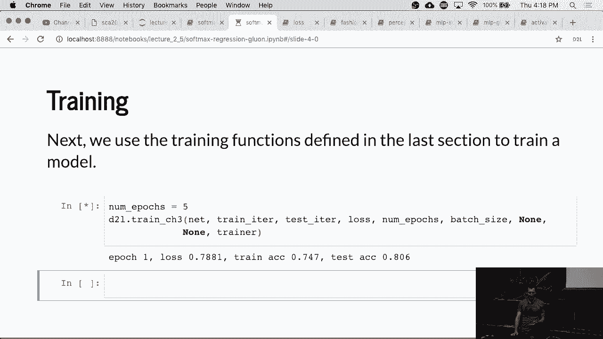

训练过程的调用签名与我们手动实现时几乎一模一样。Gluon将前向传播、损失计算、反向传播和参数更新封装了起来。

以下是训练循环的核心结构：

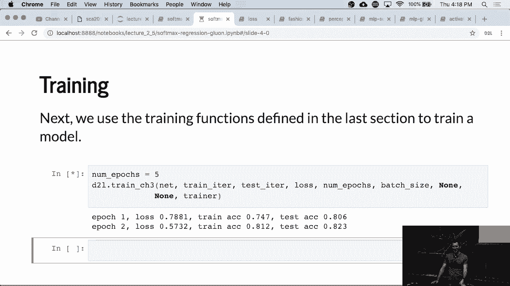

```python
for epoch in range(num_epochs):
    for X, y in train_iter:
        with autograd.record():
            output = net(X)
            l = loss(output, y)
        l.backward()
        trainer.step(batch_size)
    # 每个epoch后评估准确率...
```

由于Gluon内部的高效实现，训练速度可能会比手动实现略快，尤其是在构建更复杂的网络时，优势将更加明显。

---

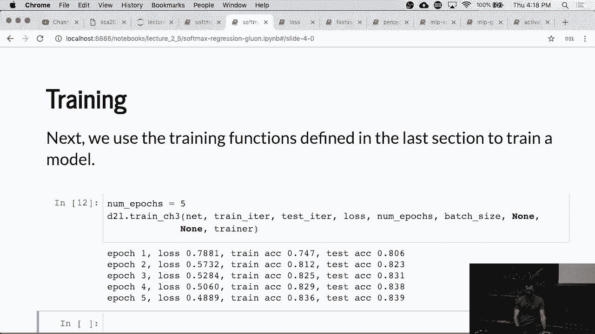

## 总结

本节课中，我们一起学习了如何使用Gluon框架实现Softmax分类。我们看到了Gluon如何通过高级API简化网络定义（`nn.Sequential`）、参数初始化（`initialize`）、损失函数（`SoftmaxCrossEntropyLoss`）和优化器（`Trainer`）的设置。最重要的是，我们体验了其自动维度推断功能带来的便利，但也提醒了在实际应用中需注意输入尺寸可能带来的问题。使用Gluon，我们可以更专注于模型结构和高层逻辑，而非底层实现细节。