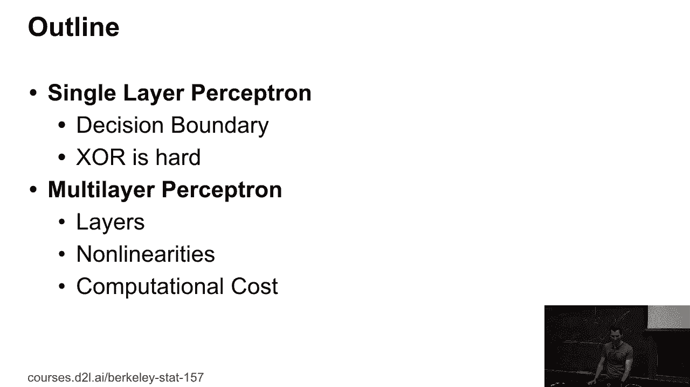
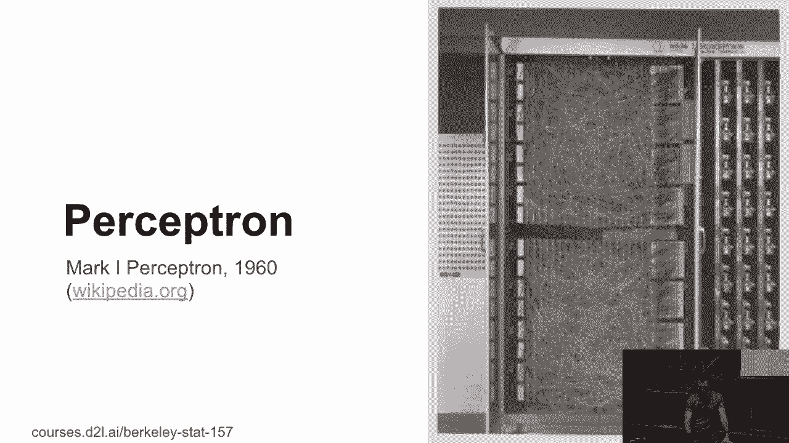
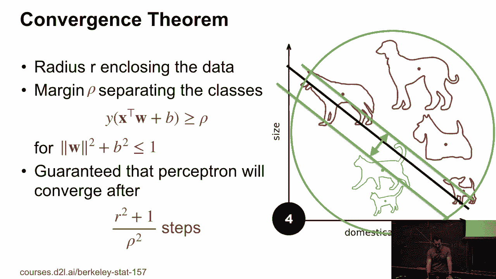
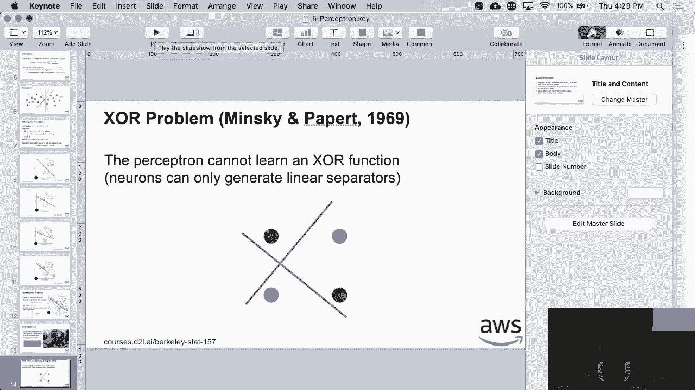
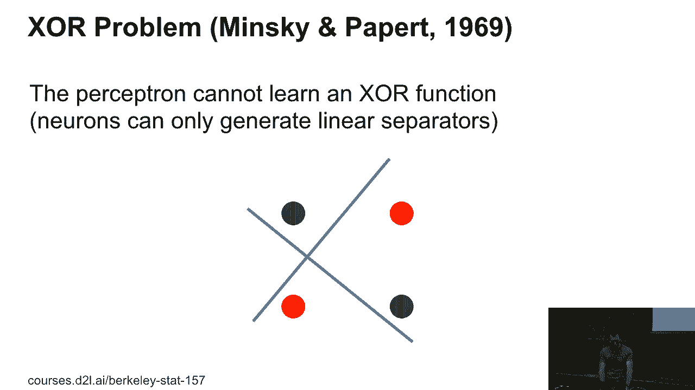
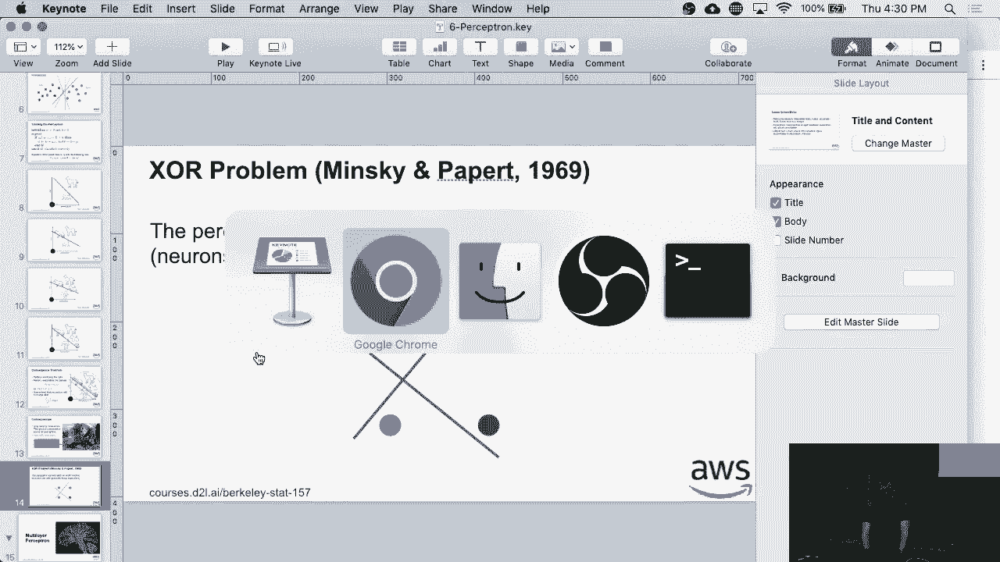
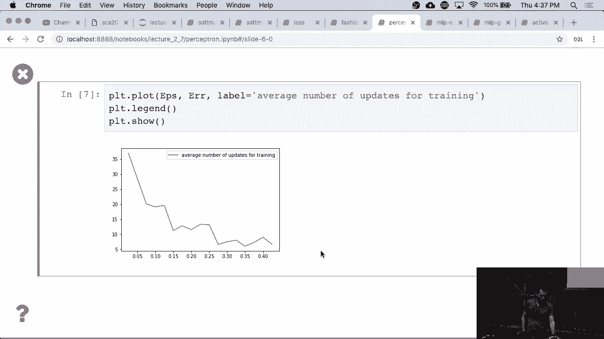

# 26：感知机算法 🧠

在本节课中，我们将学习感知机算法。这是20世纪50年代提出的一种早期神经网络模型，用于解决二分类问题。我们将了解它的工作原理、训练方法，并通过一个简单的例子来观察其运行过程。



---



## 感知机模型

上一节我们介绍了课程背景，本节中我们来看看感知机的具体模型。

感知机是一个简单的线性分类器。它接收输入 `X`，通过一个线性函数计算得分，然后根据得分输出分类结果（例如0或1）。

其核心计算过程可以用以下公式描述：

**输出 = f(W·X + b)**

其中：
*   `W` 是权重向量。
*   `X` 是输入特征向量。
*   `b` 是偏置项。
*   `f` 是一个非线性激活函数。对于二分类，通常使用阶跃函数：当 `W·X + b >= 0` 时输出1，否则输出0。

这个线性函数 `W·X + b = 0` 在空间中定义了一个决策边界（一个平面或直线），用于分隔不同的类别。

---

## 感知机训练算法

了解了模型的基本结构后，本节我们来看看如何训练它。

感知机使用一种迭代算法进行训练，其核心思想是：当模型对某个样本分类错误时，就调整参数以修正这个错误。这可以被视为使用特定损失函数、批大小为1的随机梯度下降。

以下是算法的具体步骤：

初始化权重 `W` 和偏置 `b` 为0。
对训练数据进行迭代。
对于每个样本 `(xi, yi)`（其中 `yi` 是真实标签，取值为+1或-1）：
检查分类是否正确。条件为：`yi * (W·xi + b) <= 0`。如果成立，则表示分类错误。
如果分类错误，则按以下规则更新参数：
*   `W = W + yi * xi`
*   `b = b + yi`
重复此过程，直到所有样本都被正确分类或达到停止条件。

该算法对应的损失函数可以理解为：当预测正确（`y * f(x) >= 0`）时，损失为0；当预测错误时，损失与 `-y * f(x)` 成正比。上述更新规则正是该损失函数导出的结果。

---

## 算法的收敛性

在开始实践之前，我们先从理论上了解这个算法的表现。



感知机收敛定理保证了算法的可行性。该定理指出：如果存在一个权重向量 `W*` 和偏置 `b*` 能够以间隔 `ρ > 0` 完美分隔所有训练数据，并且所有数据点都在一个半径为 `R` 的球内，那么感知机算法最多经过 `(R² + 1) / ρ²` 次参数更新后就会收敛。

这个定理的关键在于，收敛所需的**是参数更新的次数，而非遍历数据的次数**。如果数据容易分隔（间隔 `ρ` 大），更新次数就少；如果数据难以分隔或分布复杂，更新次数就多。

---

## 实践：用Python实现感知机

理论部分已经介绍完毕，现在让我们通过代码来实际观察感知机是如何工作的。

首先，我们需要生成一些线性可分的数据。



```python
import numpy as np
import matplotlib.pyplot as plt

def generate_linear_separable_data(num_samples=100, margin=0.3):
    # 生成一个随机的分隔超平面参数
    W_true = np.random.randn(2)
    W_true = W_true / np.linalg.norm(W_true)  # 归一化
    b_true = np.random.randn()

    X = []
    y = []
    while len(X) < num_samples:
        x_i = np.random.randn(2)  # 随机生成一个点
        # 计算该点到决策边界的“距离”
        dist = np.dot(W_true, x_i) + b_true
        # 如果距离足够大（即远离边界），则赋予标签并保留
        if abs(dist) > margin:
            label = 1 if dist > 0 else -1
            X.append(x_i)
            y.append(label)

    return np.array(X), np.array(y), W_true, b_true



# 生成数据
X, y, W_true, b_true = generate_linear_separable_data(margin=0.5)
```



接下来，我们实现感知机训练算法。

```python
def perceptron_train(X, y, max_epochs=100):
    num_features = X.shape[1]
    W = np.zeros(num_features)  # 初始化权重
    b = 0.0                     # 初始化偏置
    mistakes_history = []       # 记录错误历史

    for epoch in range(max_epochs):
        mistakes = 0
        for i in range(len(y)):
            # 检查是否分类错误
            if y[i] * (np.dot(W, X[i]) + b) <= 0:
                # 更新参数
                W = W + y[i] * X[i]
                b = b + y[i]
                mistakes += 1
                # 记录当前状态（用于可视化）
                mistakes_history.append((W.copy(), b, X[i], y[i]))
        # 如果本轮没有错误，则已收敛
        if mistakes == 0:
            print(f"Converged after {epoch} epochs.")
            break
    else:
        print(f"Stopped after reaching max_epochs ({max_epochs}).")

    return W, b, mistakes_history

# 训练感知机
W_trained, b_trained, history = perceptron_train(X, y)
```

最后，我们可以绘制训练过程，观察决策边界是如何逐步调整的。

```python
def plot_decision_boundary(W, b, X, y, title):
    # 绘制数据点
    plt.scatter(X[y==1, 0], X[y==1, 1], c='blue', label='Class +1')
    plt.scatter(X[y==-1, 0], X[y==-1, 1], c='red', label='Class -1')

    # 绘制决策边界 W·x + b = 0
    x1_min, x1_max = X[:, 0].min() - 1, X[:, 0].max() + 1
    x2_min, x2_max = X[:, 1].min() - 1, X[:, 1].max() + 1
    xx1 = np.linspace(x1_min, x1_max, 200)
    # 由 W[0]*x1 + W[1]*x2 + b = 0 解出 x2
    xx2 = -(W[0] * xx1 + b) / (W[1] + 1e-10)  # 防止除零
    plt.plot(xx1, xx2, 'k-', label='Decision Boundary')
    plt.xlabel('Feature 1')
    plt.ylabel('Feature 2')
    plt.title(title)
    plt.legend()
    plt.grid(True)
    plt.axis('equal')
    plt.show()

# 绘制最终的决策边界
plot_decision_boundary(W_trained, b_trained, X, y, "Perceptron Final Decision Boundary")
```

运行代码后，你将看到感知机如何从初始状态（决策边界可能很差）开始，随着每次错误更新，逐步调整到能够完美分隔所有数据点的最终状态。

---

## 感知机的局限性：XOR问题

感知机虽然简单有效，但它有一个根本性的局限。本节中我们来看看这个著名的“XOR问题”。

异或（XOR）问题要求模型学习以下规则：
*   输入 (0,0) 或 (1,1) 时，输出 0。
*   输入 (0,1) 或 (1,0) 时，输出 1。

在二维平面上，这对应于需要将 (0,0) 和 (1,1) 分为一类（例如红点），将 (0,1) 和 (1,0) 分为另一类（例如绿点）。**你无法找到一条直线来完美分隔这两类点**。

正是明斯基和帕帕特在20世纪70年代初指出了感知机的这一缺陷，证明了单层感知机无法解决线性不可分问题，这直接导致了第一次“AI寒冬”。

---

## 总结

本节课中我们一起学习了感知机算法。
*   我们首先介绍了感知机的基本模型，它是一个通过线性函数加阶跃激活函数进行二分类的简单网络。
*   接着，我们详细讲解了其训练算法，该算法在分类错误时更新权重，并了解了保证其收敛的理论定理。
*   然后，我们通过Python代码实践，生成了线性可分数据并实现了感知机，直观地观察了其学习过程。
*   最后，我们探讨了感知机的主要局限性——无法解决像XOR这样的线性不可分问题，这为后续引入多层网络（多层感知机）埋下了伏笔。



感知机是神经网络发展史上的重要里程碑，理解它为我们学习更复杂的深度学习模型奠定了坚实的基础。