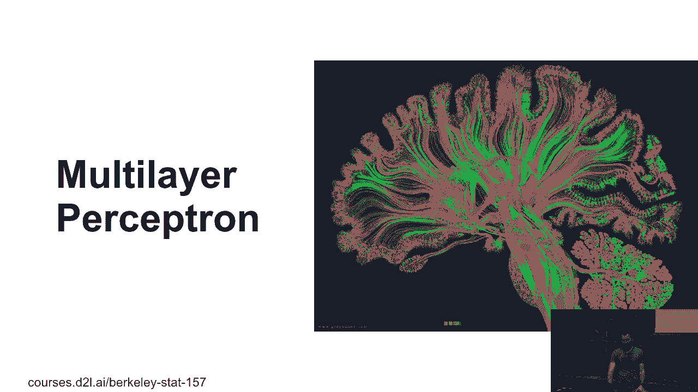
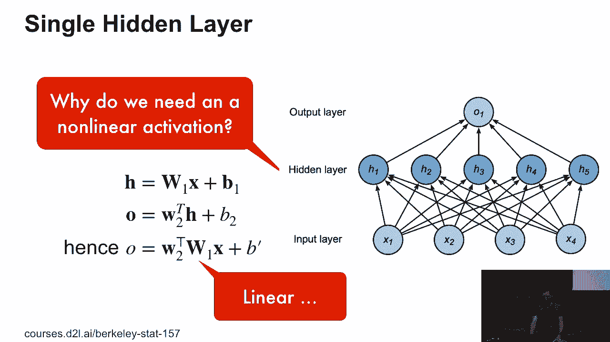
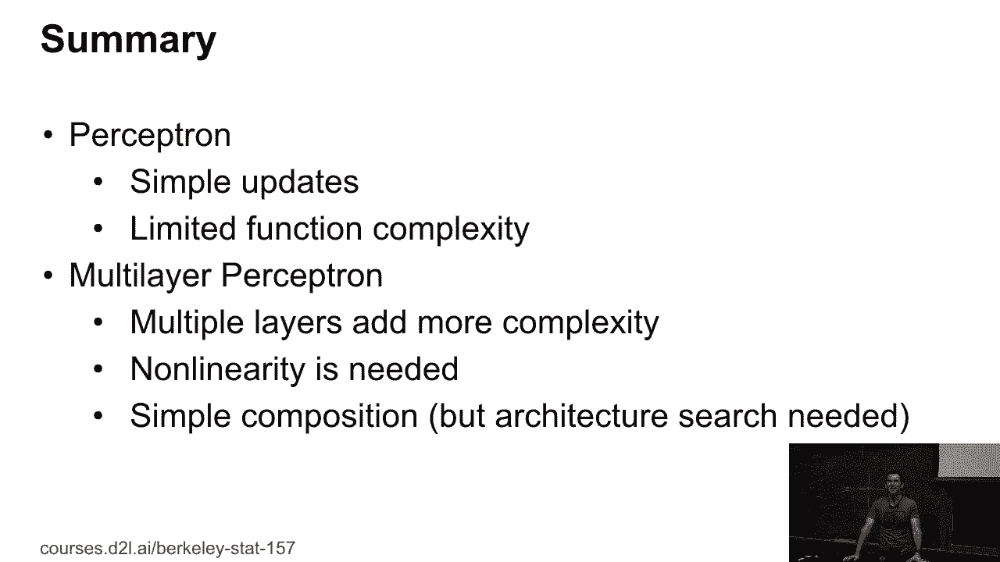

# 27：多层感知机 🧠

在本节课中，我们将要学习多层感知机。我们将从经典的XOR问题入手，理解为什么需要引入非线性激活函数和隐藏层，并最终构建一个能够解决复杂分类问题的神经网络模型。

---

## XOR问题与线性不可分性

上一节我们介绍了线性分类器的局限性。本节中我们来看看一个经典例子：XOR（异或）问题。

在XOR问题中，我们遇到的问题是线性分割器无法分割一些非常简单的数据。下图展示了这个问题：

事后看来，显然的解决方案是使用多层网络。值得注意的是，大脑也采用了类似的多层连接结构。

那么这一切与XOR有什么关系呢？让我们看看两个线性分类器。一个是简单的水平分割，另一个是垂直分割。这两者单独都无法正确分类所有点，但我可以轻松地将它们每一个都实现为线性分类器。我有蓝色的和橙色的分类器，它们分别分割其他点（1，2，3，4）。

根据这些加号和减号。但现在真正巧妙的地方在于，如果我取这两个分类器输出的逻辑乘积，我就得到了XOR问题的解。这个结果并不令人惊讶，因为我实际上可以通过这种方式将XOR写成乘法运算。从逻辑上讲，这非常简洁，因为这实际上就是一个带有一个隐藏层的深度网络。我首先取第一个和第二个分类器的输出，将它们相乘，然后输入到下一层就完成了。

---

## 单隐藏层网络结构

看起来不错。让我们看看是否可以做得更多。这是一个单隐藏层网络。

如果我有一个分类问题，那么输出就是这个。我要称输出为 **O**，隐藏层为 **H**。在这种情况下，我有一些设计自由度，除了选择参数之外。我可以选择有多少个隐藏单元。如果我选择很多隐藏单元，我可能能够建模更复杂的函数类。如果我选择很少，我就做不了太多。

有一个非常好的理论结果，它说，我几乎可以通过添加足够的隐藏单元来逼近任何有趣的函数。问题在于，这是一个美丽的理论结果，但在实践中完全没有用。因为没人会这样做，这样做会带来非常不愉快的后果。与庞大的函数类一起工作并不容易。但至少你知道如果你真的想做的话，是可以做到的。

---

## 数学模型与激活函数

那么这里是数学模型。我们有一些输入 **x**。我们有一些输出。我们有隐藏层。所以我们有一些参数 **w1** 和偏置 **b1**。对于输出，我们有一些向量 **w2** 和偏置 **b2**。这样输出就是标量。

所以对于隐藏层，我有：
**H = σ(w1 * x + b1)**

然后对于输出，我有：
**O = w2^T * H + b2**

这里的 **σ** 是一个激活函数。

那么为什么我需要激活函数呢？有任何想法吗？否则，无论你加多少层，最终都会得到一个线性函数。因为我可以一个接一个地应用线性变换。一个矩阵乘以下一个矩阵，组合起来仍然是线性的。事实上，我通过增加更多的线性层，可能会把事情搞得更糟。

为什么这是一个可怕的主意？过拟合？其实不完全是，因为最终它只是一个线性函数，尽管你有一个非常奇怪的参数化。但有一些非常实际的问题。第一点是，它可能需要永远才能收敛，因为我有一个非常大的等效网络参数空间，优化算法可能无法很好地收敛。第二个更具数学意义的问题是，我可能会得到一个表达能力更弱的网络。假设我有一个10维的输入和一个10维的输出，在中间我只有5个隐藏单元。那么我自动强制我的网络，在矩阵的基本秩上，将维度限制为5。这大大限制了我能做的事情。所以，不仅仅是我失去了非线性表达能力，我实际上可能会使模型比简单线性模型变得更糟。因此，这就是为什么我们需要激活函数的原因。

---

### 常见的激活函数

以下是一些常见的激活函数：

**Sigmoid函数**：`σ(x) = 1 / (1 + e^(-x))`
这曾经是一个非常流行的激活函数，但现在似乎没有人再用了。有人知道为什么这实际上是一个非常糟糕的主意吗？所以对于非常负的输入和非常正的输入，梯度会变为零。并且在某个地方有一个非常小的黄金区间（也许是-2到2之间），梯度才比较明显。如果由于某种不幸，你的输入尺度超出了范围，结果落入了那两个平坦的区域之一，那么你的优化算法基本上会卡住。你将再也得不到有意义的梯度。

**Tanh函数**：`tanh(x)`
它和Sigmoid的情况类似，只是尺度不同。你可以证明，这两个函数在重新缩放后是等效的。

**ReLU函数**：`ReLU(x) = max(0, x)`
现在大家都使用这个叫做ReLU（修正线性单元）的东西。它只是x和0的最大值。它不再有Sigmoid那么严重的梯度消失问题，至少它只剩下一半的问题（输入为负时梯度为0）。对于正半空间，梯度恒为1。

考虑到这一点，在某个时刻，一些人提出了一个想法，让我们固定左边的梯度零点，并使用一种叫做PReLU（参数化修正线性单元）的东西。PReLU本质上就是ReLU，但常数零的位置稍微偏移了一点，这个偏移量 **α** 是可以学习的。在某些情况下，这会让事情稍微变得更好一些。所以除非你真的知道自己遇到了梯度消失问题，否则不必特意使用它。

---

## 扩展到多类分类

现在我们可以进行多类分类。我们需要做的唯一事情就是构建网络：输入层、隐藏层、输出层。然后我在输出上运行一个softmax函数。

数学上讲：
隐藏层是：**H = σ(w1 * x + b1)**
输出是：**O = w2 * H + b2**
最终预测是：**y = softmax(O)**

既然我们这么喜欢增加复杂度，我们可以有更多的层。如果你只用图形表示，那很容易。但在某个时刻，用图形来指定真的很困难。因此，这就是在代码中指定网络会容易得多的地方。

一旦你有了这个框架，你将拥有更多的设计自由度。你可以添加更多的层，让它更深。你可以增加更多的隐藏单元。根据你怎么做，例如，你可以创建一个直线型网络，然后再转到输出，或者在中间变窄，之后又变宽。这实际上是你可能想要为特定数据集微调的地方。

---

## 总结与展望

本节课中我们一起学习了多层感知机。我们从XOR问题出发，理解了单层线性模型的局限性，并引入了隐藏层和非线性激活函数（如ReLU）来构建更强大的模型。我们看到了网络的数学模型，并讨论了网络深度和宽度等设计选择。

你现在将有足够的时间来实际尝试构建和训练一个多层感知机。

到目前为止，理论上有任何问题吗？

没有问题？很好，太棒了。

