# 28：L6_3 多层感知器在 Python 中的实现 🧠💻

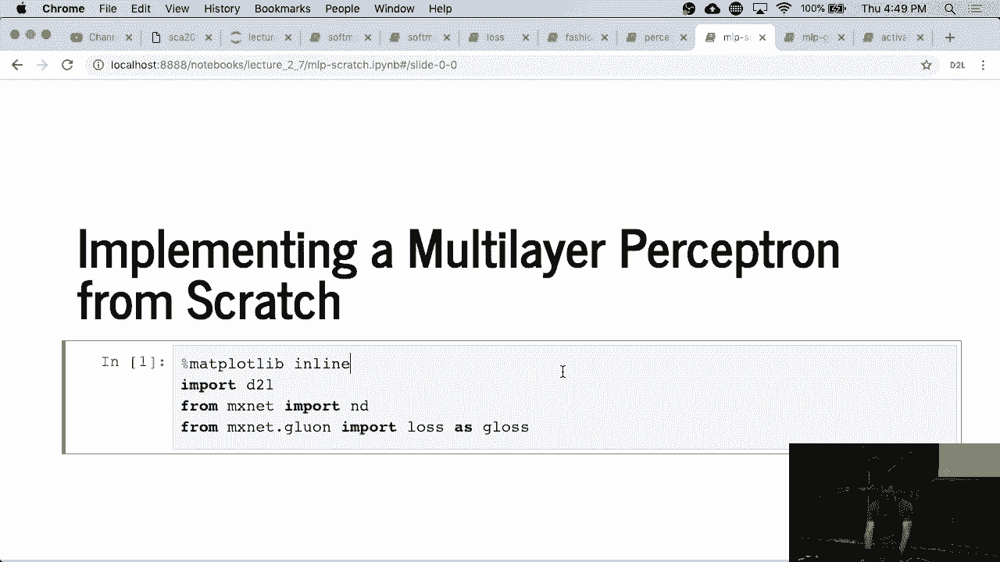

在本节课中，我们将从零开始，使用 Python 实现一个多层感知器（MLP）。我们将学习如何初始化模型参数、定义网络结构、计算损失并进行训练。通过这个过程，你将理解 MLP 的基本构建模块，并看到它如何比简单的线性模型带来性能提升。

---

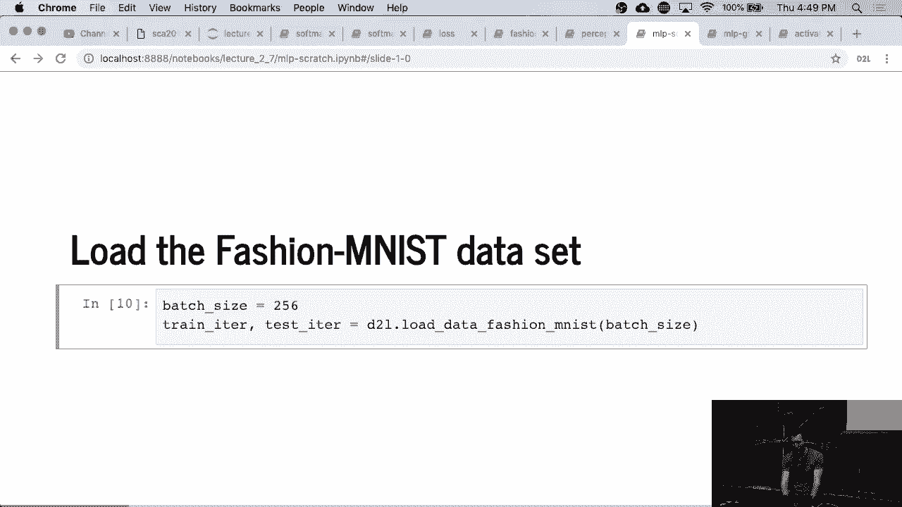

## 1. 导入库与加载数据 📊

首先，我们需要导入必要的库并加载数据集。这部分代码与之前线性回归模型的准备工作类似。

```python
import numpy as np
# 假设我们有一个加载数据集的函数 load_data()
train_data, test_data = load_data()
```

我们加载了新的数据集，但代码结构与之前完全相同。

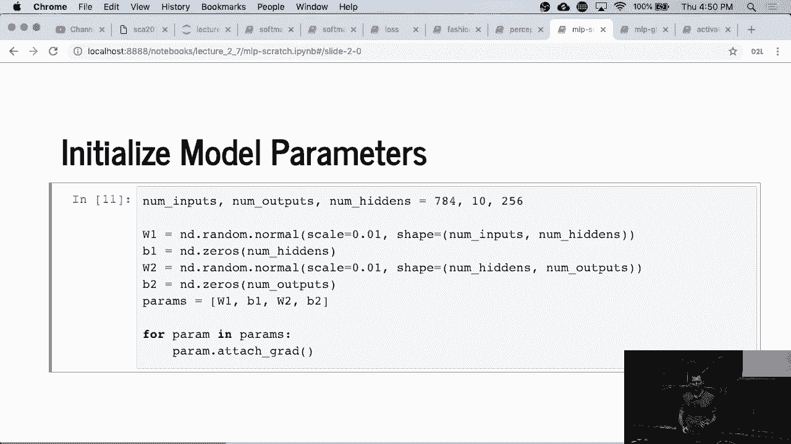

---

## 2. 初始化模型参数 🔧

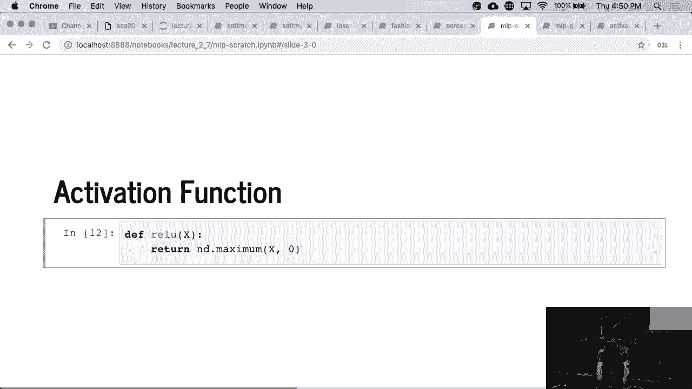

上一节我们准备好了数据，本节中我们来看看如何初始化一个含有一个隐藏层的多层感知器的参数。

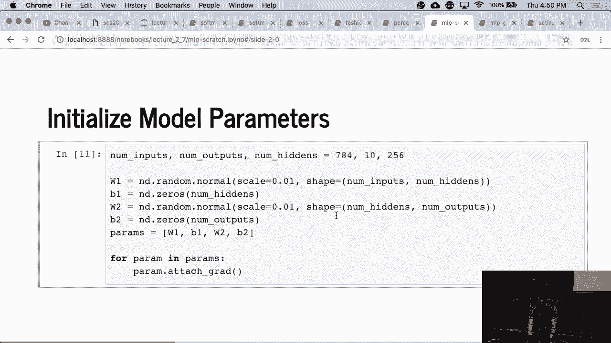

假设我们的网络有一个包含 256 个神经元的隐藏层。我们需要初始化两个权重矩阵和两个偏置向量。

以下是参数初始化的步骤：
*   **W1**: 连接输入层和隐藏层的权重矩阵，维度为 `(输入特征数, 256)`。
*   **b1**: 隐藏层的偏置向量，维度为 `(256,)`。
*   **W2**: 连接隐藏层和输出层的权重矩阵，维度为 `(256, 输出类别数)`。
*   **b2**: 输出层的偏置向量，维度为 `(输出类别数,)`。

我们将所有参数存储在一个列表中，并为每个参数附加一个梯度存储空间，以便后续进行梯度下降学习。

```python
num_inputs = 28 * 28  # 假设是28x28的图像，展平后
num_hiddens = 256
num_outputs = 10  # 假设是10分类问题

def init_params():
    W1 = np.random.randn(num_inputs, num_hiddens) * 0.01
    b1 = np.zeros(num_hiddens)
    W2 = np.random.randn(num_hiddens, num_outputs) * 0.01
    b2 = np.zeros(num_outputs)
    params = [W1, b1, W2, b2]
    # 为每个参数附加梯度
    for param in params:
        param.grad = np.zeros_like(param)
    return params

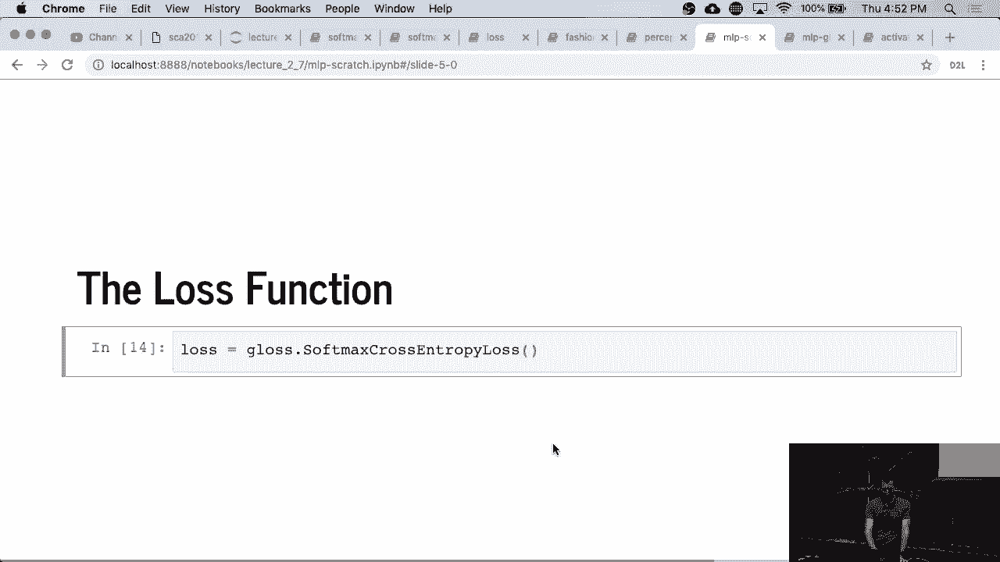

params = init_params()
W1, b1, W2, b2 = params
```

---

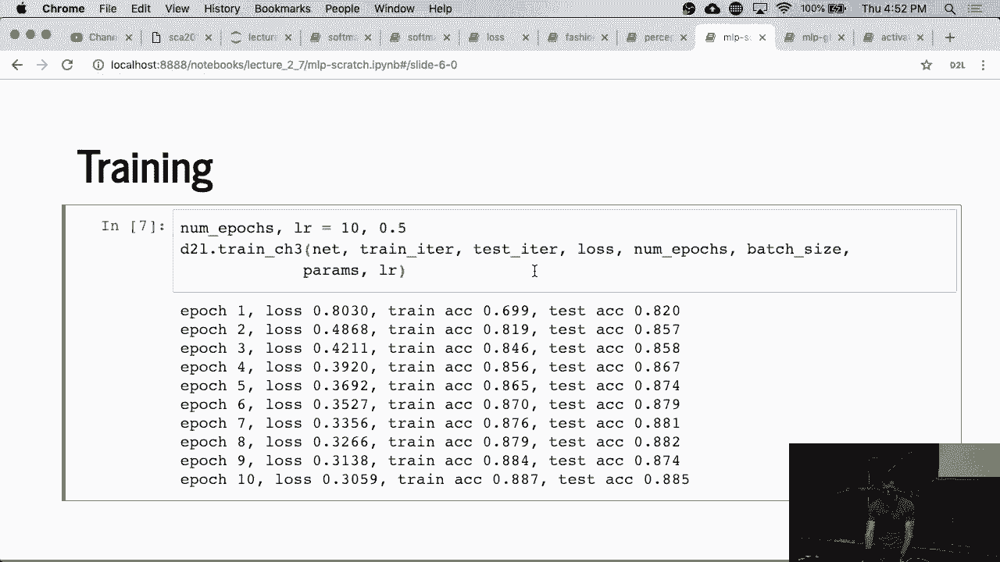

## 3. 定义激活函数与模型结构 🏗️

参数初始化后，我们需要定义网络的前向传播过程。这包括线性变换和非线性激活。

我们使用 ReLU 作为隐藏层的激活函数。ReLU 函数的公式是：
**`ReLU(x) = max(0, x)`**

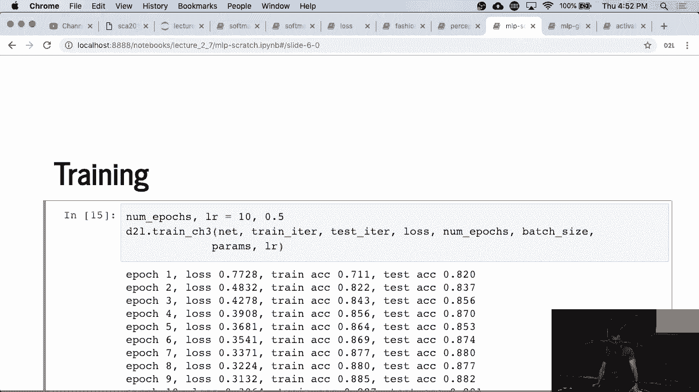

在代码中，我们可以利用广播机制对数组进行逐元素计算。

```python
def relu(x):
    return np.maximum(0, x)
```

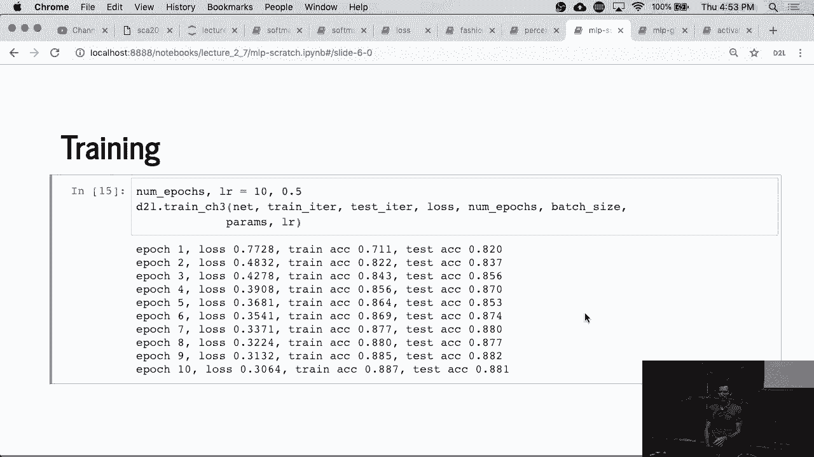

现在，我们可以定义整个模型的前向传播函数。模型首先将输入的二维图像展平为一维向量，然后进行两次线性变换，中间通过 ReLU 激活函数引入非线性。

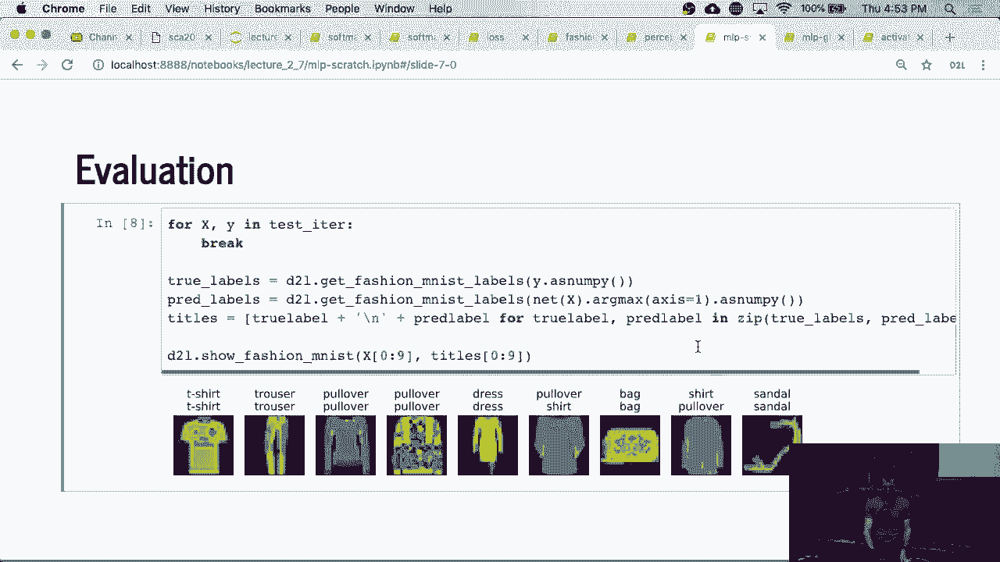

```python
def mlp(X, params):
    W1, b1, W2, b2 = params
    # 将输入图像展平
    X = X.reshape(-1, num_inputs)
    # 第一层：线性变换 + ReLU激活
    H = relu(np.dot(X, W1) + b1)
    # 第二层：线性变换（输出层）
    O = np.dot(H, W2) + b2
    return O
```

这个模型结构与之前的 softmax 线性回归模型类似，但增加了一个带有非线性激活的隐藏层。

---

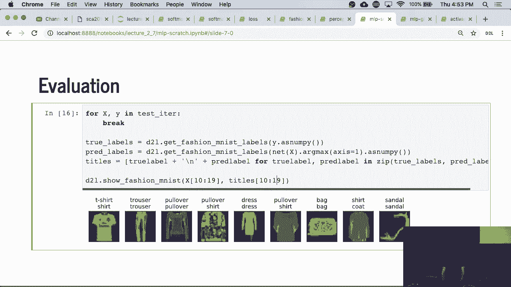

## 4. 定义损失函数与训练流程 📉

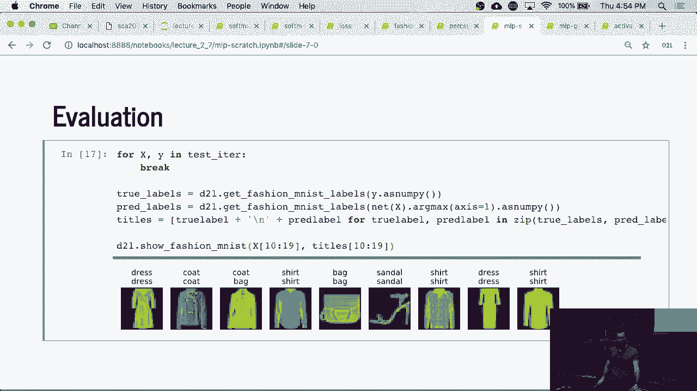

模型定义好后，我们需要一个损失函数来衡量其预测的好坏，并指导参数更新。

为了代码的简洁和数值稳定性，我们直接使用内置的 softmax 交叉熵损失函数。训练流程的代码（包括梯度计算和参数更新）与之前实现简单模型时基本相同。

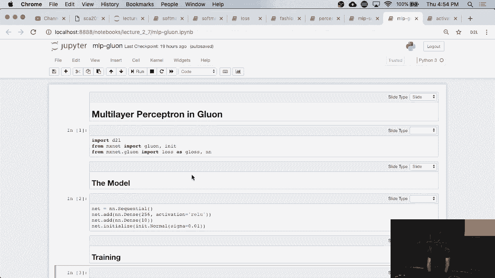

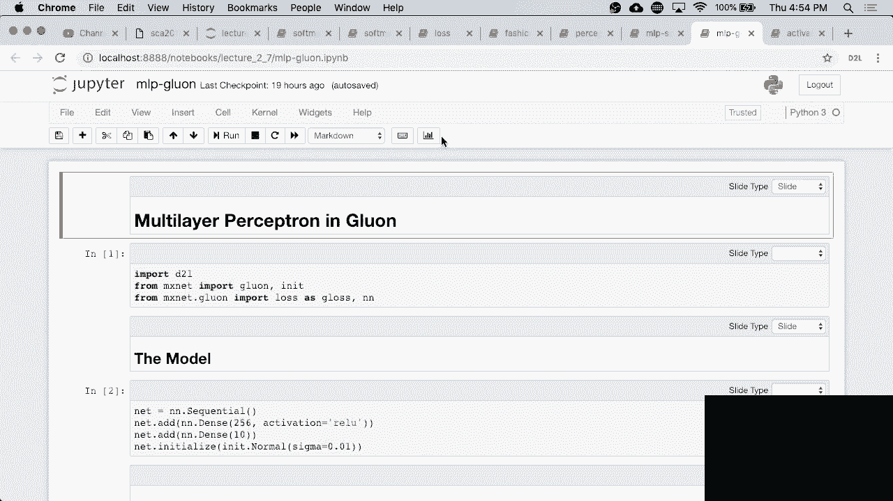

```python
def softmax_cross_entropy_loss(O, y):
    # 使用稳定的softmax和交叉熵计算
    exp_O = np.exp(O - np.max(O, axis=1, keepdims=True))
    softmax = exp_O / np.sum(exp_O, axis=1, keepdims=True)
    loss = -np.log(softmax[range(len(y)), y]).mean()
    return loss

# 训练循环伪代码示意
def train_epoch(data_iter, params, lr):
    for X, y in data_iter:
        with autograd.record():
            O = mlp(X, params)
            loss = softmax_cross_entropy_loss(O, y)
        loss.backward()
        # 使用梯度下降更新每个参数
        for param in params:
            param[:] = param - lr * param.grad
            param.grad[:] = 0  # 梯度清零
```

唯一的区别是，我们现在将 `mlp` 函数作为网络架构，而不是简单的线性模型。

---

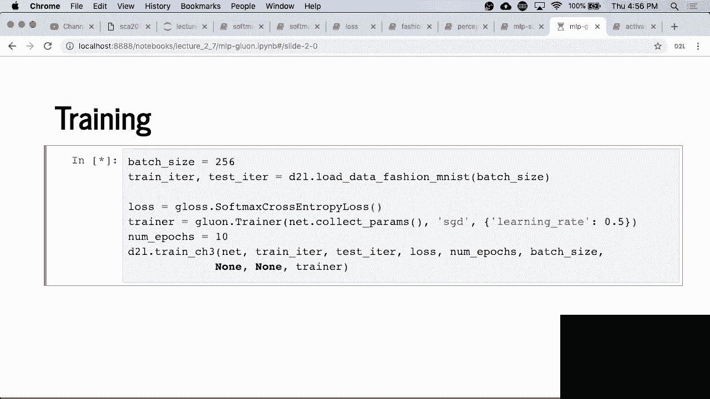

## 5. 模型训练与结果分析 📈

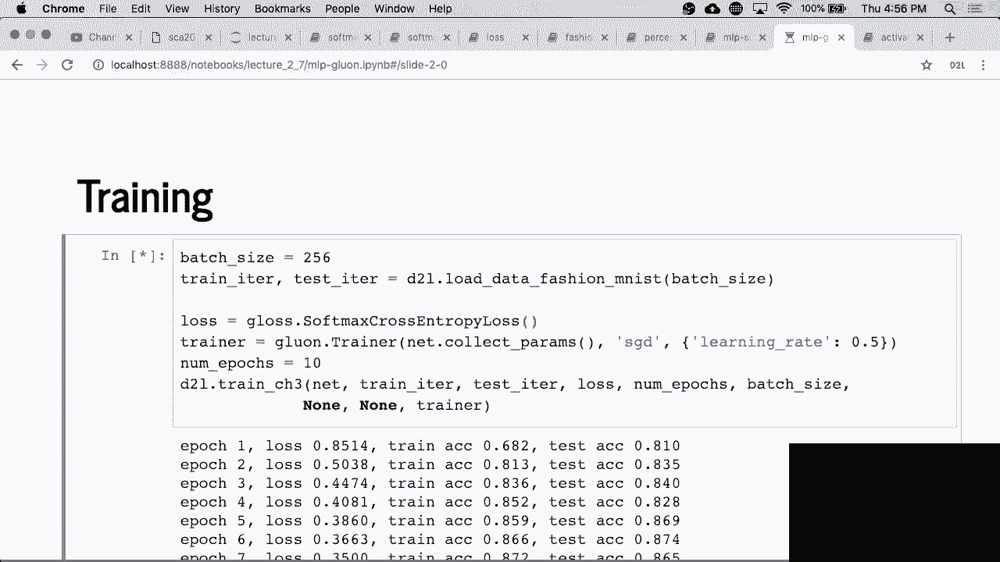

使用上述代码对模型进行训练。经过若干次迭代后，我们可以观察到损失下降，并且模型在测试集上的准确率相较于简单的线性模型有所提升。

例如，线性模型的准确率可能在 85% 左右，而带有一个隐藏层的 MLP 可能将准确率提升到 88% 或更高。这种提升源于更强大的网络架构对数据中复杂模式的捕捉能力。

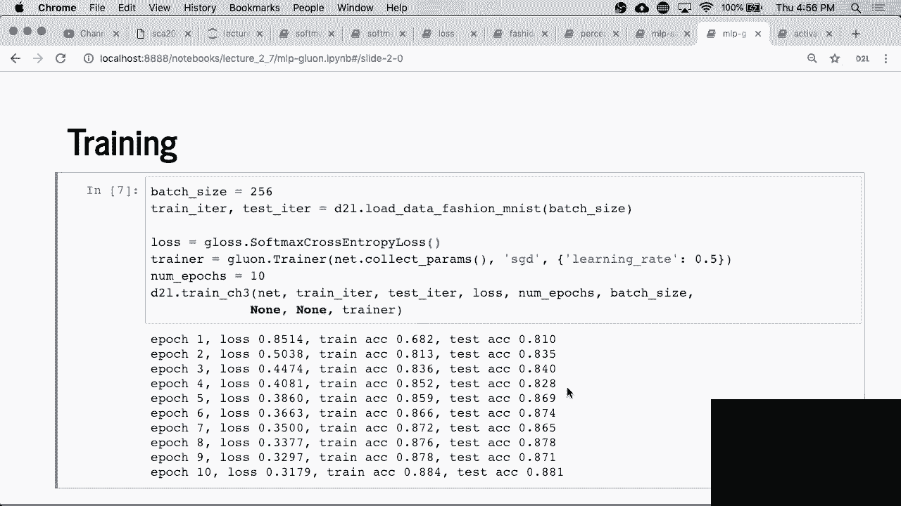

我们可以进一步检查模型犯的错误类型。例如，新的模型可能会将某些“靴子”图片误分类为“包”，但这可能代表了错误模式的改变，有时也意味着进步。

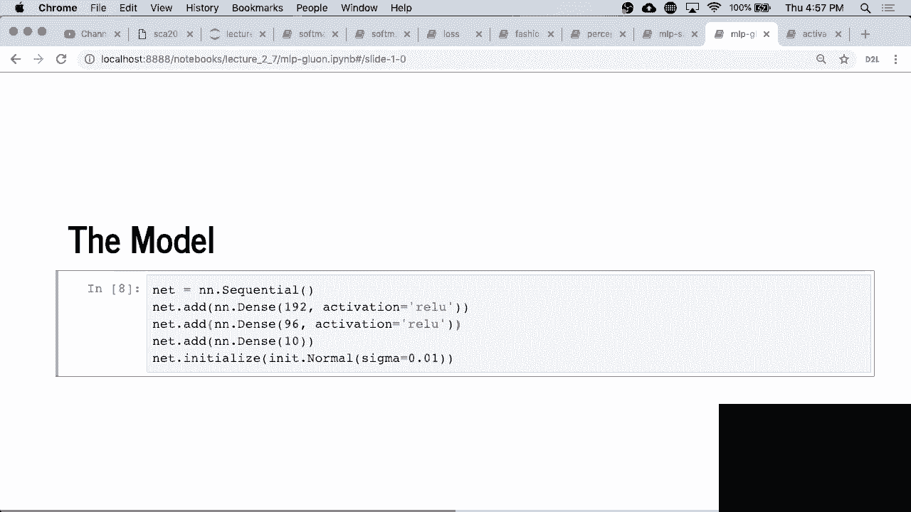

通过调整隐藏层大小、学习率或训练轮数，我们有可能获得更好的结果。

---

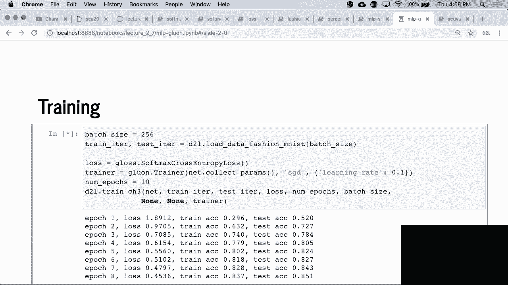

## 总结 ✨

本节课中，我们一起学习了如何从零开始实现一个多层感知器（MLP）。我们完成了以下关键步骤：
1.  **初始化参数**：为具有一个隐藏层的网络创建权重和偏置。
2.  **构建模型**：定义了包含展平层、线性变换和 ReLU 激活函数的前向传播过程。
3.  **计算损失**：使用了 softmax 交叉熵损失函数。
4.  **训练模型**：应用梯度下降算法更新参数。

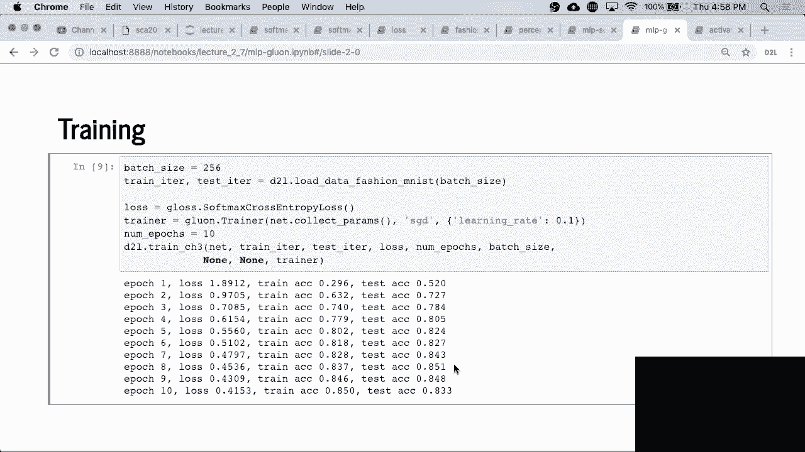

通过这个实践，我们看到了引入隐藏层和非线性激活函数如何让模型获得比简单线性回归更强的表达能力，从而在图像分类任务上取得更好的性能。这为理解更复杂的深度学习模型奠定了坚实的基础。