# 29：模型评估、过拟合与欠拟合 🧠

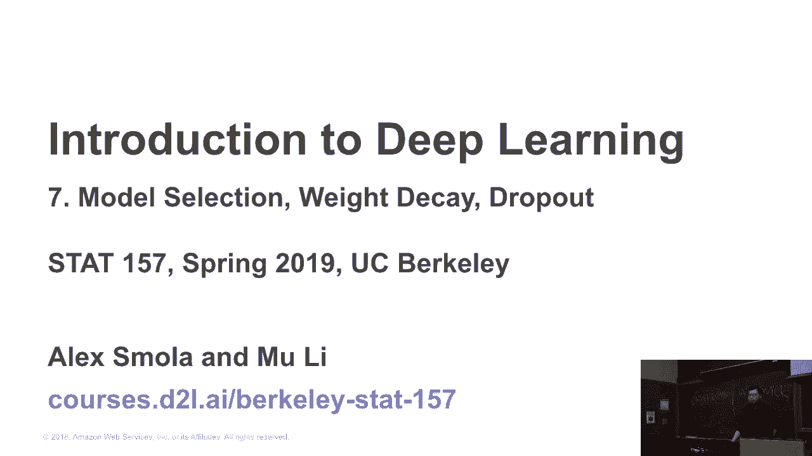

在本节课中，我们将要学习如何评估机器学习模型，并理解模型训练中两个常见的问题：过拟合与欠拟合。我们将探讨为什么不能仅依赖训练数据来评判模型的好坏，以及如何通过验证集、测试集和交叉验证来更准确地评估模型的泛化能力。

---

## 作业四介绍：Kaggle房价预测竞赛 🏠

上一节我们介绍了课程安排，本节中我们来看看即将开始的作业四。

作业四将是一个有趣的Kaggle竞赛，任务是预测房屋销售价格。我们已经多次讨论过房价预测问题。你的目标是将作业提交到Kaggle平台。

我们提供了一个基准模型，并说明了如何下载数据集、构建基准模型以及提交结果。这个基准模型非常简单，可能使你在排行榜上排在1000名左右。你的任务是尽最大努力优化模型。

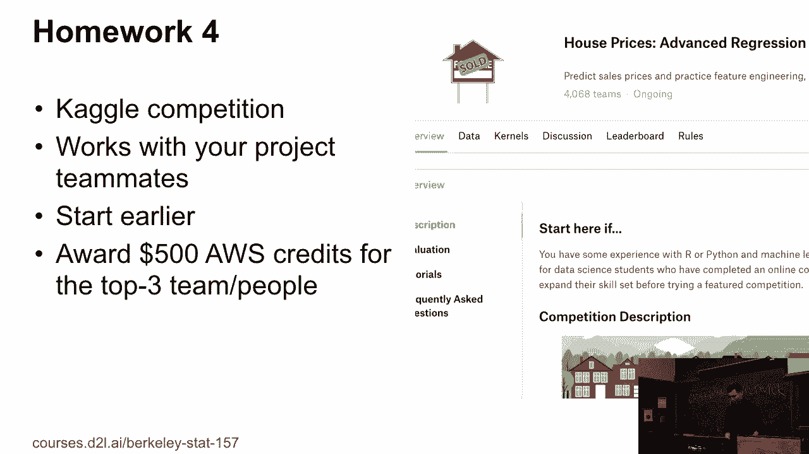

半年前，我们班上有十名学生成功进入了该竞赛的前十名。但现在情况有所不同，因为半年过去，可能已有约2000人参与。因此，在一周内进入前三名比较困难，但你仍然可以尽力而为。

我们建议你与团队合作，特别是你的项目团队。你可以借此机会熟悉你的队友。

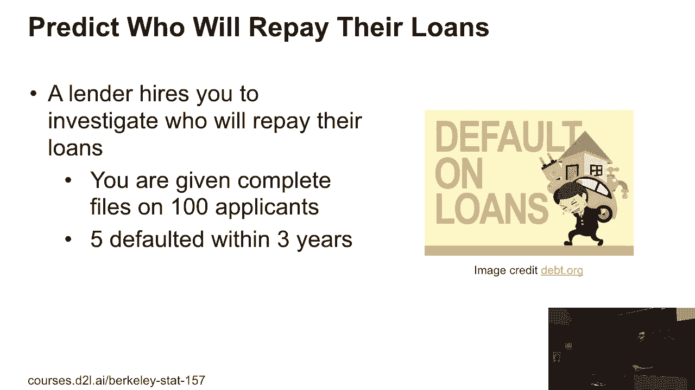

我们还将为个人或团队中提交作品排名前三的提供500美元的ADOP积分。这笔积分可用于你的项目，尝试更复杂的模型。

作业四将在周四的课程中回顾相关笔记本。但我们建议你尽早开始，因为Kaggle非专业账户每天最多只能提交五次。你会有很多想法需要尝试，整个过程可能需要五个小时。如果你计划投入这些时间，建议每天花一小时，而不是在截止日期前集中完成。

这就是关于作业四的介绍。

---

## 模型评估的重要性：一个激励性示例 💡

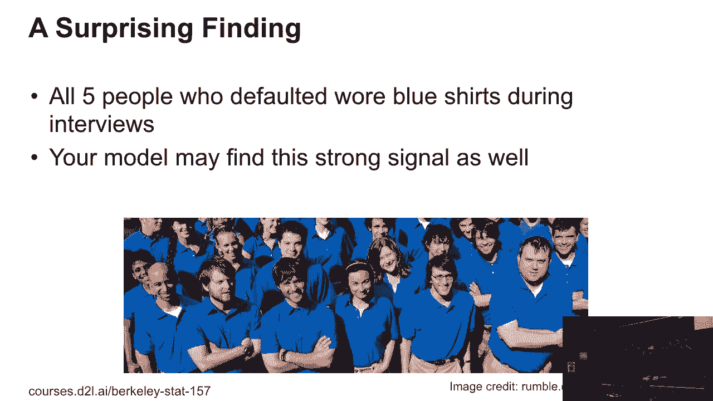

上一节我们介绍了作业，本节中我们来看看模型评估的重要性，并通过一个例子来理解。

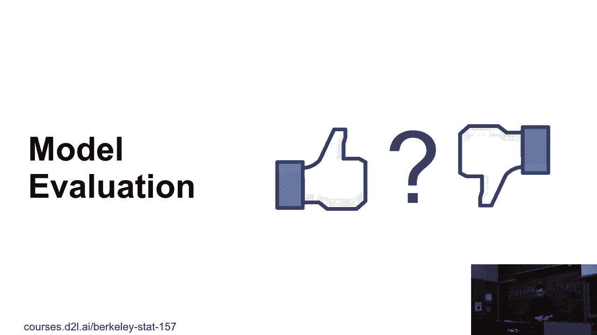

假设一位雇主雇佣你调查哪些贷款申请者会按时还款。你收到了100名申请者的信息，包括个人资料、银行账单和面试视频。此外，你还有一个月的跟踪数据，显示其中五人在三年内违约了。你的任务是预测未来谁可能违约。

你查看数据后，惊讶地发现所有五个违约者在面试中都表现得非常自信。这是一个强烈的信号，因为样本中其他人普遍表现得不那么自信。这可能意味着特别自信的人更容易违约。

但你无法确定这是巧合还是确有意义的关联。只要你能识别出这个信号，就可以用它来构建模型。模型可能会将这个信号视为最强的预测因子。例如，在面试期间，模型可能会立即标记出某个非常自信的申请者为高风险。

这里存在什么问题？问题在于我们只有五个违约样本。如果我们有10,000名申请者，其中100人违约，那么每个人的违约特征可能就不会如此明显和绝对。

希望这个例子能让你理解，在构建实用模型时，许多因素都至关重要。

---

## 训练误差与泛化误差 📊

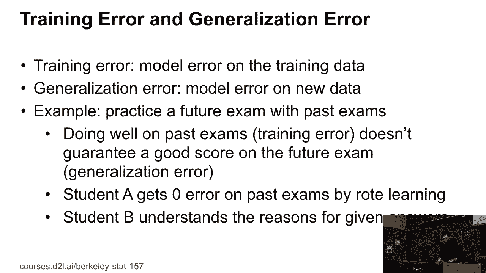

上一节我们通过例子看到了数据评估的复杂性，本节中我们正式探讨模型评估的核心概念：训练误差与泛化误差。

到目前为止，我们主要讨论如何计算模型在**训练数据集**上的误差。训练数据集是你用来调整模型参数的数据。

然而在实践中，我们更关心的是**泛化误差**，即模型在从未见过的**新数据**上的表现。

举个例子，假设我们要为未来的考试做准备。我们可以根据过去的考试题目进行练习，这相当于在“训练集”上训练。但这并不能保证你在未来的真实考试中取得好成绩。

例如，一个学生可能通过死记硬背所有过往考题的答案，在模拟考试中得到满分。而另一个优秀的学生则努力理解解题背后的原理，他可能在模拟考试中得分稍低，但在未来的真实考试中可能表现更好。

这个类比可以扩展到作业上。我们已经发布了前两次作业的答案。如果你仅仅基于前两次作业的答案来准备第三次和第四次作业，可能会遇到问题。因为每次作业涵盖的主题可能不同。在考试中，情况则不同，因为考试通常覆盖整个课程的内容，且每年考察的知识领域相对稳定。

因此，我们关心的是模型的泛化能力。

---

## 验证集与测试集 🧪

上一节我们区分了训练误差和泛化误差，本节中我们来看看如何通过划分数据集来评估泛化能力。

我们通常使用**验证数据集**来评估模型。这个数据集不用于训练模型，仅用于评估。

例如，我们可以将一半的训练数据留作验证集，在剩余的另一半数据上训练模型，然后在验证集上评估其性能。

机器学习中一个常见的错误就是将训练数据和验证数据混淆。让我举一个真实的例子：几年前，一个团队训练了一个图像分类模型，使用的数据集是ImageNet。为了评估模型，他们让另一个人使用相同的类别标签去Google搜索并抓取新图像，然后用这个新数据集来验证模型。

这里的问题是什么？问题在于，原始的ImageNet数据集本身可能就是通过搜索引擎抓取图像构建的。如果验证时再次使用相同的搜索策略，很可能会抓取到已经存在于训练集中的图像，导致验证集并非真正的“新数据”，从而高估了模型的泛化能力。

因此，你需要非常小心地确保训练集和验证集是独立且不重叠的。

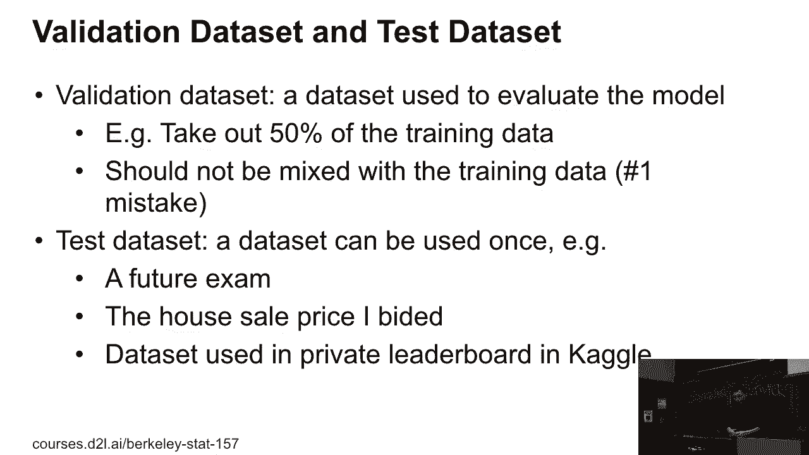

验证数据集可用于**模型选择**。你可以尝试不同的学习率、不同的模型架构，然后根据在验证集上的误差来选择最佳模型。

此外，还有一个**测试数据集**。这个数据集也用于最终评估模型，但关键区别在于你**只能使用它一次**。这类似于期末考试或竞赛的最终私人排行榜——你只有一次机会获得最终分数。

在实际讨论中，人们常说的“测试准确率”通常指的是验证集上的准确率。严格来说，测试误差才是模型在完全独立、仅使用一次的数据集上的最终表现。

---

## K折交叉验证 🔄

上一节我们介绍了验证集和测试集，本节中我们来看看当数据量不足时，如何更有效地利用数据进行评估。

一个常见问题是我们没有足够的有标签数据来单独划分出一个大的验证集。如果我们使用一半数据作为验证集，那么用于训练的数据就会变少。

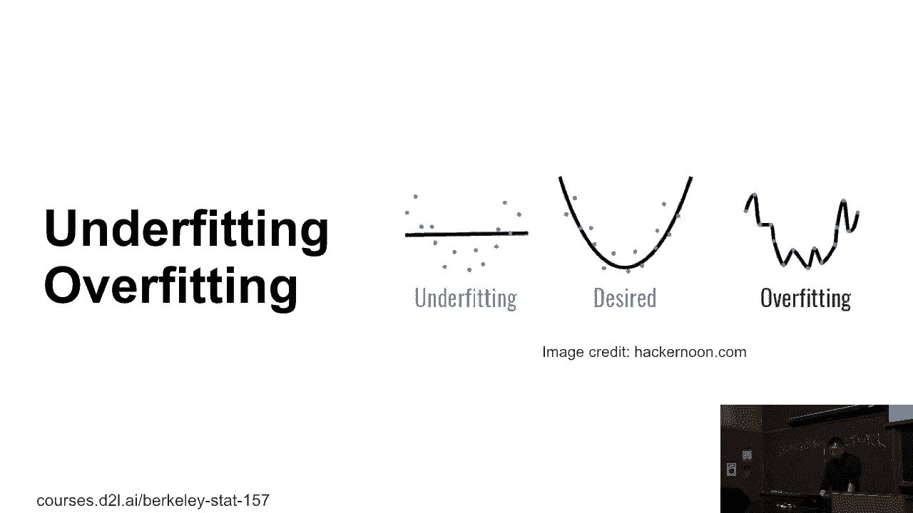

为了解决这个问题，一个常用的方法是**K折交叉验证**。这将是你在作业中使用的重要方法。

以下是K折交叉验证的步骤：
1.  将整个训练数据集（带有标签的样本）随机分成K个大小相似的子集（或称为“折”）。
2.  进行K次实验。对于第i次实验（i从1到K）：
    *   将第i个子集作为**验证数据集**。
    *   将剩余的K-1个子集合并作为**训练数据集**。
    *   在训练数据集上训练模型。
    *   在验证数据集上计算验证误差。
3.  计算这K次实验的**平均验证误差**，作为模型交叉验证误差的估计。

如果你选择一个较大的K值（例如K=100），那么每次训练将使用99%的数据，这对训练模型有利。但问题是，你需要重复进行100次训练，计算成本会非常高。

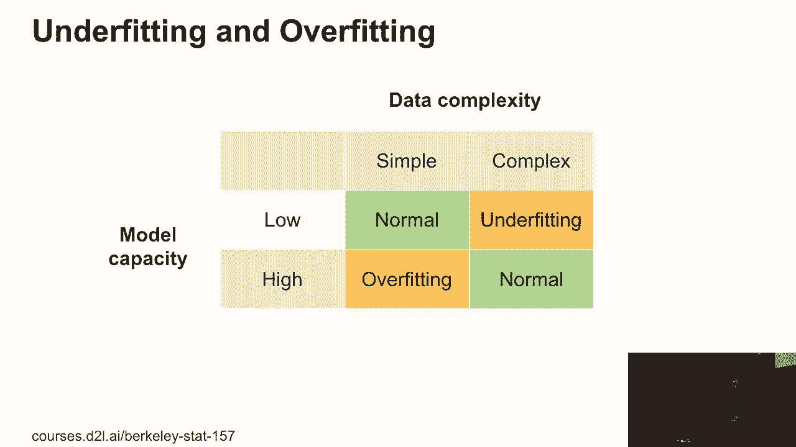

实际上，我们通常选择K=5或K=10。如果模型较简单，可以选择稍大的K值（如20或50）。如果数据量很大或模型训练非常耗时，则选择较小的K值。

我们将在作业四中实现K折交叉验证，并在周四的课程中详细讨论。

了解了如何评估模型后，我们将讨论训练过程中两种常见的异常情况：**过拟合**和**欠拟合**。

---

## 过拟合与欠拟合 ⚖️

上一节我们学习了交叉验证，本节中我们深入探讨模型训练中的两个核心问题。

一般来说，模型训练的好坏取决于两个关键因素的匹配程度：**数据的复杂性**和**模型的容量**。

以下是四种典型情况：
*   **数据简单，模型简单**：模型能够很好地学习和概括。
*   **数据复杂，模型复杂**：模型有能力处理复杂模式，可以正常工作。
*   **数据复杂，模型简单**：模型能力不足，无法充分学习数据中的复杂模式，导致**欠拟合**。
*   **数据简单，模型复杂**：模型能力过强，不仅学习了数据中的真实规律，还“记住”了训练数据中的噪声和随机波动，导致**过拟合**。

严格来说，**模型容量**是指模型拟合各种函数或数据分布的能力。低容量模型（如简单的直线）难以拟合复杂曲线。高容量模型（如高阶多项式）可以完美拟合训练数据（误差为零），但这通常意味着过拟合。

下图展示了模型容量对误差的影响：
*   **横轴**：模型容量/复杂度。
*   **纵轴**：损失（误差）。
*   **训练损失**：随着模型容量增加，模型更容易拟合训练数据，因此训练损失持续下降。
*   **泛化损失**（我们真正关心的）：随着模型容量增加，泛化损失先下降后上升，形成一个U形曲线。
*   训练损失与泛化损失之间的差距就是**过拟合**的程度。模型越复杂，这个差距通常越大。

最优的模型容量位于泛化损失最低的点，通常在中间位置。模型既不能太简单（导致欠拟合），也不能太复杂（导致过拟合）。

---

## 如何估计与控制模型容量？ 🧮

上一节我们定义了过拟合和欠拟合，本节中我们来看看如何量化并控制模型的容量。

估计模型的容量是一个难题。比较不同算法家族（如决策树 vs. 神经网络）的容量尤其困难。在本课程中，我们主要关注在同一算法家族内进行比较。

影响模型容量的两个主要因素是：
1.  **参数数量**：模型可调整的权重和偏置的数量。
2.  **参数值范围**：训练过程中允许参数取值的范围或约束。

例如，比较两个模型：
*   **线性回归**：假设输入有D维，模型有D个权重和1个偏置，总参数为 `D + 1`。
*   **两层感知机**：输入D维，隐藏层大小为M，输出K类。第一层参数为 `(D + 1) * M`，第二层参数为 `(M + 1) * K`。总参数远多于线性回归。

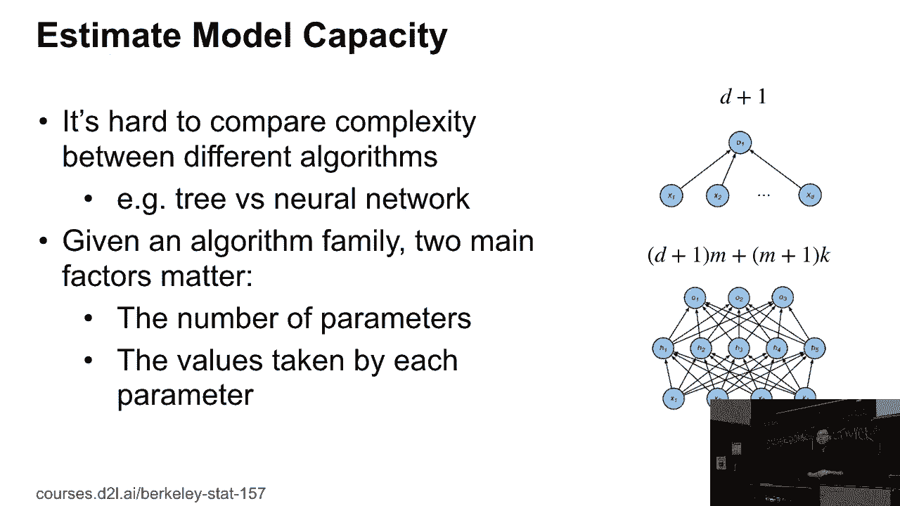

因此，两层感知机通常比线性回归具有更高的模型容量。

关于参数值范围，如果我们限制模型参数只能在-1到+1之间取值，那么即使参数数量相同，其容量也低于参数可以取任意实数的模型。

---

## 统计学习理论简介：VC维度 📐

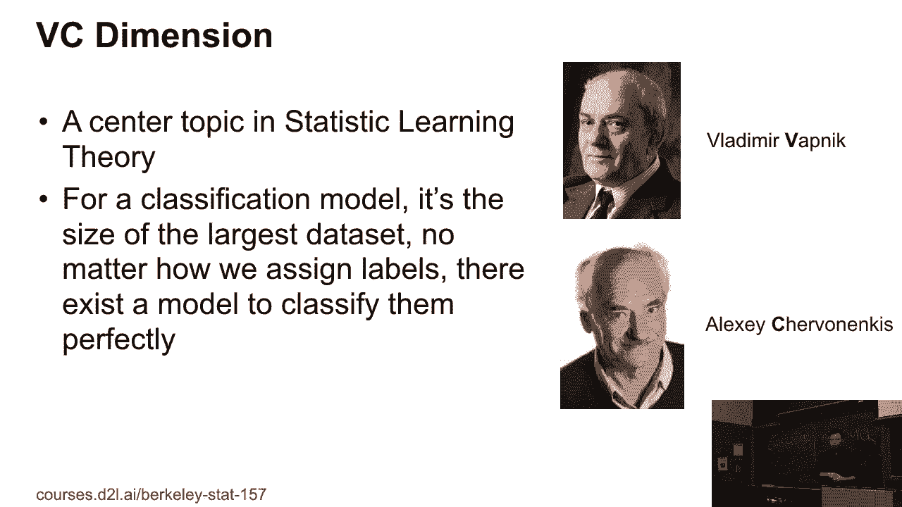

上一节我们讨论了参数数量，本节中我们简要介绍一个理论工具——VC维度，它用于更形式化地衡量模型容量。

统计学习理论中，一个核心概念是**VC维度**（Vapnik-Chervonenkis dimension）。对于分类模型，其VC维度定义为：该模型能够完美分类（即“打散”）的**最大数据集的大小**。无论你如何给这个数据集中的点分配标签，模型总能找到一个配置来实现完美分类。

来看一个具体例子：2D感知机（即一条直线）。其VC维度是3。这意味着对于平面上的任意三个点（只要不共线），无论你如何给它们分配正负标签，总可以找到一条直线将它们正确分开。但VC维度不是4，因为对于四个点（例如正方形的四个顶点，按对角线分配标签），一条直线就无法完美分类了。

对于一般的D维线性感知机（有D个权重和1个偏置，共D+1个参数），其VC维度大约等于参数数量M。这意味着模型参数越多，其VC维度通常越高，容量也越强。

VC维度理论提供了训练误差与泛化误差之间差距的理论上界，非常有用。然而，将其应用于现代深度学习模型（如深度神经网络、卷积网络）非常困难，因为它们的结构复杂，VC维度难以精确计算。因此，深度学习理论仍在快速发展以跟上实践。

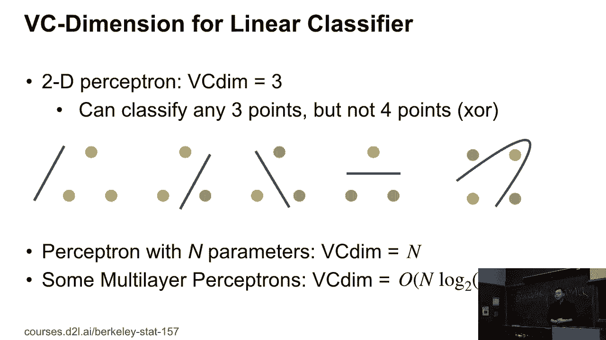

---

## 数据复杂性 📈

上一节我们主要关注模型容量，本节中我们来看看问题的另一面：数据复杂性。

数据的复杂性受多种因素影响：
*   **样本数量**：样本越多，数据集可能越复杂，但也为复杂模型提供了更多学习材料。深度学习的理想数据集通常在10万到100万样本之间。
*   **每个样本的特征数量**：例如，图像有数百万像素，广告数据可能有数十亿特征。
*   **数据结构**：数据是否具有时间序列（如股票数据）、空间结构（如图像）或图结构（如社交网络）。具有结构的数据通常更复杂。
*   **多样性**：数据集中包含多少不同的对象或概念。例如，ImageNet有1000个物体类别，比只有10个类别的数据集复杂得多。
*   **类内多样性**：同一类别内样本的差异程度。例如，狗的照片如果颜色、品种、姿态差异很大，复杂性就高。

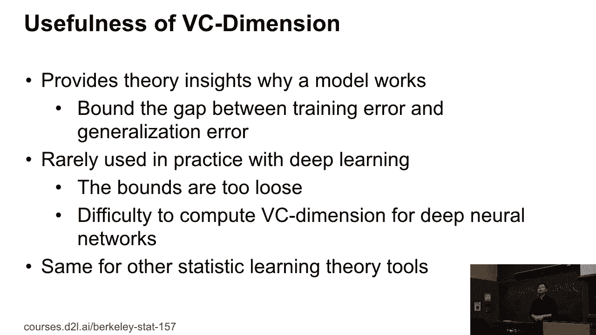

理解数据复杂性有助于你选择合适的模型容量。复杂的数据需要高容量的模型，而简单的数据则用简单模型即可，避免过拟合。

---

## 总结 🎯

本节课中我们一起学习了机器学习模型评估的核心概念以及过拟合与欠拟合问题。

我们首先通过一个贷款预测的例子，理解了模型评估的重要性。然后，我们区分了**训练误差**和**泛化误差**，指出我们真正追求的是模型在新数据上的表现。

为了评估泛化能力，我们引入了**验证集**和**测试集**的概念，并强调了保持它们独立于训练集的必要性。当数据量有限时，我们介绍了强大的**K折交叉验证**方法。

接着，我们深入探讨了模型训练中的两个关键问题：**过拟合**（模型过于复杂，记住了噪声）和**欠拟合**（模型过于简单，无法捕捉数据规律）。它们的发生取决于**模型容量**与**数据复杂性**是否匹配。

我们讨论了通过**参数数量**来粗略估计模型容量，并简要介绍了理论工具**VC维度**。最后，我们也分析了影响**数据复杂性**的多种因素。

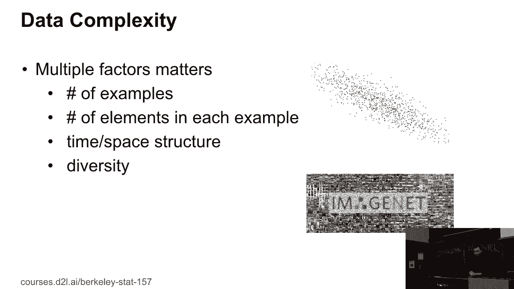

理解这些概念是构建有效、可靠机器学习模型的基础。在接下来的课程和作业中，你将应用这些知识来优化你的模型。