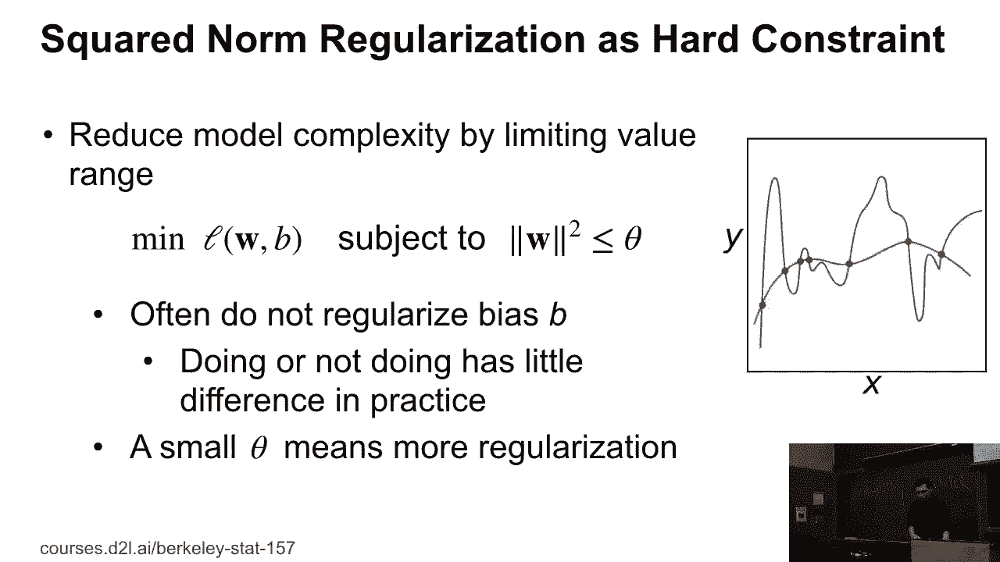
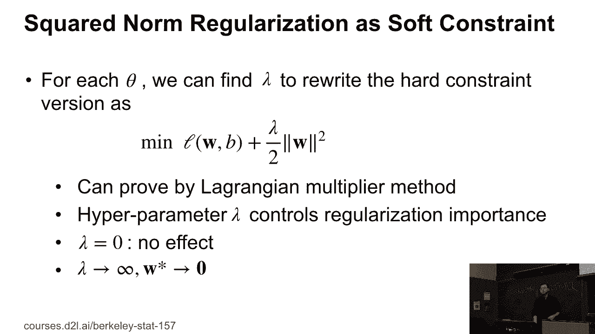
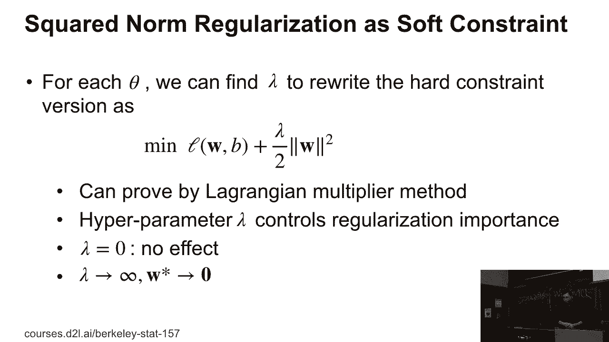
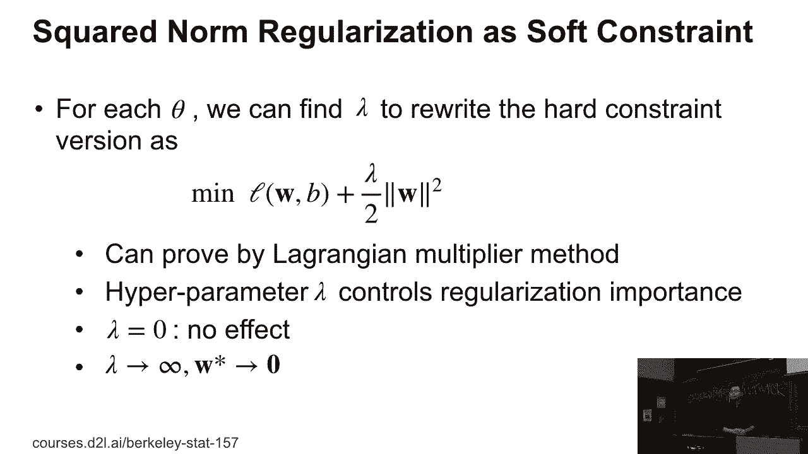
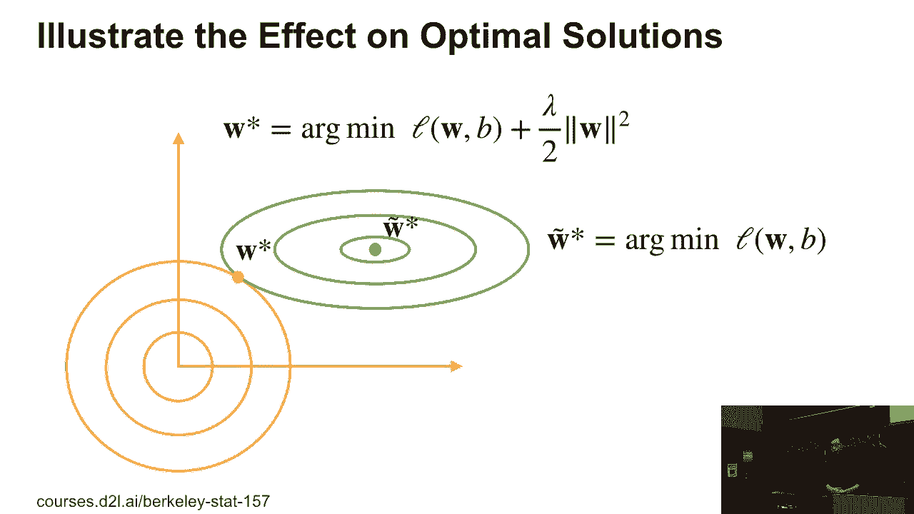
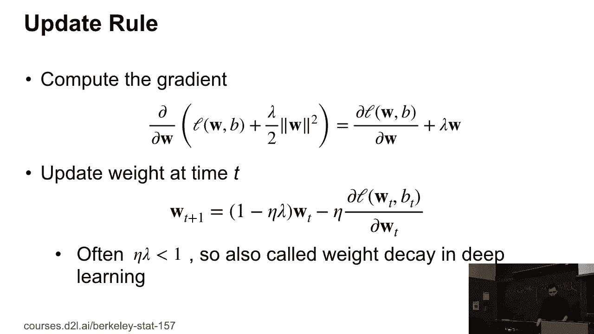

# 30：L7_2 平方 L2 正则化 🧠

在本节课中，我们将要学习一种在机器学习中非常重要的技术——**L2正则化**，它也被称为**权重衰减**。我们将了解它的数学原理、直观解释以及在优化过程中的作用。

---

## 概述 📖

上一节我们介绍了过拟合的概念，本节中我们来看看如何通过**正则化**技术来缓解过拟合。具体来说，我们将深入探讨**平方L2正则化**，这是一种通过约束模型权重的大小来提升模型泛化能力的有效方法。

## 从硬约束到软约束 🔄

在机器学习中，我们有时希望对模型的权重（参数）施加约束，例如限制其大小不能超过某个值。这被称为**硬约束**。

然而，在硬约束版本中，优化过程会变得相当困难。所以我们通常使用**软约束**版本，这意味着对于每一个约束条件，我们实际上可以找到一个对应的数值（拉格朗日乘子）。

根据这个数值，我们可以将硬约束的优化问题重写为以下形式：

**目标函数 = 原始损失函数 + λ/2 * ||w||²**

这里，`||w||²` 表示权重向量 `w` 的 **L2范数的平方**（即各分量平方和）。`λ` 是一个超参数，用于控制正则化的强度。

## L2正则化的形式与等价性 ⚖️

所以，这实际上是 **L2正则化** 或者 **平方L2正则化**。你可以通过**拉格朗日乘子法**证明，带约束的优化问题（硬约束）与上述添加惩罚项的形式（软约束）是等价的。

这里的 `λ` 是超参数：
*   如果我们选择 `λ = 0`，那么正则化项不起作用，对模型能力没有影响。
*   如果我们选择一个更大的值，比如 `λ = 0.1` 或 `λ = 1`，正则化的效果会增强。
*   如果我们选择 `λ` 趋近于无穷大，那么我们就强制所有权重 `w` 为 0。

## L2正则化如何工作？ 🎯

我们可以可视化它是如何工作的。

想象一个二维权重空间（`w1` 和 `w2`）。绿色的等高线椭圆代表**原始损失函数**，其中心点 `w*` 是未正则化时的最优解。

当我们加上L2正则化项 `λ/2 * ||w||²` 时，它在图上表现为一系列以原点（0,0）为中心的同心圆。新的优化目标变成了“损失函数值 + 正则化项值”。

因此，最优解的位置会在原始损失函数的最优点 `w*` 和原点 `(0,0)` 之间进行权衡。**L2正则化项像一根弹簧，将权重向量 `w*` 向原点方向拉拽**。

*   如果我们有一个更大的 `λ` 值，这个拉拽的作用力就更大，最优解会更靠近原点。
*   如果我们有一个小的 `λ` 值，那么这个作用力就较小，最优解会更靠近原始的 `w*`。

## 为什么叫“权重衰减”？ 📉

在神经网络领域，L2正则化常被称为**权重衰减**。这是因为我们可以从梯度更新的角度来理解它。

让我们计算包含L2正则化的总损失函数的梯度。总梯度是原始损失函数的梯度与正则化项梯度之和。

使用**随机梯度下降（SGD）**，我们知道每次更新权重的公式是：
`w_t = w_{t-1} - η * 梯度`

其中 `η` 是学习率。对于包含L2正则化的损失，其关于权重 `w` 的梯度包含一项 `λ * w`。因此，更新公式可以重写为：

`w_t = w_{t-1} - η * (原始损失梯度 + λ * w_{t-1})`
`w_t = (1 - ηλ) * w_{t-1} - η * (原始损失梯度)`

通常，我们选择一个非常小的 `λ` 值（例如 `1e-3` 或 `1e-6`），而学习率 `η` 也是一个小于1的数。因此，`(1 - ηλ)` 是一个略小于1的数字。

**这意味着在每次更新时，我们先将前一步的权重 `w_{t-1}` 乘以一个略小于1的因子进行“收缩”，然后再减去原始损失的梯度。** 这种在每一步都使权重绝对值轻微减小的过程，就像权重在“衰减”一样。因此，神经网络领域的人们称之为**权重衰减**。实际上，它就是L2正则化。

---

## 总结 ✨

本节课中我们一起学习了：
1.  **L2正则化（平方L2正则化）** 是一种通过向损失函数添加权重范数惩罚项（`λ/2 * ||w||²`）来防止过拟合的技术。
2.  它等价于对权重大小施加一个软约束，超参数 `λ` 控制着约束的强度。
3.  从几何上看，L2正则化将最优解从原始损失的最优点向坐标原点方向推动，从而限制权重的大小。
4.  在优化过程中，由于其更新公式会使权重每一步都乘以一个小于1的因子，因此它在神经网络领域常被称为**权重衰减**。

理解L2正则化是掌握模型正则化与泛化能力的关键一步。