# 31：在 Jupyter 中实现平方 L2 正则化 🧮

在本节课中，我们将学习如何在 Jupyter Notebook 中为线性回归模型实现平方 L2 正则化（也称为权重衰减）。我们将通过一个高维数据的例子，演示正则化如何帮助缓解过拟合问题，并比较使用正则化前后的模型表现差异。

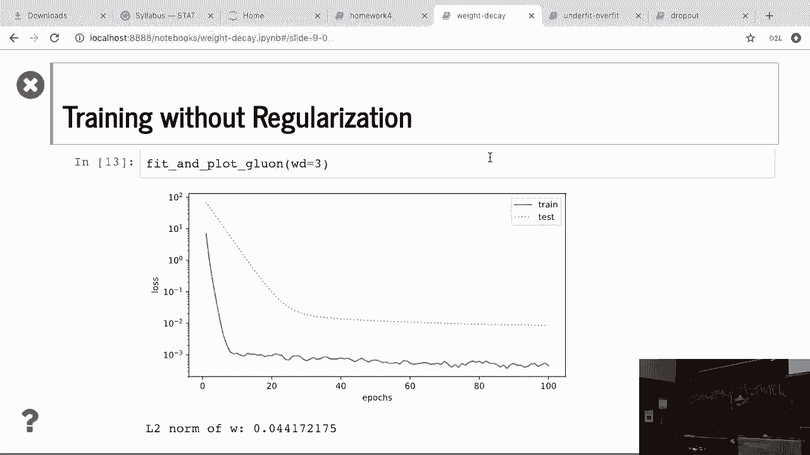

---

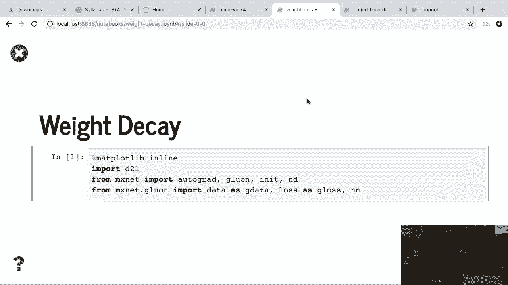

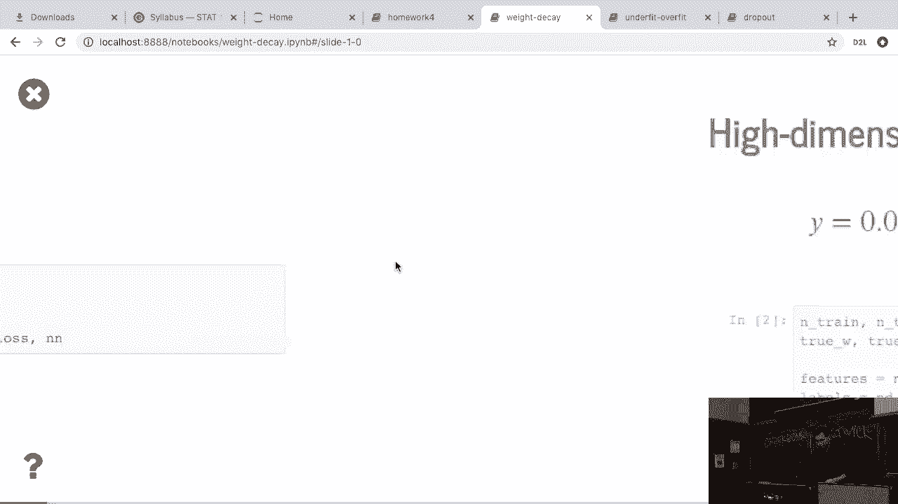

## 数据生成与问题背景

上一节我们讨论了正则化的基本概念。本节中，我们来看看如何在一个具体的高维数据场景下应用它。

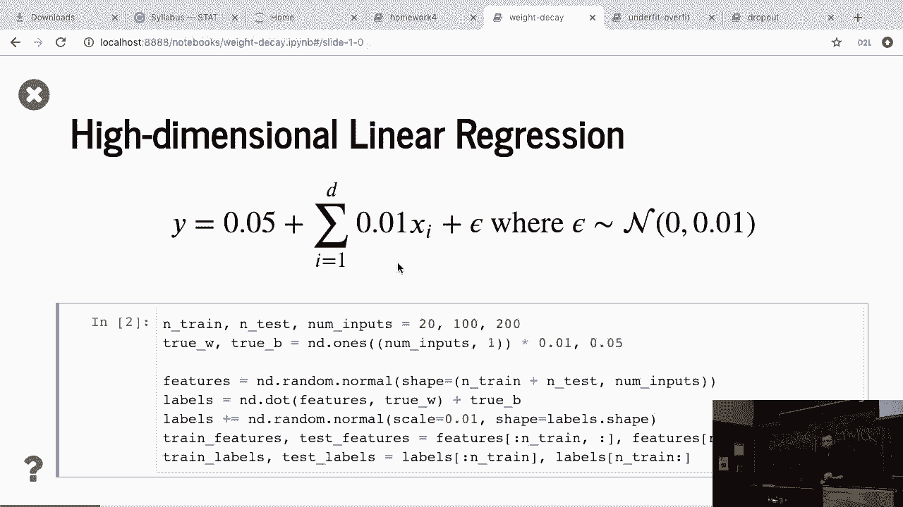

我们生成一个用于线性回归的高维数据集。这里，`d` 代表数据的维度数（即特征数量），`w` 代表模型的权重向量。

数据生成过程相当简单：权重全部初始化为0，然后减去0和1，并加上一些噪声。通过这个过程，我们可以清楚地知道数据是如何构造的。

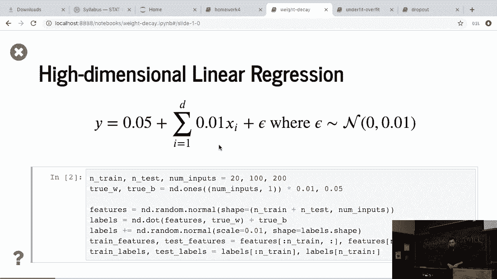

获取这些数据后，我们像之前一样，构造线性回归模型并进行权重初始化。

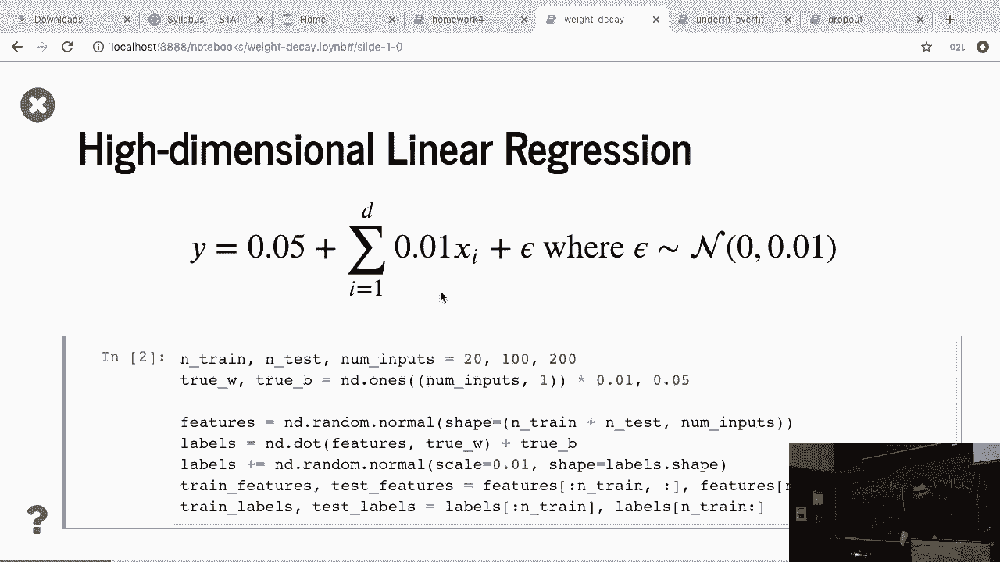

---

## 定义平方 L2 正则化

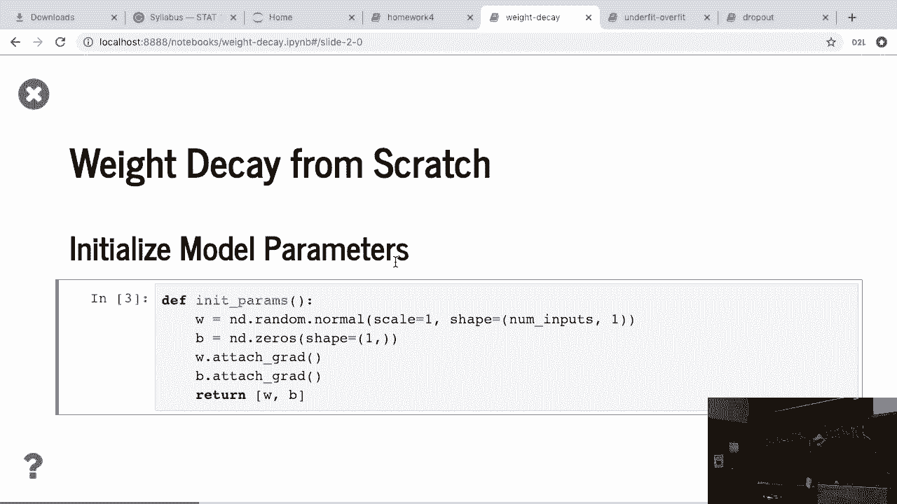

在定义了模型之后，我们需要定义平方 L2 长度惩罚，也就是 L2 正则化项。

其核心概念是：对于给定的权重向量 `W`，计算其所有元素的平方和，然后除以 2。用公式表示如下：

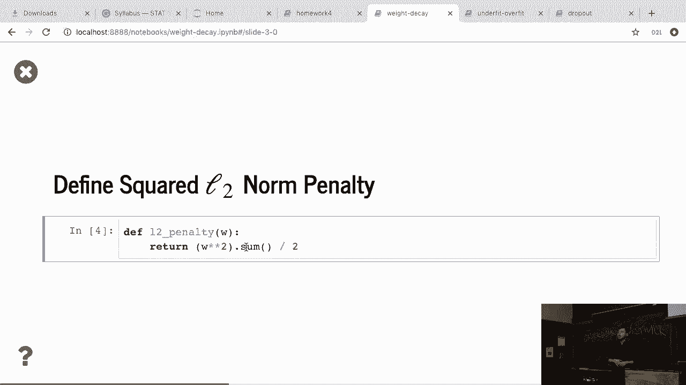

**公式：**
```
L2_penalty = (1/2) * sum(W_i^2)
```

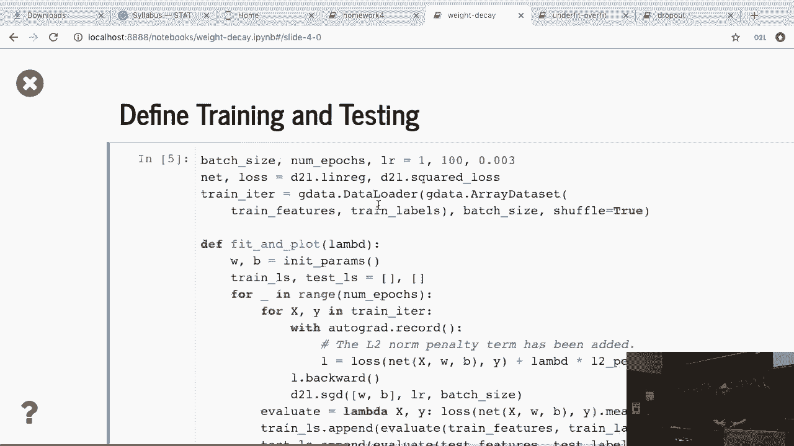

这就是 L2 正则化项。在训练过程中，我们将把这个项加入到原始的损失函数中。

---

## 训练过程与损失函数

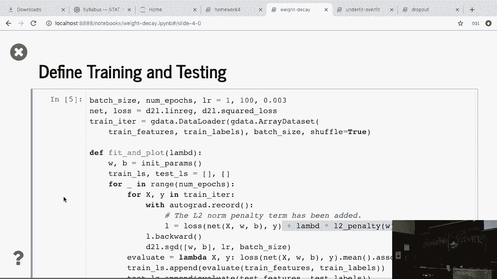

训练过程实际上和之前的普通线性回归非常相似。

唯一的区别在于损失函数的计算。新的损失函数是原始损失（如均方误差）加上一个正则化项。具体公式如下：

**公式：**
```
total_loss = original_loss(y_pred, y_true) + lambda * L2_penalty(W)
```

其中，`lambda` 是一个超参数，用于控制正则化的强度。这是我们引入的唯一不同之处，模型的其他部分都保持不变。

---

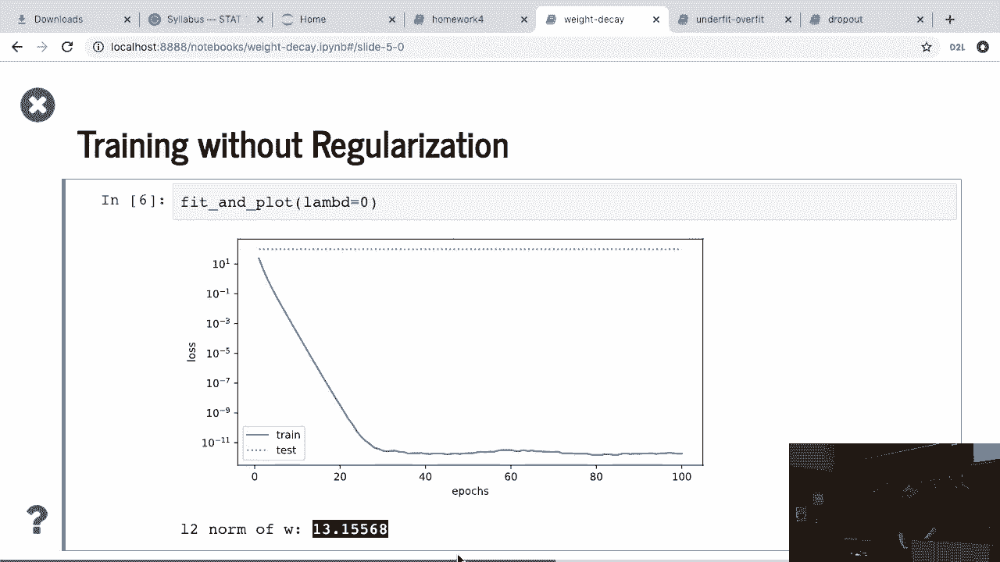

## 实验：不使用正则化

首先，我们设置 `lambda = 0`，这意味着不使用任何正则化。

以下是观察结果：
*   蓝色实线代表训练误差，虚线代表验证误差。
*   可以看到训练误差持续下降，但验证误差实际上升了，且变化不大。
*   原因在于我们使用了100个维度，但只用了非常少的样本。因此，即使是线性模型也会在这个数据集上严重过拟合。
*   我们可以计算最终学到的权重 `W` 的 L2 范数，结果约为 13。

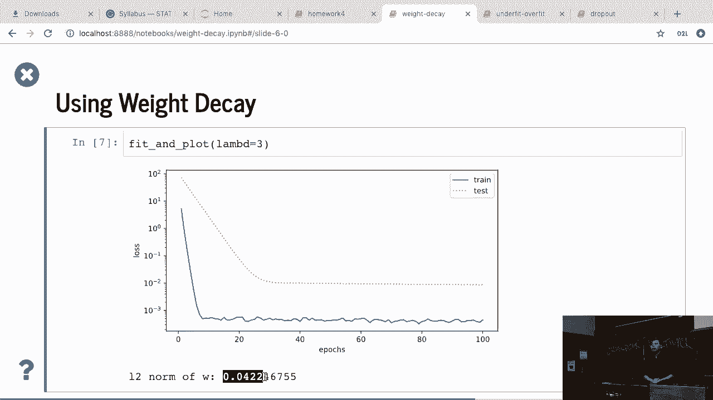

---

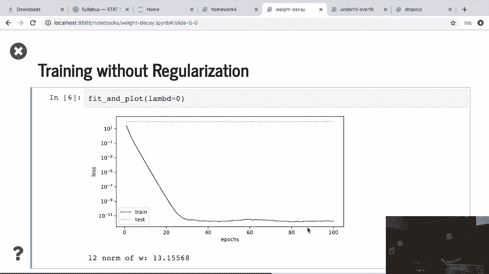

## 实验：使用权重衰减

现在，让我们尝试使用权重衰减，设置 `lambda = 3`。

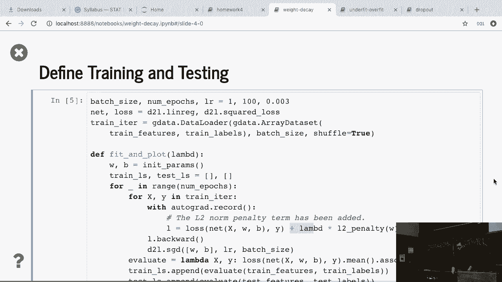

以下是观察结果：
*   模型仍然存在一些过拟合，但情况比之前好多了。
*   测试误差被显著降低。
*   鉴于我们仍然只有少数样本对应这个高维数据集，模型仍在过拟合，但正则化大大减少了测试误差。
*   此时，权重 `W` 的 L2 范数相比之前（13）变得非常小。

---

## 在深度学习框架中的实现

如果我们要从头实现，我们只需要直接更改损失函数。

然而，如果你要使用一个深度学习库（如 PyTorch），操作通常更简单。我们通常不需要手动修改损失函数，而是告诉优化器（如SGD）应用权重衰减。

例如，在 PyTorch 中，你可以这样定义优化器：
```python
optimizer = torch.optim.SGD(model.parameters(), lr=0.01, weight_decay=3)
```
这里，`weight_decay` 参数就对应我们的 `lambda` 值。

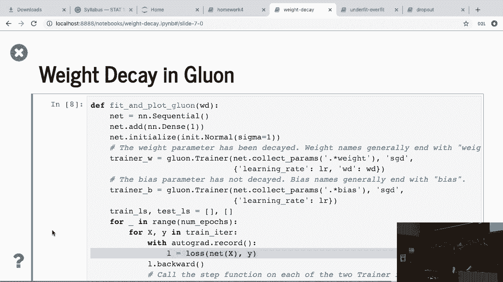

在实际操作中，框架通常只对权重参数应用 `weight_decay`，而不会对偏置项应用。这与我们公式讨论的内容非常相似。因此，在实践中，你通常只需要指定 `weight_decay` 参数，而无需手动更改损失函数。

---

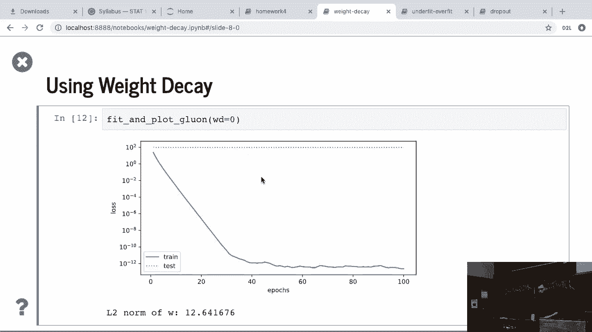

## 结果对比与总结

通过对比实验，我们可以清晰地看到：
*   当不应用权重衰减时，训练准确度与测试准确度之间存在巨大差距。
*   当应用权重衰减（`lambda = 3`）后，测试准确度得到提升，同时权重 `W` 的 L2 范数也减小了。

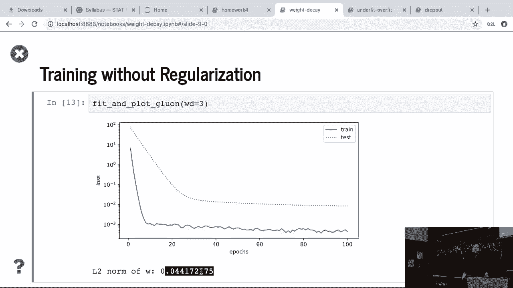

本节课中，我们一起学习了如何在 Jupyter 环境中实现平方 L2 正则化。我们通过代码实践看到了正则化如何通过惩罚大的权重来有效控制模型的复杂度，从而减轻过拟合，提升模型在未见数据上的泛化能力。记住，在实际使用深度学习框架时，直接通过优化器的 `weight_decay` 参数来应用 L2 正则化是最便捷的方式。