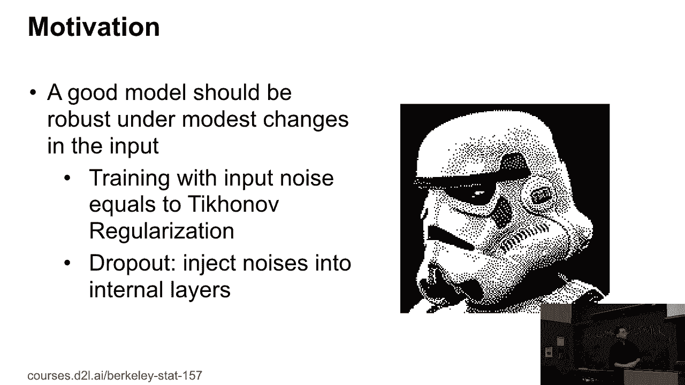
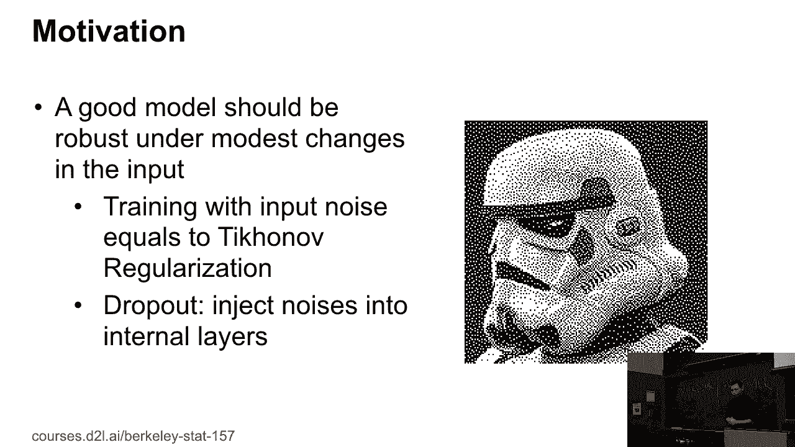
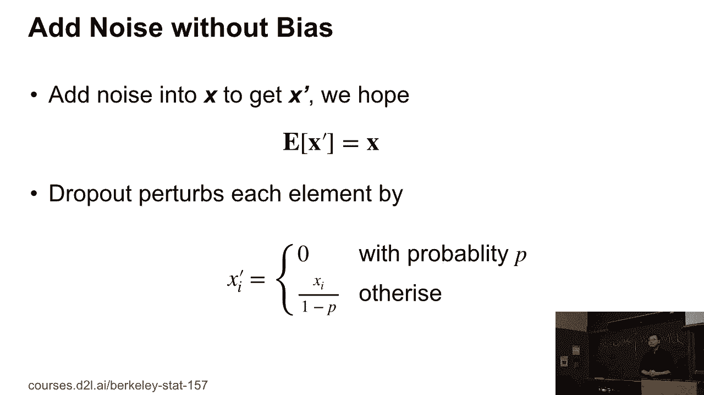
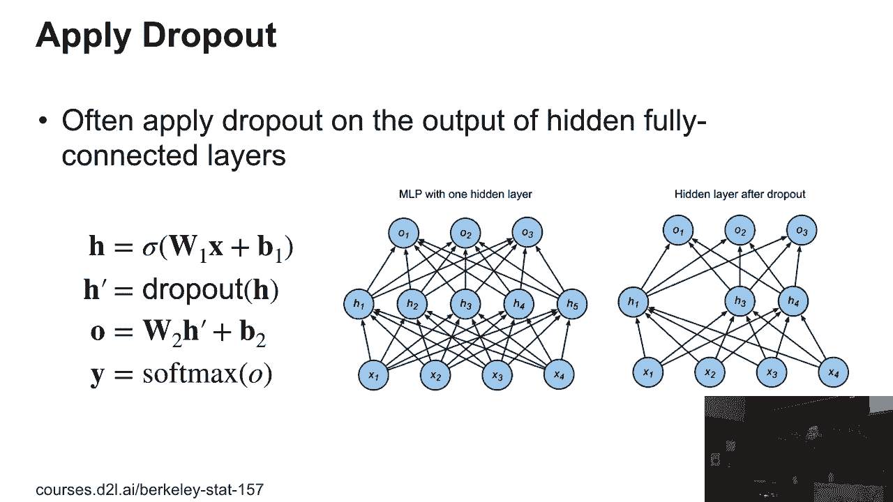
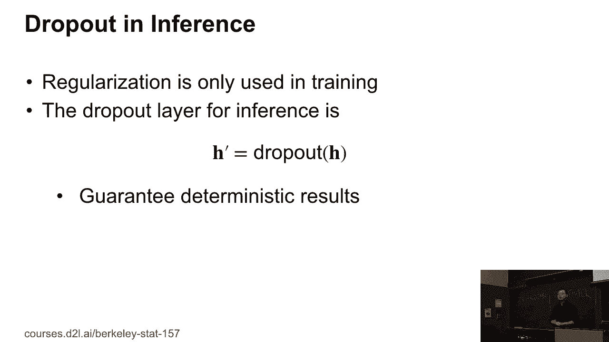

# 32：L7_4 Dropout 🧠

在本节课中，我们将要学习深度学习中一个重要的正则化技术——Dropout。我们将了解它的核心思想、工作原理、应用方式以及在训练和推理阶段的不同处理方式。

---

## 概述 📖

Dropout是一种在神经网络训练过程中，通过随机“丢弃”一部分神经元来防止模型过拟合的技术。它通过向网络内部层添加噪声，而非调整输入数据，来增强模型的鲁棒性。

---

## Dropout的核心思想 💡

一个好的模型应该对输入数据的变化具有鲁棒性。例如，识别图像中的物体时，无论图像的角度、光线或存在多少噪声，模型都应能正确识别。

上一节我们介绍了模型鲁棒性的概念，本节中我们来看看Dropout如何实现这一点。其核心思想是：在训练过程中，随机将神经网络中某些神经元的输出置为零，从而模拟一个“残缺”的网络进行学习。

---

## Dropout的工作原理 ⚙️

Dropout向神经网络的内部层添加噪声，而不是直接调整输入数据。

具体来说，假设某一层的输出为向量 **x**。应用Dropout后，我们得到新的输出 **x'**，其数学期望 **E[x']** 等于原始的 **x**。这意味着我们加入了噪声，但没有改变输出的期望值。

以下是Dropout的具体操作步骤：
1.  设定一个丢弃概率 **p**（例如0.5）。
2.  对于输出向量 **x** 中的每一个元素 **xᵢ**，以概率 **p** 将其设置为0。
3.  对于未被设置为0的元素，将其值放大，除以 **(1 - p)**。

这个过程可以用以下公式描述：
**x'ᵢ = (xᵢ / (1 - p)) * Bernoulli(1-p)**
其中 `Bernoulli(1-p)` 是一个以概率 **(1-p)** 取1，以概率 **p** 取0的伯努利随机变量。

这样，**E[x'ᵢ] = xᵢ** 得以保证。

---

## Dropout的应用方式 🎯

Dropout通常应用于全连接层的输出。全连接层是模型中参数最多、最容易过拟合的部分，因此是应用Dropout进行正则化的理想位置。

以下是Dropout在层间应用的具体流程：
1.  某一层计算得到输出（例如，经过权重 **W**、偏置 **b** 和激活函数处理后的结果）。
2.  对该输出应用Dropout操作，得到新的输出 **x'**。
3.  这个新的输出 **x'** 将作为下一层的输入。

例如，一个内部层有5个神经元输出（边1到边5）。应用Dropout后，可能会随机地将边2和边5的输出置为0。这意味着下一层将接收来自边1、3、4的信号。

**关键点**：每次进行前向传播训练时，被“丢弃”的神经元都是随机选择的。模型不会永久性地固定丢弃某几个神经元，这使得网络每次学习时都面对略有不同的子网络结构，从而增强了泛化能力。

---

## 训练与推理阶段的差异 🔄

Dropout是一种正则化手段，其目的是在训练过程中限制权重的学习，以防止过拟合。

上一节我们介绍了Dropout在训练时的应用，本节中我们来看看在模型部署时的不同。在推理（或预测）阶段，我们**不应该**再使用Dropout。因为此时我们的目标是获得稳定、确定性的预测结果。

因此，模型在训练和推理时的行为是不同的：
*   **训练时**：启用Dropout，随机丢弃神经元。
*   **推理时**：关闭Dropout，使用完整的网络结构进行计算。为了补偿训练时因放大激活值（除以1-p）带来的尺度变化，在推理时，通常需要将该层的输出乘以 **(1-p)**，或者更常见的做法是在训练时进行缩放，而在推理时不做任何处理（即“Inverted Dropout”）。

---

## 总结 ✨

本节课中我们一起学习了Dropout技术。我们了解到：
1.  Dropout是一种通过随机“关闭”神经元来防止神经网络过拟合的正则化技术。
2.  它的工作原理是在训练时，以概率 **p** 将神经元的输出置零，并将剩余输出放大 **1/(1-p)** 倍，以保持期望值不变。
3.  Dropout主要应用于全连接层，且每次训练迭代丢弃的神经元是随机的。
4.  在模型训练阶段需要启用Dropout，而在推理阶段则应关闭它以获得确定性输出。

掌握Dropout有助于你构建更具鲁棒性和泛化能力的深度学习模型。