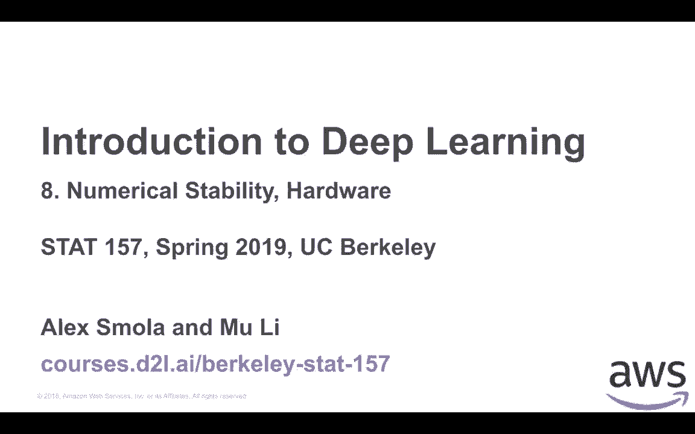
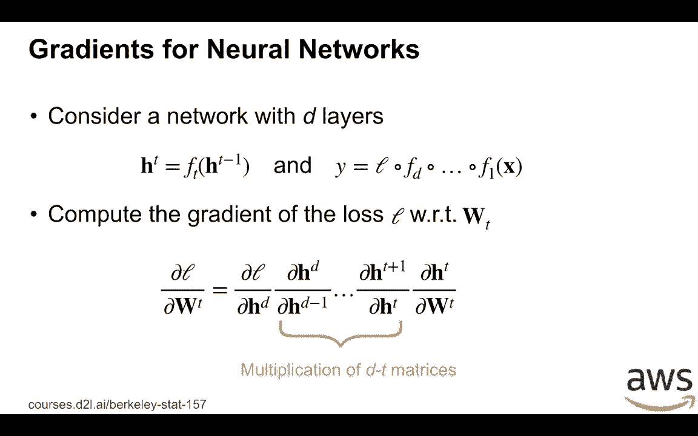
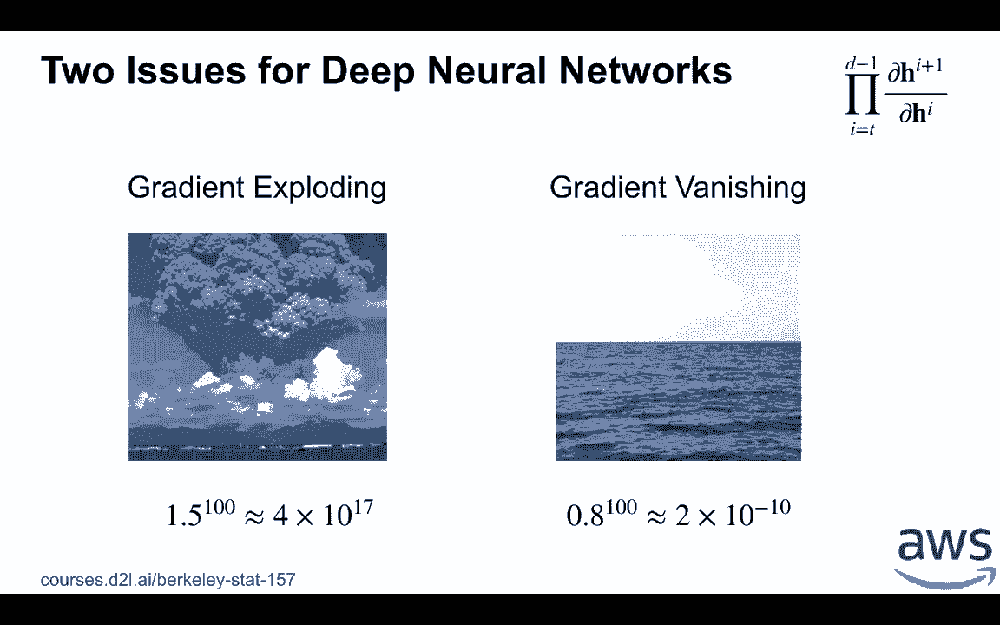
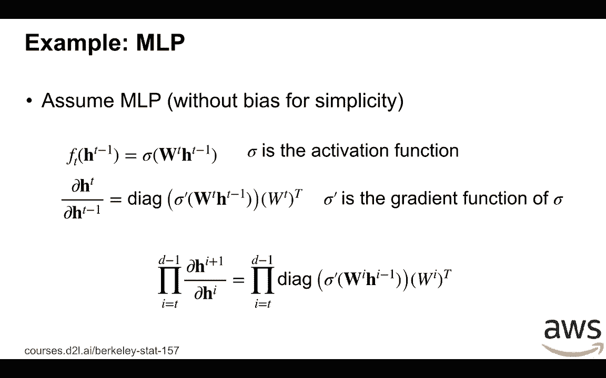
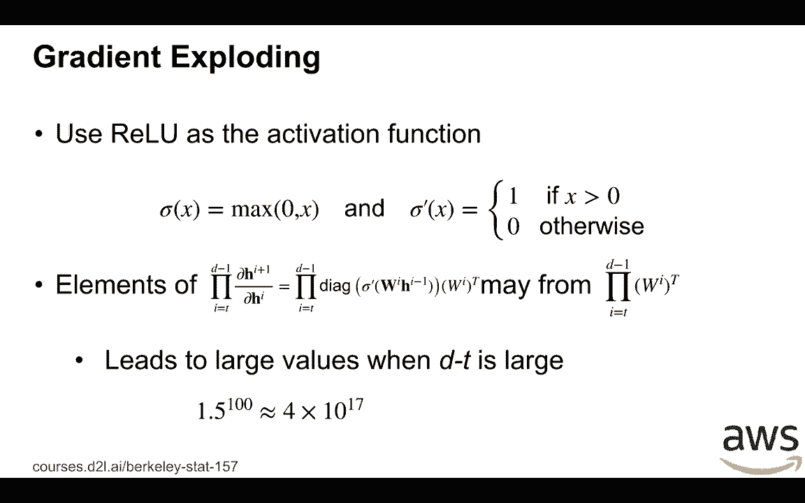
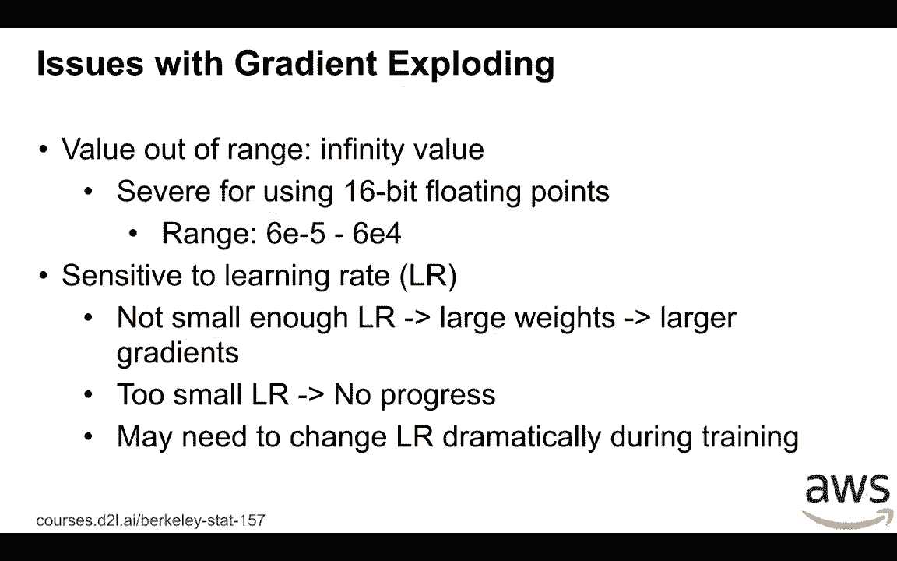
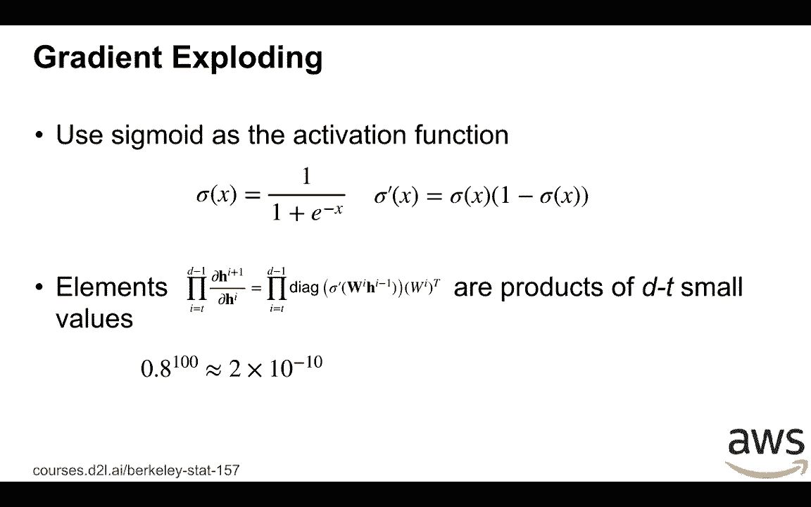
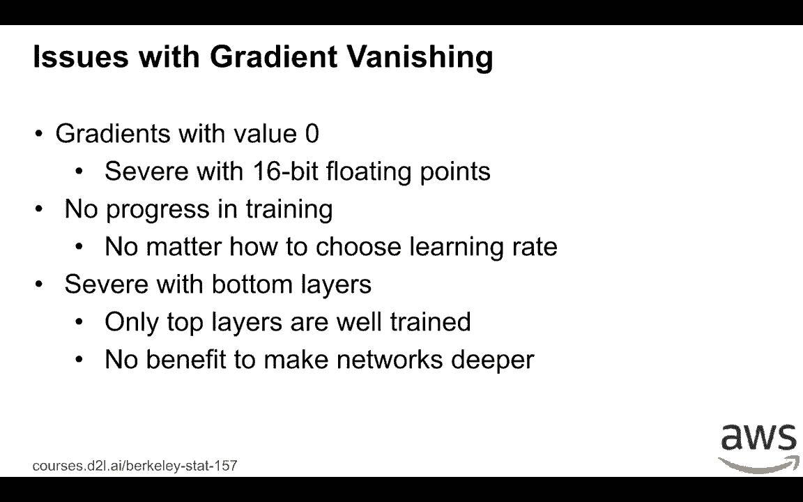
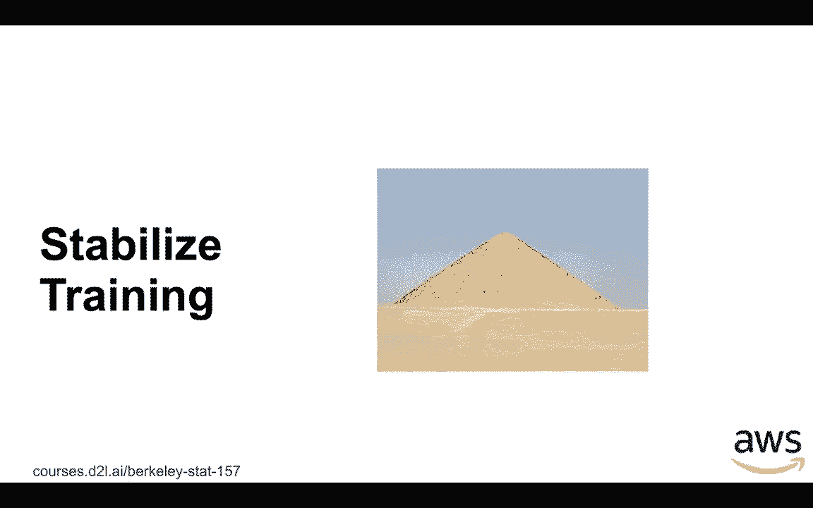

# 34：梯度爆炸与消失 🧨➡️👻

在本节课中，我们将要学习深度神经网络训练中的两个核心挑战：梯度爆炸与梯度消失。理解这两个问题的成因和影响，是构建稳定、可训练的深度模型的基础。

## 数值稳定性问题

让我们从数值稳定性开始讨论。

考虑一个简单的深度神经网络。该网络共有 `D` 层。第 `t` 层的输入记作 `h_{t-1}`，输出是 `h_t`。每一层都有一个函数 `f_t`，负责将输入 `h_{t-1}` 转换为输出 `h_t`。给定输入 `x`，网络的最终输出为 `y`。计算过程是：首先将 `x` 输入到第一层 `f_1`，依次经过各层直到最后一层 `f_D`，最后通过一个损失函数 `l`。

我们关注的是计算损失 `l` 相对于第 `t` 层参数 `w_t` 的梯度。根据链式法则，我们有：

**公式：**
`∂l/∂w_t = (∂l/∂h_D) * (∂h_D/∂h_{D-1}) * ... * (∂h_{t+1}/∂h_t) * (∂h_t/∂w_t)`

关键点在于，这个计算过程涉及 `D - t` 个雅可比矩阵的连续乘法。

这种连续的矩阵乘法可能会引发严重问题。第一个问题是**梯度爆炸**。当这些矩阵中的元素值普遍大于1时，经过多次连乘，梯度值会变得极其巨大。第二个问题是**梯度消失**。当矩阵中的元素值普遍小于1时，经过多次连乘，梯度值会趋近于零。这两个问题都会导致模型训练失败。

## 梯度爆炸问题

上一节我们介绍了梯度问题的根源，本节中我们来看看梯度爆炸的具体表现。

让我们考虑一个具体的多层感知机（MLP）例子。为了简化，我们忽略偏置项。对于第 `t` 层，其计算为：
`h_t = σ(W_t * h_{t-1})`
其中 `σ` 是激活函数，`W_t` 是权重矩阵。

计算该层的梯度时，我们需要计算激活函数的梯度 `diag(σ')`（一个对角矩阵）与权重矩阵 `W_t` 的乘积。在反向传播中，从顶层到底层，我们需要连续进行 `D-t` 次这样的矩阵乘法。

例如，假设我们使用 ReLU 作为激活函数，即 `σ(x) = max(0, x)`。其导数为：当 `x > 0` 时为1，否则为0。那么，在反向传播的连乘链中，如果权重矩阵 `W_t` 中的元素普遍大于1，并且网络很深（`D-t` 很大），这些大于1的数值经过多次相乘，会导致梯度值呈指数级增长，从而引发梯度爆炸。

以下是梯度爆炸带来的主要问题：

*   **数值溢出**：梯度值可能超过浮点数所能表示的最大范围（如 `inf` 或 `NaN`），导致计算完全失效。
*   **训练不稳定**：即使梯度没有溢出，过大的梯度值也会对学习率极其敏感。如果学习率设置不当，权重更新会剧烈波动，可能瞬间破坏模型已经学到的特征，使训练过程震荡甚至发散。
*   **学习率调整困难**：由于梯度值可能在训练过程中剧烈变化，很难找到一个固定的、合适的学习率，通常需要复杂的自适应学习率算法。

## 梯度消失问题

了解了梯度爆炸，我们再来看看它的“孪生兄弟”——梯度消失问题。

我们继续使用之前的 MLP 例子，但这次将激活函数改为 Sigmoid 函数。Sigmoid 函数的定义为：
**公式：**
`σ(x) = 1 / (1 + e^{-x})`
其导数可以表示为：
**公式：**
`σ'(x) = σ(x) * (1 - σ(x))`

Sigmoid 函数及其导数的图像显示，当输入 `x` 的绝对值较大时（例如大于4），其导数值会变得非常小，趋近于0。

在反向传播中，每一层都会乘上一个由 Sigmoid 导数构成的对角矩阵，其元素值都很小（例如 `0.04`）。当网络很深时，这些小于1的小数值经过 `D-t` 次连乘，梯度会以指数速度衰减到接近零。

以下是梯度消失带来的主要问题：

*   **训练停滞**：梯度值变得极小，以至于在浮点数精度下被舍入为零。权重更新量也为零，模型参数无法得到有效更新，训练进程停滞。
*   **深层网络难以训练**：梯度消失的影响在网络的底层（靠近输入层）尤为严重。因为反向传播路径更长，连乘次数更多。这导致只有顶层的几层（靠近损失函数）能得到有效的梯度更新，而底层的参数几乎不变。这相当于一个深度网络只有最上面几层在学习，无法发挥深度模型的优势。
*   **收敛缓慢**：即使梯度没有完全消失，过小的梯度也会导致权重更新极其缓慢，需要非常多的迭代次数才能收敛，大大增加了训练时间和计算成本。

## 总结

本节课中我们一起学习了深度神经网络训练中的两大难题：梯度爆炸与梯度消失。

*   它们的根源在于**反向传播过程中，梯度需要通过链式法则进行多次矩阵连乘**。
*   **梯度爆炸**通常由大于1的数值（如大权重、某些激活函数的导数）连乘导致，会引起训练不稳定和数值溢出。
*   **梯度消失**通常由小于1的数值（如 Sigmoid/Tanh 激活函数的导数）连乘导致，会使底层网络参数更新停滞，阻碍深层网络的训练。

理解这两个问题是迈向设计更稳定、更高效的深度神经网络架构（如使用 ReLU、残差连接、恰当的权重初始化等）的关键第一步。

