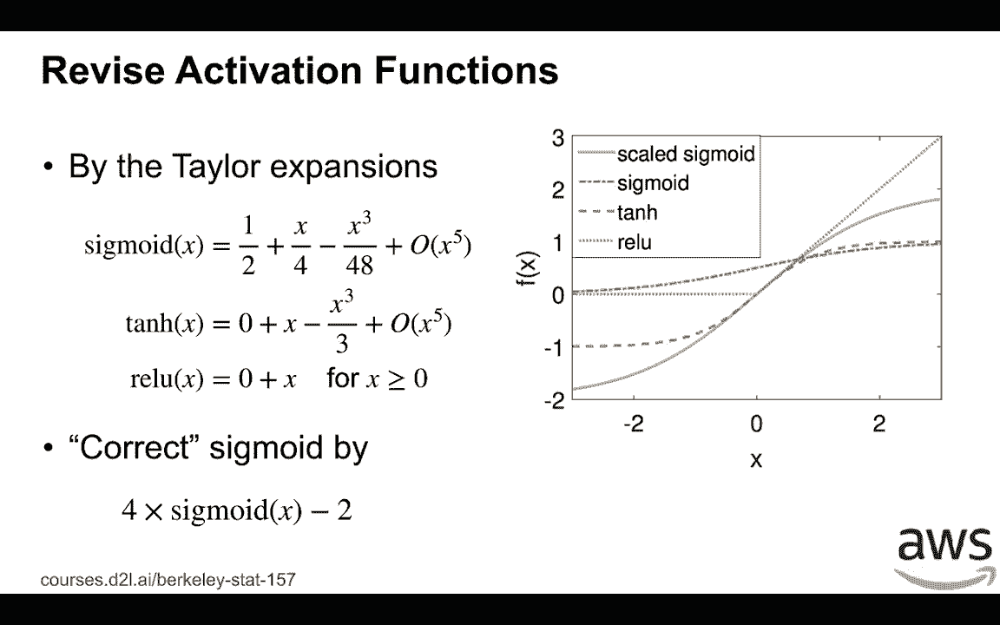

# 35：激活函数与稳定训练 🧠

在本节课中，我们将学习神经网络中激活函数的作用，并探讨如何选择合适的激活函数以确保训练过程的稳定性。我们将从简单的线性函数开始，逐步分析Sigmoid、Tanh和ReLU等常用激活函数的特性。

---

## 线性激活函数

上一节我们介绍了恒等激活函数。本节中，我们来看看一个简单的激活函数：线性函数。

给定输入 `x`，线性激活函数定义为：
`sigma(x) = alpha * x + beta`

如果我们定义 `h' = W^T * h_{t-1}` 作为激活函数的输入，那么第 `t` 层的输出 `h_t` 为：
`h_t = sigma(h')`

现在，我们可以计算 `h_t` 的期望和方差。我们知道 `h'` 的均值为零，因此 `h_t` 的期望为 `beta`。根据我们之前的假设，我们希望均值为零，这意味着 `beta` 应该等于零。

类似地，对于方差，我们知道 `h_t` 是 `h'` 的线性组合。如果 `beta` 为零，并且我们选择了适当的权重初始化方法，那么 `h_t` 的方差为：
`Var(h_t) = alpha^2 * Var(h')`

为了使方差保持恒定，`alpha` 应该等于1。这意味着，为了满足我们之前的假设，线性激活函数需要调整为恒等函数。

在反向传播中，根据链式法则，损失函数 `L` 关于输入 `h_{t-1}` 的梯度为：
`dL/dh_{t-1} = alpha * dL/dh'`

同样，其期望为零，方差为：
`Var(dL/dh_{t-1}) = alpha^2 * Var(dL/dh')`

为了保持梯度稳定，我们再次得到 `alpha` 应为1。因此，线性激活函数实际上被限制为恒等函数。

---

## 常用激活函数分析

了解了线性函数的限制后，本节我们来看看深度学习中实际使用的激活函数，如Sigmoid、Tanh和ReLU。

这些函数在零点附近的行为可以用线性函数来近似。例如：

*   **Sigmoid函数** 在零点附近的泰勒展开近似为：
    `sigmoid(x) ≈ 1/2 + x/4 + O(x^2)`
*   **Tanh函数** 在零点附近的展开近似为：
    `tanh(x) ≈ 0 + x + O(x^2)`，这接近恒等函数。
*   **ReLU函数** 在 `x > 0` 时直接定义为：
    `ReLU(x) = x`，这也是恒等函数。

由于神经网络权重通常被随机初始化为接近零的值，并且输入/输出具有零均值和小方差，因此在训练初期，激活函数的输入 `x` 也接近零。此时，Tanh和ReLU函数的行为都接近线性（恒等）函数。

然而，Sigmoid函数在零点附近并不接近恒等函数（其斜率约为1/4，而非1），这可能导致梯度消失问题。

---

## 修复Sigmoid函数

针对Sigmoid函数的问题，我们可以通过缩放来修复它。

以下是修复方法：
使用缩放后的Sigmoid函数：`4 * sigmoid(x) - 2`

经过缩放后，该函数在零点附近的近似变为：
`4*(1/2 + x/4) - 2 = x`
这使得它在零点附近的行为接近恒等函数。

从图像上可以看到，缩放后的Sigmoid函数（蓝色曲线）在零点附近与Tanh和ReLU函数（均接近恒等函数 `y=x`）的行为相似，而与原始Sigmoid函数（绿色曲线）有显著不同。

---

## 总结

本节课中，我们一起学习了激活函数对神经网络训练稳定性的影响。

我们首先分析了线性激活函数，发现为了保持前向传播和反向传播中信号的均值和方差稳定，它必须退化为恒等函数。接着，我们探讨了Sigmoid、Tanh和ReLU等非线性激活函数，指出在权重初始化合理的情况下，Tanh和ReLU在训练初期其行为接近恒等函数，有利于稳定训练。最后，我们介绍了通过缩放（`4*sigmoid(x)-2`）来修正Sigmoid函数，使其在零点附近也接近恒等函数，从而缓解梯度消失问题。

理解激活函数的这些特性，对于设计和初始化稳定的深度神经网络至关重要。