# 36：数值稳定性实验验证 📊

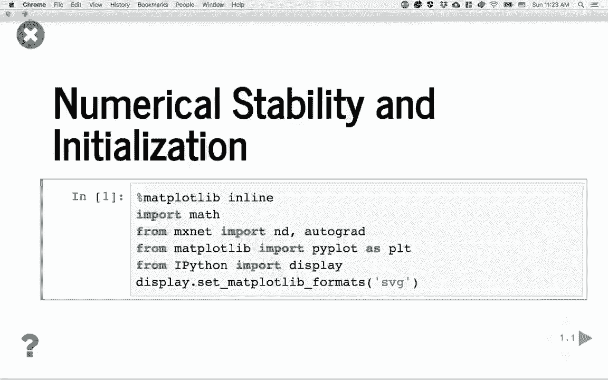

在本节课中，我们将通过一系列Python实验，验证之前讨论过的确保神经网络数值稳定性的方法。我们将观察不同初始化策略和激活函数如何影响深层网络中的梯度行为。

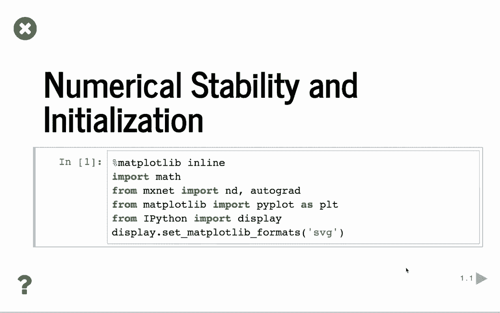

---

## 实验一：随机矩阵连乘的敏感性

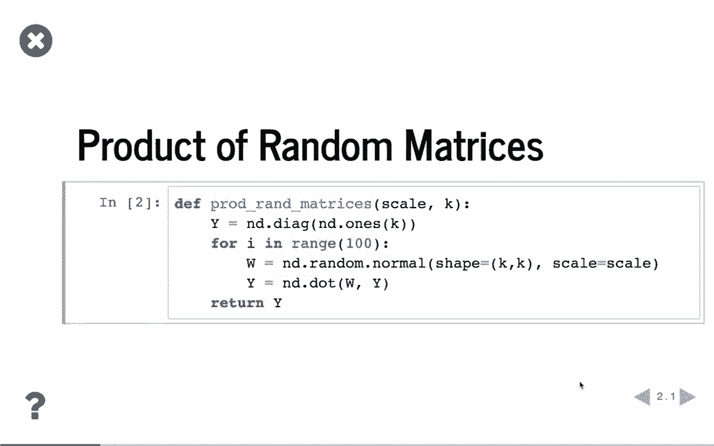

上一节我们讨论了初始化的重要性，本节中我们来看看一个简单的实验：连续相乘多个随机矩阵。这个实验能直观展示数值对初始化方差的敏感性。

以下是实验步骤：

1.  定义一个函数 `prod_random_matrices`，它接受两个参数：`scale`（控制随机矩阵的方差）和 `K`（矩阵的形状）。
2.  函数首先生成一个 `K x K` 的单位矩阵 `Y`。
3.  然后进行100次循环，每次生成一个随机矩阵 `W`，其元素服从均值为0、方差为 `scale` 的正态分布，形状为 `K x K`。
4.  每次循环执行矩阵乘法 `Y = W @ Y`。
5.  函数返回最终的 `Y` 矩阵。

```python
import numpy as np

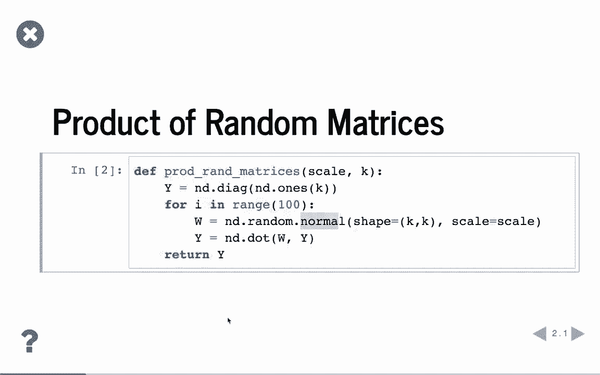

def prod_random_matrices(scale, K):
    Y = np.eye(K)  # 初始化为单位矩阵
    for _ in range(100):
        W = np.random.randn(K, K) * scale  # 生成随机矩阵
        Y = W @ Y  # 矩阵连乘
    return Y
```

现在，我们使用不同的 `scale` 值来观察结果：

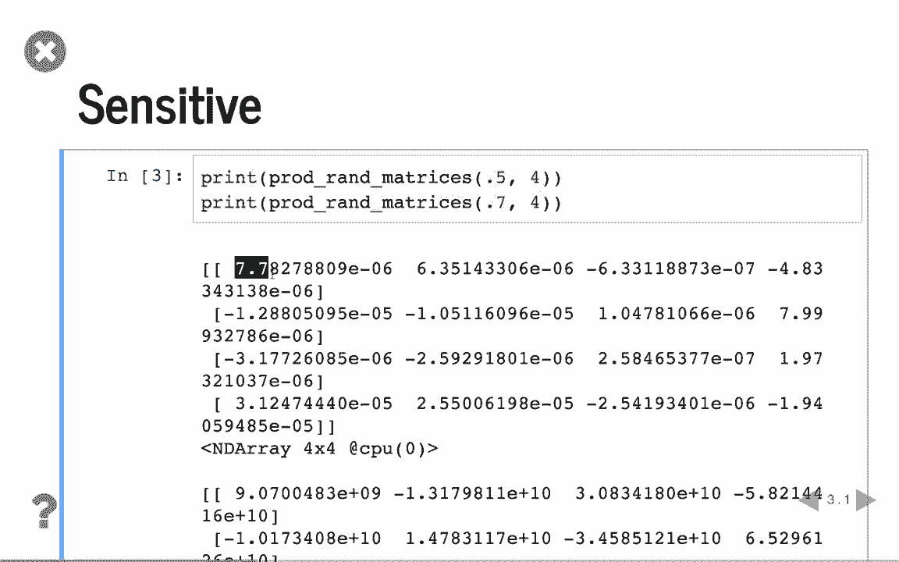

*   当 `scale=0.5`，`K=4` 时，结果矩阵中的值都非常小（约 `1e-6`）。
*   当 `scale=0.7`，`K=4` 时，结果矩阵中的值变得极大（约 `1e+10`）。

这个实验表明，即使初始化方差仅有微小变化，在经过多次矩阵乘法后，输出值也会产生数量级上的巨大差异。因此，我们必须谨慎选择初始化参数。

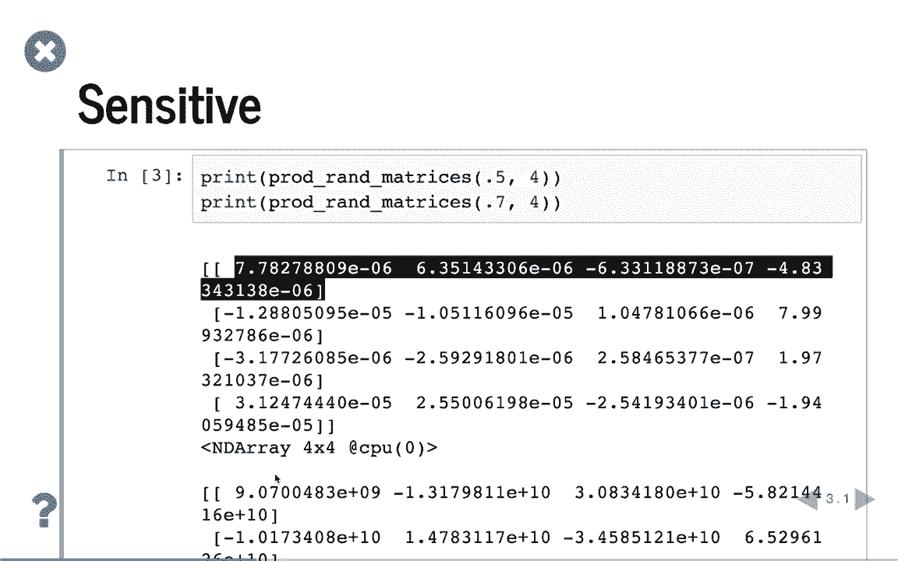

---

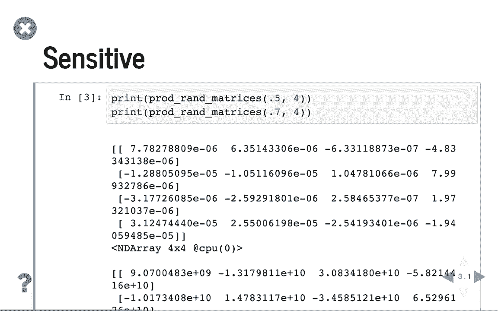

## 实验二：多层感知机（MLP）的梯度分析

接下来，我们将分析在一个深层MLP中，梯度如何随层数传播。这有助于我们理解梯度消失或爆炸问题。

以下是核心实验函数 `synthetic_grad` 的步骤：

1.  函数接受参数：`K`（层大小）、`sigma`（激活函数）、`sigma_prime`（激活函数的梯度函数）和 `get_weight`（权重初始化函数句柄）。
2.  重复实验10次并取平均，以减少随机性。
3.  在每次重复中，随机生成一个输入向量 `x`。
4.  模拟一个50层的网络。对于每一层：
    *   使用 `get_weight` 函数初始化权重矩阵 `w`。
    *   计算该层的激活前值：`a = w @ h`（`h` 初始为 `x`）。
    *   计算该层的梯度：`grad = sigma_prime(a) * (w.T @ y)`（`y` 初始为输出层的单位矩阵，通过链式法则反向传播）。
    *   更新 `y` 为当前层的梯度，更新 `h` 为当前层的激活值 `sigma(a)`，用于下一层计算。
5.  记录并返回这10次重复中，最终梯度绝对值的平均值。

```python
def synthetic_grad(K, sigma, sigma_prime, get_weight, repeats=10):
    grad_vals = []
    for _ in range(repeats):
        x = np.random.randn(K, 1)
        h = x
        y = np.eye(K)  # 假设输出梯度为单位矩阵
        for _ in range(50):  # 50层网络
            w = get_weight(K)
            a = w @ h
            grad = sigma_prime(a) * (w.T @ y)  # 链式法则
            y = grad
            h = sigma(a)
        grad_vals.append(np.abs(y).min())
    return np.mean(grad_vals)
```

---

### 使用ReLU激活函数

我们首先使用ReLU作为激活函数，其梯度函数为：
**`relu_prime(x) = 1 if x > 0 else 0`**

我们尝试不同的权重初始化方差（`scale`）：

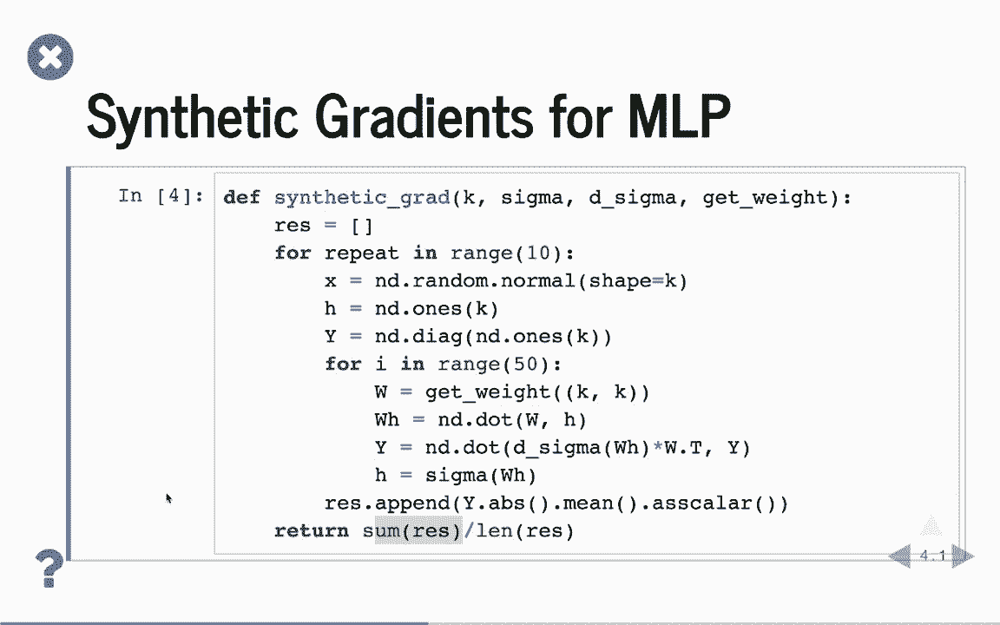

```python
# 权重初始化函数：正态分布
def get_weight_normal(scale, K):
    return np.random.randn(K, K) * scale

scales = [0.1, 0.2, 0.4, 0.8]
for scale in scales:
    avg_grad = synthetic_grad(100, np.maximum(0, x), relu_prime, lambda K: get_weight_normal(scale, K))
    print(f"方差 {scale}: 平均梯度最小值 = {avg_grad:.2e}")
```
**结果示例**：
*   方差 0.1: 梯度极小 (`~1e-9`)，可能梯度消失。
*   方差 0.2: 梯度值合理 (`~0.01`)。
*   方差 0.4/0.8: 梯度极大 (`~1e+20`)，发生梯度爆炸。

结论是，对于ReLU网络，存在一个狭窄的“合理”初始化方差范围（如0.2），过大或过小都会导致梯度不稳定。

---

### 使用Xavier初始化

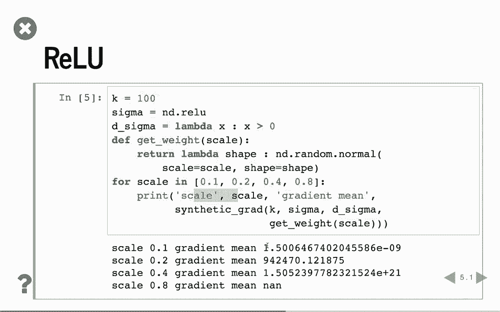

为了解决上述问题，我们采用Xavier初始化，它根据输入和输出的维度调整方差。
对于均匀分布，权重范围的计算公式为：
**`limit = sqrt(6 / (fan_in + fan_out))`**
**`weight ~ Uniform(-limit, limit)`**

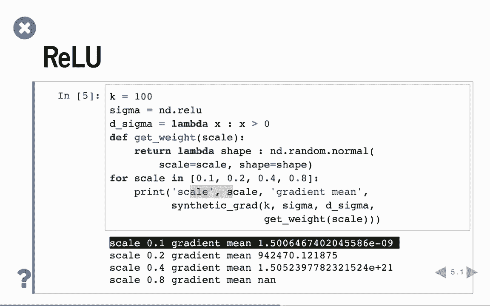

```python
# Xavier均匀分布初始化
def get_weight_xavier(K):
    limit = np.sqrt(6 / (K + K))  # 假设fan_in = fan_out = K
    return np.random.uniform(-limit, limit, (K, K))

avg_grad = synthetic_grad(100, np.maximum(0, x), relu_prime, get_weight_xavier)
print(f"Xavier初始化下，平均梯度最小值 = {avg_grad:.2e}")
```
使用Xavier初始化后，梯度值 (`~1e-9`) 虽然仍偏小，但相比不稳定的正态分布初始化，它提供了一个更可靠、更不易爆炸的起点。

---

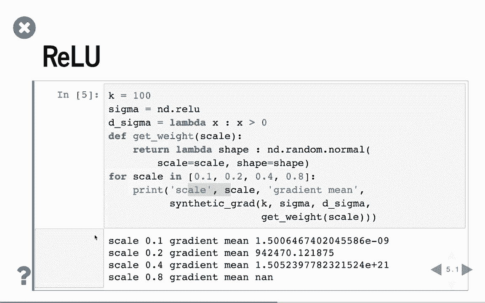

### 使用Sigmoid激活函数

现在，我们观察经典的Sigmoid激活函数，其梯度公式为：
**`sigmoid_prime(x) = sigmoid(x) * (1 - sigmoid(x))`**

```python
def sigmoid(x):
    return 1 / (1 + np.exp(-x))

def sigmoid_prime(x):
    s = sigmoid(x)
    return s * (1 - s)

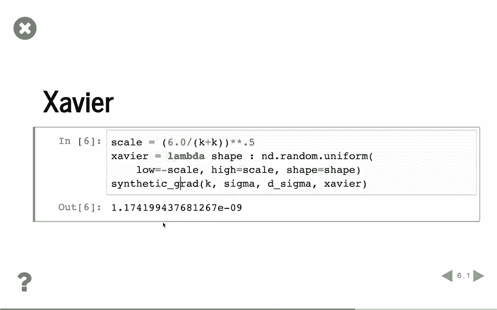

scales = [0.1, 0.2, 0.4, 0.8]
for scale in scales:
    avg_grad = synthetic_grad(100, sigmoid, sigmoid_prime, lambda K: get_weight_normal(scale, K))
    print(f"方差 {scale} (Sigmoid): 平均梯度最小值 = {avg_grad:.2e}")
```
**结果**：无论方差取0.1到0.8中的哪个值，梯度都极小 (`~1e-33` 到 `~5e-5`)。这清晰地展示了Sigmoid函数在深层网络中容易导致**梯度消失**的问题。

---

### 改进：缩放Sigmoid函数

如前所述，我们可以通过缩放Sigmoid函数来缓解梯度消失。例如，使用 `4 * sigmoid(x) - 2`。

```python
def scaled_sigmoid(x):
    return 4 * sigmoid(x) - 2

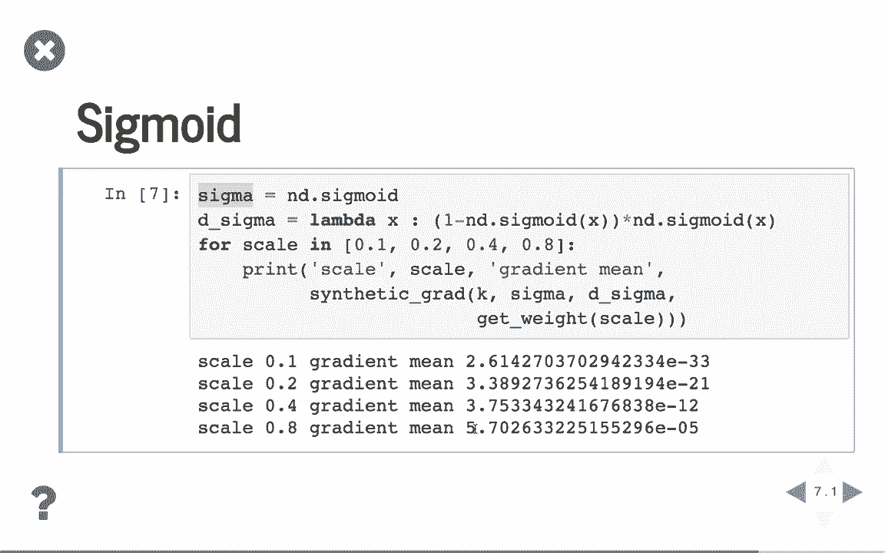

def scaled_sigmoid_prime(x):
    return 4 * sigmoid_prime(x)  # 梯度也相应放大4倍

for scale in scales:
    avg_grad = synthetic_grad(100, scaled_sigmoid, scaled_sigmoid_prime, lambda K: get_weight_normal(scale, K))
    print(f"方差 {scale} (缩放Sigmoid): 平均梯度最小值 = {avg_grad:.2e}")
```
**结果**：使用缩放后的Sigmoid函数，梯度值变得合理得多（例如，方差0.1时梯度约为 `0.01`）。即使方差增大到0.8，梯度也保持在可控范围内。这表明对激活函数进行适当的缩放，能显著改善梯度流，增强数值稳定性。

---

## 总结 🎯

本节课中我们一起学习了如何通过实验验证神经网络的数值稳定性：
1.  **矩阵连乘实验**表明，初始化方差微小的变化会被深层计算放大，强调初始化的重要性。
2.  **MLP梯度分析实验**揭示：
    *   使用ReLU时，初始化方差需精心选择，Xavier初始化是一个更稳健的方案。
    *   使用标准Sigmoid函数会导致严重的梯度消失。
    *   通过对Sigmoid函数进行缩放（如 `4*sigmoid(x)-2`），可以有效地缓解梯度消失问题，获得更稳定的梯度。

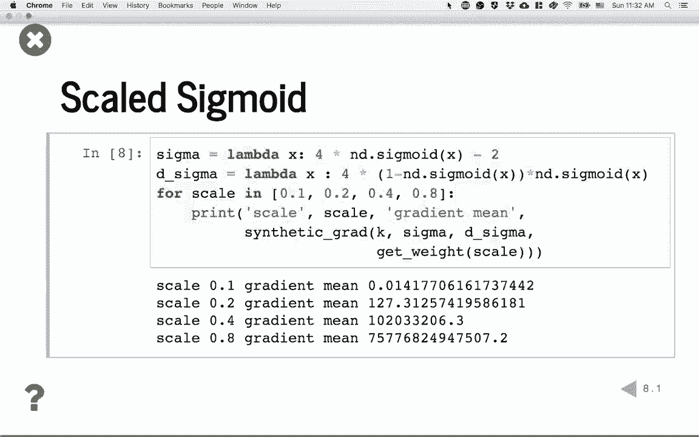

这些实验巩固了我们的理解：通过结合恰当的**权重初始化方法**（如Xavier）和**激活函数选择/调整**，我们可以有效地控制深层神经网络中的梯度，避免其消失或爆炸，从而确保模型能够成功训练。