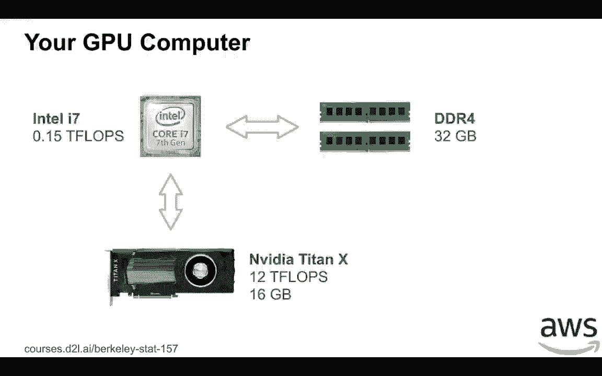
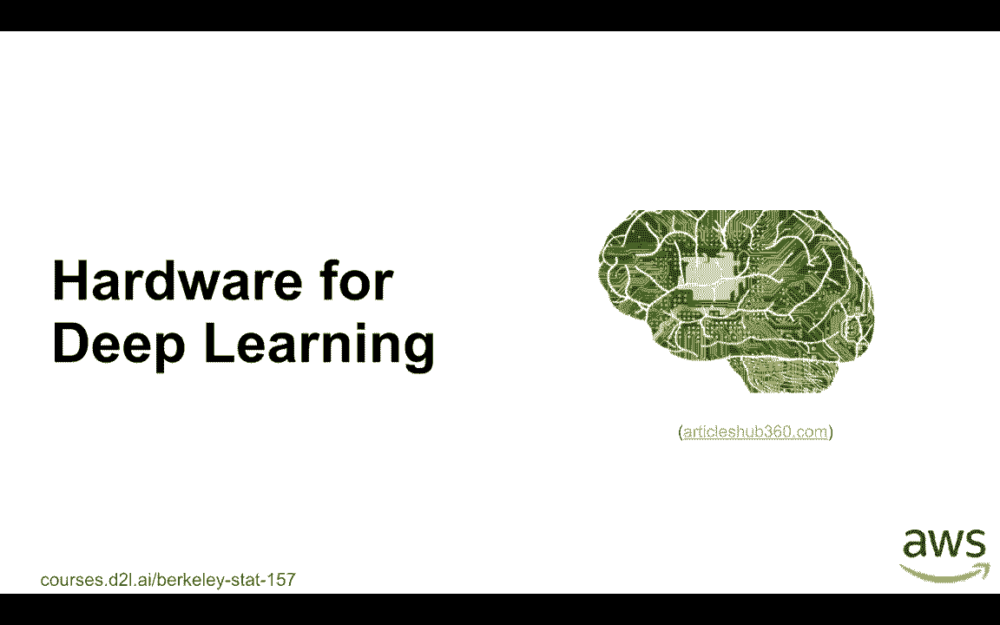
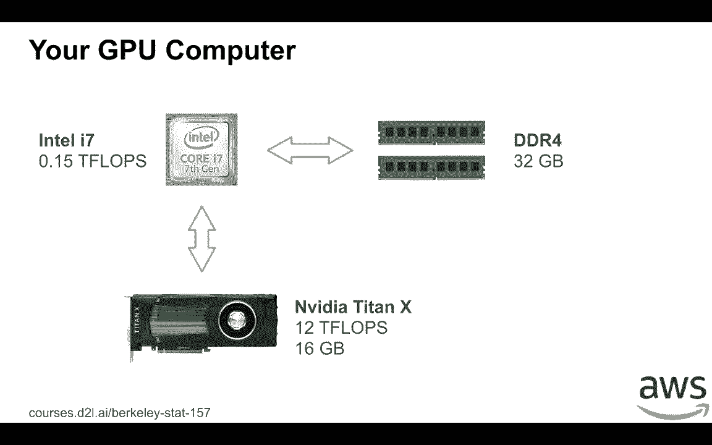
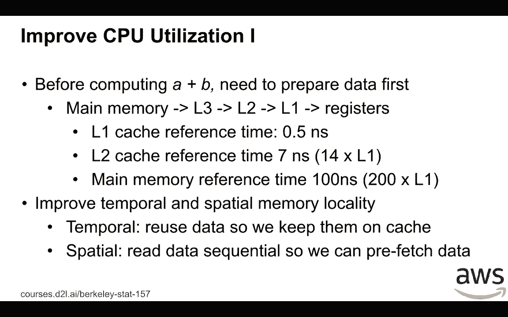
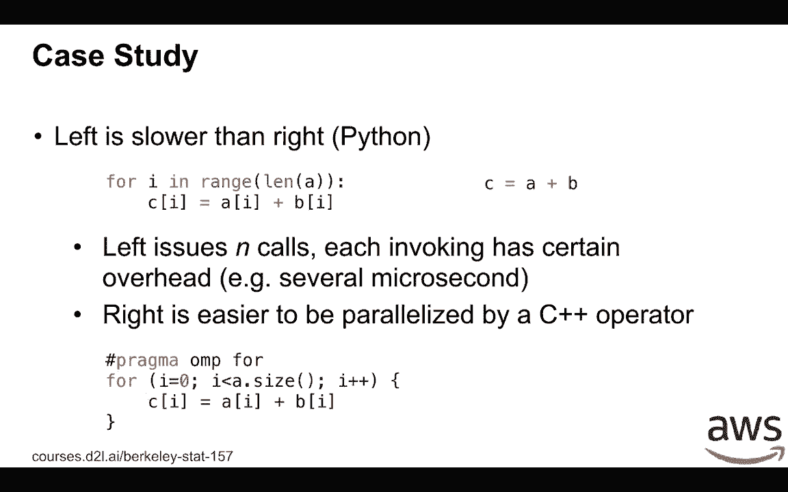
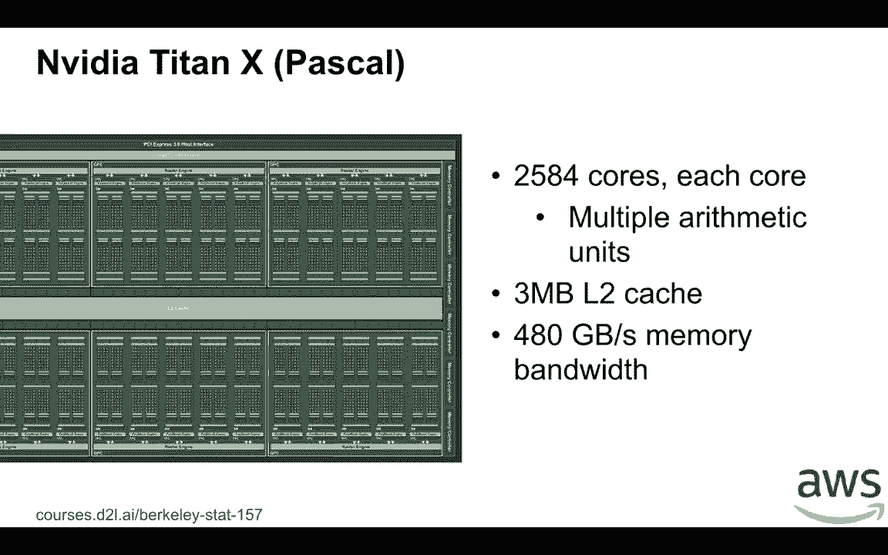
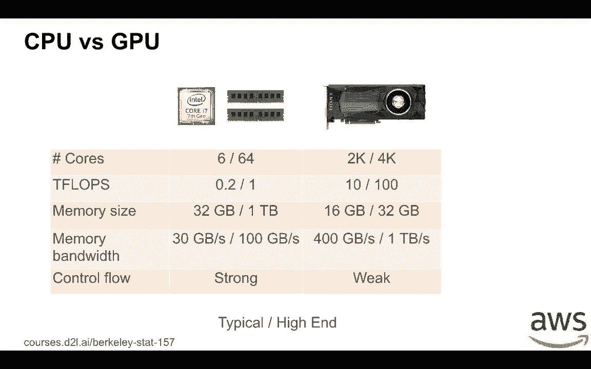
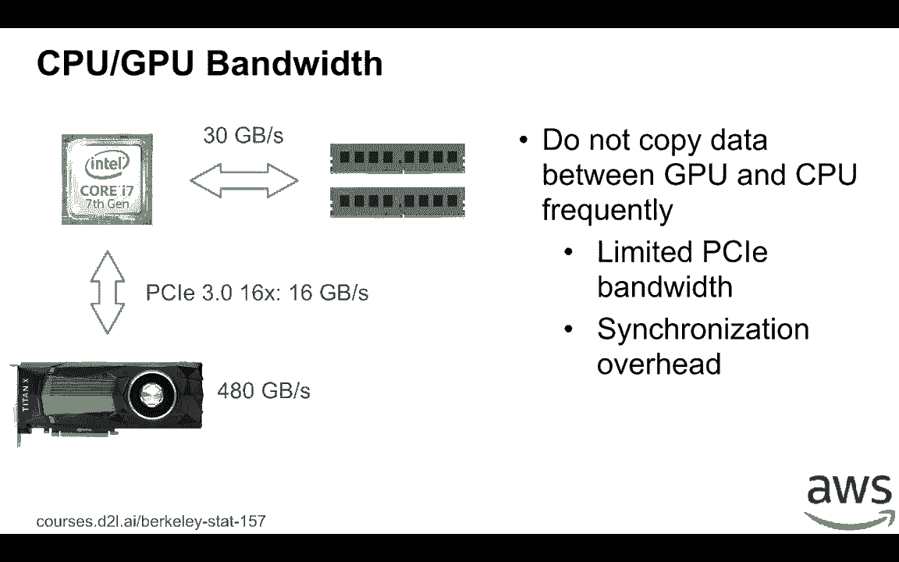
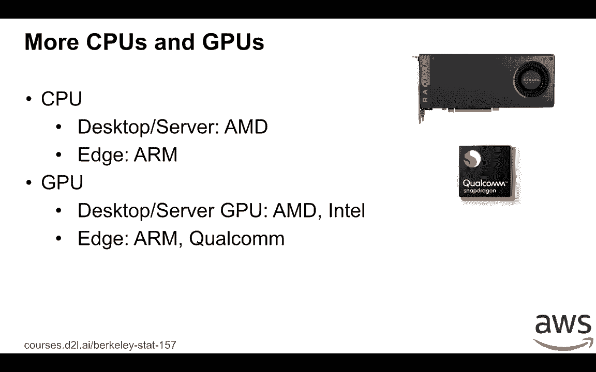
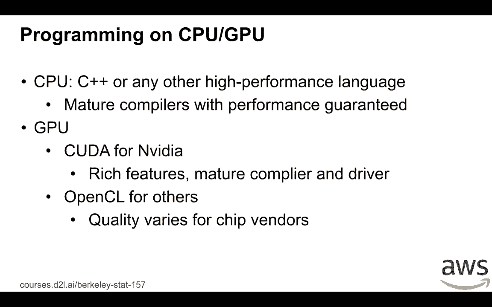

# 37：深度学习硬件指南 🖥️💡





在本节课中，我们将学习深度学习任务中硬件（特别是CPU和GPU）的基础知识、性能差异以及如何高效利用它们。我们将从个人可购买的硬件讲起，深入探讨CPU和GPU的架构特点，并比较它们的性能与适用场景。

---



## CPU架构与性能优化 🧠

上一节我们介绍了课程概述，本节中我们来看看中央处理器（CPU）的架构以及如何优化其性能。

CPU是计算机的核心处理单元。以英特尔i7 CPU为例，其芯片区域包含集成的图形处理器（GPU）、物理核心、多级缓存以及与内存的接口。集成GPU通常较弱，不用于深度学习训练，但可用于推理任务。

CPU通常有多个物理核心（例如4个），每个核心拥有自己的L1和L2缓存，所有核心共享一个L3缓存。内存带宽约为每秒30GB。访问不同层级存储的速度差异巨大：访问L1缓存的速度比访问主内存快约200倍。

为了充分利用CPU性能，关键在于减少数据移动。这可以通过优化**内存局部性**来实现。

以下是两种主要的内存局部性类型：



*   **时间局部性**：如果数据在不久的将来会被再次使用，就应将其保留在缓存中。
*   **空间局部性**：如果使用了某个内存地址的数据，那么其邻近地址的数据也很有可能被使用，CPU可以据此预取数据。

让我们通过一个案例来理解空间局部性的应用。假设一个矩阵按**行主序**存储，这意味着内存中连续存储的是每一行的元素。在这种情况下，按行顺序访问元素（具有良好的空间局部性）会比按列顺序访问快得多。因为CPU以**缓存行**（通常为64字节）为单位读取数据。按行访问时，一次读取就能获取多个后续需要的元素；而按列访问时，每次可能都需要发起新的内存请求，导致效率低下。

除了内存局部性，另一种提升CPU性能的关键技巧是**并行化**。现代CPU拥有多个核心，可以同时执行多个线程。例如，服务器CPU可能拥有数十个物理核心。为了充分利用所有核心，我们需要使用至少与物理核心数相等的线程数。

> **注意**：英特尔CPU的超线程技术会将一个物理核心虚拟为两个逻辑核心。但对于计算密集型任务，使用的线程数最好等于物理核心数，以避免寄存器资源的争抢。

让我们看一个向量加法的案例。在Python中，直接使用NumPy进行向量运算 `c = a + b` 远比使用 `for` 循环逐个元素相加要快。这是因为前者将整个操作作为一个整体交给底层优化过的C/C++代码执行，减少了Python解释器的开销，并且更易于实现并行化。在C++中，可以简单地使用OpenMP指令来并行化这样的循环。

```cpp
// 使用OpenMP并行化的向量加法示例
#pragma omp parallel for
for (int i = 0; i < n; ++i) {
    c[i] = a[i] + b[i];
}
```

---

## GPU架构与性能优化 ⚡

上一节我们探讨了CPU的优化技巧，本节中我们来看看图形处理器（GPU）的架构及其性能优化策略。

GPU的设计目标与CPU不同。以NVIDIA Titan X GPU为例，它拥有超过2000个小型、高效的计算核心，专门用于执行大量并行的简单算术运算。它拥有一个较小的共享L2缓存（如3MB），但配备了极高的内存带宽（如480GB/s）。



鉴于这种架构，优化GPU性能的策略与CPU类似但也有所不同：

1.  **大规模并行**：GPU需要成千上万个线程才能充分发挥性能。这意味着提交给GPU的任务（例如处理的向量或矩阵）必须足够大。处理一个仅有100个元素的向量对GPU来说是大材小用。
2.  **极重视内存局部性**：由于GPU缓存较小，高效的内存访问模式至关重要，以减少对高延迟全局内存的访问。
3.  **控制流简单**：GPU核心设计简单，不擅长处理复杂的条件分支和控制系统（如运行操作系统或Web服务器）。深度学习中的矩阵运算等规则计算非常适合GPU。



对于个人购买GPU，有一个简单的指南：在**同一代产品系列**内，GPU的计算能力（以GFLOPS衡量）与价格大致呈线性关系。然而，**新一代产品**的性能通常远优于旧一代。因此，在预算允许的情况下，应优先购买新一代的型号。

---

## CPU与GPU对比 🆚

上一节我们分别了解了CPU和GPU，现在我们来系统地比较它们。

以下是典型配置与高端配置的对比：

| 特性 | 典型CPU | 高端CPU | 典型GPU | 高端GPU |
| :--- | :--- | :--- | :--- | :--- |
| **核心数量** | 6-16核 | 可达64核 | 2000+核心 | 4000+核心 |
| **计算能力** | 0.2-1 TFLOPS | 1+ TFLOPS | 10+ TFLOPS | 30+ TFLOPS |
| **内存容量** | 16-64 GB | 可达1 TB | 8-16 GB | 32 GB |
| **内存带宽** | 30-50 GB/s | 可达100 GB/s | 300-500 GB/s | 1 TB/s |
| **控制流能力** | **强**，适合复杂逻辑 | **强** | **弱**，适合规则计算 | **弱** |

**关键差异总结**：
*   **计算能力**：GPU的并行计算能力远超CPU，可达百倍之差。
*   **内存**：CPU可支持更大的内存容量，而GPU内存有限，需要精打细算。
*   **带宽**：GPU拥有极高的内存带宽以喂饱其海量计算核心。
*   **适用性**：CPU擅长复杂控制流和通用任务；GPU擅长大规模数据并行计算。

CPU和GPU通过PCIe总线连接，其带宽（例如PCIe 3.0 x16约为16GB/s）远低于GPU自身的内存带宽。因此，**应尽量避免在GPU和CPU之间频繁复制数据**，否则PCIe带宽将成为性能瓶颈。在深度学习训练中，应尽可能将整个模型和数据保持在GPU内存中。

---



## 其他硬件与编程生态 🌐

除了主流的英特尔CPU和英伟达GPU，市场上还有其他选择。

**CPU方面**：还有AMD的CPU和ARM架构的处理器（广泛应用于移动设备）。
**GPU方面**：除了英伟达，还有AMD的GPU、英特尔的集成GPU，以及移动设备上的ARM Mali、高通Adreno等GPU。



不同的硬件对应不同的编程生态：

*   **CPU编程**：通常使用C++等语言，编译器成熟，在不同CPU上都能获得稳定性能。
*   **GPU编程**：
    *   **英伟达GPU**：使用**CUDA**平台，生态成熟，工具链完善，是深度学习的首选。
    *   **其他GPU**：可使用**OpenCL**，它是一种开放的并行计算标准，但不同厂商的驱动和工具链质量参差不齐，可能影响性能和使用体验。



---

## 总结 📚

本节课中我们一起学习了深度学习硬件的核心知识。

我们首先从个人硬件选型入手，然后深入分析了**CPU**和**GPU**的架构差异：CPU核心少而强，擅长复杂控制流；GPU核心多而专，擅长大规模并行计算。我们探讨了优化两者性能的关键，即**内存局部性**和**并行化**，并指出GPU对任务规模和内存访问模式有更高要求。接着，我们系统比较了CPU和GPU在计算能力、内存、带宽等方面的优劣，并强调了避免CPU与GPU间频繁数据拷贝的重要性。最后，我们简要介绍了其他硬件选项（如AMD、ARM）及其编程生态（CUDA vs. OpenCL）。



理解这些硬件特性，能帮助你在实践中更好地配置资源、编写高效代码，并选择适合的硬件进行深度学习开发。