# 38：高级深度学习硬件 🧠💻

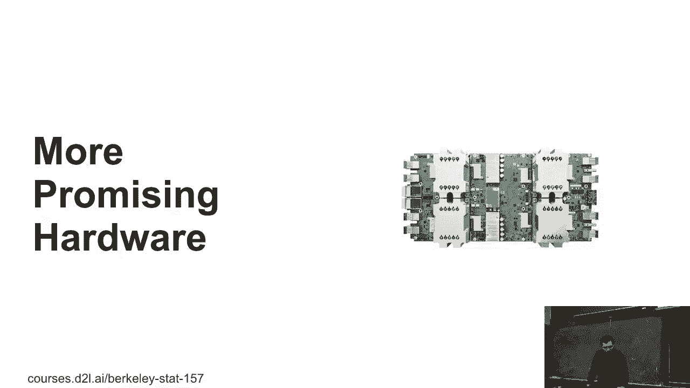

在本节课中，我们将学习除了CPU和GPU之外，其他用于深度学习的专用硬件。我们将探讨DSP、FPGA和AI加速器（如TPU）的工作原理、优势、劣势以及它们的应用场景。

---

## 更多硬件选择

上一节我们介绍了CPU和GPU，本节中我们来看看其他可用于深度学习的硬件。

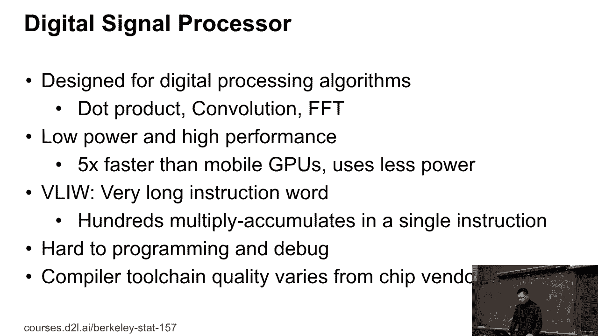

例如，高通的骁龙845芯片集成了多个组件。右上角是GPU，右下角是CPU。在GPU和CPU之间，有一个ISP（图像信号处理器）。在ISP左侧，有一个DSP（数字信号处理器）。DSP和ISP占据了芯片的很大面积，它们功能强大，可以用于深度学习任务。

---

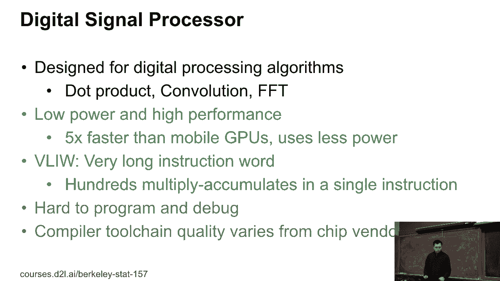

## 数字信号处理器 (DSP) 🎛️

DSP是专门为数字信号处理算法设计的处理器。它能高效执行矩阵点乘、卷积和快速傅里叶变换等操作，前两项与深度学习密切相关。

DSP的设计使其在某些场景下精度更高，性能可能达到GPU的五倍甚至更多。其主要优点是功耗较低。在手机等移动设备上运行任务时，使用DSP而非GPU或CPU可以节省电力，避免设备过热，从而在电池模式下执行更多任务。

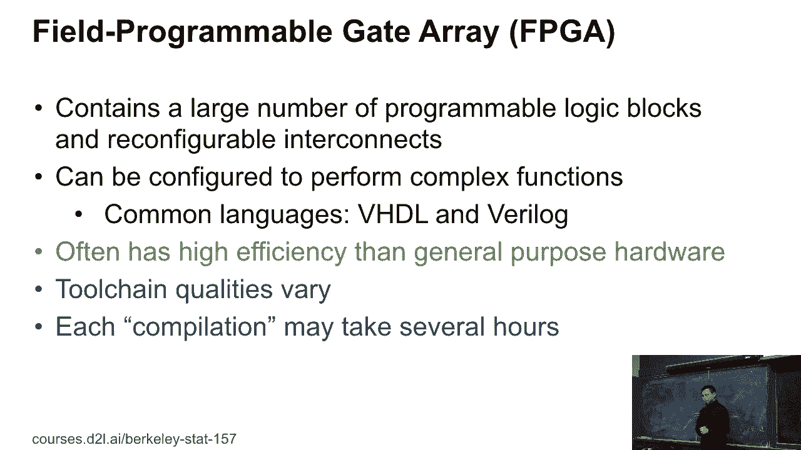

DSP采用了一种名为**超长指令字（VLIW）**的架构。在CPU上，每条指令可能只执行几十次浮点乘法。而在DSP上，每条指令可以执行大量的浮点乘法。因此，即使频率较低，DSP的性能也能超越CPU。

以下是DSP的主要优缺点：

*   **优点**：通常比GPU更快，更节能。
*   **缺点**：编程相对复杂，调试困难，且不同芯片厂商提供的编译工具链质量参差不齐。

---

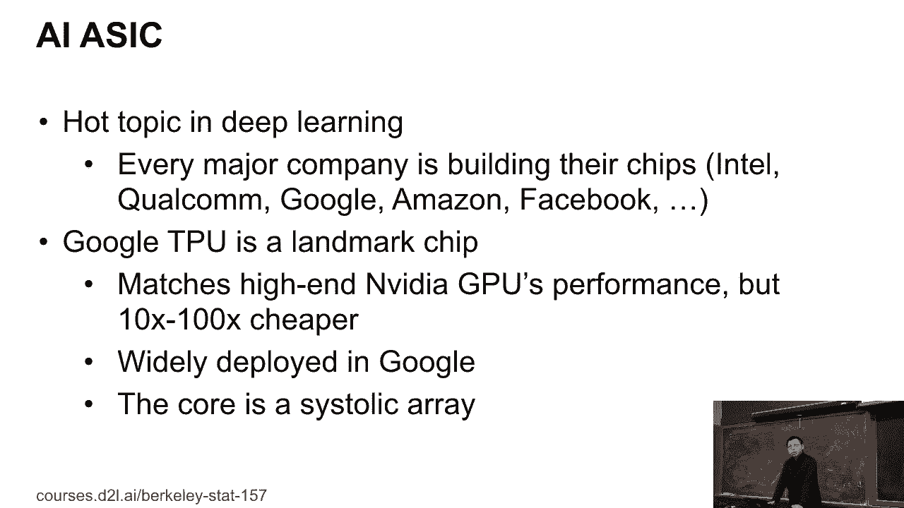

## 现场可编程门阵列 (FPGA) 🔧

FPGA与我们常用的CPU和GPU有本质不同。它包含大量可编程逻辑块，我们可以重新配置这些逻辑块之间的连接。

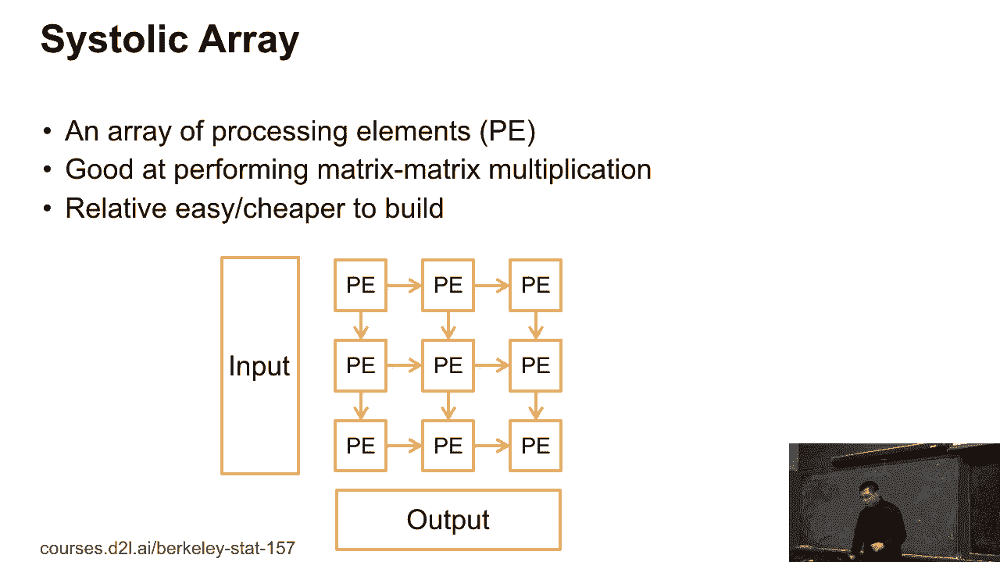

在CPU和GPU上，我们编写并执行程序。但对于FPGA，你需要编写一个程序来描述硬件本身。编译过程实际上是在改变FPGA的硬件结构，这可能需要数小时甚至数天。编译完成后，你就得到了一个为特定任务定制的硬件，然后在其上运行程序。这项工作通常使用**VHDL**或**Verilog**等硬件描述语言完成。

FPGA的优势在于，它可以为特定应用定制硬件，去除不必要的部分，从而获得比通用硬件更高的效率。然而，它并不常见，因为编程和调试非常困难，且编译时间可能很长。

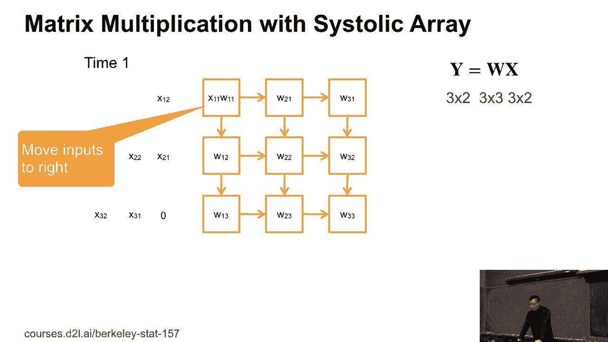

---

## AI加速器与TPU 🚀

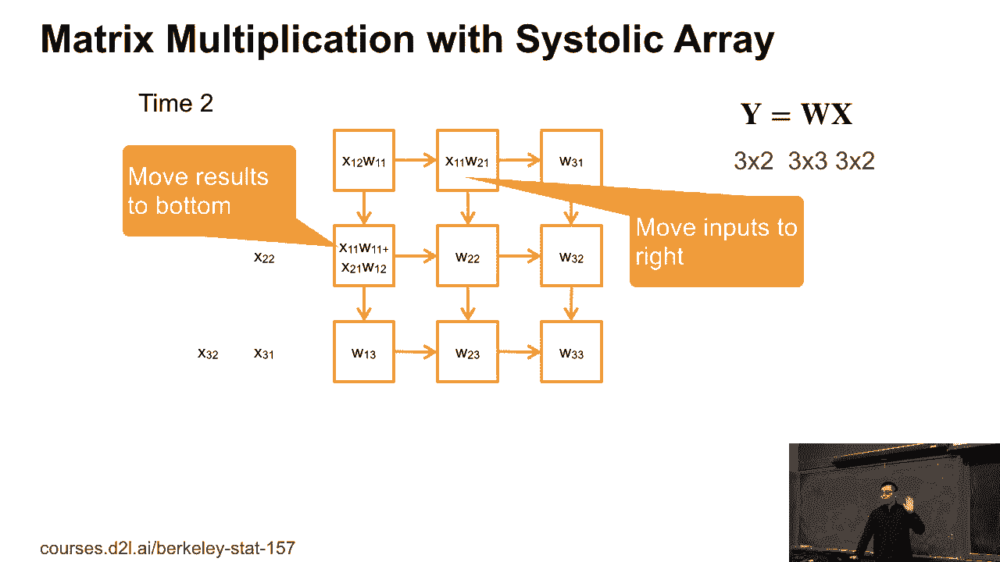

在深度学习领域，许多公司都在设计自己的AI芯片。其中，谷歌的TPU是最早且最成功的案例之一。

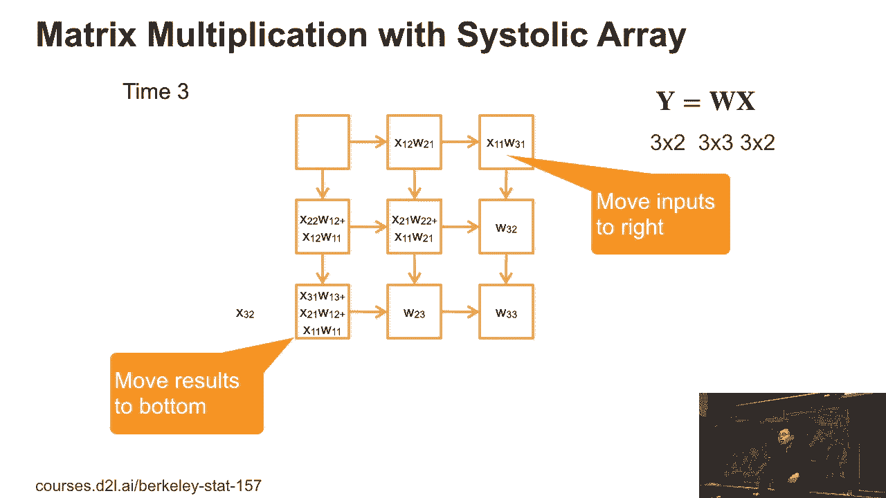

谷歌TPU的性能可以媲美高端GPU，能提供约100 TFLOPS的算力。但关键优势在于成本：一个高端GPU可能售价约10,000美元，而一个TPU的制造成本可能只有500美元，存在20倍的差距。这也是谷歌部署TPU的主要原因。

TPU的核心是一个名为**脉动阵列**的结构。它由一个处理单元（PE）组成的二维网格构成，配有输入和输出缓冲区。这个设计专为矩阵乘法优化。

我们来通过一个例子看看脉动阵列如何工作。假设我们要计算 **y = Wx**，其中 **W** 是一个3x3的矩阵，**x** 是一个3x2的矩阵。

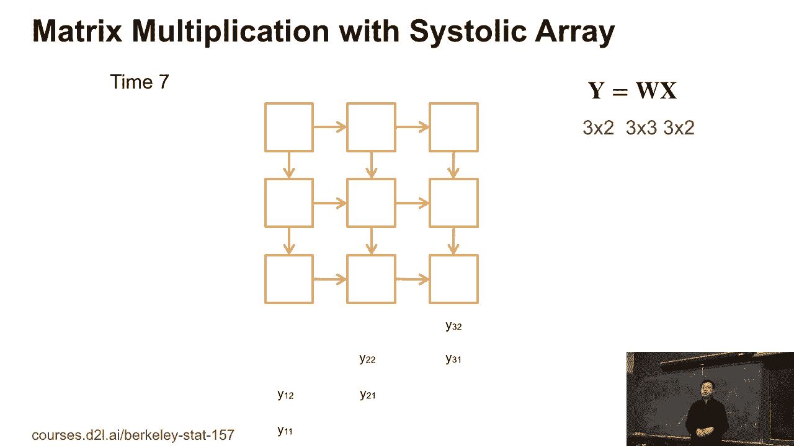

1.  **数据加载**：首先，将权重矩阵 **W** 的每个元素预先放入对应的PE中。同时，将输入矩阵 **x** 以特定形式对齐到输入缓冲区。
2.  **计算与数据流动**：计算开始后，输入数据从缓冲区向左一步步移动。同时，每个PE将接收到的输入与存储的权重相乘，并将部分结果向下移动。
3.  **结果输出**：经过多个时钟周期后，完整的计算结果 **y** 会从阵列底部输出。

脉动阵列通常具有很高的效率。对于大规模矩阵乘法，可以根据阵列大小对矩阵进行分块处理。虽然初始延迟可能较高，但在处理大批量输入时，吞吐量会非常可观。

需要注意的是，脉动阵列主要优化矩阵乘法。对于Sigmoid等其他操作，可能需要额外的专用芯片。此外，目前的硬件对稀疏计算（即矩阵中包含大量零）的优化有限。专门的稀疏计算芯片虽然性能可能与密集计算芯片相似，但功耗可以降低约10倍，这对移动设备极具吸引力。

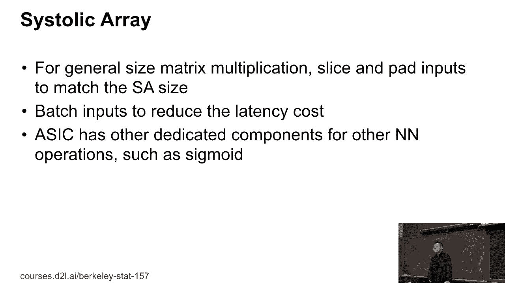

---

## 硬件对比与总结 📊

我们可以根据性能和灵活性对硬件进行分类：
*   **X轴（性能）**：左侧功耗高、速度快，右侧功耗低、速度慢。
*   **Y轴（灵活性）**：表示编程、调试和部署的难易程度。

以下是各类硬件的定位：
*   **CPU**：最容易使用，通用性强，支持广泛。
*   **GPU**：比CPU更快，但编程更难（如CUDA, OpenCL）。
*   **DSP**：主要用于手机等小型设备，能效比可能高于手机GPU，但编程复杂。
*   **FPGA**：可定制硬件以实现高效率，但需要深厚的硬件知识，编程和调试极难。
*   **AI加速器 (如TPU)**：专为特定算法（如矩阵乘法）设计，效率极高，但灵活性和通用性较差，目前正处于快速发展阶段。

---

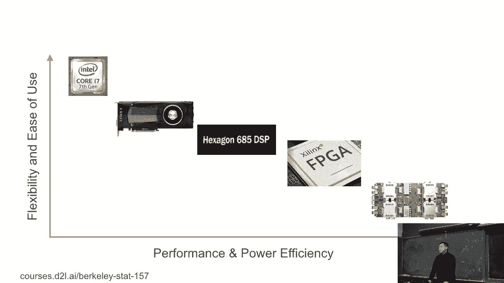

本节课中我们一起学习了DSP、FPGA和AI加速器等高级深度学习硬件。我们了解了它们的基本原理、各自的优势（如高性能、低功耗）和劣势（如编程复杂性）。理解这些硬件的特点，对于从事深度学习架构研究或将模型部署到实际硬件中至关重要。未来一年，预计AI加速器领域将会有更多进展。