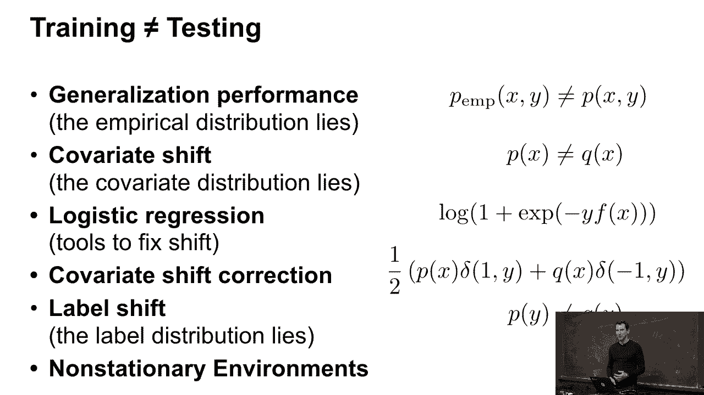
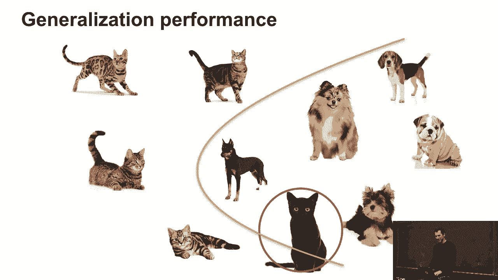
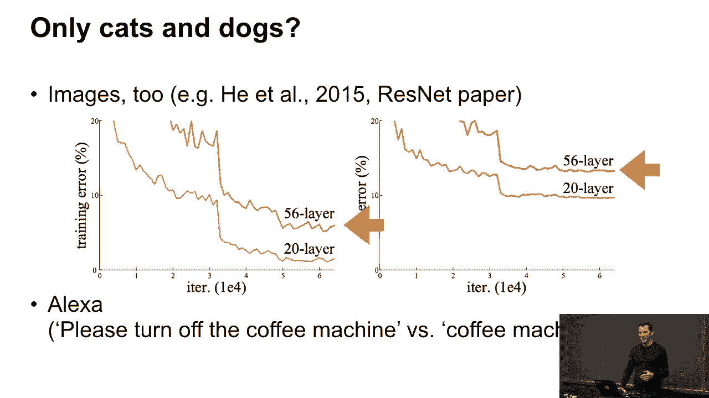
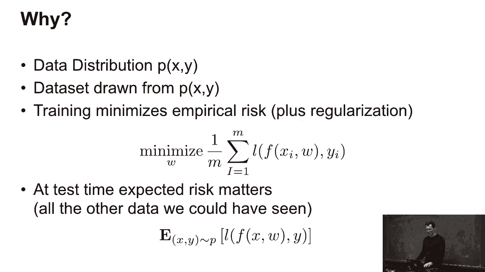
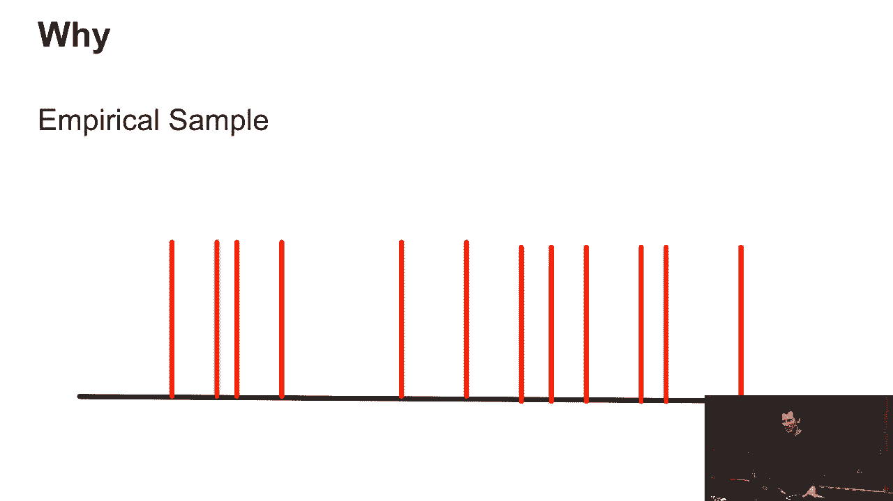
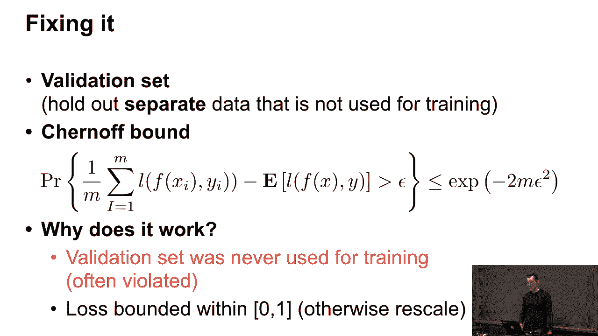
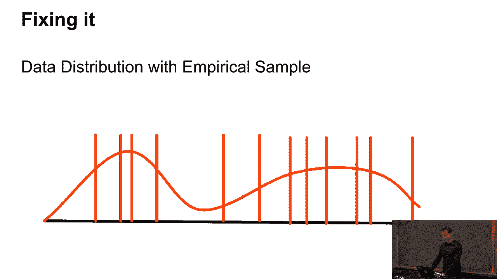
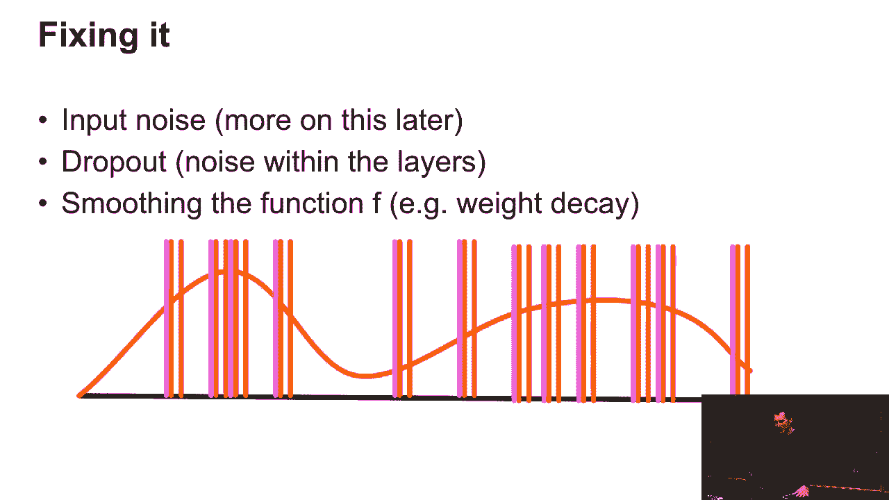

# 39：经验风险与期望风险 📊

在本节课中，我们将学习机器学习中一个核心概念：经验风险与期望风险。我们将探讨当训练数据与测试数据分布不一致时会发生什么，并介绍几种常见的分布偏移问题及其应对思路。

---

## 泛化性能概述 🎯

上一节我们介绍了机器学习的基本目标。本节中，我们来看看模型在训练集和测试集上表现不一致的问题，即泛化性能问题。

仅仅因为在训练集上表现良好，并不能保证在测试集上也会表现良好。

以下是泛化问题的常见表现：
*   训练误差通常低于测试误差。
*   对于更复杂的模型（如深层神经网络），这种差距可能更明显。
*   问题不仅存在于图像识别，也存在于自然语言处理等任务中。

---

## 经验风险与期望风险 📈

上一节我们了解了泛化问题的现象，本节中我们来深入其背后的数学概念：经验风险与期望风险。

我们有一个真实的数据分布 `p(x, y)`。在训练时，我们只能从一个数据集中采样，并最小化**经验风险**（Empirical Risk）：
`R_emp(f) = (1/m) * Σ_{i=1}^{m} L(f(x_i), y_i)`

然而，我们真正关心的是模型在未知数据上的表现，即**期望风险**（Expected Risk）：
`R_exp(f) = E_{(x,y) ~ p}[L(f(x), y)]`

我们的目标是使期望风险最小化，但我们只能通过优化经验风险来间接实现。

---

## 分布偏移问题 🔄

上一节我们定义了风险，本节中我们来看看导致期望风险与经验风险不一致的主要原因：数据分布偏移。

当训练数据分布 `p_train(x, y)` 与测试数据分布 `p_test(x, y)` 不同时，就会发生分布偏移。主要有以下几种类型：

以下是三种常见的分布偏移：
1.  **协变量偏移（Covariate Shift）**：输入特征 `x` 的分布发生变化（`p_train(x) ≠ p_test(x)`），但条件分布 `p(y|x)` 保持不变。例如，用白天照片训练的模型去识别夜间照片。
2.  **标签偏移（Label Shift）**：标签 `y` 的分布发生变化（`p_train(y) ≠ p_test(y)`），但条件分布 `p(x|y)` 保持不变。这是协变量偏移的一个特例。
3.  **非平稳环境（Nonstationary Environments）**：数据分布随时间或环境持续变化。例如，金融市场的预测模型或推荐系统。

---

## 应对策略与修正方法 🛠️

上一节我们识别了问题，本节中我们探讨一些应对分布偏移的思路和策略。

解决泛化问题的核心思路之一是提高模型的鲁棒性，使其对输入的小变化不敏感。

以下是两种常用的技术思路：
*   **添加噪声**：在训练时向输入数据或网络激活中添加随机噪声，这相当于一种正则化，可以迫使模型学习更稳健的特征。
*   **正则化**：通过显式的约束（如权重衰减）或隐式的方法（如Dropout）来限制模型复杂度，防止其过度拟合训练数据中的特定噪声。

对于已知的协变量偏移，存在一种数学修正方法。其核心思想是**重要性加权**：在计算经验风险时，为每个训练样本赋予一个权重 `β_i`，该权重正比于测试分布与训练分布在输入 `x_i` 处的密度比。
`β_i = p_test(x_i) / p_train(x_i)`
修正后的风险为：`R_weighted(f) = (1/m) * Σ_{i=1}^{m} β_i * L(f(x_i), y_i)`
实践中，难点在于估计密度比 `β_i`。

---

## 总结 📝

本节课中，我们一起学习了机器学习中的核心挑战——泛化问题。
*   我们明确了**经验风险**（在训练集上的平均损失）与**期望风险**（在真实数据分布上的预期损失）的区别。
*   我们探讨了导致两者差异的主要原因：**数据分布偏移**，包括协变量偏移、标签偏移和非平稳环境。
*   我们介绍了一些提高模型泛化能力的思路，如添加噪声和正则化。
*   最后，我们简要了解了针对协变量偏移的**重要性加权**修正方法。

理解这些概念对于在实践中构建稳健的机器学习系统至关重要。