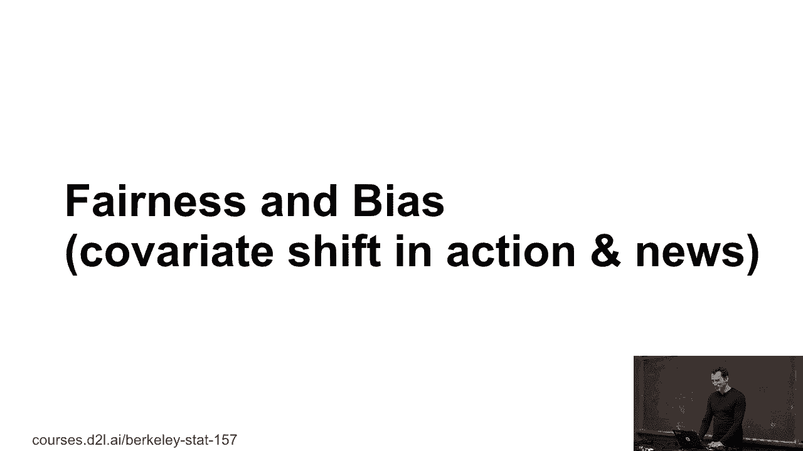
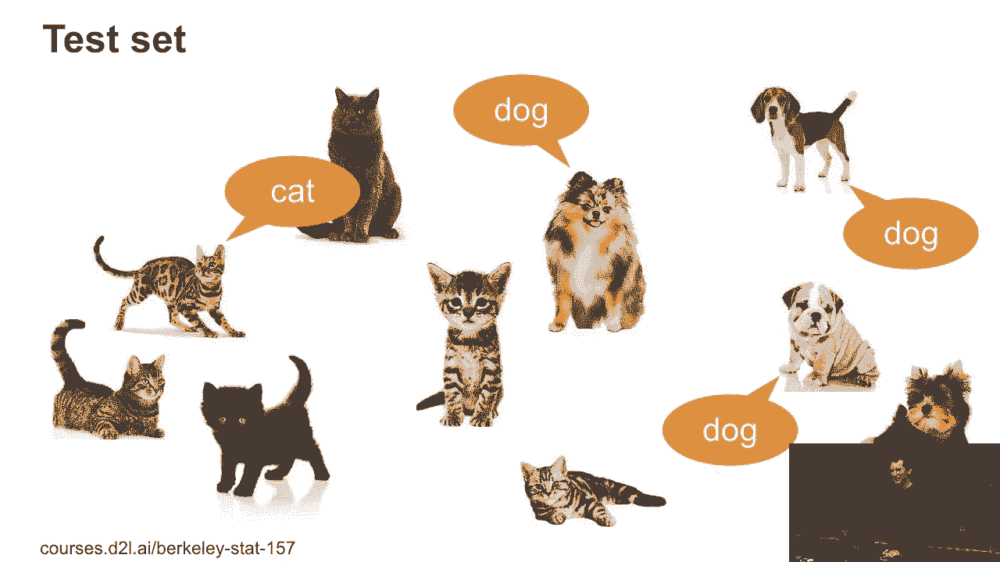
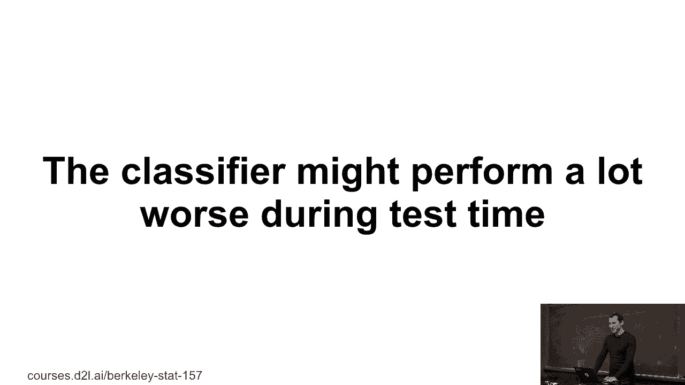
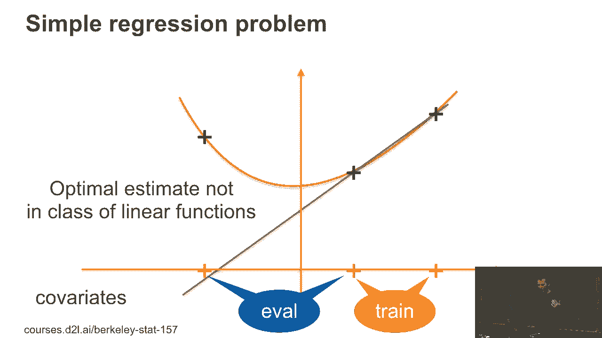
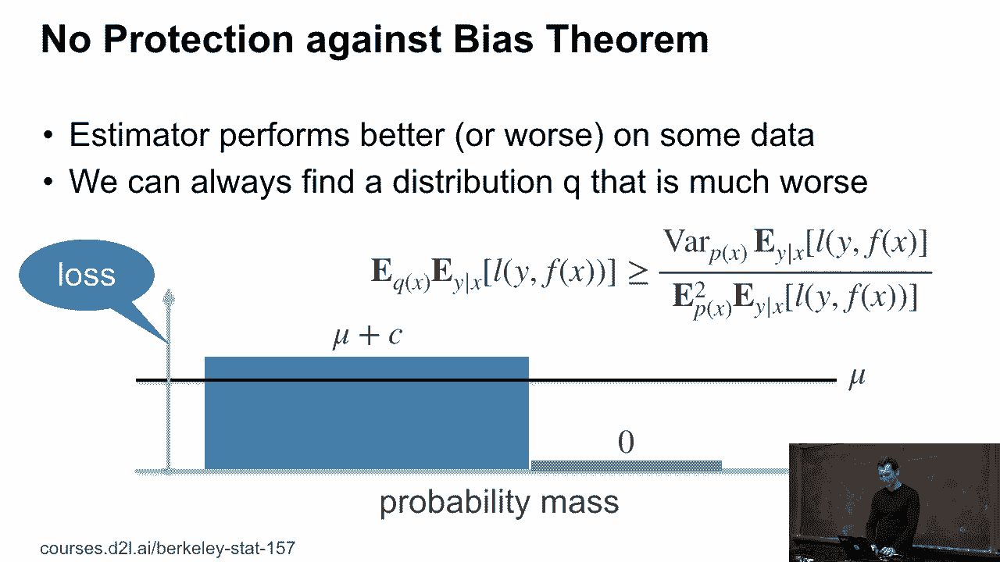
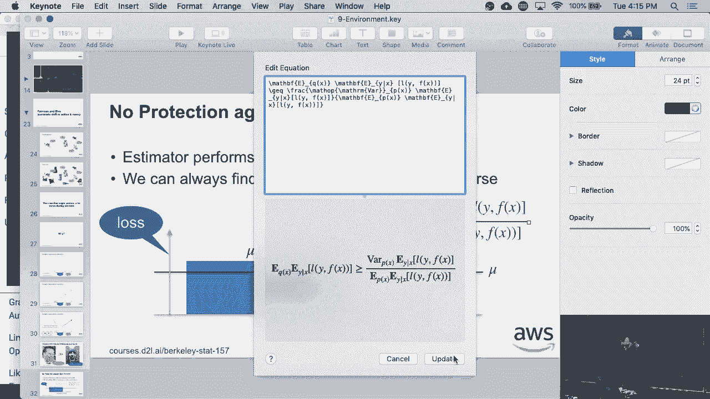
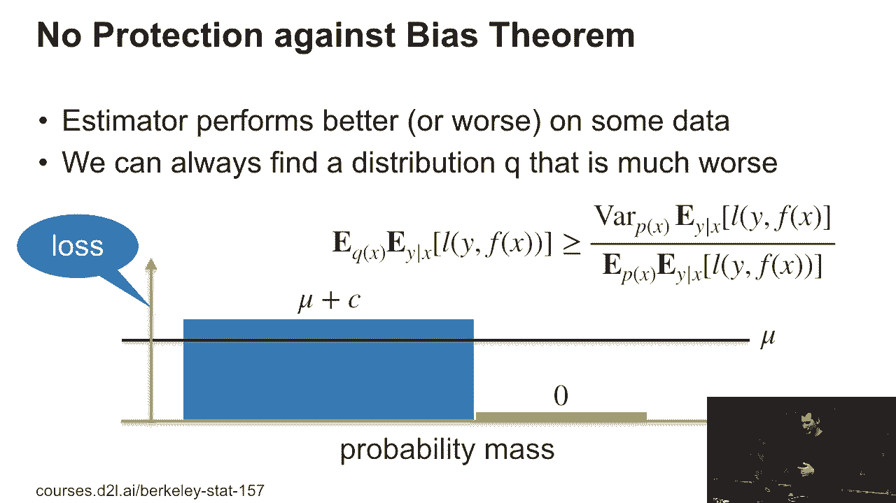
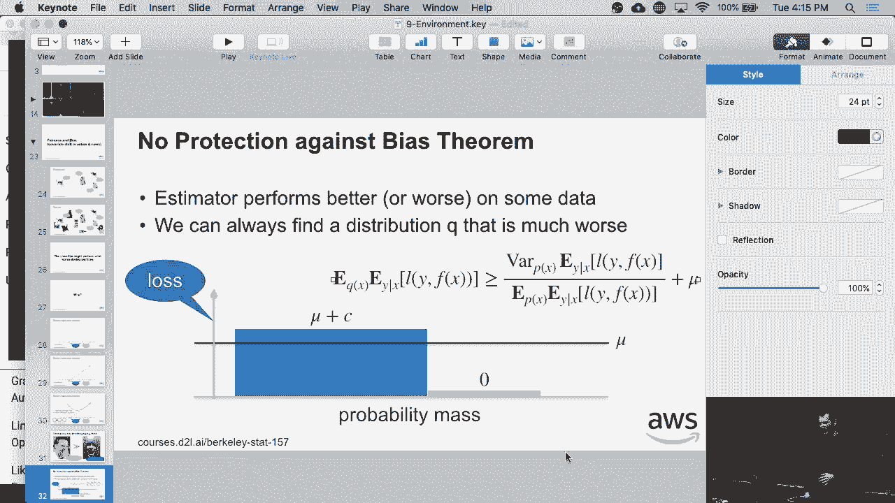
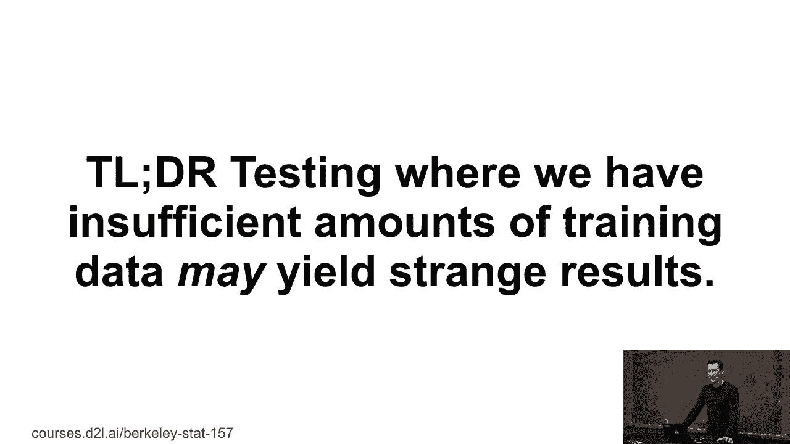

# 41：协变量偏移与偏差 🧠

在本节课中，我们将探讨机器学习模型在现实部署中可能遇到的“协变量偏移”问题，以及由此引发的性能偏差。我们将通过简单的例子和数学原理，理解为何模型在某些数据子集上表现会变差，并认识到这种偏差在数学上是难以完全避免的。

---

## 问题引入：训练集与测试集的差异

假设我们有一个用于区分猫和狗的图像分类器。我们的训练集数据分布如下：

然而，在真实部署（测试集）时，我们遇到的数据可能大不相同。测试集中可能包含更多灰色动物、更多猫，并且这些猫的外观也可能与训练时不同。

在这种情况下，我们不能期望系统表现良好。训练数据与测试数据分布的不匹配，是导致模型性能下降的一个核心原因。

上一节我们介绍了训练与测试数据分布不同这一现象，本节中我们来看看导致性能下降的具体数学原因。

---

## 性能下降的简单示例

性能变差至少有两个直观原因。我们通过一个简单的线性回归问题来说明。

**第一种情况：数据点位置变化**
假设我们有两种观测值。在训练时，数据点（用黑色十字表示）集中在某个区域，我们拟合出一条线性函数（实线），模型表现良好。

但在测试时，数据点的分布发生了偏移（例如，黑色十字出现在上方区域）。如果我们仍使用原模型（虚线），性能就会变差。理想情况下，我们应该根据测试分布重新训练，得到另一条实线。

**第二种情况：数据特征分布变化**
另一种常见情况是特征本身分布的变化。例如，训练数据集可能只包含在理想光照、角度下的“美丽”面孔（如来自IMDB数据库的明星头像）。

而在测试时，我们可能遇到光线较暗、角度不佳的普通面孔。这种协变量的偏移同样会导致模型性能显著下降。

---

## 数学原理：无偏差保护定理

现在，我们用一个简单的数学定理来量化这个问题，它被称为“无偏差保护定理”。

定理的核心思想是：如果一个估计器在平均性能上达到某个水平，但其性能在不同数据子集上存在波动（即方差），那么我们总能找到一个数据分布，使得模型在该分布上的性能比“方差除以均值”所度量的还要差。

以下是该关系的公式描述：

设模型在分布 `p` 上的期望损失（即平均性能）为 **μ**，其性能的方差为 **σ²**。
那么，总存在另一个数据分布 `q`，使得模型在 `q` 上的期望损失 **L_q** 满足：

**L_q ≥ μ + σ² / μ**

换句话说，**性能的方差（σ²）除以平均性能（μ）**，给出了模型性能可能变差程度的一个下界。只要模型性能存在波动，我们就无法保证它在所有可能的数据分布上都有好表现。

以下是可能使性能变差的数据分布示例：
*   包含更多黑猫或灰猫的图片。
*   包含更多高个子或矮个子的狗的图片。
*   包含特定人口统计特征的面孔。

---

## 现实意义与总结

本节课我们一起学习了协变量偏移如何导致模型性能偏差。

这个定理对机器学习实践有重要警示：当你部署一个机器学习产品时，如果发现它在某些用户群体或数据子集上表现远差于平均水平，这并不一定是编程错误或道德偏见，而可能是数据分布差异和模型性能方差的直接数学结果。

理解这一点至关重要，它意味着：
1.  收集具有广泛代表性的训练数据非常重要。
2.  监控模型在不同子群体上的性能是必要的。
3.  完全消除这种性能差异在数学上非常困难。

因此，作为工程师或研究者，我们需要管理好各方预期，并持续致力于改进模型的鲁棒性。