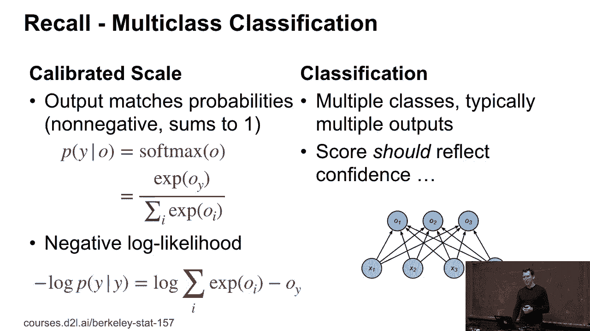
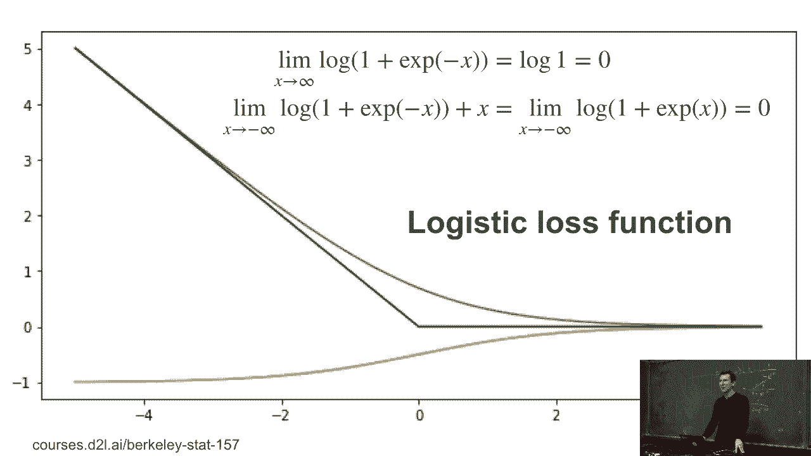
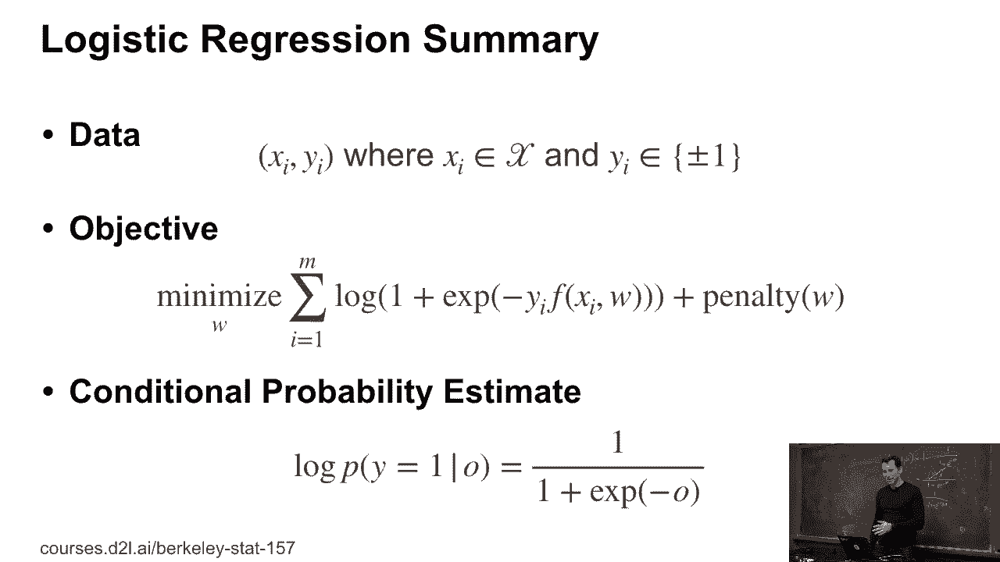
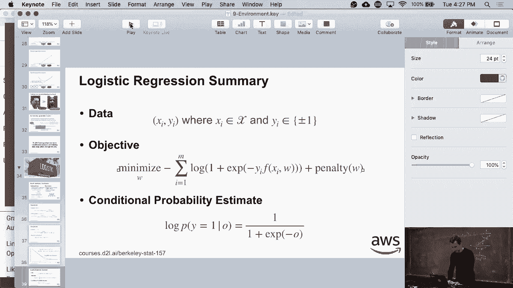
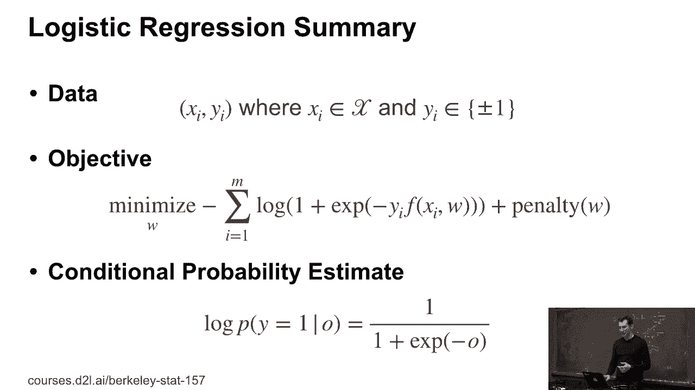

# 42：逻辑回归 🧠

在本节课中，我们将学习逻辑回归。逻辑回归是处理二分类问题的一种核心方法，它实际上是我们在多类分类中已接触过的 softmax 函数的一个特例。我们将从回顾多类分类开始，逐步推导出逻辑回归的公式，并理解其损失函数和概率输出的含义。

---

## 从多类分类到二分类 🔄

上一节我们介绍了多类分类。在多类分类中，我们使用 softmax 函数来获得经过校准的概率。对于一个输出向量 **O**，类别 **Y** 的概率为：

**P(Y | O) = e^{O_Y} / Σ_j e^{O_j}**

其对应的负对数似然损失函数形式为：

**L = -log(e^{O_Y} / Σ_j e^{O_j}) = log(Σ_j e^{O_j}) - O_Y**

本节中我们来看看，当类别减少到只有两个时，情况会如何简化。

---

## 逻辑回归的推导 📝

如果我们只有两个类别，例如类别 1 和类别 -1，softmax 函数会呈现出一种“加法不变性”。这意味着我们可以给所有输出加上一个常数 **C**，而概率保持不变。

**P(Y=1 | O) = e^{O_1} / (e^{O_1} + e^{O_{-1}})**

利用加法不变性，我们可以将其中一个输出设为 0 以简化计算。这里，我们选择将 **O_{-1}** 设为 0。

**P(Y=1 | O) = e^{O_1} / (1 + e^{O_1})**

对上式分子分母同时除以 **e^{O_1}**，我们得到：

**P(Y=1 | O) = 1 / (1 + e^{-O_1})**

这个函数就是逻辑函数（Logistic Function），也称为 Sigmoid 函数。现在，我们可以统一地表示两个类别的概率。对于任意类别标签 **Y**（取值为 1 或 -1），其概率可以写为：

**P(Y | O) = 1 / (1 + e^{-Y \* O})**

这个公式非常方便，因为它避免了使用条件判断语句，可以通过简单的乘法统一处理两个类别。

---

## 逻辑回归的损失函数与概率 📉

基于上述概率公式，我们可以定义逻辑回归的损失函数，即负对数似然。

**损失函数 L = -log(P(Y | O)) = log(1 + e^{-Y \* O})**

以下是关于损失函数和概率的几个关键点：

*   **损失函数形状**：该损失函数是一个平滑的凸函数，当预测正确且置信度高时（即 **Y \* O** 值很大），损失趋近于 0；当预测错误时（即 **Y \* O** 值为负），损失会线性增长。
*   **概率输出**：模型对于输入 **X** 预测为正类（Y=1）的概率，恰好就是 Sigmoid 函数的输出：
    **P(Y=1 | X) = 1 / (1 + e^{-O})**
    其中 **O** 是模型对样本 **X** 的原始输出（也称为 logit）。
*   **导数的巧合**：有趣的是，损失函数关于 **O** 的导数，其形式恰好等于 **-Y \* P(Y=-1 | O)**。这与概率模型属于指数族有关，背后有优美的数学原理。如果你对此感兴趣，可以选修相关的统计学课程。

---

## 损失函数的渐近线分析 📈

最后，我们来分析一下逻辑回归损失函数在极端情况下的行为，即计算其渐近线。

当 **X**（此处 **X** 对应 **Y \* O**）趋向于正无穷时，**e^{-X}** 趋近于 0。因此，损失函数 **log(1 + e^{-X})** 趋近于 **log(1) = 0**。

当 **X** 趋向于负无穷时，情况稍复杂一些。我们重写损失函数：
**L = log(1 + e^{-X}) = log(e^{-X} \* (e^{X} + 1)) = -X + log(1 + e^{X})**
当 **X → -∞** 时，**e^{X} → 0**，所以 **log(1 + e^{X}) → 0**。因此，损失函数渐近于 **-X**，即一条斜率为 -1 的直线。

这意味着，对于严重错误的预测，损失会线性增加，这为优化过程提供了明确的方向。

---

## 总结 🎯

本节课中我们一起学习了逻辑回归的核心内容。

1.  我们首先回顾了多类分类的 softmax 函数，并利用其加法不变性，推导出了二分类场景下的逻辑回归公式。
2.  我们得到了统一的概率表达式 **P(Y | O) = 1 / (1 + e^{-Y \* O})** 和对应的损失函数 **L = log(1 + e^{-Y \* O})**。
3.  我们分析了损失函数的性质，包括其与预测概率的关系，以及在预测完全正确或完全错误时的渐近行为。

逻辑回归是机器学习中一个基础且强大的模型，理解其数学本质对于后续学习更复杂的模型至关重要。