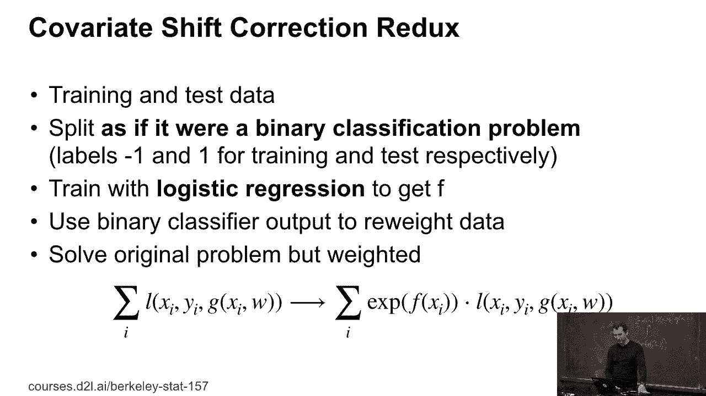

# 43：协变量偏移校正 🎯


在本节课中，我们将学习一种名为“协变量偏移校正”的技术。当训练数据和测试数据来自不同的分布时，这种技术可以帮助我们调整模型，使其在测试集上表现更好。我们将通过一个巧妙的分类器技巧来实现这一点，并讨论其潜在问题及解决方案。

---

## 回顾与引入

上一节我们介绍了倾向得分和密度比率的概念。如果已知两个分布密度之比 `α(x)`，我们就能利用复杂的统计工具轻松处理协变量偏移问题。

实际上，我们可以利用已构建的工具，例如逻辑回归，它既能用于协变量校正，也能解决实际的分类问题。接下来，我们将具体看看如何操作。

---

## 核心思想：使用分类器进行双样本检验

我们的核心思路是：将训练集和测试集的数据混合，并尝试训练一个分类器来区分它们。

以下是具体步骤：
1.  假设训练集和测试集大小相同。
2.  将训练集数据标记为类别 `1`，测试集数据标记为类别 `-1`。
3.  将两组数据合并为一个数据集。

现在，我们的目标是训练一个分类器，看它能否区分某个数据点来自训练集还是测试集。

其直觉在于：如果分类器无法区分，说明两组数据可能来自相同分布。如果能区分，则分类器给出的概率可以告诉我们某个观测值更可能来自哪个分布，我们可以利用这个信息来重新加权数据。

这个技巧在生成对抗网络（GAN）中也常被用作“双样本检验”。不过，我们这里的目的不是生成数据，而是**重新加权数据**，使一个数据集看起来像另一个数据集。

---

## 从分类概率到权重校正

接下来是精妙的部分。我们关注条件类别概率 `P(y=1|x)`。在等量混合了分布 `P`（训练）和 `Q`（测试）后，这个概率与密度比率 `α(x) = Q(x)/P(x)` 存在数学关系。

通过代数推导，我们可以得到以下关键公式：

**`α(x) = exp(f(x))`**

其中，`f(x)` 是我们训练的分类器输出的某个函数（例如，逻辑回归中 `logit` 函数的一部分）。

这意味着，我们无需走复杂的密度估计路线，只需调用任何能输出条件类别概率的现成分类器，就能直接得到一个协变量校正器。

总结一下流程：
1.  合并训练和测试数据，并赋予类别标签。
2.  训练一个二分类器。
3.  对于训练数据中的每个样本 `xi`，计算权重 `exp(f(xi))`。
4.  使用这些权重重新加权训练数据，然后再去解决我们原本的预测问题（如分类或回归）。

---

## 潜在问题与解决方案

上述方法有一个明显的问题：对函数 `f(x)` 取指数可能导致权重值过大或过小。

*   如果 `f(x)` 非常大，`exp(f(x))` 会给该样本赋予极高的权重。
*   如果 `f(x)` 非常小，`exp(f(x))` 会接近零，导致该样本几乎被丢弃。

这两种情况都可能使估计变得不稳定。

一种解决方案是对函数 `f(x)` 进行**裁剪（Clipping）**。例如，设定一个阈值 `c`，并执行以下操作：

```python
clipped_f = max(min(f(x), c), -c)
weight = exp(clipped_f)
```

这样可以将单个观测值的影响限制在一个可接受的范围内，确保不会完全丢弃数据，也不会让某个数据点主导整个过程。当然，这会引入一些偏差，但能显著降低方差。

此外，还有更复杂的方法，如 **W-Robos估计法**，它通过组合多种统计技术来稳健地纠正偏差。

---

## 总结



本节课我们一起学习了协变量偏移校正的实用方法。我们了解到，可以通过训练一个区分训练集和测试集的分类器，并利用其输出的概率来推导重新加权的权重 `exp(f(x))`。同时，我们也认识到直接取指数可能带来的数值不稳定问题，并介绍了裁剪等解决方案来保证估计的稳健性。这种方法巧妙地将分布对齐问题转化为了一个标准的分类任务，易于实现和应用。