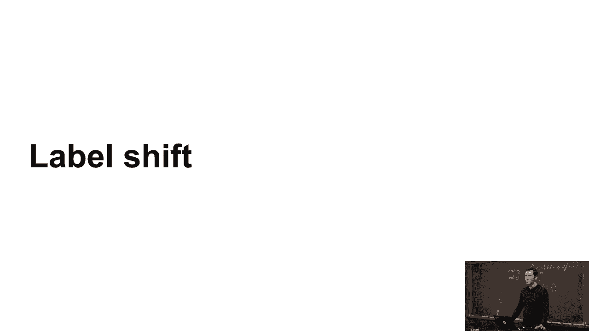
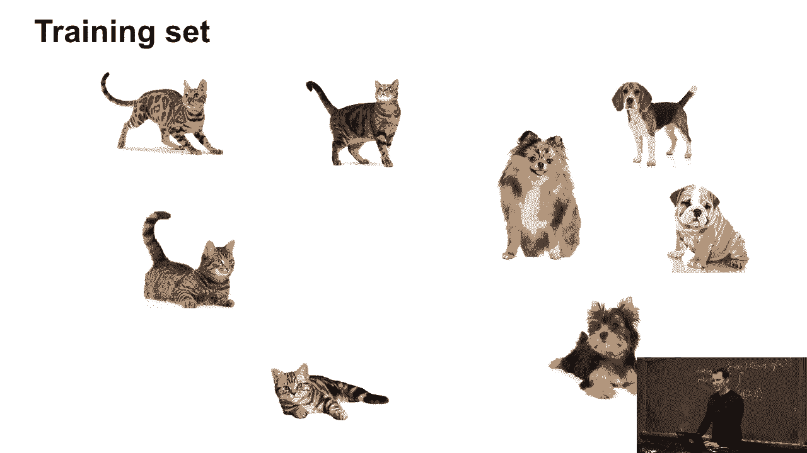
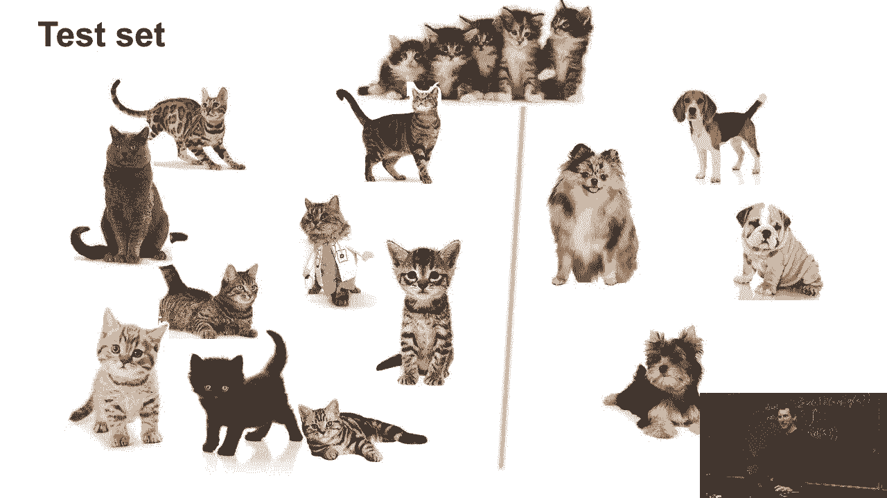
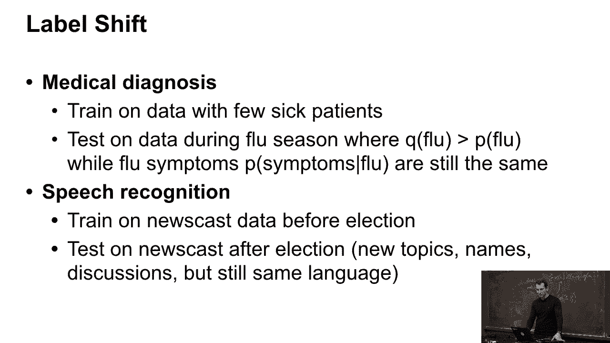
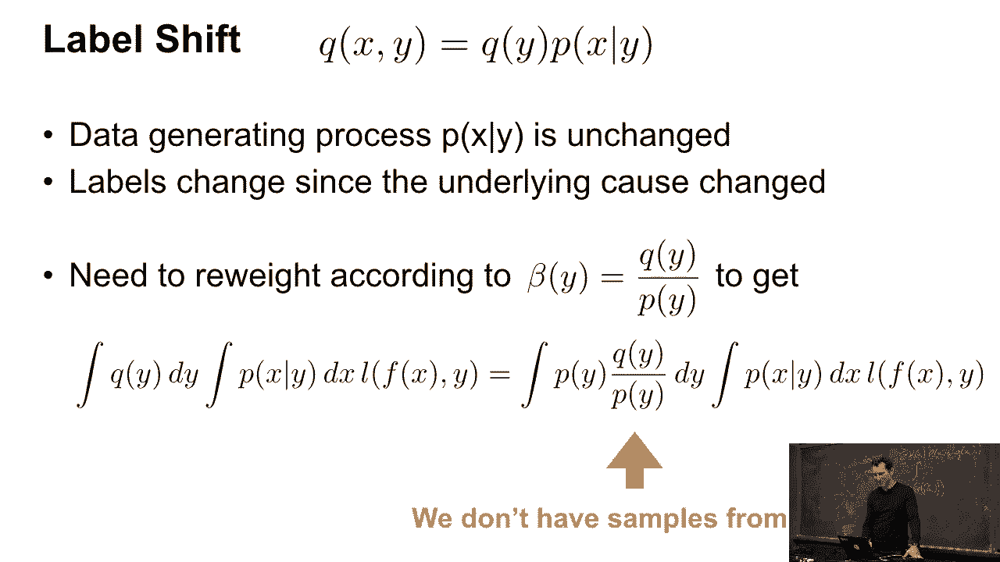
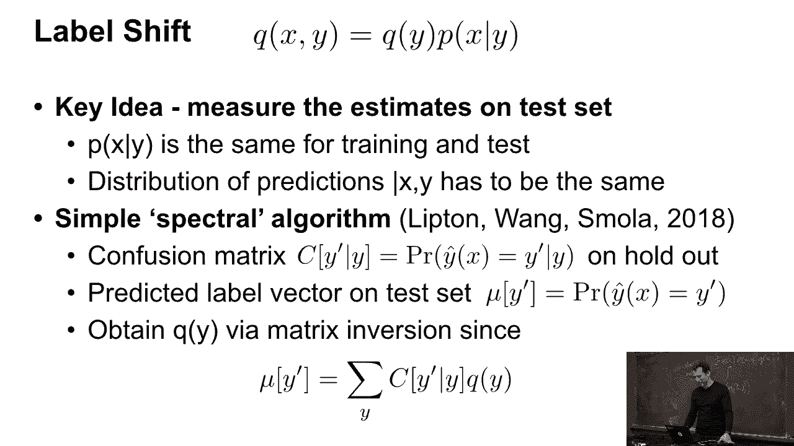
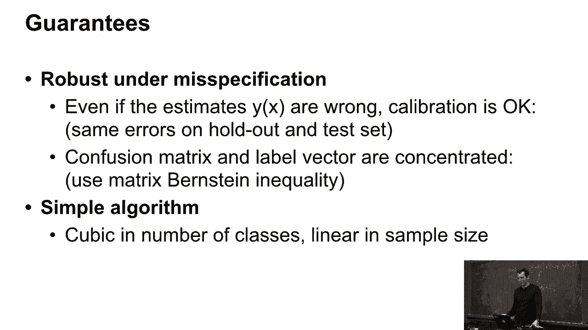
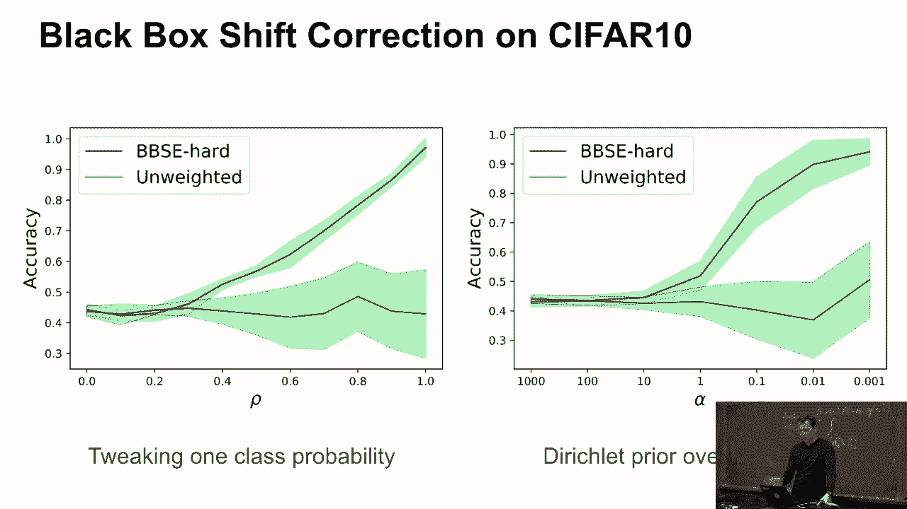
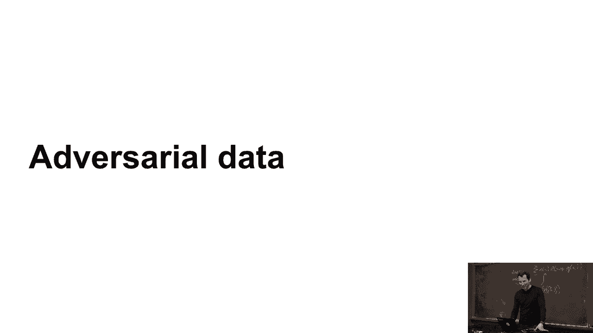

# 44：标签偏移 🏷️➡️📊

在本节课中，我们将要学习一种称为“标签偏移”的分布偏移问题。我们将了解它与之前讨论的协变量偏移有何不同，探索其常见的应用场景，并简要介绍其背后的数学原理和一种可能的解决方法。

## 概述

上一节我们介绍了协变量偏移，本节中我们来看看另一种分布偏移问题——标签偏移。标签偏移是协变量偏移的一种简化但常见的情况，其核心在于标签 `y` 的先验分布 `P(y)` 在训练集和测试集之间发生了变化，而条件分布 `P(x|y)` 保持不变。

## 什么是标签偏移？

假设这是我们的训练集，其中包含一定比例的病例（例如，生病的病人）和健康个体。

而我们的测试集看起来是这样的。结果发现，测试集中有更多的病例，而训练集中较少。这与简单的协变量偏移略有不同，而且实际上这种情况更为常见。

在数学上，标签偏移的假设是：
*   条件分布 `P_train(x|y) = P_test(x|y)` 保持不变。
*   标签的边缘分布发生了变化，即 `P_train(y) ≠ P_test(y)`。

## 为什么会出现标签偏移？

那么，为什么你会遇到这种情况呢？以下是几个常见的例子：

*   **医学诊断**：假设我使用一个医疗诊断工具，在训练时使用了50%生病和50%健康的病人数据。但在实际应用中，目标人群的疾病发病率可能远低于50%（例如，乳腺癌筛查）。模型需要根据实际发病率进行调整。
*   **季节性变化**：在流感季节，流感病例的比例会显著升高。一个在非流感季节训练的模型，其预测结果需要根据季节进行调整。
*   **语音识别**：假设我构建了一个语音识别器。训练时，人们讨论的话题和提及的人名是特定的。之后，如果出现了新的话题（如新的政治议题）或新流行的人物（名字奇怪的电影明星），虽然语言本身没变，但词汇的分布发生了变化，这本质上也是一种标签（输出内容）分布的变化。

## 标签偏移的数学表现与挑战

从数学上看，标签偏移的设置略有不同。

我们不再假设 `P(y|x)` 相同，而是假设 `P(x|y)` 相同，但 `P(y)` 从训练集的 `p(y)` 变成了测试集的 `q(y)`。这通常发生在 `y` 是 `x` 的因果因素时（例如，流感引起症状，而不是症状引起流感）。

与协变量偏移修正相比，处理标签偏移的一个主要挑战是：**我们可能没有测试集的真实标签**。因此，无法直接计算重要性权重 `β_i = P_test(x_i) / P_train(x_i)`。

## 一种解决方法：利用混淆矩阵

你可以做的是，你想要估算在测试集上的表现。事实证明，有一种方法可以处理。

其核心思想是假设模型的**错误混淆矩阵在训练集和测试集上保持不变**。虽然这是一个稍微高级的话题，但其背后的代数相当简单。

以下是基本的思路：
1.  在训练集上计算模型的混淆矩阵 `C`（例如，对于流感预测，矩阵包含真正例、假正例等）。
2.  在测试集上，运行模型得到预测标签的分布，记为向量 `μ`（例如，模型预测40%为流感，60%为健康）。
3.  假设测试集上真实的标签分布向量为 `ν`（未知），那么存在关系：`μ ≈ C * ν`。
4.  如果混淆矩阵 `C` 是可逆的，我们就可以估算出真实的测试集标签分布：`ν ≈ C^{-1} * μ`。

通过这种方式，我们可以推测出测试集上标签分布的变化，从而对模型进行修正。

## 总结

本节课中我们一起学习了标签偏移的概念。它描述了当标签 `P(y)` 的分布发生变化，而特征给定标签的条件分布 `P(x|y)` 保持不变时出现的问题。这与协变量偏移既相似又不同。

我们看到了它在医疗诊断、季节性预测和语音识别等领域的实际应用。最后，我们简要介绍了一种通过假设混淆矩阵不变来估计和修正标签偏移的方法。这提醒我们，在实际机器学习应用中，需要仔细考虑数据分布可能发生的各种偏移。

是的，当然你尝试了一下，它有效，反正就是这样。

没关系。

