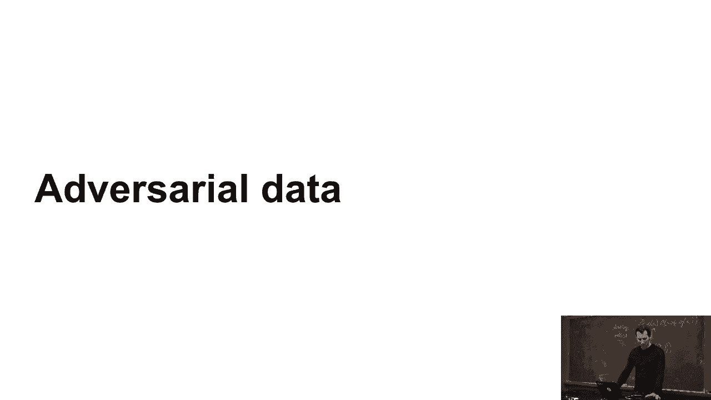
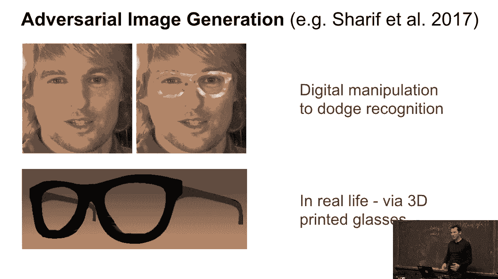
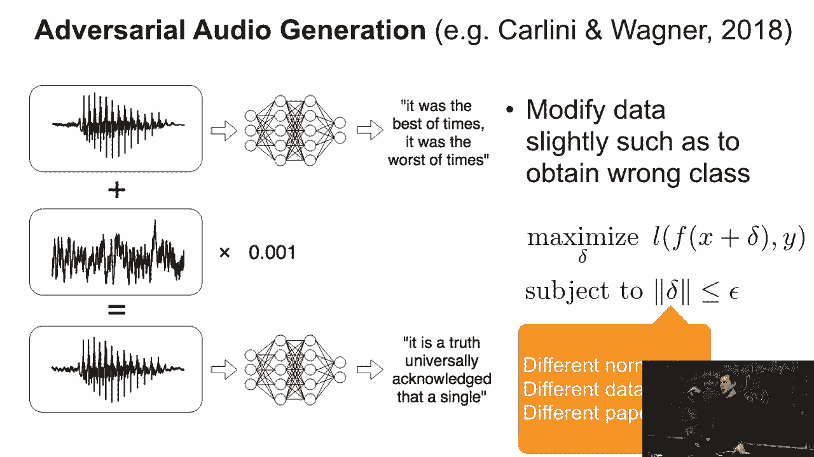
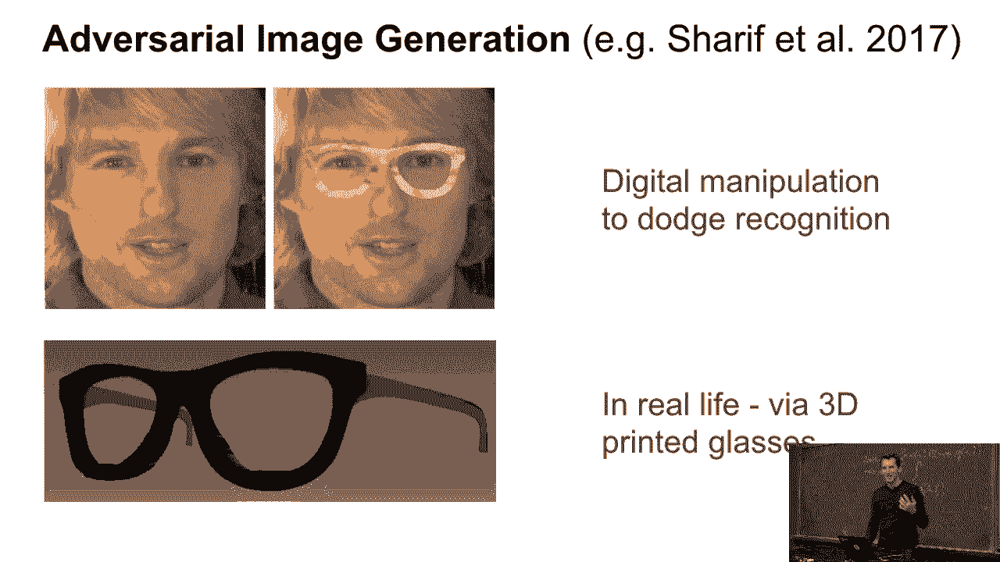
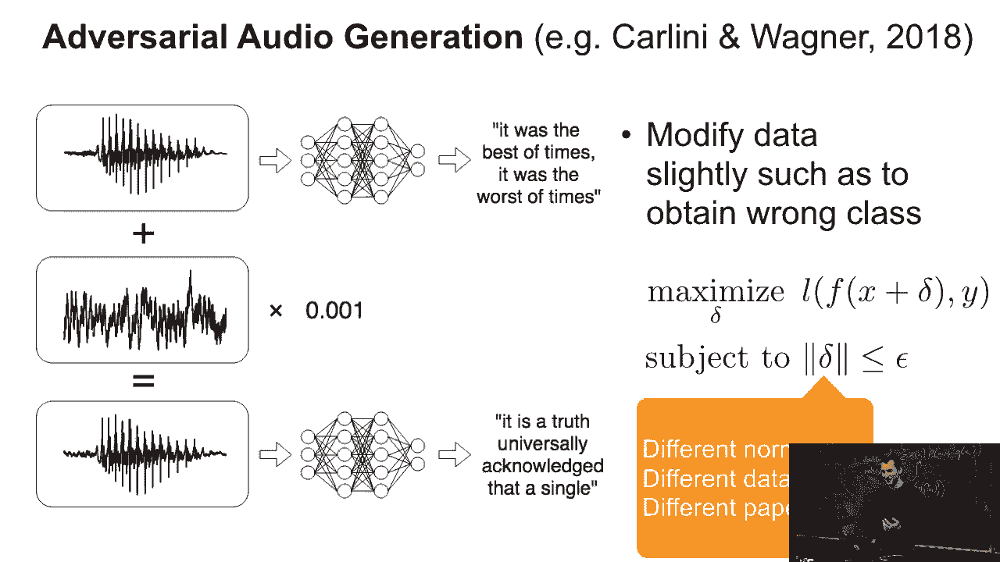
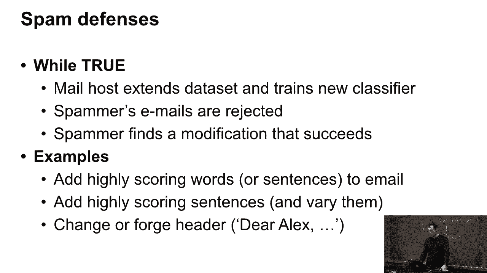
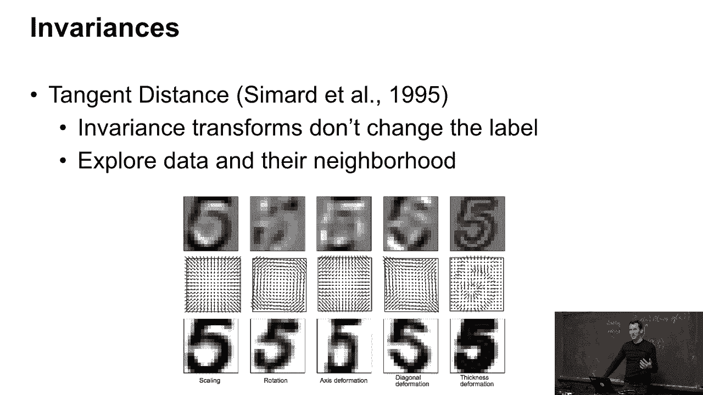
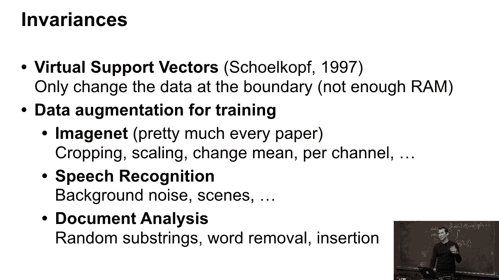
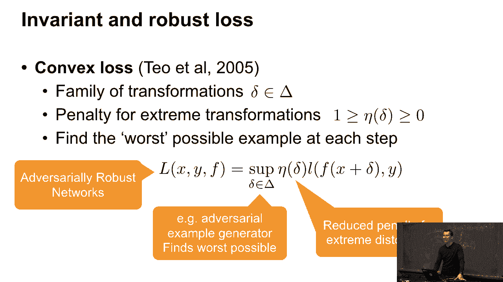

# 45：敌对数据 👁️‍🗨️



在本节课中，我们将要学习机器学习中的一个重要概念——**敌对数据**。我们将探讨它的定义、产生原因、实际案例以及如何通过数学和工程方法来应对它。

---

## 概述

敌对数据是指经过精心设计的、旨在欺骗机器学习模型的输入数据。这些数据对人眼来说可能看起来正常，却能导致模型做出错误的预测。理解敌对数据对于构建鲁棒的AI系统至关重要。

上一节我们介绍了模型评估，本节中我们来看看一种特殊的、可能影响模型性能的数据形式。

---

## 什么是敌对数据？🤔

假设我们构建了一个名人识别系统。系统可以顺利识别出Jeff（亚马逊创始人）和他右边的人——AWS的CEO Andy Jassy。这看起来工作良好。



但问题在于，如何让系统无法识别出特定人物（例如Jeff）？这就引出了对抗性攻击的概念。

一篇2017年的论文展示了一个实验：研究人员在一张人像照片上进行了数字处理，给人物戴上了一副造型夸张的眼镜（类似电影《王牌大贱谍》的风格）。他们甚至3D打印了这副眼镜。

结果是，这副眼镜成功地欺骗了人脸识别系统，使其无法正确识别佩戴者。尽管对人眼而言，这仍然是同一个人，但模型却被“愚弄”了。这种现象既令人担忧，也引人深思。


---

## 敌对数据的其他案例 🎤



敌对数据不仅限于图像领域。去年（指课程录制时的去年）伯克利的一篇论文在音频上做了类似实验。

研究人员选取了一段朗读狄更斯小说《双城记》开篇“这是最好的时代，也是最坏的时代……”的音频。他们向这段音频中添加了微小的、人耳难以察觉的噪声。



结果，语音识别系统将这段音频完全错误地转译成了其他文本（例如“来自言语识别器的宪法”）。而人类听众甚至无法察觉到音频被改动过。

这个实验的核心方法是：**尝试对输入数据做一个微小的改动，以最大化模型的损失**。




---

## 为什么敌对数据会生效？🔍

以下是敌对数据能够生效的几个关键原因：

1.  **训练数据分布有限**：模型在训练时只接触过相对较小、较“自然”的输入数据子集。敌对数据则轻微偏离了这个数据分布的支持集。
2.  **模型未见过“怪异”数据**：像那副夸张的眼镜，现实中几乎不会有人佩戴，因此人脸识别系统从未针对此类数据进行训练。
3.  **人类与模型感知差异**：对于不自然的数据，人类和模型的判断可能截然不同。例如，看到一个圆圈左边的生物，人类可能会联想到“猫医生”这样的虚构角色，而不一定直接判断为“猫”。模型则可能因此做出意外反应。

几年前，关于“对抗性数据生成将摧毁机器学习”的讨论甚嚣尘上。但这并非全新问题。


---

## 历史渊源：垃圾邮件过滤 📧

对抗性数据几乎从机器学习应用之初就已存在，一个典型的例子是**垃圾邮件过滤**。

垃圾邮件发送者为了绕过过滤器，会不断修改邮件内容。例如，一封关于“尼日利亚王子”的诈骗邮件，发送者会在其中添加或替换一些词语，使邮件对人类读者而言仍然可读（内容核心不变），但却能逃过基于关键词或模式的垃圾邮件过滤器。

他们可能会插入一些高频但无关的词汇，或者使用特殊的句式。例如，将称呼改为“亲爱的Alex”，如果收件人正好是Alex，这封邮件就更可能通过基于社交关系的过滤器。

因此，对抗性攻击在文本领域早已存在。当它被应用于图像、音频等更直观的领域时，才因其视觉冲击力而受到广泛关注。

---

## 应对之道：利用不变性增强鲁棒性 🛡️

既然敌对数据利用了模型对某些变换的敏感性，那么一个直接的应对思路就是让模型学会**不变性**——即对某些不影响本质的变换不敏感。

一个早期的经典例子是1995年AT&T实验室关于手写数字识别的研究（切平面距离法）。他们系统地研究了数字图像的各种变换：



以下是他们考虑的不变性类型：
*   **缩放**：将数字变大或变小。
*   **旋转**：旋转数字的角度。
*   **形变**：沿轴线扭曲或挤压数字形状。
*   **笔画粗细变化**：改变数字笔画的粗细。

他们通过计算数字在这些变换构成的“切平面”内的距离来判断相似性。如果两个数字在这个平面内距离很近，就可以被认为是同一个数字（例如，都是“5”）。这实质上是**通过数据增强来提升模型鲁棒性**。


如今，数据增强已成为标准实践：
*   **图像分类**：在训练时随机裁剪、旋转、调整亮度对比度。
*   **语音识别**：添加背景噪音、改变语速、音调。
*   **文本分析**：随机删除或替换单词，使用同义词。

甚至早期的“虚拟支持向量机”概念，部分也是因为当时计算机内存有限，无法存储所有数据，而采用的一种独特的数据增强方式。

---

## 背后的数学模型 🧮

对抗性训练可以从一个**极小极大化**的游戏角度来形式化理解。



我们不仅希望在原始数据 `(x, y)` 上损失小，还希望在其扰动版本 `(x + δ, y)` 上损失也小。其中 `δ` 是一个小的扰动。

对抗性训练的目标可以表述为以下公式：

```
min_θ [ max_δ∈Δ L(f_θ(x + δ), y) + penalty(δ) ]
```

**公式解读**：
*   `L` 是损失函数。
*   `f_θ` 是我们的模型，参数为 `θ`。
*   `δ` 是添加到输入 `x` 上的扰动，通常被限制在一个小范围 `Δ` 内（例如，像素值变化很小）。
*   `penalty(δ)` 是对扰动大小的惩罚项，确保扰动不会太大。
*   **内层 `max`**：对手（攻击者）试图找到一个扰动 `δ`，使得模型在当前参数下的损失 **最大**。
*   **外层 `min`**：我们（防御者）则调整模型参数 `θ`，以最小化这个 **最坏情况下的损失**。



这个过程本质上是在训练一个能够抵抗最坏情况扰动的鲁棒模型。这套框架在1995年就被明确提出，构成了对抗性数据生成和防御的理论基础。


---

## 总结

本节课中我们一起学习了**敌对数据**的核心内容：

1.  **定义**：敌对数据是人为设计的、能导致机器学习模型出错的微小扰动数据。
2.  **普遍性**：它并非新问题，在垃圾邮件过滤等历史应用中早已存在。
3.  **成因**：主要源于模型训练数据分布的有限性，以及其对人类不易察觉的变换的敏感性。
4.  **防御策略**：核心思想是**提升模型鲁棒性**，主要方法包括**数据增强**（让模型见识更多变换）和**对抗性训练**（通过数学框架主动训练模型抵抗攻击）。



理解敌对数据有助于我们认识到机器学习模型的局限性，并指导我们设计出更安全、更可靠的AI系统。


