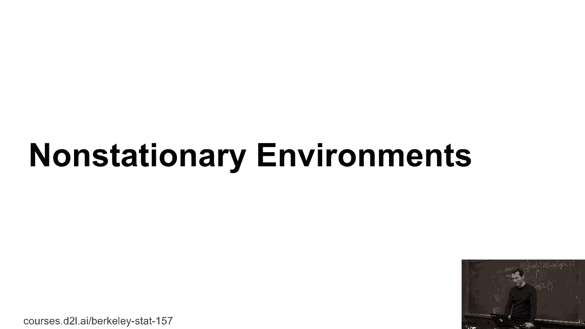
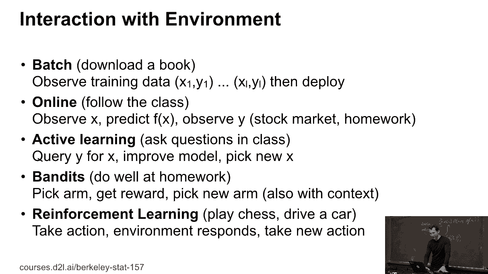
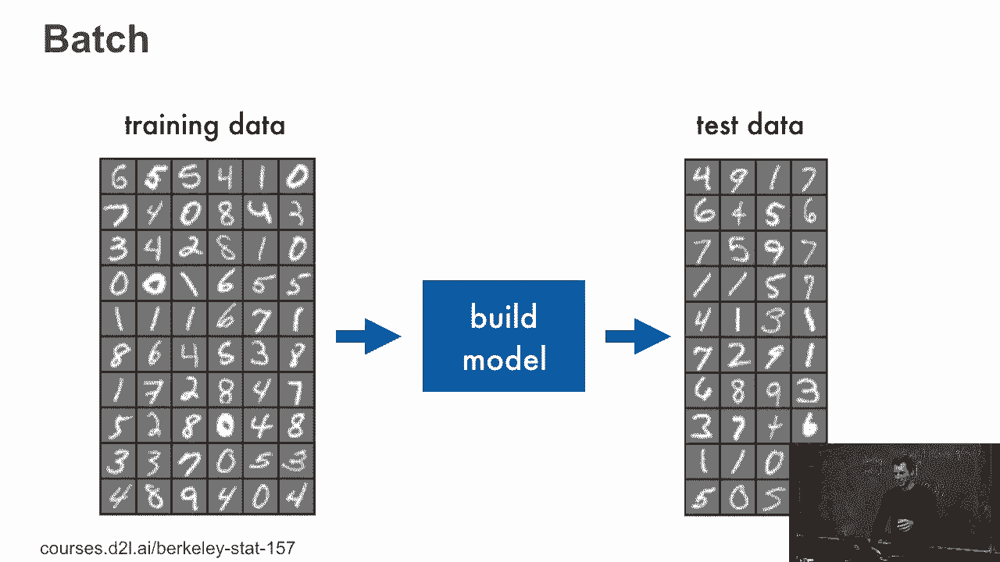
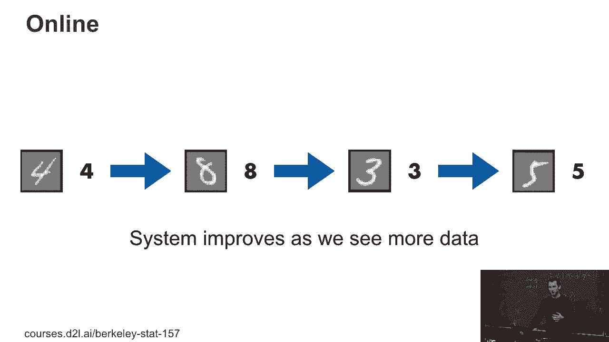
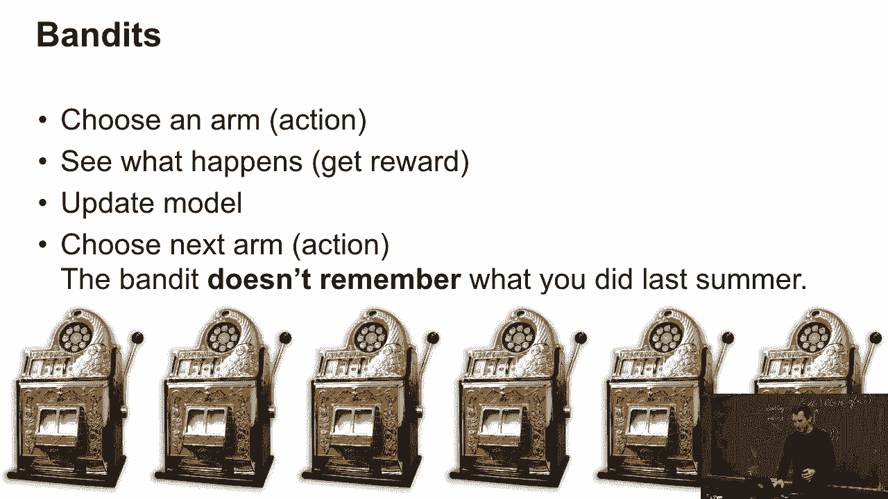
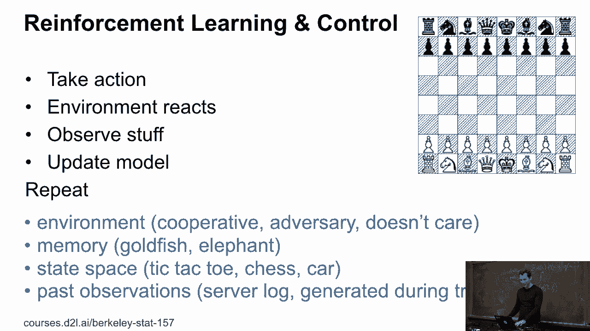
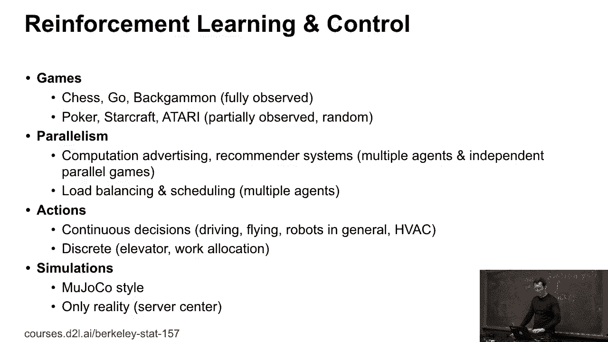
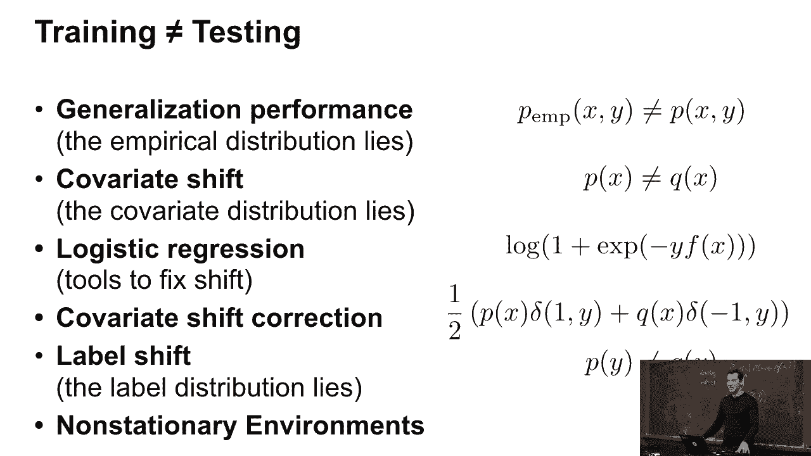

# 46：非平稳环境 🚀

在本节课中，我们将要学习机器学习系统在现实世界中部署时，所面临的各种“非平稳环境”。我们将探讨不同的交互模式，理解每种模式的特点和挑战，为将来构建更健壮的机器学习应用打下基础。

---

## 机器学习系统的交互模式

上一节我们讨论了模型训练与测试的差异，本节中我们来看看模型部署后与环境的几种主要交互方式。

以下是几种常见的交互模式：

*   **批处理**：我们目前最熟悉的方式。使用一批固定数据进行训练，生成一个分类器，然后直接部署。
*   **在线学习**：模型在收到新数据、做出预测并观察到真实标签后，立即进行更新。这个过程持续进行。
*   **主动学习**：模型可以主动提出查询（例如，请求特定数据的标签），以加速学习过程。
*   **多臂老虎机问题**：模型需要在“探索”（尝试新选项）和“利用”（选择当前最佳选项）之间做出权衡。
*   **强化学习**：最复杂的模式，模型的行为会直接影响后续的环境状态和反馈。

---

## 批处理与在线学习

在批处理设置中，流程是线性的：**训练数据 -> 构建模型 -> 在测试数据上评估 -> 部署**。

然而，在线学习是更常见于现实世界部署的场景。例如，一个广告系统需要不断根据用户点击反馈来更新模型，以最大化收入。其核心流程是一个循环：**观察输入 -> 模型预测 -> 获得真实标签 -> 更新模型**。

---

## 从老虎机问题到强化学习

多臂老虎机问题是一个经典的探索与利用问题。模型选择不同的“臂”（选项），获得奖励，并据此更新对每个臂价值的估计。其特点是环境本身没有“记忆”，你的选择不会改变老虎机内部的概率分布。

当环境具有状态，并且你的行为会改变后续状态时，问题就演变为强化学习。例如，下棋、控制机器人或管理数据中心。强化学习的环境可以是合作的、敌对的或中立的。

强化学习系统需要考虑：
*   **状态空间**：简单或复杂。
*   **记忆**：短期或长期。
*   **数据可用性**：是否有大量历史数据（离线策略学习），还是主要依赖实时交互（在线策略学习）。
*   **动作空间**：离散的（如移动棋子）或连续的（如控制机器人关节角度）。

> **注意**：在模拟环境（如游戏）中失败可以轻松重启，但在现实世界系统（如控制服务器冷却）中失败可能导致严重后果。这是理论与应用的关键区别。

---

## 总结与展望

本节课中我们一起学习了机器学习在非平稳环境下面临的挑战。我们介绍了从简单的批处理、在线学习，到更复杂的主动学习、老虎机问题，直至最具综合性的强化学习等多种交互模式。

我希望大家能认识到，模型的训练环境和真实的测试/部署环境是截然不同的。虽然我们有一系列工具（如正则化、验证集）来缓解这个问题，但无法完全根除。理解这些环境差异及其数学基础，能帮助我们在未来更好地设计、部署和维护机器学习系统，并理解其可能存在的局限性。

---
**课程总结**：我们探讨了机器学习系统与动态环境交互的五种主要模式，理解了从静态批处理到具有状态和记忆的强化学习的演进，强调了理论模型与真实世界部署之间的重要差异。