# 47：深度学习框架入门 🚀

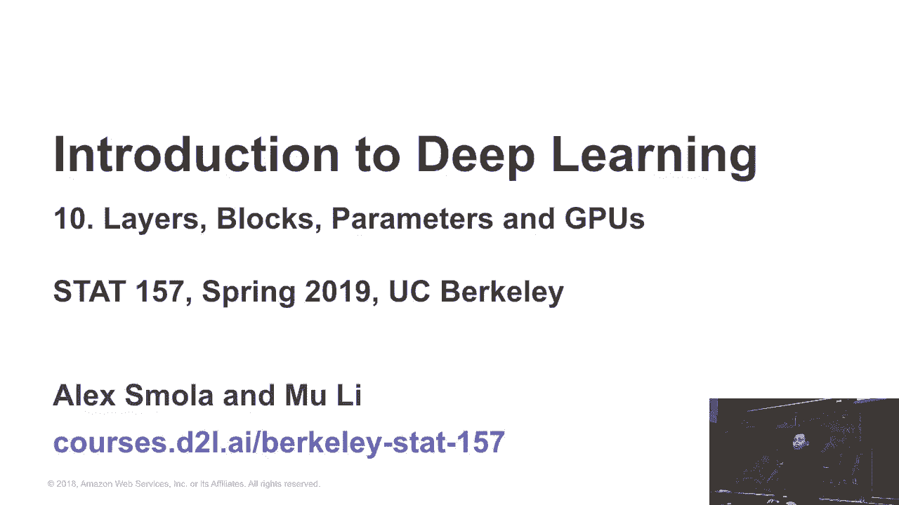

在本节课中，我们将学习深度学习框架的发展历程、主要框架的特点以及如何开始使用Gluon框架。我们将从历史背景入手，逐步了解不同框架的设计哲学，并最终聚焦于课程所使用的MXNet及其Gluon接口。

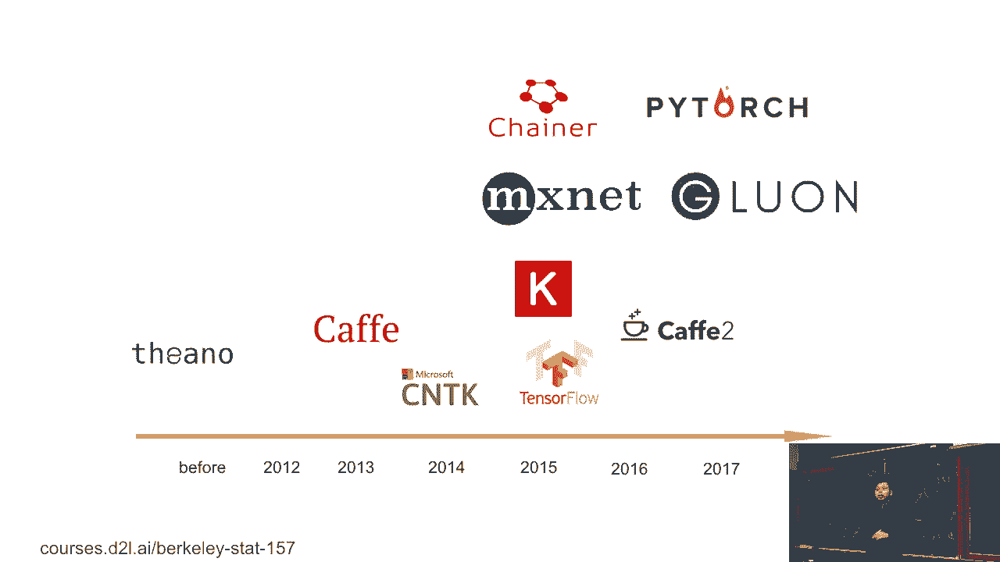

---

## 框架发展历程 📈

上一节我们介绍了硬件基础，本节中我们来看看深度学习的前端框架是如何演变的。

下图展示了深度学习框架随时间发展的概况。横轴代表年份，可以看到不同框架的兴起与更迭。

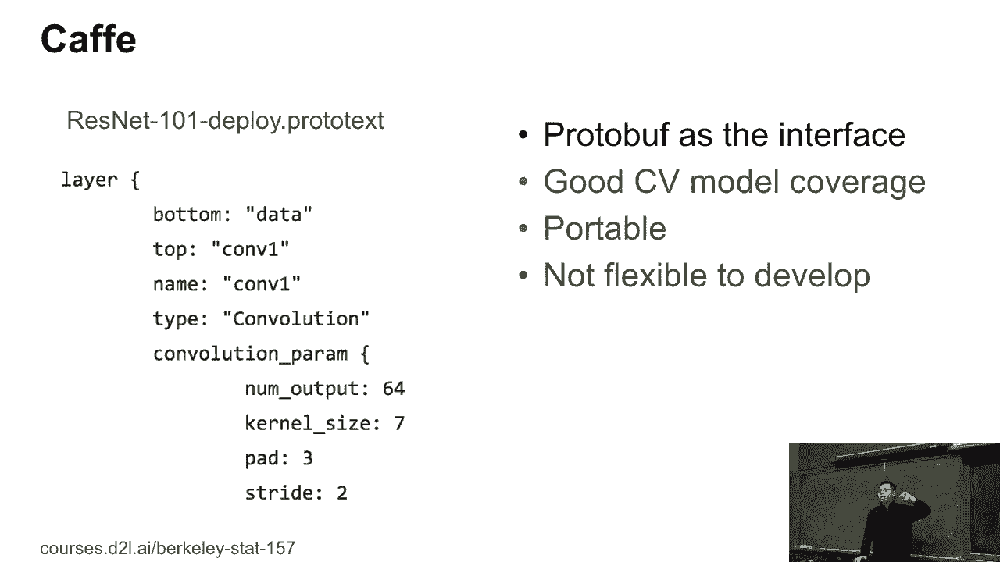


大约三年前，有四个主要的框架并存。我们可以简要回顾每个框架的核心设计决策。

## 主要框架介绍 🔍

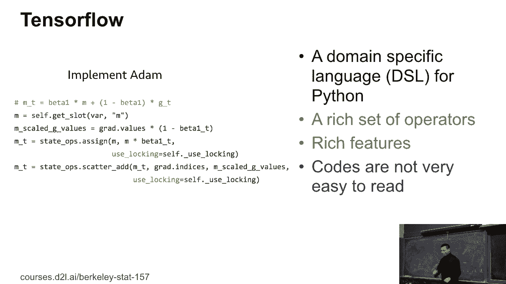

以下是几个具有代表性的深度学习框架及其特点。

### Caffe ☕

Caffe源自伯克利，大约四年前是计算机视觉领域最流行的框架。

它的程序接口基于协议缓冲区（Protocol Buffers）。用户通过编写文本文件来描述网络结构。例如，以下是ResNet-101网络的一部分定义：

```
layer {
  name: "conv1"
  type: "Convolution"
  bottom: "data"
  top: "conv1"
  convolution_param {
    num_output: 64
    kernel_size: 7
    stride: 2
    pad: 3
  }
}
```

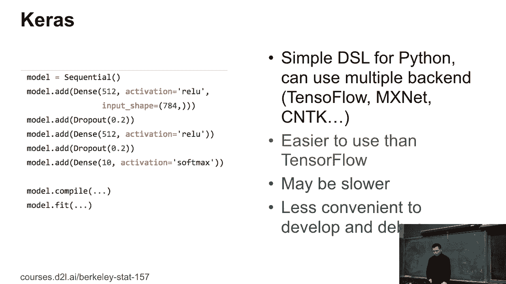

Caffe拥有出色的计算机视觉算子覆盖，并且易于移植，通常打包为单一二进制文件。然而，它在Python级别的交互式编程上不够灵活，且网络定义文件可能非常冗长（例如，一个四层网络的定义可能长达四千行）。

### TensorFlow 🔧

TensorFlow是目前最流行的深度学习框架之一。它提供了一种用于Python的领域特定语言（DSL）。

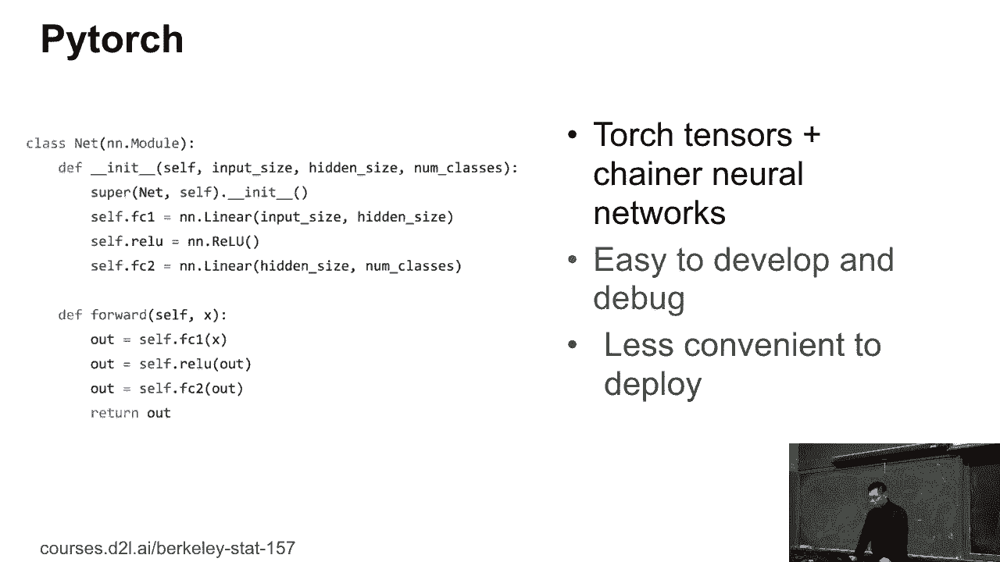

TensorFlow功能强大，包含成千上万的运算符，涵盖训练、部署等各个方面。但其代码风格对Python用户而言可能较难理解。例如，以下代码中的 `state_ops` 赋值操作可能让初学者困惑：

```python
import tensorflow as tf
x = tf.placeholder(tf.float32, shape=(None, 784))
W = tf.Variable(tf.zeros([784, 10]))
b = tf.Variable(tf.zeros([10]))
y = tf.nn.softmax(tf.matmul(x, W) + b)
```

### Keras 🧠

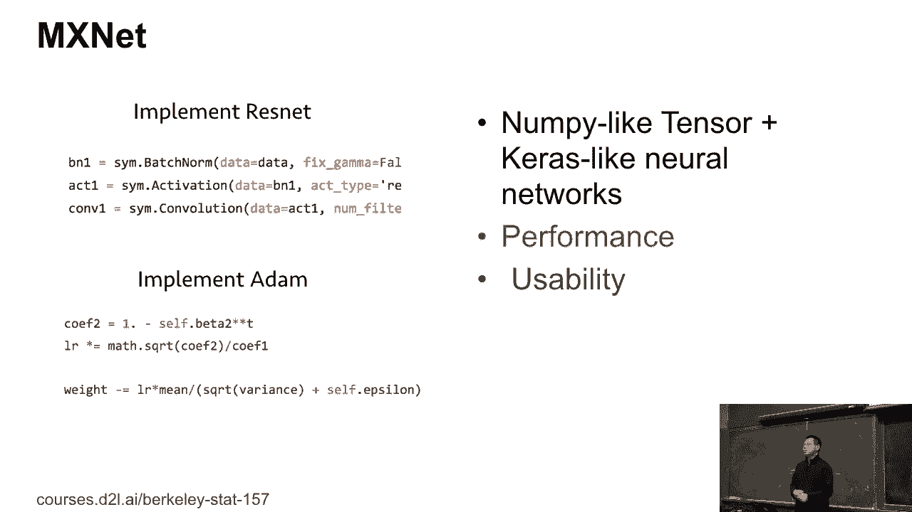

Keras是一个高层神经网络API，旨在简化开发过程。它的设计理念与我们将要学习的Gluon非常相似。

以下是如何使用Keras定义一个多层感知机（MLP）：

```python
from keras.models import Sequential
from keras.layers import Dense

model = Sequential()
model.add(Dense(units=64, activation='relu', input_dim=100))
model.add(Dense(units=10, activation='softmax'))
```

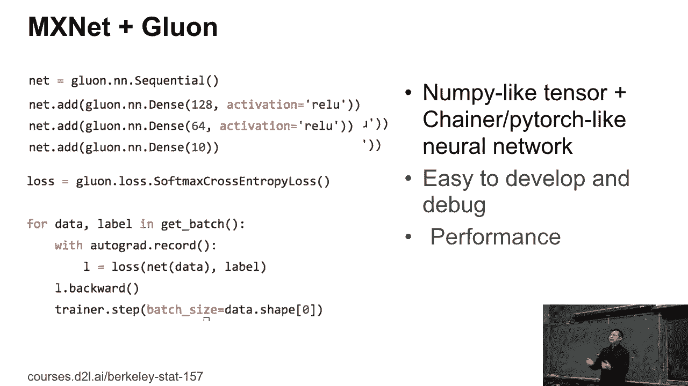

Keras可以使用不同的后端（如TensorFlow、Theano、CNTK），这使得它比直接使用TensorFlow更简单，但有时会因前端开销而稍慢。它采用符号式编程，在获取中间结果进行交互式调试时可能不太方便。

### PyTorch 🔥

PyTorch融合了Torch的Tensor接口和Chainer的自动求导接口。它完全基于Python，因此代码非常易于阅读和理解。

对于Python用户来说，PyTorch代码直观明了。然而，这种与Python的紧密集成在工业部署（尤其是需要与Java等语言集成或在移动设备上运行）时可能带来挑战。尽管如此，其易用性使其在研究领域越来越流行。

## MXNet与Gluon框架 🎯

本课程基于MXNet框架。原始的MXNet包含一个强大的张量计算库NDArray，以及一个符号式编程的神经网络模块。

MXNet最初的设计优先考虑性能，因此在一定程度上牺牲了易用性。当时社区规模较小，用户多为专家，对易用性要求不高。

随着社区发展，像PyTorch这样易用性极高的框架出现后，MXNet团队推出了Gluon接口。Gluon的设计理念与PyTorch类似，旨在使神经网络的开发和调试变得更加容易。

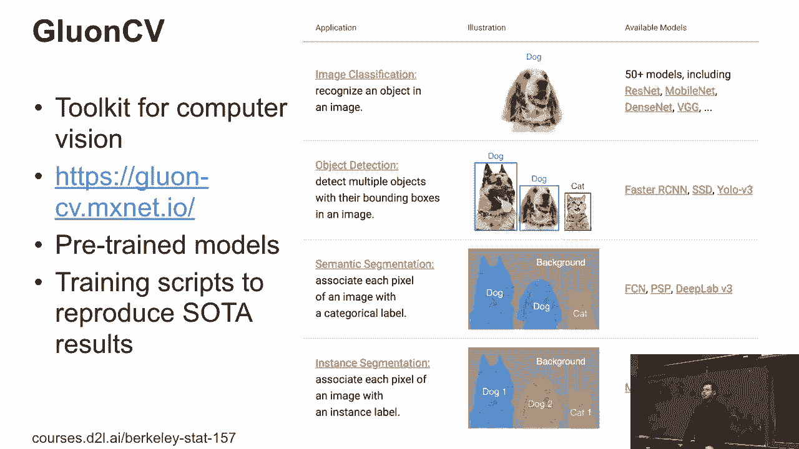

以下是一个使用Gluon定义网络的简单示例：

```python
from mxnet.gluon import nn
net = nn.Sequential()
net.add(nn.Dense(256, activation='relu'),
        nn.Dense(10))
```

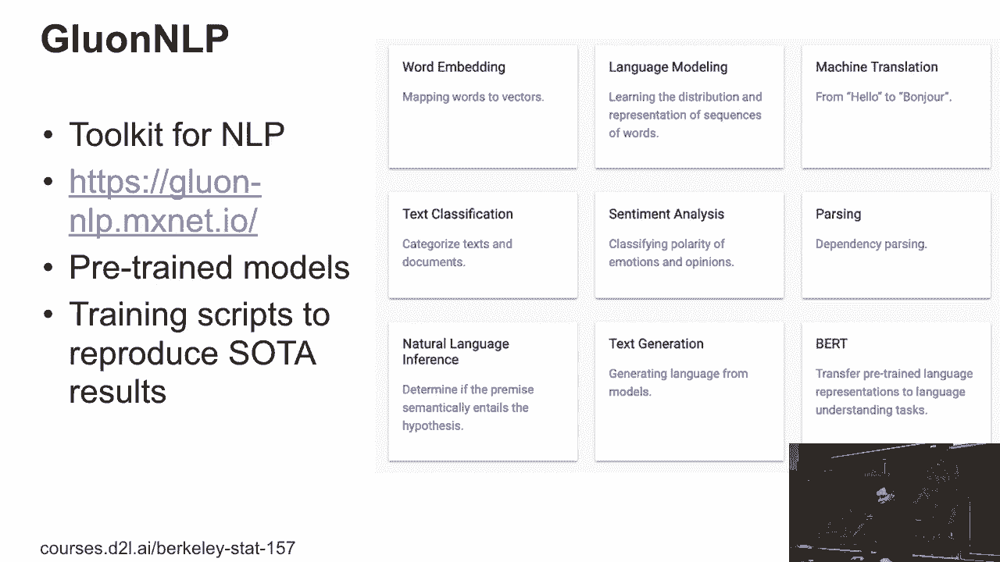

Gluon的交互式体验很好，虽然相比纯符号式接口可能损失一点性能，但在大多数应用场景下（除非处理海量数据，如自动驾驶的4K视频流），这并不是问题。对于课程作业而言，完全无需担心。

## 框架即工具：关注应用 🛠️

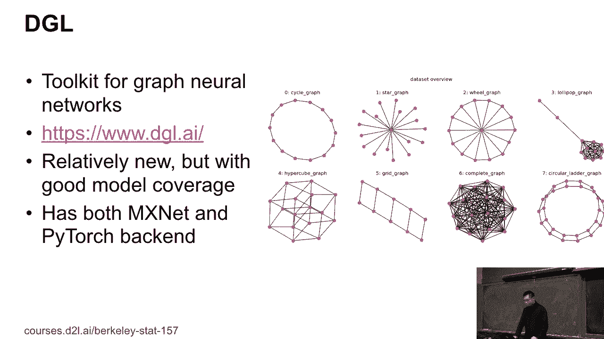

过去两年的经验表明，框架本身只是一个工具。研究人员更关注是否有现成的基准模型可供修改和实验；工程师则更关心数据流水线、模型训练和部署流程。

因此，社区的焦点逐渐转向应用。例如：

*   **GluonCV**：一个计算机视觉工具包，提供了大量预训练模型（如物体检测、语义分割、人脸识别）和训练脚本，帮助用户复现论文结果。实践中，许多论文的性能提升依赖于特定的训练技巧（如标签平滑），而这类工具包集成了这些技巧。
*   **自动机器学习（AutoML）**：例如，利用课程第三章的代码，可以自动为你的数据集寻找合适的模型结构。
*   **自然语言处理（NLP）**：针对文本任务，出现了基于Transformer架构的模型（如BERT、GPT-2），取得了显著成果。
*   **图神经网络（GNN）**：用于处理社交网络、推荐系统等图结构数据，是一个快速发展的新兴领域。

## 未来展望与Gluon教程 🚀

框架的发展日新月异。基于课程反馈，MXNet生态也在持续进化：

1.  **API改进**：例如，针对NDArray不支持布尔索引等反馈，未来可能引入一个名为`NP`的新包，在保持NumPy兼容性的同时，增加GPU支持和自动图优化。
2.  **性能优化**：利用编译器技术对计算图进行整体优化，可以在CPU/GPU上获得显著的性能提升。
3.  **硬件扩展**：深度学习正扩展到更多硬件平台（如手机、专用芯片ASIC）。预计未来即使在集成显卡上也能高效运行GPU代码。

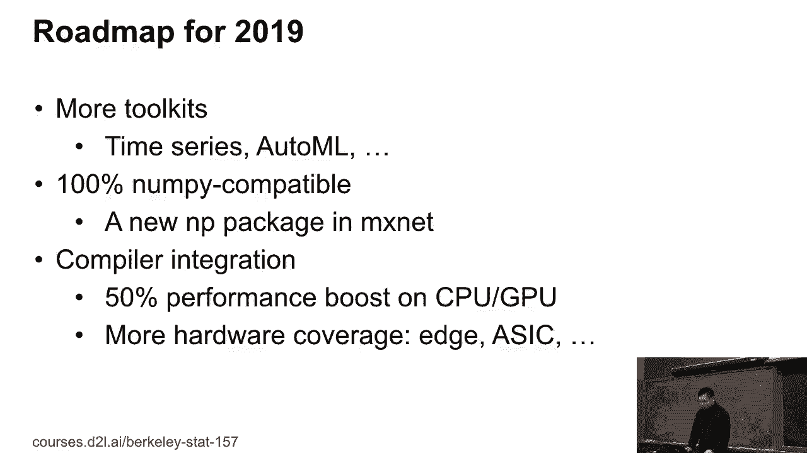

接下来，我们将开始Gluon的具体教程。我们已经了解了NDArray接口，接下来将重点学习三方面内容：


1.  如何创建和定义新的网络层。
2.  如何初始化和操作模型参数。
3.  如何利用GPU加速计算（对于下周将学习的计算量更大的卷积神经网络，GPU几乎是必需的）。

---

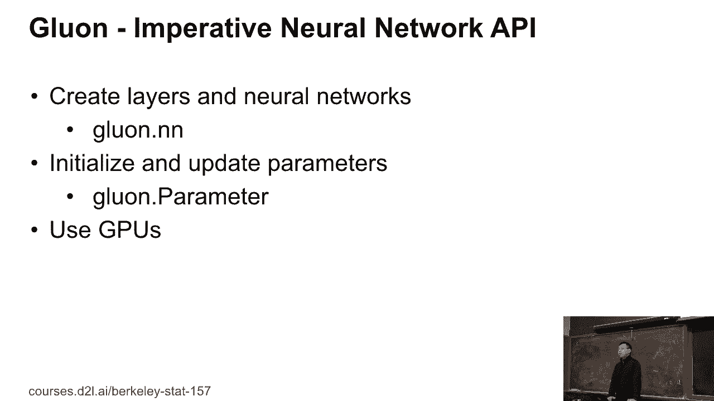

本节课中，我们一起回顾了深度学习框架的发展简史，了解了Caffe、TensorFlow、Keras、PyTorch等框架的特点，并深入认识了本课程的核心——MXNet及其Gluon接口。我们认识到框架是服务于应用的工具，并展望了其未来发展方向。从下一节开始，我们将动手实践，学习如何使用Gluon构建和训练神经网络。