# 48：深度学习框架入门：Gluon 🧠

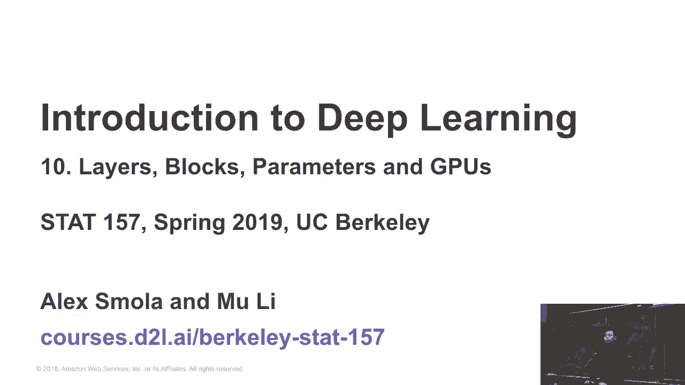

## 课程概述

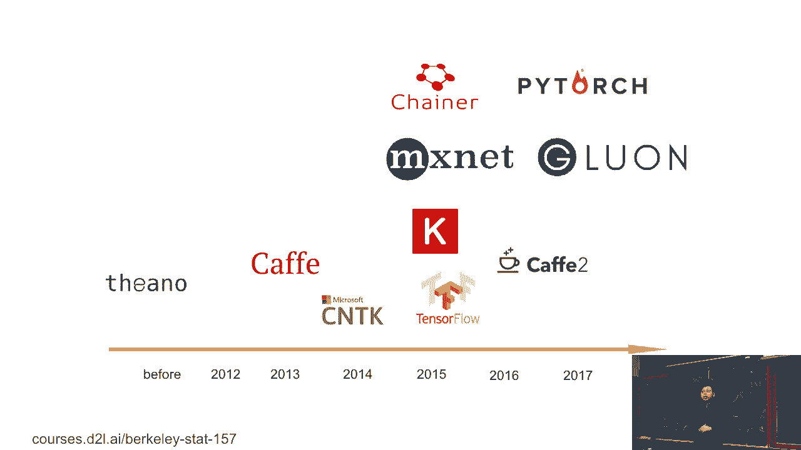

在本节课中，我们将学习深度学习框架的基本概念，并重点介绍MXNet框架下的Gluon接口。我们将了解不同框架的设计哲学、优缺点，以及Gluon如何平衡易用性与性能，最后学习如何使用Gluon定义网络和操作参数。

---

## 主流深度学习框架简介

在硬件知识之后，我们来了解一下软件前端——深度学习框架。下图展示了近年来主流框架的发展时间线。


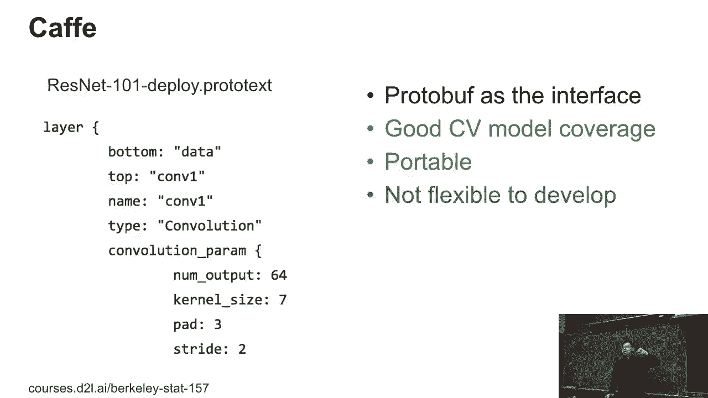

横轴代表年份，可以看到Caffe、TensorFlow、Keras、PyTorch等框架相继出现。每个框架都有其核心的设计决策和目标。

### Caffe：计算机视觉的早期流行框架

第一个是**Caffe**。Caffe由伯克利大学开发，大约四年前，它是计算机视觉领域最流行的框架之一。

它的程序接口特点是：用户提供一个协议缓冲区文件（prototxt）来描述网络层次结构。例如，以下是ResNet-101网络的一部分定义方式：

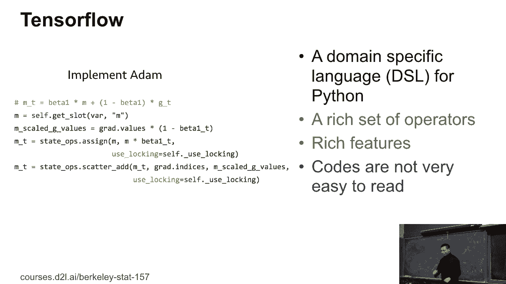

```
layer {
  name: "conv1"
  type: "Convolution"
  bottom: "data"
  top: "conv1"
  convolution_param {
    num_output: 64
    kernel_size: 7
    stride: 2
    pad: 3
  }
}
```

Caffe具有非常好的计算机视觉模型覆盖度，并且是**可移植的单一二进制文件**，可以在任何地方运行。然而，它不够灵活，难以进行像Python那样的交互式编程。一个完整的网络定义可能长达数千行代码。

### TensorFlow：当前最流行的框架之一

之后，**TensorFlow**成为了目前最流行的深度学习框架之一。它提供了一种针对Python的领域特定语言（DSL）。

TensorFlow代码示例：
```python
import tensorflow as tf
x = tf.placeholder(tf.float32, shape=(None, 784))
W = tf.Variable(tf.zeros([784, 10]))
b = tf.Variable(tf.zeros([10]))
y = tf.nn.softmax(tf.matmul(x, W) + b)
```

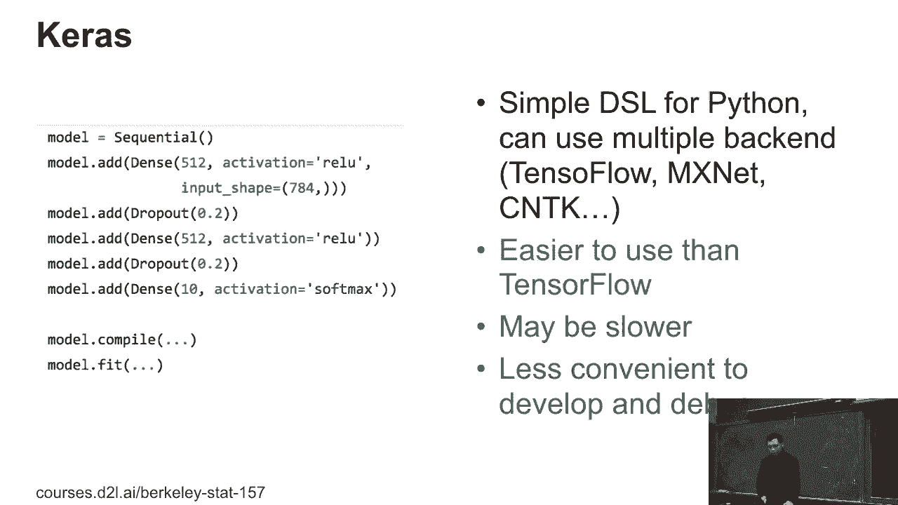

TensorFlow拥有成千上万个操作符，功能全面，能满足训练、部署等各种需求。但它的代码对于Python用户来说可能有些难以理解，例如其中的“状态操作”（stateful ops）概念。

### Keras：以简化开发为目标

另一方面，**Keras**是一个高层API，旨在简化开发过程。例如，使用Keras定义一个多层感知机（MLP）非常简单：

```python
from keras.models import Sequential
from keras.layers import Dense

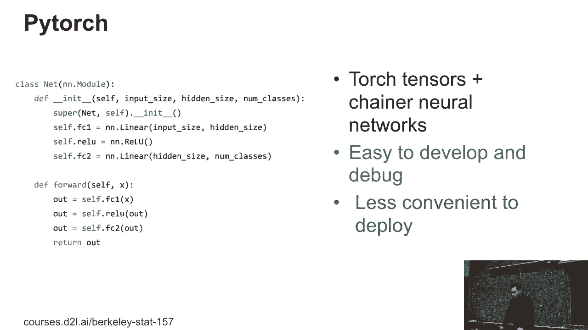

model = Sequential()
model.add(Dense(units=64, activation='relu', input_dim=100))
model.add(Dense(units=10, activation='softmax'))
```

Keras可以使用不同的后端，如TensorFlow、Theano或CNTK。它相对于TensorFlow更易用，但可能会因为前端抽象而带来轻微的性能开销。

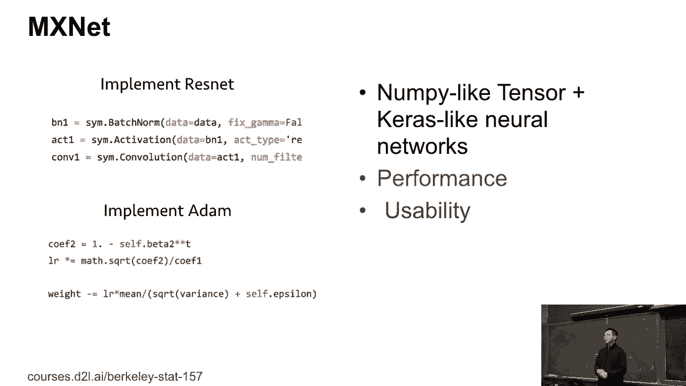

### PyTorch：研究界的宠儿

另一个非常流行的是**PyTorch**。它继承了Torch的Tensor接口和Chainer的自动求导接口，完全基于Python。

PyTorch代码示例：
```python
import torch
import torch.nn as nn

model = nn.Sequential(
          nn.Linear(784, 256),
          nn.ReLU(),
          nn.Linear(256, 10),
          nn.LogSoftmax(dim=1)
        )
```

这使得PyTorch代码非常易于阅读和理解。由于其与Python的紧密集成，它在研究界变得极其流行。然而，这种紧密集成有时也使得模型在工业环境（如移动端或Java环境）中的部署变得更具挑战性。

---

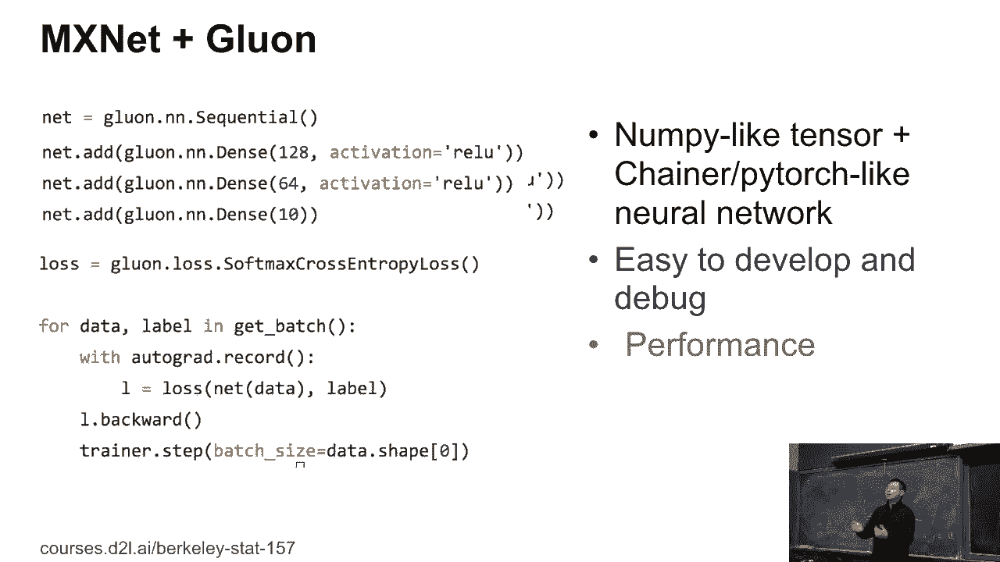

## MXNet与Gluon的设计哲学

本课程基于**MXNet**框架。原始的MXNet包含一个类似NumPy的张量库NDArray，其设计初衷是追求极致的性能，有时会牺牲一些易用性。

随着社区发展，人们意识到易用性的重要性。PyTorch因其易用性而广受欢迎。因此，MXNet推出了**Gluon**接口。

Gluon的设计理念与PyTorch非常相似，旨在使代码开发和调试更容易。以下是如何使用Gluon定义一个简单的网络：

```python
from mxnet.gluon import nn
net = nn.Sequential()
net.add(nn.Dense(256, activation='relu'))
net.add(nn.Dense(10))
```

Gluon采用了**命令式编程**（imperative programming）风格，这使得获取中间结果和进行交互操作变得简单。虽然相比纯粹的符号式接口（symbolic programming）可能在性能上略有损失，但对于大多数研究和教学场景来说，这种损失是可以接受的。

---

## 超越框架：工具包与生态系统

随着深度学习的发展，大家越来越将框架视为完成任务的工具。社区的需求主要集中在两个方面：

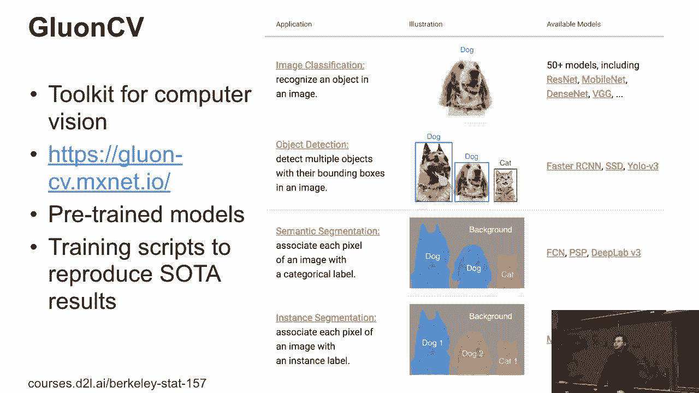

1.  **对于研究人员**：希望有高质量的基准模型和实现，以便在其基础上进行修改和创新。
2.  **对于工程师**：关心如何快速获取数据、训练模型并部署到生产环境。

为了满足这些需求，MXNet生态系统提供了一系列工具包：

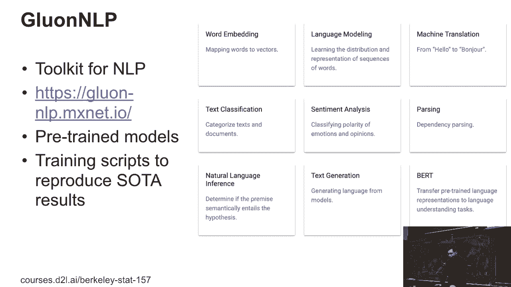

*   **GluonCV**：计算机视觉工具包，提供了图像分类、目标检测、语义分割等任务的众多预训练模型和训练脚本。
*   **GluonNLP**：自然语言处理工具包，涵盖了如BERT、GPT-2等基于Transformer的流行模型。
*   **DGL**：深度图神经网络库，用于处理社交网络、推荐系统等图结构数据。

这些工具包不仅提供了模型，还集成了许多提升模型性能的实用技巧（例如使用标签平滑技术），帮助用户更容易地复现论文结果。

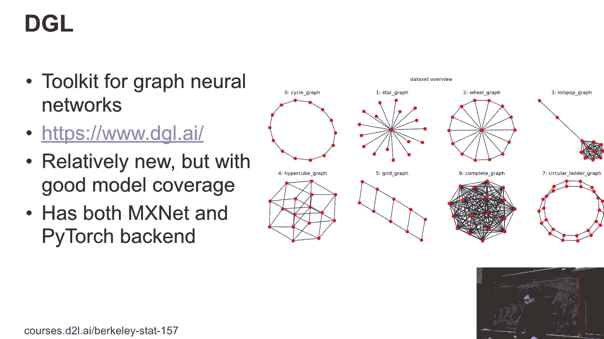

---

## 框架的持续演进

深度学习框架领域发展迅速。以MXNet为例，它也在不断学习和改进：

1.  **API改进**：根据用户反馈，MXNet引入了`mx.np`模块，旨在提供与NumPy 100%兼容的接口，并支持GPU和自动求导。
2.  **性能优化**：利用编译器技术对计算图进行整体优化，在CPU和GPU上能获得显著的性能提升。
3.  **硬件扩展**：积极支持更多硬件后端，如Intel和AMD的GPU，使得深度学习应用能更广泛地部署在边缘设备上。

---

## 动手使用Gluon

接下来，我们将提供一些关于Gluon的实际操作指南。我们已经讨论过NDArray接口，现在我们将更多地讲解如何编写代码来构建新的网络。

主要有三件事需要掌握：
1.  如何创建和定义新的网络层。
2.  如何初始化和操作模型参数。
3.  如何利用GPU进行加速计算（这对于接下来要学习的计算量更大的卷积神经网络尤为重要）。

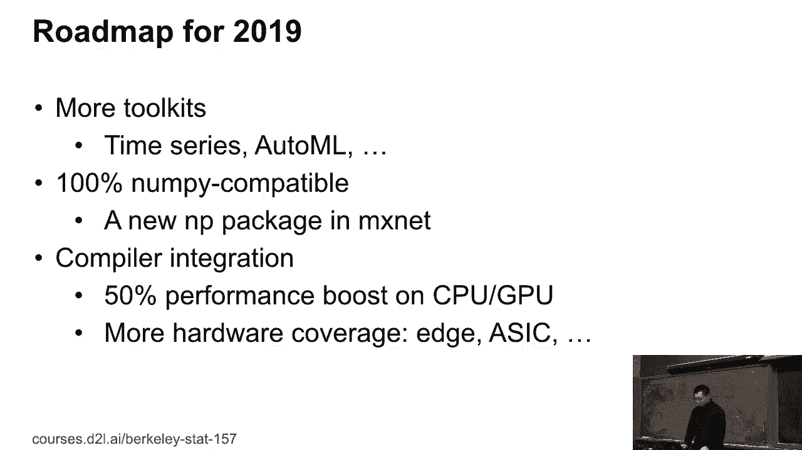

我们将在后续的实践环节中详细展开这些内容。


---

## 课程总结

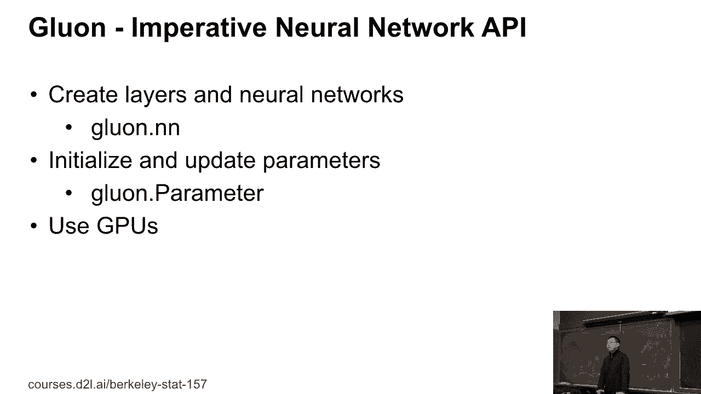

本节课我们一起学习了深度学习框架的演变历程，了解了Caffe、TensorFlow、Keras、PyTorch等主流框架的特点。我们重点介绍了MXNet的Gluon接口，它如何平衡易用性与性能，并了解了围绕MXNet构建的丰富工具包生态系统。最后，我们认识到框架是快速实现想法的工具，而整个领域仍在高速演进中。在接下来的课程中，我们将开始使用Gluon进行实际编程。