# 49：块与层 🧱

在本节课中，我们将学习如何使用自定义的“块”来构建神经网络。我们将从回顾使用顺序容器构建多层感知器开始，然后逐步深入到如何通过继承“块”类来创建更灵活、更复杂的网络结构。

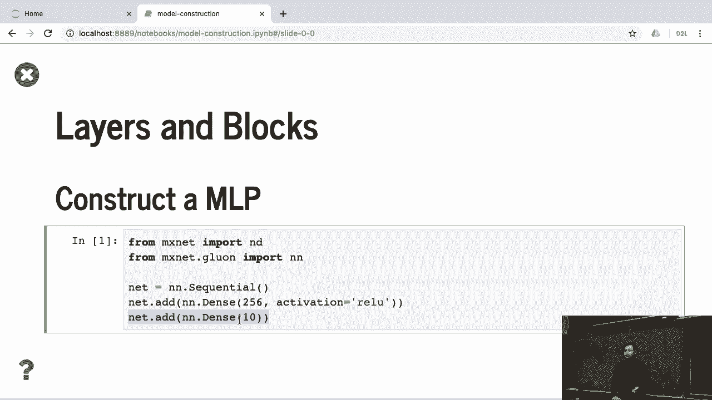

---

## 回顾：使用顺序容器构建网络

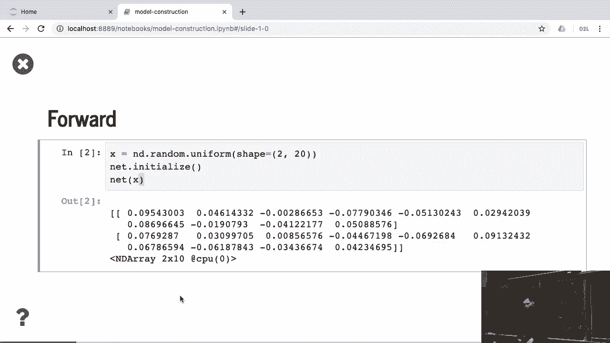

在前面的课程中，我们已经学习了如何构建多层感知器。具体方法是定义一个顺序网络容器，并向其中添加层。

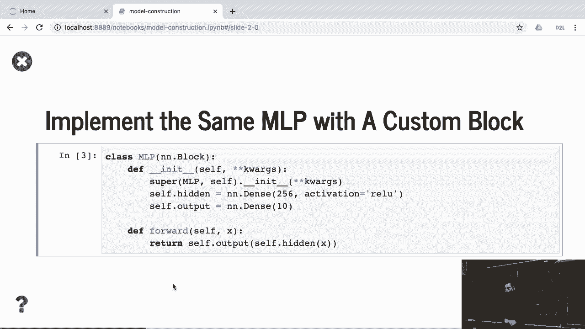

以下是一个示例，我们定义了一个顺序网络，它包含两个密集层。第一个密集层有256个输出并使用ReLU激活函数，第二个密集层输出维度为10。

```python
# 示例：使用顺序容器
net = nn.Sequential()
net.add(nn.Dense(256, activation='relu'))
net.add(nn.Dense(10))
```

在前向传播时，我们生成一个随机输入`x`（例如，形状为`(2, 20)`，代表2个样本，每个样本20个特征）。将`x`输入网络后，我们得到输出`y`，其形状为`(2, 10)`，即批处理大小和输出特征数。

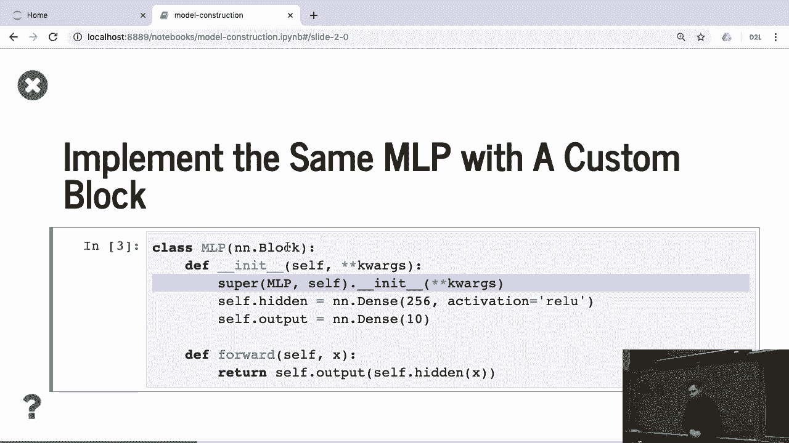

---

## 使用自定义块构建网络

现在，让我们使用用户自定义的“块”来重新实现相同的多层感知器。这种方法与PyTorch中的做法非常相似。

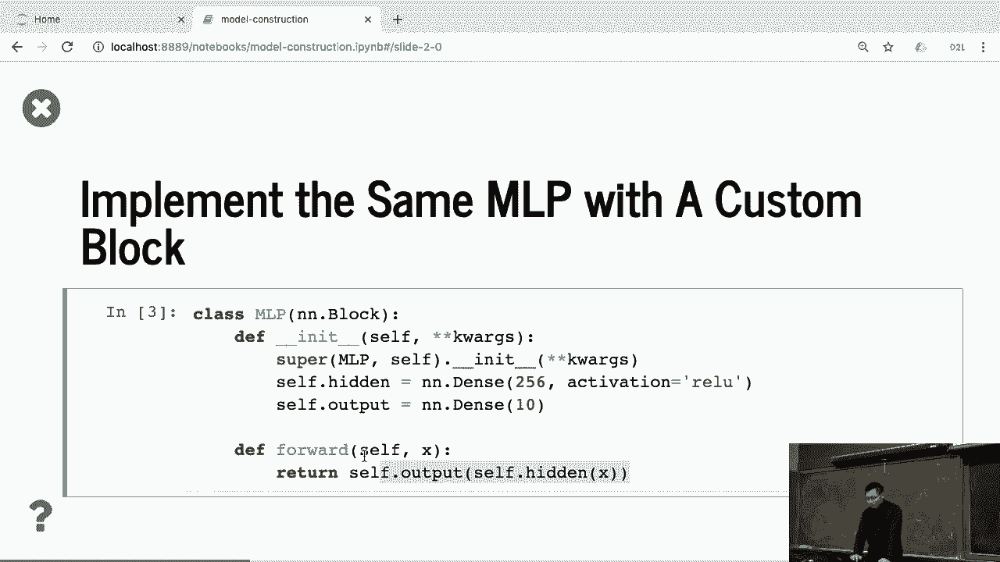

我们创建一个名为`MLP`的类，它继承自`nn.Block`类。这个类需要定义两个核心函数：`__init__`和`forward`。

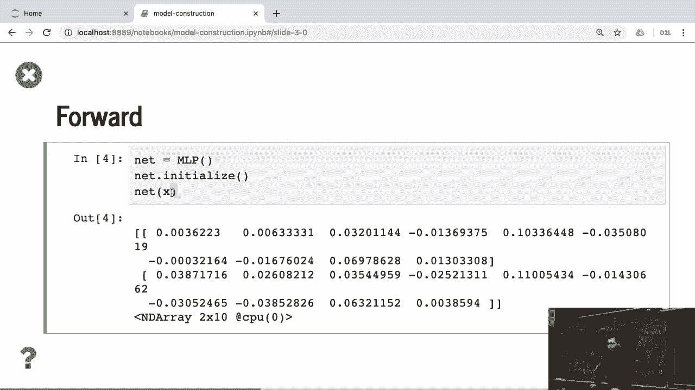

```python
class MLP(nn.Block):
    def __init__(self, **kwargs):
        # 调用父类构造函数
        super(MLP, self).__init__(**kwargs)
        # 定义并创建层
        self.hidden = nn.Dense(256, activation='relu')
        self.output = nn.Dense(10)

    def forward(self, x):
        # 定义前向传播逻辑
        return self.output(self.hidden(x))
```

*   `__init__`函数：主要目的是定义并创建网络中的所有层。我们首先调用父类的构造函数来初始化必要的内部数据结构。
*   `forward`函数：定义了给定输入`x`时，如何计算网络的输出。

使用这个自定义块的方式与使用顺序模型非常相似：

```python
net = MLP()
net.initialize()
y = net(x)
```

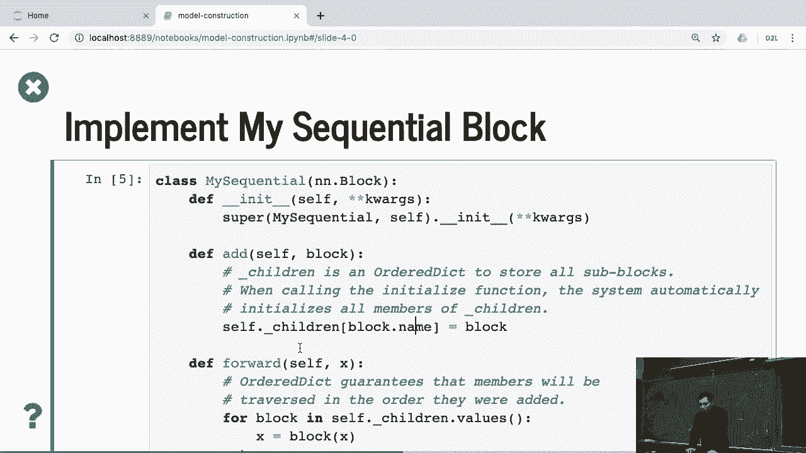

---

## 实现自定义顺序容器

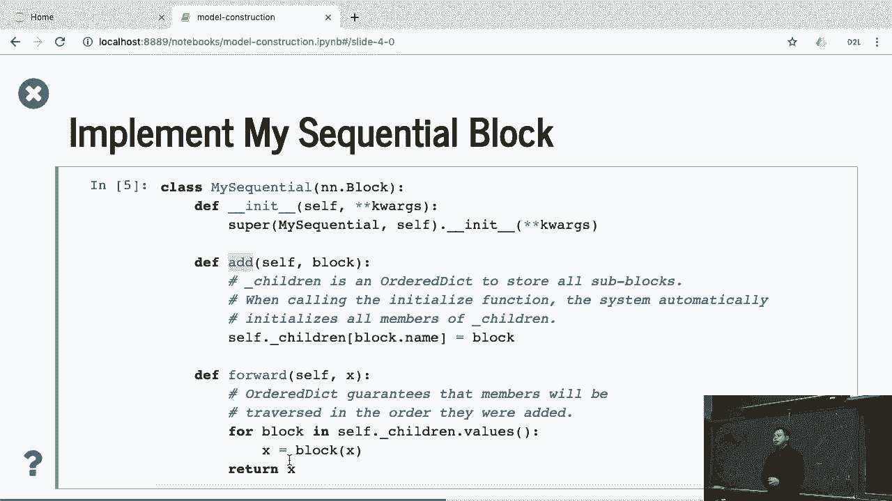

利用`Block`基类，我们甚至可以自己实现一个类似于`Sequential`的容器。我们将其称为`MySequential`。

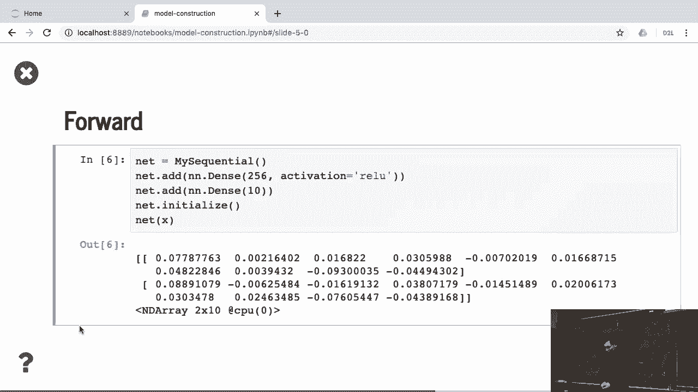

```python
class MySequential(nn.Block):
    def __init__(self, **kwargs):
        super(MySequential, self).__init__(**kwargs)
        # 使用一个有序字典来存储层
        self._layers = {}

    def add(self, name, block):
        # 添加层或块到容器中
        self._layers[name] = block

    def forward(self, x):
        # 按添加顺序依次通过每一层
        for name, block in self._layers.items():
            x = block(x)
        return x
```

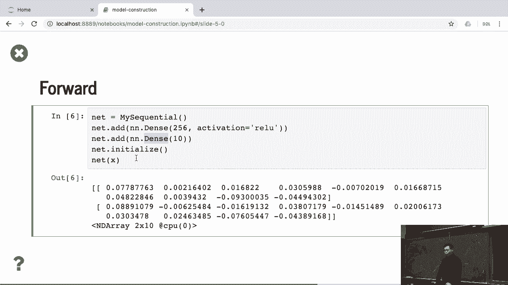

*   `add`函数：允许我们向容器中添加层或块。
*   `forward`函数：遍历存储的所有层，依次将输入`x`传递下去。

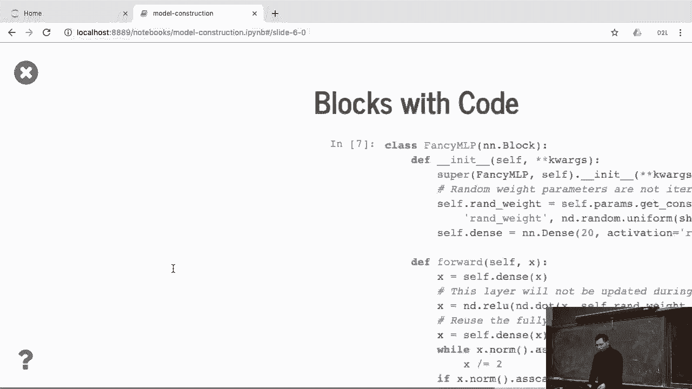

它的使用方式与内置的`Sequential`类似：

```python
net = MySequential()
net.add(‘hidden‘, nn.Dense(256, activation=‘relu‘))
net.add(‘output‘, nn.Dense(10))
net.initialize()
y = net(x)
```

---

## 块的灵活性：复杂网络示例

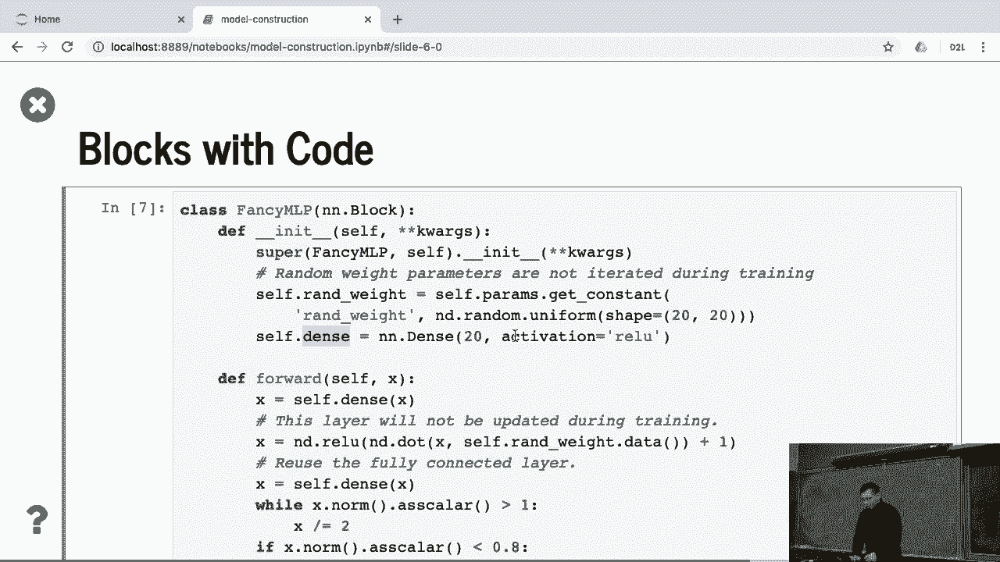

使用`Block`类的主要优势在于其极大的灵活性，允许我们实现顺序接口难以表达的复杂网络结构。

以下是一个“复杂MLP”的示例，它展示了几个高级功能：

```python
class FancyMLP(nn.Block):
    def __init__(self, **kwargs):
        super(FancyMLP, self).__init__(**kwargs)
        # 1. 一个普通的可训练密集层
        self.dense = nn.Dense(256, activation=‘relu‘)
        # 2. 一个随机权重层，在训练中固定（不更新）
        self.rand_weight = self.params.get_constant(‘rand_weight‘, np.random.uniform(size=(20, 20)))
        # 3. 一个密集层，它将与第一层共享参数
        self.shared_dense = self.dense  # 指向同一个层对象

    def forward(self, x):
        x = self.dense(x)  # 通过第一层
        # 使用固定的随机权重进行运算
        x = nd.relu(nd.dot(x, self.rand_weight.data()) + 1)
        # 再次通过第一层（参数共享）
        x = self.shared_dense(x)
        # 添加一些自定义逻辑，例如根据值调整输出
        while x.norm().asscalar() > 1:
            x /= 2
        if x.norm().asscalar() < 0.8:
            x *= 10
        return x
```

这个例子展示了：
1.  **固定参数**：`self.rand_weight`被声明为常量参数，在训练过程中不会更新梯度。这在微调预训练模型时很有用，可以固定底层参数防止小数据集过拟合。
2.  **参数共享**：`self.shared_dense`直接指向`self.dense`，意味着它们使用完全相同的参数。计算梯度时，梯度会在这两层间累积。
3.  **自定义前向逻辑**：在`forward`函数中，我们可以编写任意的Python控制流（如循环、条件判断），这是顺序容器难以做到的。

---

## 混合搭配各种组件

无论是内置层（如`Dense`）、自定义块（如`MLP`）、自定义容器（如`MySequential`），还是自定义操作，只要它们是`Block`的子类，就可以自由地混合在一起使用。

```python
class MixedMLP(nn.Block):
    def __init__(self, **kwargs):
        super(MixedMLP, self).__init__(**kwargs)
        # 包含一个顺序网络
        self.net = nn.Sequential()
        self.net.add(nn.Dense(64, activation=‘relu‘), nn.Dense(32, activation=‘relu‘))
        # 和一个独立的层
        self.dense = nn.Dense(16)

    def forward(self, x):
        return self.dense(self.net(x))

# 甚至可以进一步嵌套
final_net = nn.Sequential()
final_net.add(MixedMLP(), nn.Dense(10))
```

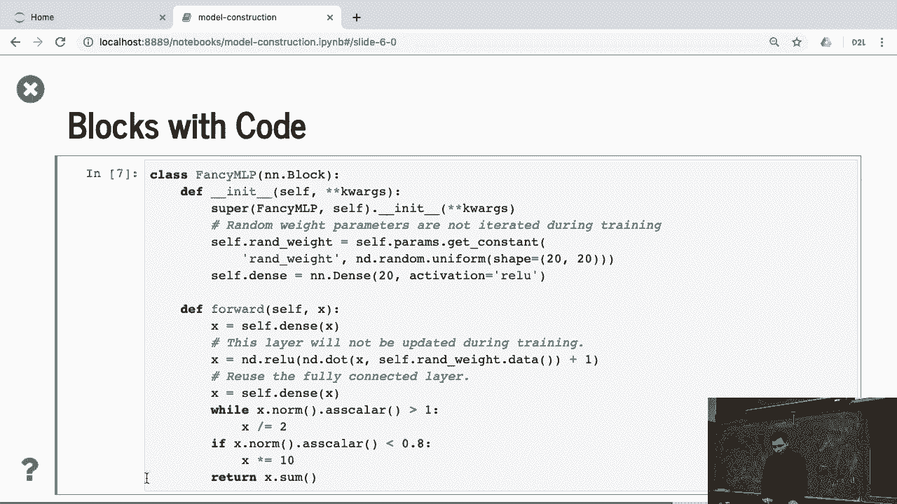

这种设计使得构建网络像搭积木一样简单而强大。

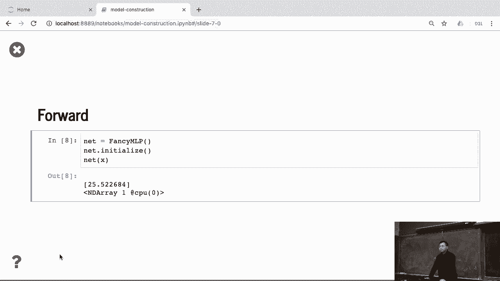

---

## 调试优势

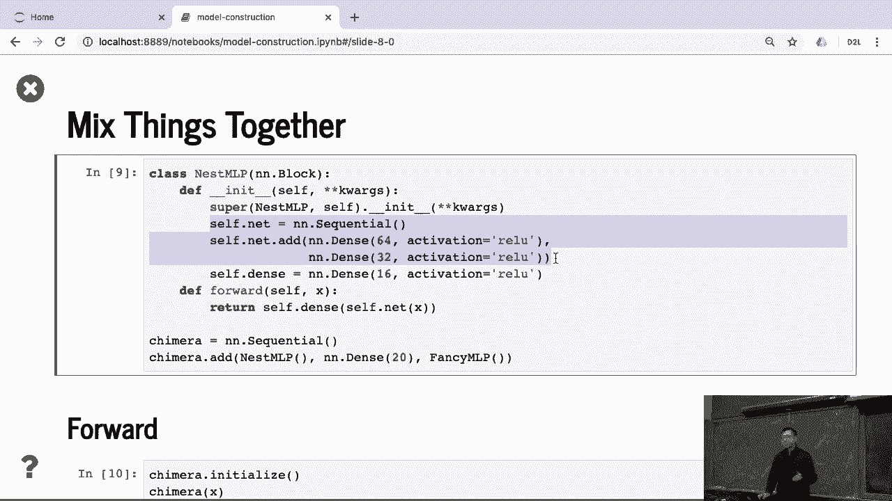

使用自定义块还有一个额外的好处：易于调试。你可以在`forward`函数中的任何位置插入代码来检查中间结果。

```python
def forward(self, x):
    x = self.hidden(x)
    print(‘隐藏层输出：‘, x)  # 调试语句
    x = self.output(x)
    return x
```

这种灵活性让你能够深入理解数据在网络中的流动和变换过程。

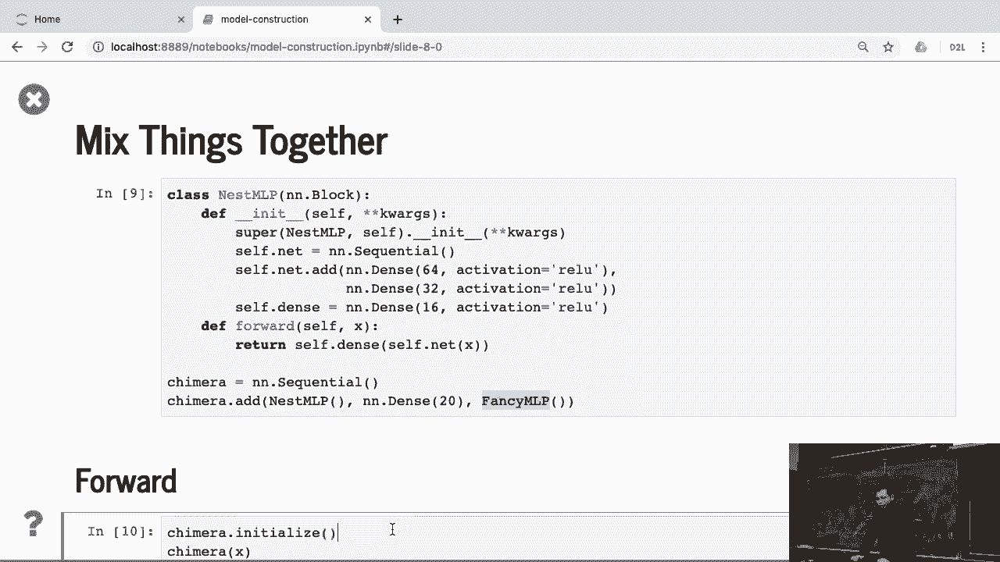

---

## 总结

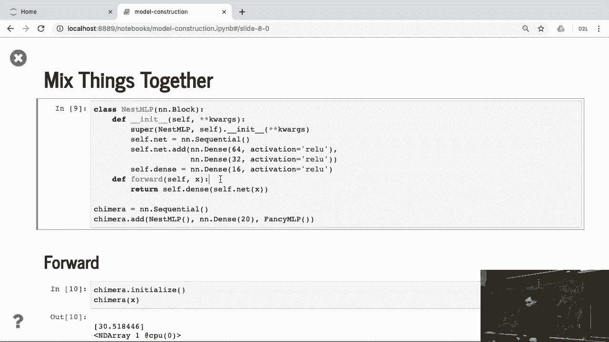

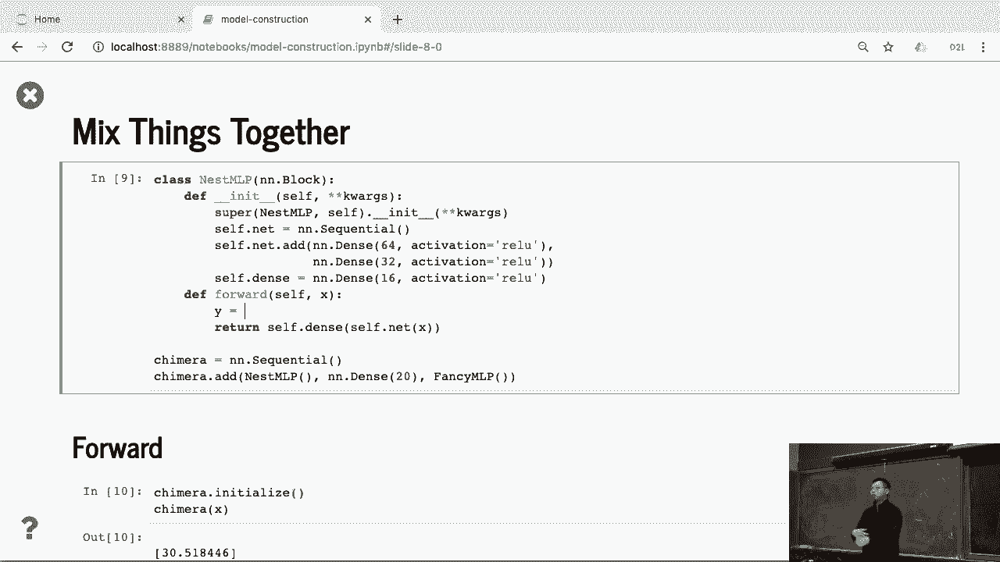

本节课中，我们一起学习了神经网络“块”的核心概念。

1.  我们回顾了使用`Sequential`容器快速构建顺序网络的方法。
2.  我们深入学习了如何通过继承`nn.Block`类来创建自定义网络块，这需要定义`__init__`（初始化层）和`forward`（定义计算逻辑）两个方法。
3.  我们利用`Block`基类自己实现了一个简单的顺序容器`MySequential`，理解了其内部工作机制。
4.  我们探索了`Block`提供的强大灵活性，包括创建固定参数层、实现参数共享以及在`forward`函数中编写复杂的自定义逻辑。
5.  我们了解到，所有层和网络结构都是`Block`的子类，因此可以无缝地混合搭配使用。
6.  最后，我们看到了自定义块在调试方面的优势，允许我们方便地检查中间变量。

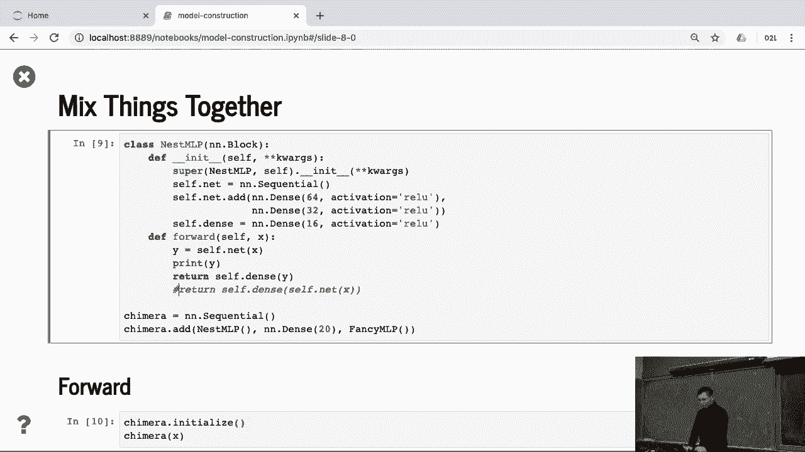

通过掌握“块”的概念，你便获得了构建任意复杂神经网络架构的能力，而不仅仅是堆叠简单的层。