# 50：L10_3 管理参数 🧠

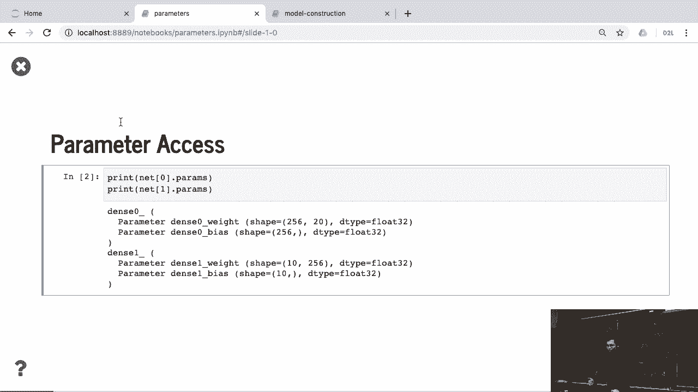

在本节课中，我们将学习如何访问和修改神经网络中的参数。参数管理是深度学习中的重要环节，它允许我们查看、初始化和调整模型内部的权重与偏置。

---

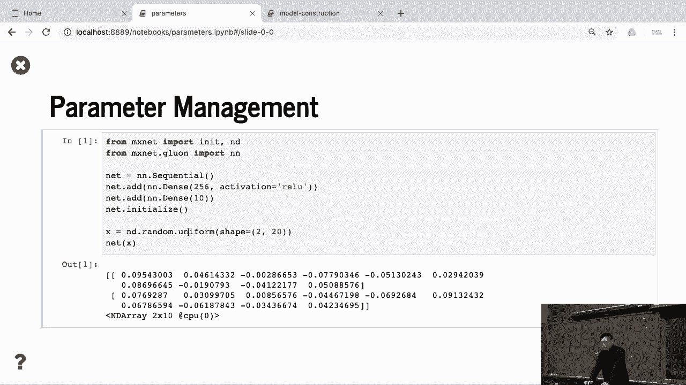

## 访问网络参数 🔍

一旦定义了网络，访问其参数是至关重要的。在下面的例子中，我们定义了一个简单的多层感知机（MLP），它包含两个全连接层（密集层）。

```python
import mxnet as mx
from mxnet import nd, init
from mxnet.gluon import nn

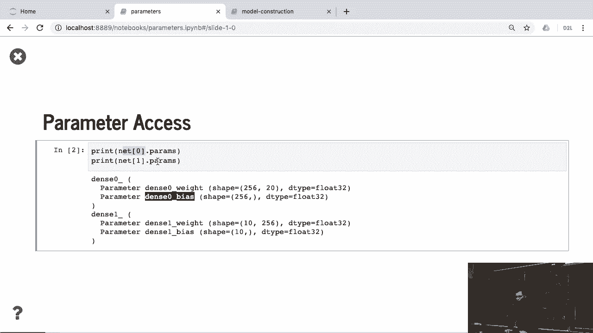

# 定义网络
net = nn.Sequential()
net.add(nn.Dense(256, activation='relu'))
net.add(nn.Dense(10))
net.initialize()


# 随机输入
X = nd.random.uniform(shape=(2, 20))
Y = net(X)
```

因为我们有两层，所以可以通过索引（0和1）来访问每一层。使用 `params` 属性可以获取该层所有的参数。

```python
# 访问第一层的参数
print(net[0].params)
```

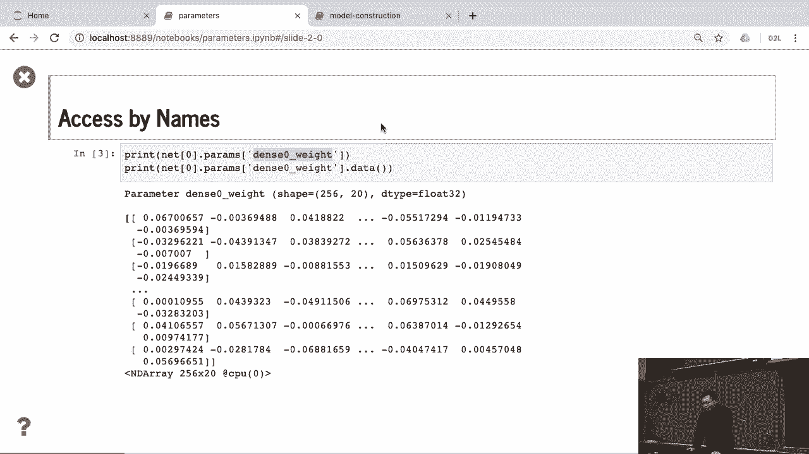

输出是一个参数字典，其中包含如 `dense0_weight` 和 `dense0_bias` 这样的键。我们可以通过键名来访问具体的参数。

```python
# 通过名称访问权重参数
weight = net[0].params.get('dense0_weight')
print(weight.data())  # 获取权重数据的数组
```

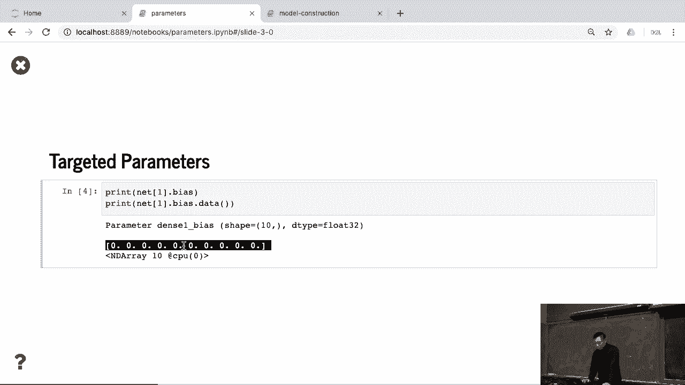

---

## 访问特定参数：权重与偏置 ⚖️

有时，直接通过属性访问权重和偏置更为方便。

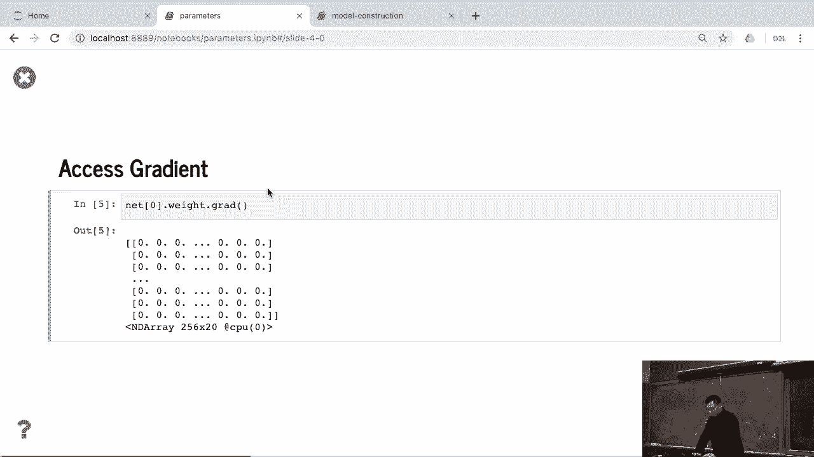

```python
# 访问第一层的偏置
bias = net[0].bias
print(bias.data())  # 默认初始化为0

# 访问第一层的权重及其梯度
weight = net[0].weight
print(weight.data())
print(weight.grad())  # 尚未进行反向传播，梯度为0
```

我们还可以通过 `collect_params` 方法一次性获取网络中所有层的参数。

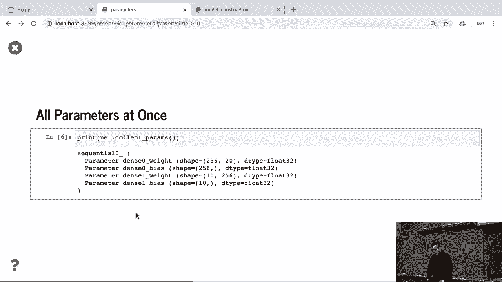

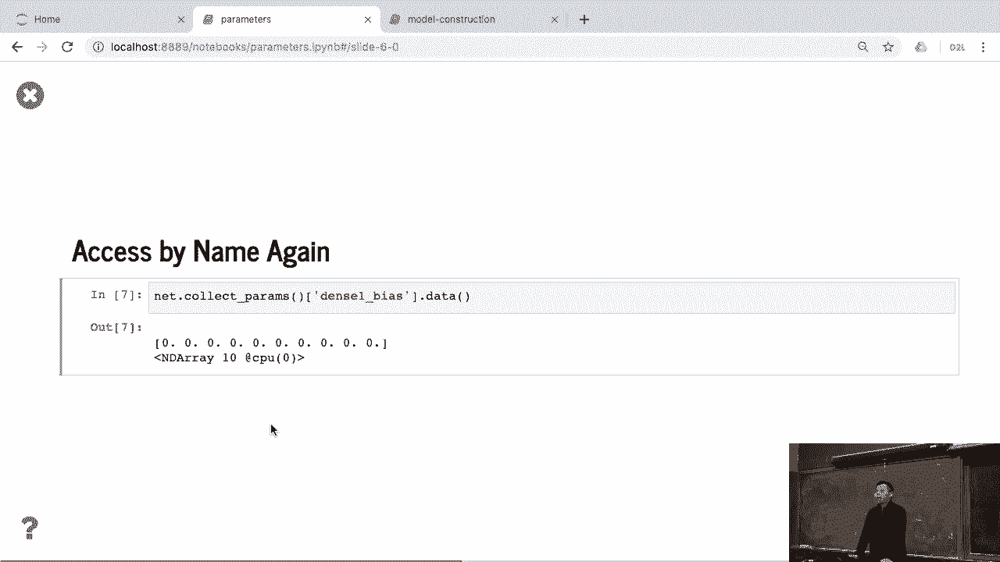

```python
# 获取所有参数
all_params = net.collect_params()
print(all_params)
```

这是一个包含所有层权重和偏置的字典，例如 `dense0_weight`, `dense0_bias`, `dense1_weight`, `dense1_bias`。

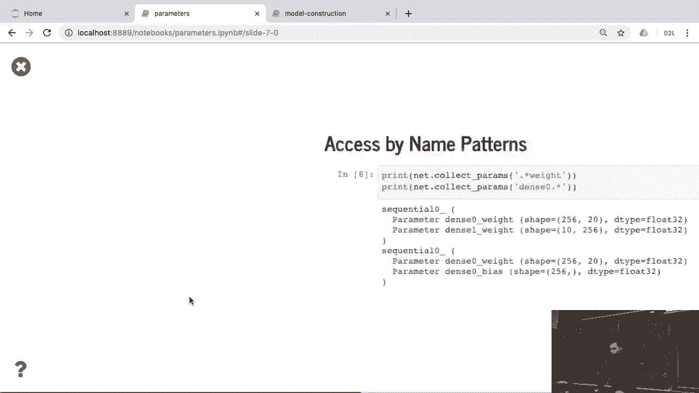

---

## 使用模式匹配访问参数 🎯

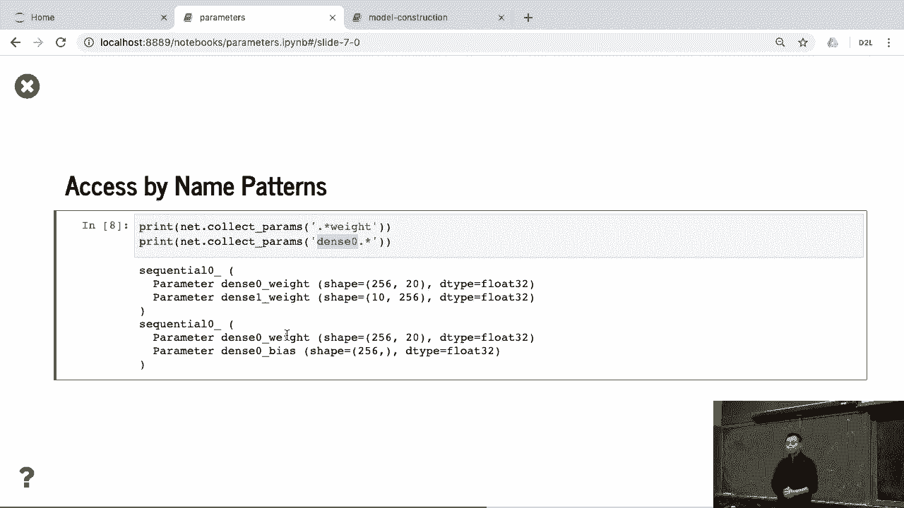

为了更灵活地访问特定类型的参数（例如所有权重），我们可以使用模式匹配。

```python
# 获取所有权重参数
weights = net.collect_params('.*weight')
print(weights)
```

这将返回一个只包含权重参数的字典，方便进行批量操作。

---

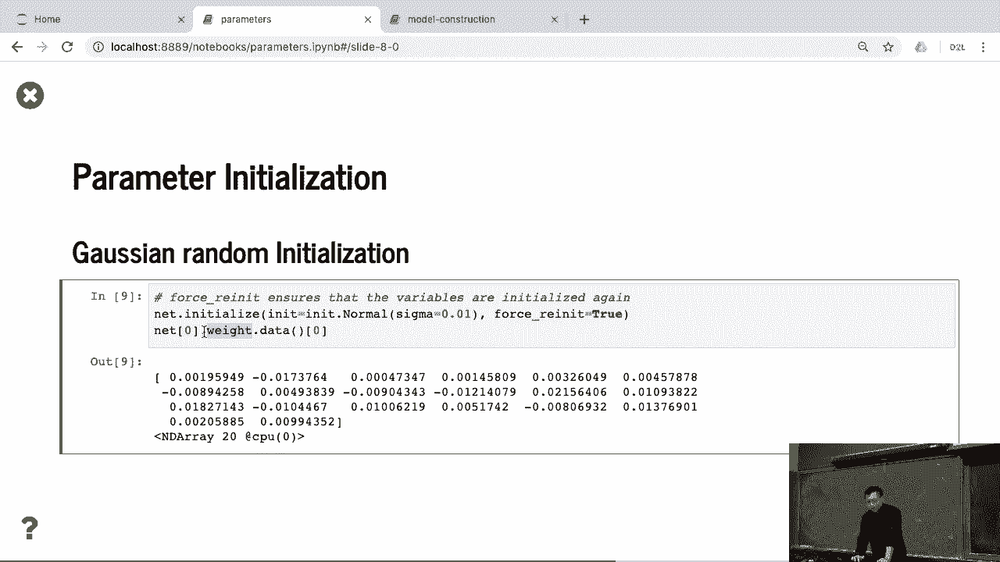

## 参数初始化 🚀

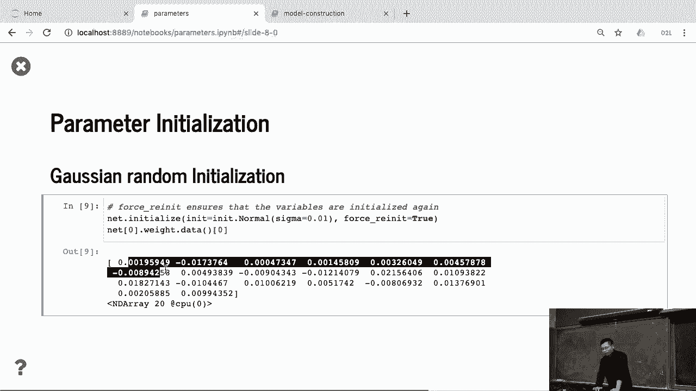

参数初始化对模型训练至关重要。好的初始化能带来更稳定和高效的训练结果。Gluon 提供了多种初始化方法。

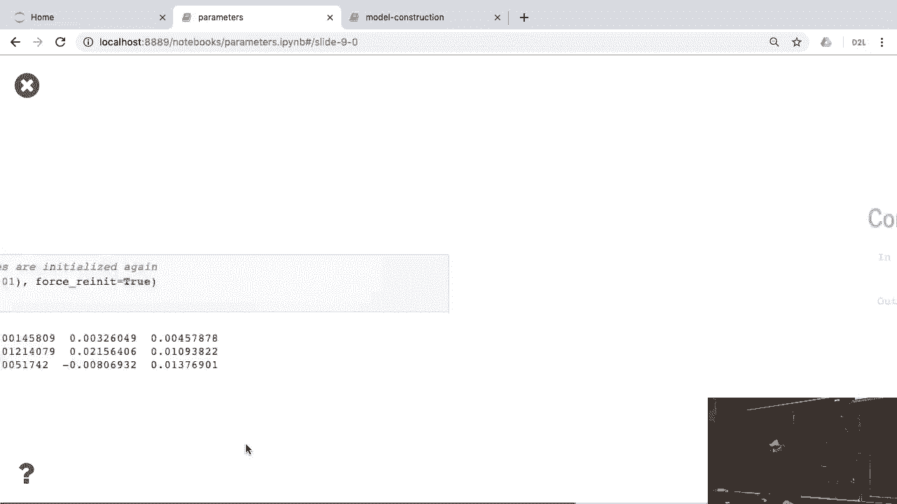

首先，我们来看如何使用正态分布初始化权重。

```python
# 使用正态分布初始化（标准差为0.01）
net.initialize(init=init.Normal(sigma=0.01), force_reinit=True)
print(net[0].weight.data()[0])  # 查看第一行权重值
```

我们还可以为不同的层或参数指定不同的初始化器。

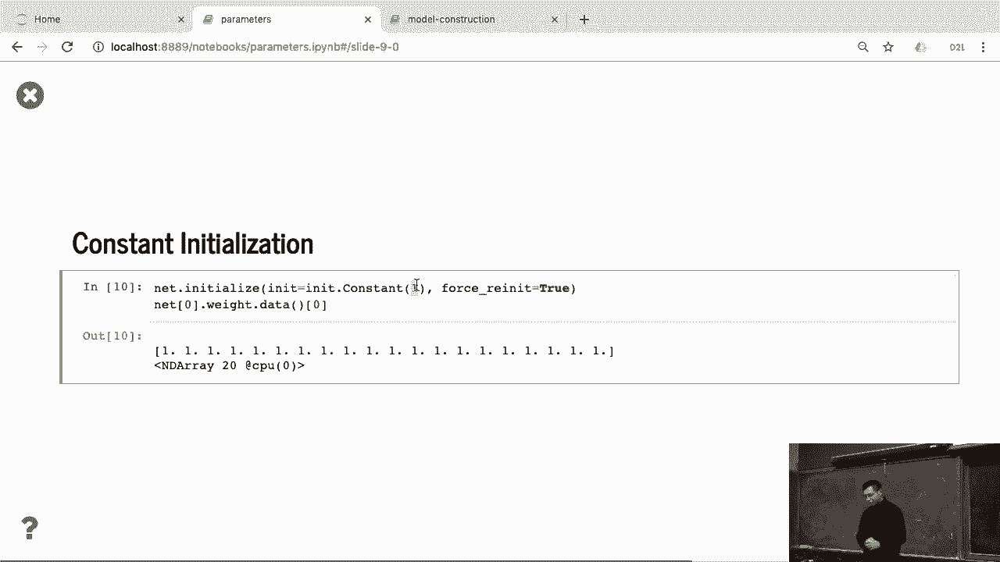

```python
# 为不同层设置不同的初始化器
net.initialize(init=init.Constant(1), force_reinit=True)  # 默认常量初始化
net[0].weight.initialize(init=init.Xavier(), force_reinit=True)  # 第一层权重使用Xavier初始化
```

---

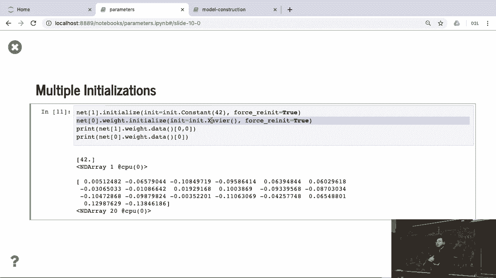

## 自定义初始化函数 🛠️

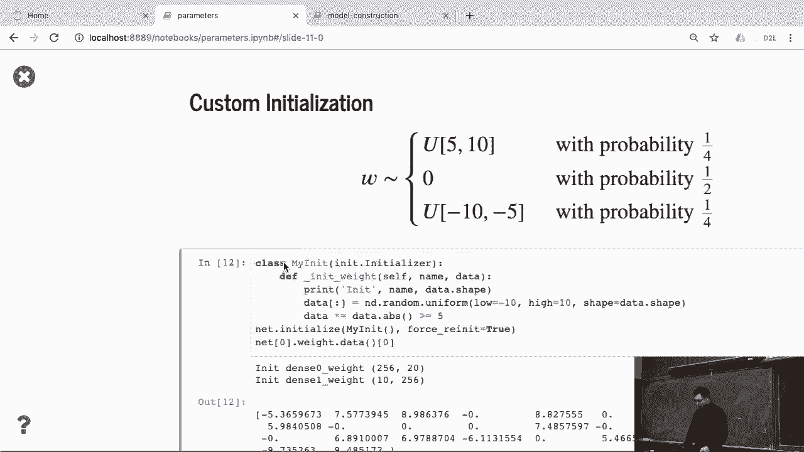

如果内置的初始化方法不满足需求，我们可以定义自己的初始化函数。

```python
# 自定义初始化器类
class MyInit(init.Initializer):
    def _init_weight(self, name, data):
        print('Init', name, data.shape)
        # 例如：将数据初始化为均匀分布
        data[:] = nd.random.uniform(low=-10, high=10, shape=data.shape)

# 使用自定义初始化器
net.initialize(init=MyInit(), force_reinit=True)
```

此外，我们也可以在初始化后直接修改参数数据。

```python
# 初始化后直接修改参数
net[0].weight.set_data(net[0].weight.data() + 1)  # 所有权重加1
net[0].weight.data()[0, 0] = 42  # 修改特定元素
print(net[0].weight.data()[0])
```

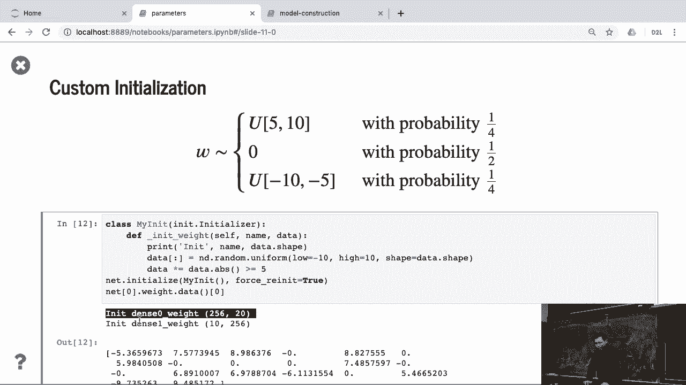

---

## 参数共享 🤝

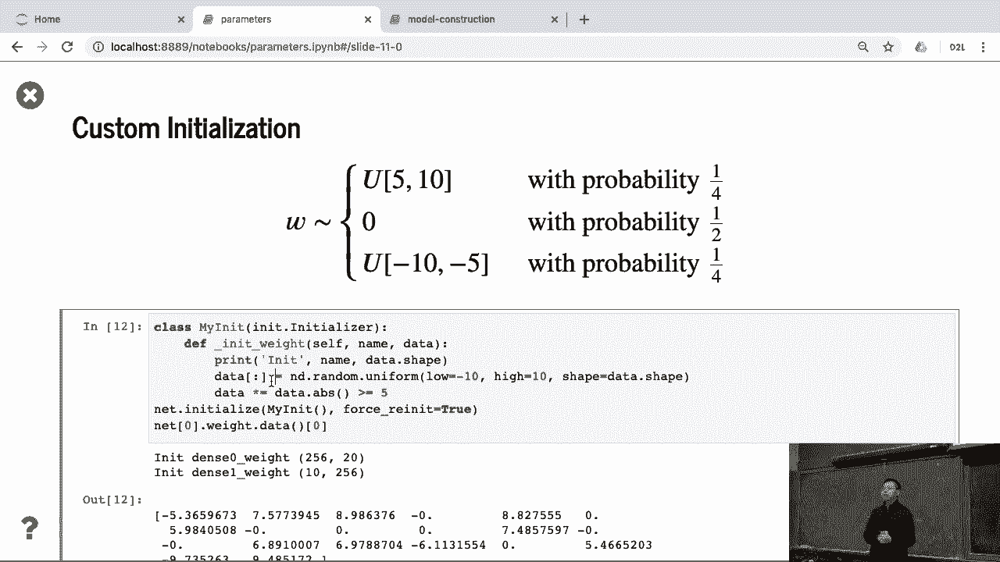

在某些网络架构中，我们可能希望不同层共享相同的参数。这可以通过在定义层时传入共享的参数对象来实现。

```python
# 创建一个共享的密集层
shared_dense = nn.Dense(8, activation='relu')
shared_dense.initialize()

# 构建一个共享参数的网络
net = nn.Sequential()
net.add(nn.Dense(8, activation='relu'))
net.add(shared_dense)  # 与第一层共享参数
net.add(nn.Dense(10))
net.add(shared_dense)  # 再次共享参数

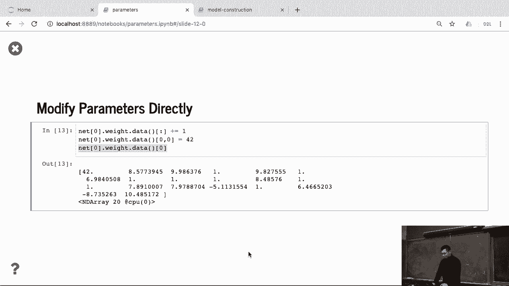

# 修改共享参数会影响所有使用它的层
shared_dense.weight.data()[:] += 1
```

这意味着 `net[1]` 和 `net[3]` 层将共享完全相同的权重和偏置，对其中一层的修改会立即反映在另一层上。

---

## 总结 📚

本节课中，我们一起学习了如何管理神经网络中的参数。我们涵盖了以下核心内容：

1.  **访问参数**：通过层索引、`params` 属性或 `collect_params` 方法查看网络参数。
2.  **初始化参数**：使用内置初始化器（如 `Normal`, `Constant`, `Xavier`）或自定义函数来设置参数的初始值。
3.  **修改参数**：在初始化后直接调整参数数据。
4.  **参数共享**：在不同层之间共享参数，以构建更复杂的网络结构。

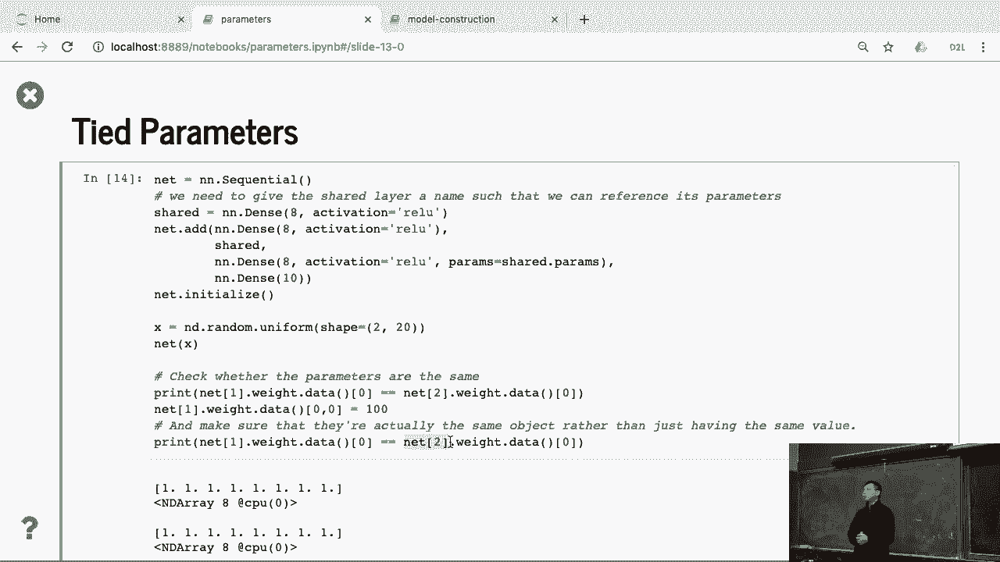

掌握参数管理是灵活构建和调试深度学习模型的基础技能。