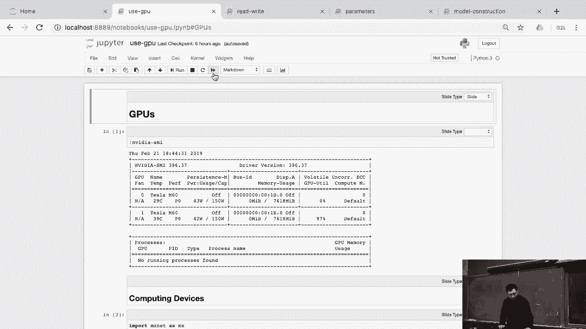
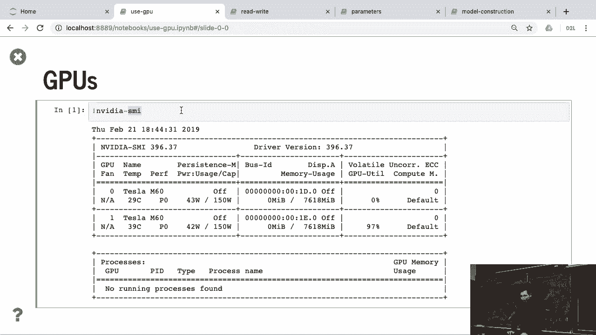
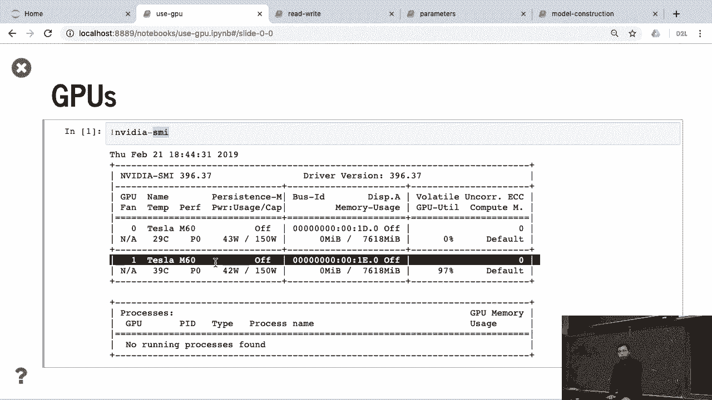
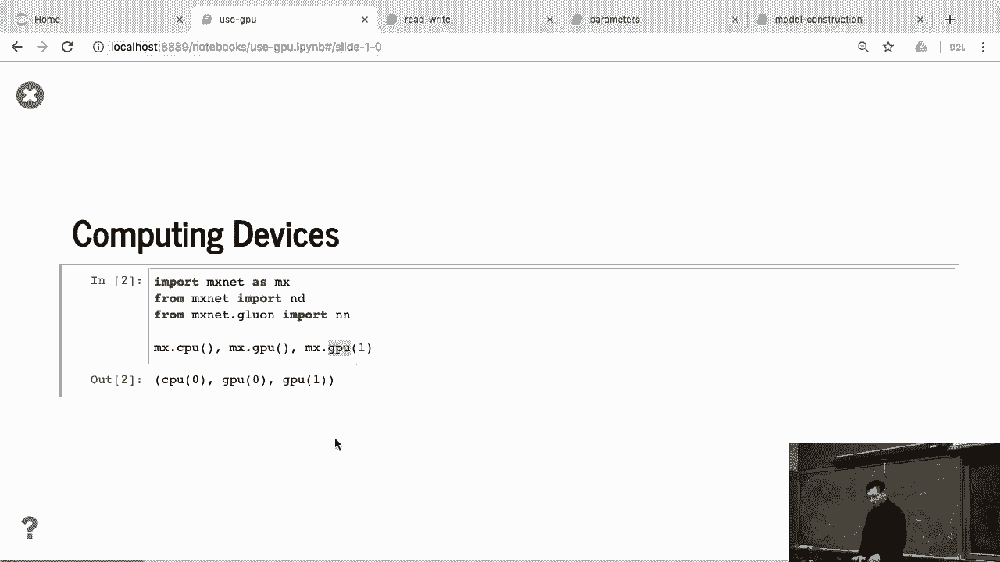
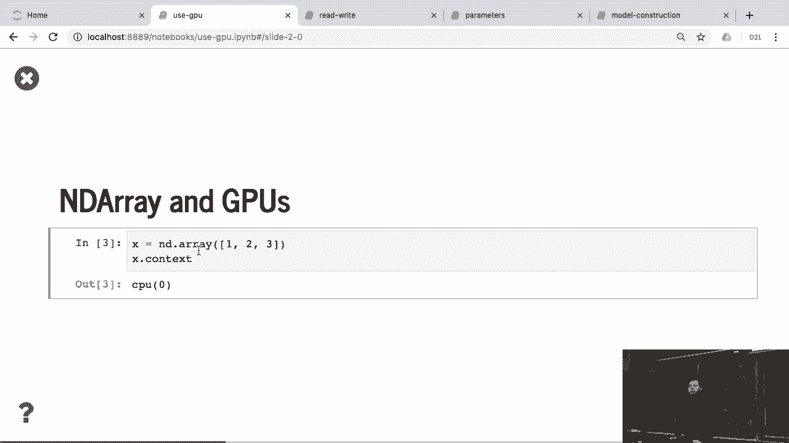
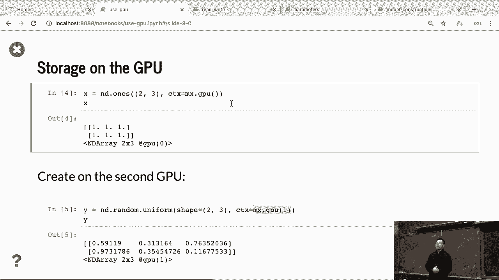
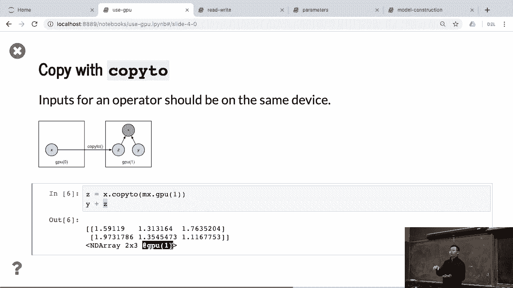
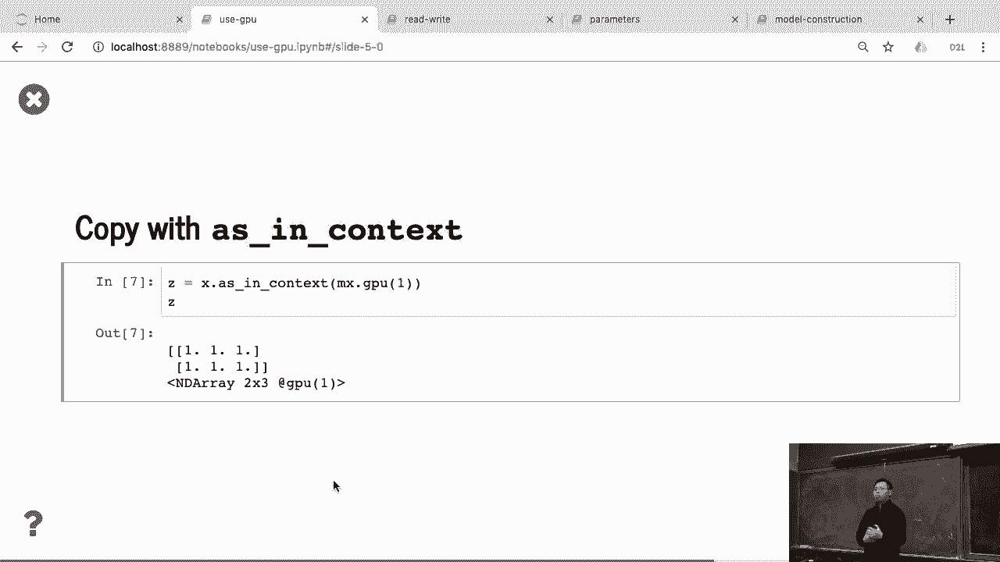
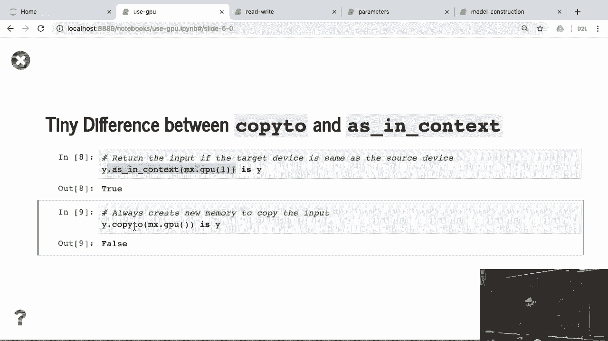
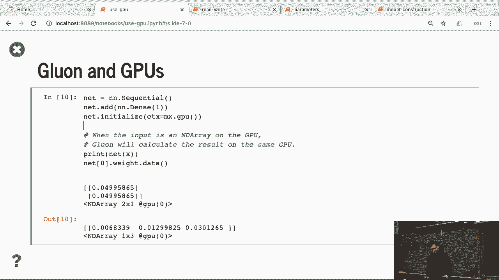

# 51：使用GPU 🚀



在本节课中，我们将学习如何在编程中利用GPU进行计算。主要内容包括如何检查GPU设备、如何将数据和计算任务分配到GPU上，以及在不同GPU设备间管理数据的注意事项。

---

## 检查GPU设备



上一节我们介绍了课程概述，本节中我们来看看如何确认你的计算机是否配备了GPU。



你可以通过运行 `nvidia-smi` 命令来检查是否拥有GPU。例如，下图显示系统拥有两个GPU。


## 理解核心设备

在开始使用GPU之前，需要引入“核心设备”的概念。设备可以是CPU或GPU。

以下是关于设备编号的关键点：
*   CPU通常被标识为 `cpu(0)`，这里的数字0没有特殊含义，无论有多少个GPU，通常只有一个 `cpu(0)`。
*   对于GPU，编号用于区分不同的物理设备。默认的第一个GPU是 `gpu(0)`，第二个是 `gpu(1)`。




## 在GPU上创建和存储数据

理解了设备概念后，我们来看看如何将数据放到GPU上。



默认情况下，创建的数组会存储在CPU内存中。我们可以通过检查数组的 `.context` 属性来确认。

```python
x = nd.array([1, 2, 3])
print(x.context)  # 输出：cpu(0)
```

要将数据放到指定的GPU上，可以使用 `context` 参数（常缩写为 `ctx`）。

```python
x_gpu = nd.array([1, 2, 3], ctx=gpu(0))
print(x_gpu.context)  # 输出：gpu(0)
```

同样，也可以在另一个GPU（例如 `gpu(1)`）上创建随机数组。




## 设备间的计算规则

将数据放到GPU后，就可以在其上进行计算了。计算遵循一个核心原则：**计算发生在数据所在的设备上**。

这意味着，如果两个数组不在同一个设备上，它们之间无法直接进行计算。例如，`x` 在 `gpu(0)` 上而 `y` 在 `gpu(1)` 上，那么 `x + y` 的操作会失败。


## 在设备间复制数据

既然不同设备上的数据不能直接计算，我们就需要学习如何移动数据。

你可以使用 `copyto` 方法将数据显式复制到另一个设备。

```python
x_gpu0 = nd.array([1, 2, 3], ctx=gpu(0))
x_gpu1 = x_gpu0.copyto(gpu(1))  # 将数据复制到 GPU 1
```

**必须显式复制数据的原因**：
1.  保证程序逻辑清晰，避免因隐式复制导致的性能问题。
2.  GPU与CPU之间的数据传输速度很慢，随意复制会严重影响程序效率。
3.  计算结果会自动保存在输入数据所在的设备上。




## `as_in_context` 与 `copyto` 的区别



除了 `copyto`，还可以使用 `as_in_context` 方法来处理设备上下文。

两者的主要区别在于：
*   `as_in_context`：如果数据已经在目标设备上，则直接返回数据本身，不进行复制。
*   `copyto`：无论数据是否已在目标设备上，都会创建一个新的副本。

因此，在代码中频繁使用 `as_in_context` 可以避免不必要的复制操作，提升性能。

```python
y = nd.array([4, 5, 6], ctx=gpu(1))
z = y.as_in_context(gpu(1))  # z 就是 y 本身，没有复制
```


## 初始化网络模型到GPU



最后，我们学习如何将整个神经网络模型初始化到GPU上。

在初始化模型参数时，可以直接指定 `ctx` 参数，将其创建在特定的GPU上。

```python
# 假设 net 是一个神经网络，initialize 用于初始化参数
net.initialize(ctx=gpu(0))
```

然后，需要确保输入数据 `x` 也在同一个GPU上，计算才能正常进行。

```python
x = nd.array([...], ctx=gpu(0))
y = net(x)  # 计算在 GPU 0 上执行
```

如果你需要切换到另一个GPU运行，必须将模型参数和数据都复制到那个设备上。




---

本节课中我们一起学习了使用GPU进行加速计算的基础知识。我们掌握了如何检查GPU设备、将数据分配至GPU、理解设备间的计算规则，以及使用 `copyto` 和 `as_in_context` 管理设备间数据。同时，我们也了解了将神经网络模型初始化到GPU的方法。这些是有效利用GPU资源进行高效计算的关键步骤。