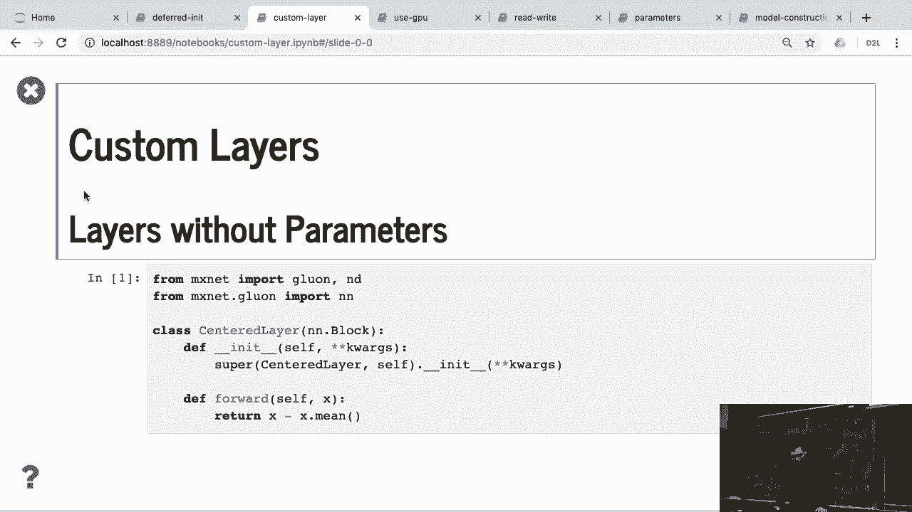
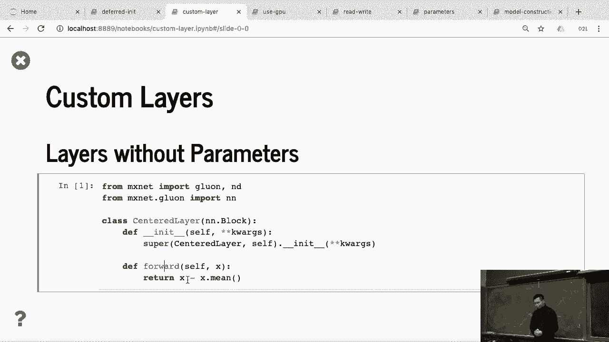
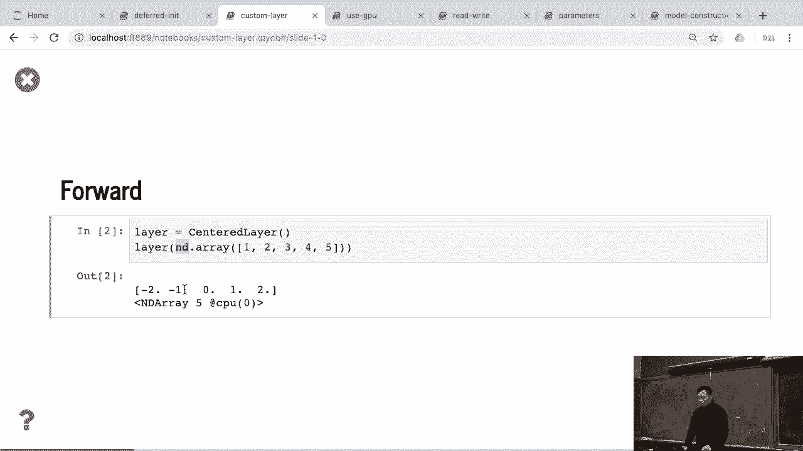
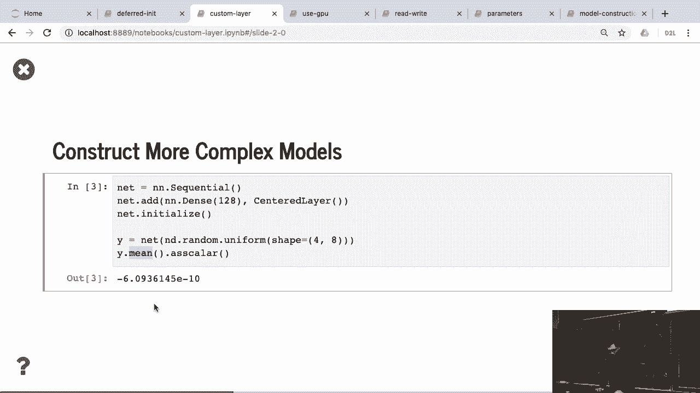
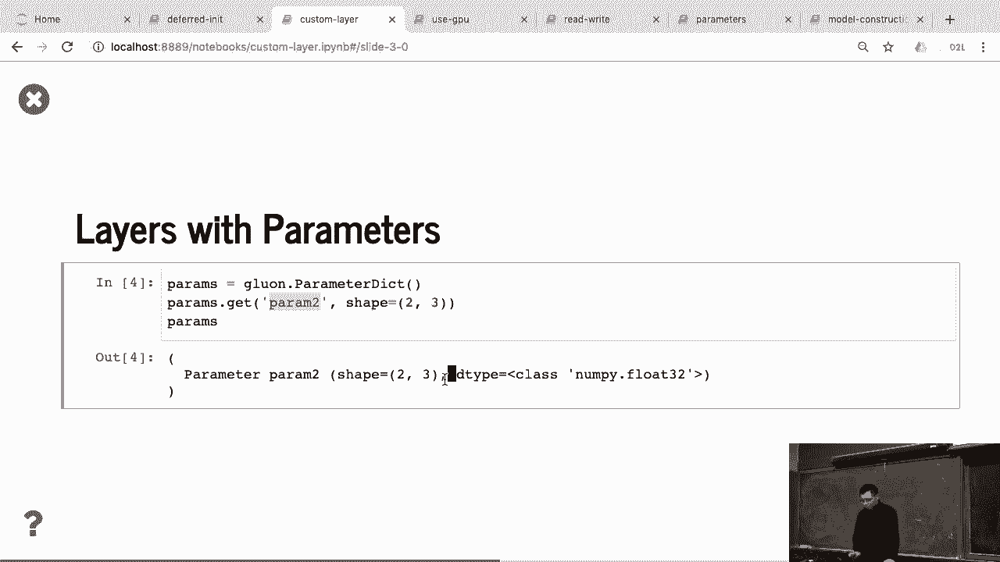
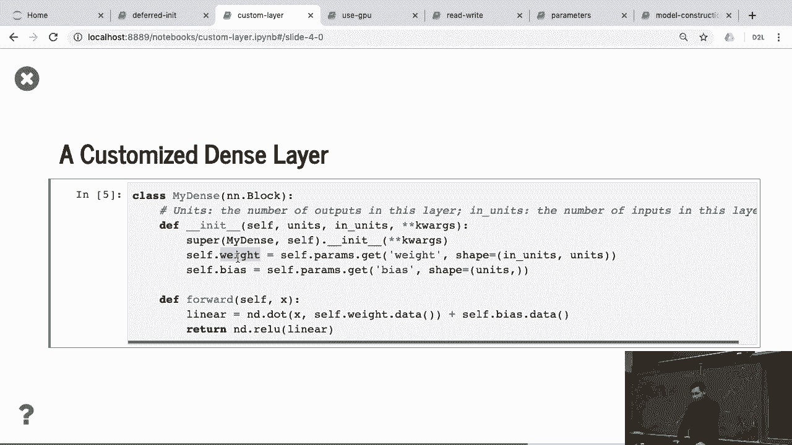
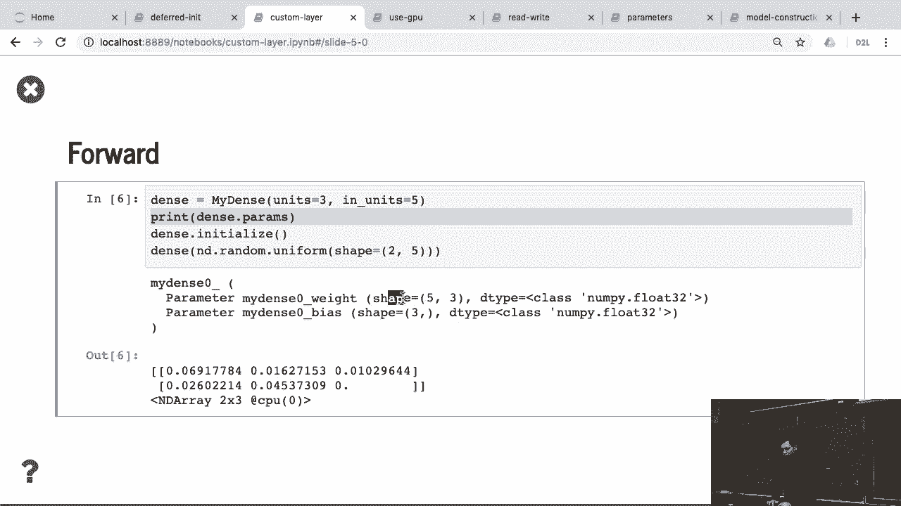
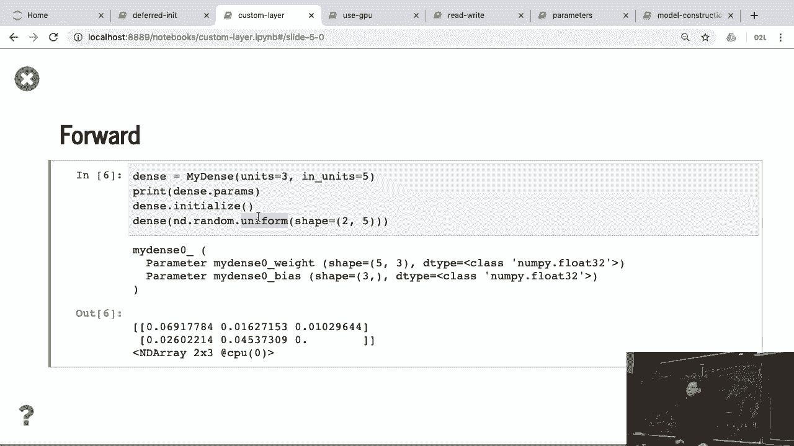
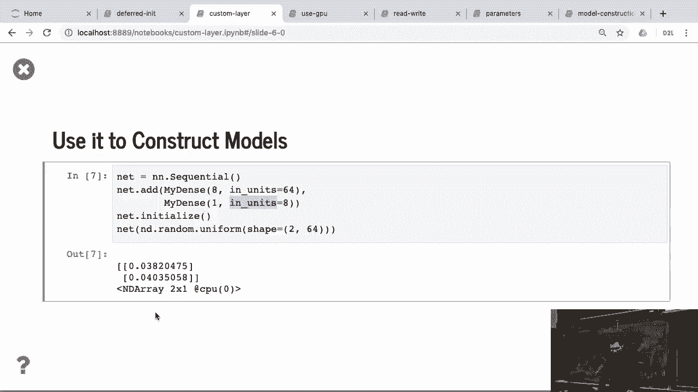

# 52：定制层 🧱



在本节课中，我们将学习如何在深度学习框架中自定义神经网络层。我们将从创建一个简单的无参数层开始，逐步深入到创建带有可学习参数（如权重和偏置）的层，并最终使用自定义层构建一个多层感知机。

---

## 概述

自定义层是深度学习研究中的重要工具，它允许我们实现新的算法思想或对现有层进行修改。通过继承基础层类并实现关键方法，我们可以创建符合特定需求的层。



## 创建无参数的自定义层

上一节我们介绍了自定义层的概念，本节中我们来看看如何创建一个简单的、无参数的自定义层。这个层的作用是将输入数据进行零中心化处理。



我们创建一个名为 `CenterLayer` 的类，它继承自基础块类 `nn.Block`。在初始化函数 `__init__` 中，我们调用父类的初始化器。在前向传播函数 `forward` 中，我们实现具体的计算逻辑：将输入 `x` 减去其均值，从而实现零中心化。

```python
class CenterLayer(nn.Block):
    def __init__(self, **kwargs):
        super().__init__(**kwargs)

    def forward(self, x):
        return x - x.mean()
```

使用这个层的方法很简单。以下是创建层实例并进行计算的步骤：

1.  实例化 `CenterLayer`。
2.  准备输入数据，例如一个张量 `[1, 2, 3, 4, 5]`。
3.  调用层实例，得到零中心化的输出 `[-2, -1, 0, 1, 2]`。



这个层本身可以视为一个简单的网络。同时，它也可以作为更复杂网络中的一个组件。例如，我们可以创建一个顺序网络，其中包含一个标准的全连接层和我们自定义的中心化层。

```python
net = nn.Sequential()
net.add(nn.Dense(128), CenterLayer())
```

在深度学习框架中，网络和层本质上都是基础块类的子类，这为灵活构建复杂模型提供了基础。

## 创建带参数的自定义层



上一节我们创建了一个无参数层，本节中我们来看看如何创建一个带有可学习参数（如权重和偏置）的自定义层。

首先，需要了解框架如何管理参数：所有参数都存储在一个参数字典中。我们可以通过指定层名、参数名和参数形状来向这个字典中注册一个新的参数。

以下是创建一个自定义全连接层 `MyDense` 的关键步骤：

1.  在 `__init__` 函数中，我们定义层的输入和输出大小。
2.  使用 `self.params.get` 方法创建权重参数 `weight`，其形状为 `(in_units, out_units)`。
3.  同样地，创建偏置参数 `bias`，其形状为 `(out_units,)`。
4.  在 `forward` 函数中，实现 `Y = X @ W + b` 的计算。

```python
class MyDense(nn.Block):
    def __init__(self, units, in_units, **kwargs):
        super().__init__(**kwargs)
        self.weight = self.params.get('weight', shape=(in_units, units))
        self.bias = self.params.get('bias', shape=(units,))

    def forward(self, x):
        linear = np.dot(x, self.weight.data()) + self.bias.data()
        return linear
```

与从零开始实现的不同之处在于，我们无需手动指定参数的初始化方法。框架允许我们在后续选择在何种设备上、使用何种方式（如 Xavier 初始化）来初始化这些参数。

使用这个自定义层的方法如下：



1.  实例化 `MyDense` 层，指定输出大小为 3，输入大小为 5。
2.  初始化该层的参数。此时，参数字典中会包含名为 `mydense0_weight` 和 `mydense0_bias` 的参数。
3.  给定一个随机输入 `X`，调用层实例即可得到计算结果 `Y`。

## 使用自定义层构建网络

现在，我们可以像使用标准层一样，使用自定义层来构建更复杂的神经网络，例如一个多层感知机。



以下是构建一个两层 MLP 的示例，其中第一层使用我们自定义的 `MyDense` 层：



```python
net = nn.Sequential()
net.add(MyDense(8, in_units=64),
        MyDense(1, in_units=8))
net.initialize()
```

这里有两个关键点需要注意：
*   我们需要为每个 `MyDense` 层显式指定 `in_units`（输入维度）。
*   在初始化网络时，框架会根据第一层的 `in_units=64` 来推断整个网络期望的输入形状。

假设我们的输入 `X` 的形状是 `(2, 64)`，经过这个网络计算后，我们将得到一个形状为 `(2, 1)` 的输出 `Y`。网络会自动确保第一层的输出维度（8）与第二层的输入维度（8）相匹配。

## 总结



本节课中我们一起学习了如何定制神经网络层。我们从创建一个无参数的中心化层开始，理解了层的基本结构。接着，我们创建了带有可学习权重和偏置的自定义全连接层，掌握了参数注册和管理的方法。最后，我们成功使用自定义层构建了一个功能完整的双层感知机。掌握自定义层的创建，是进行深度学习模型研究和创新的重要基础。