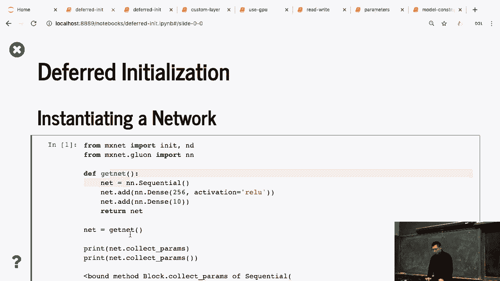
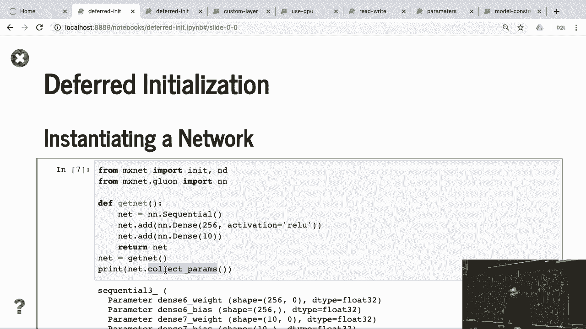
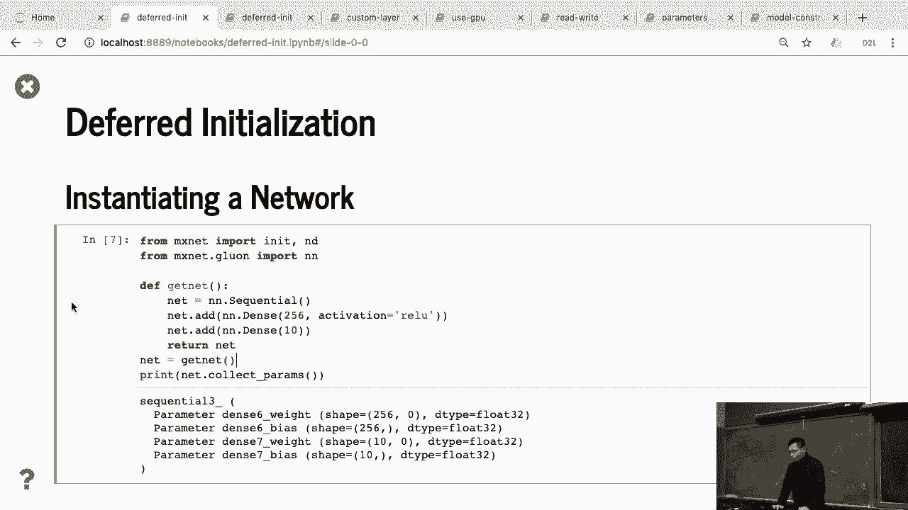
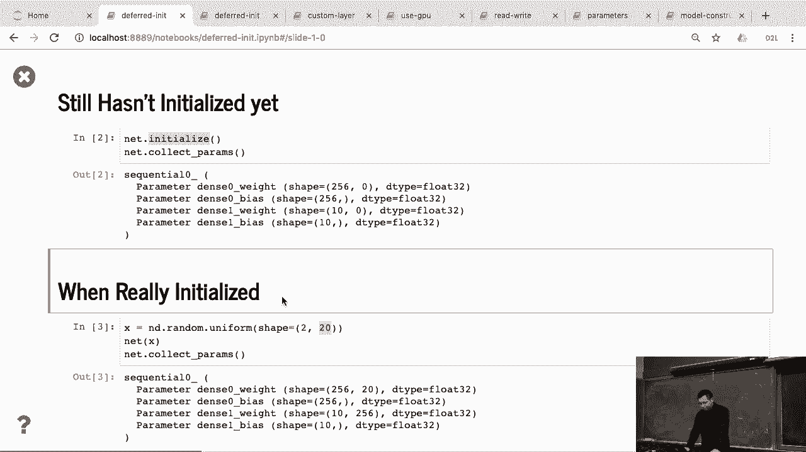
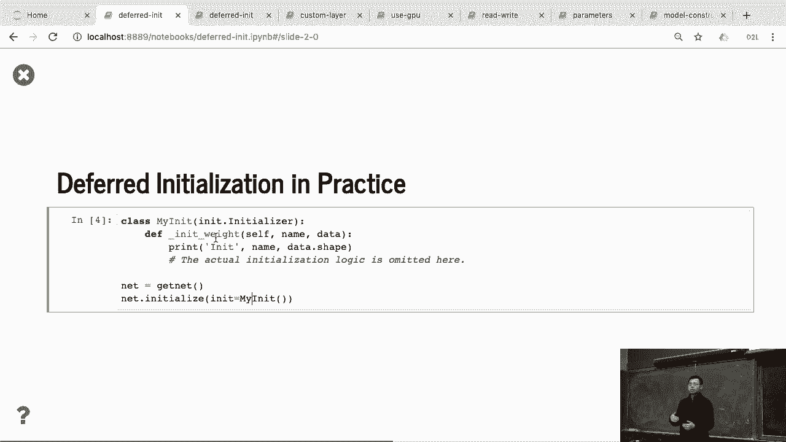
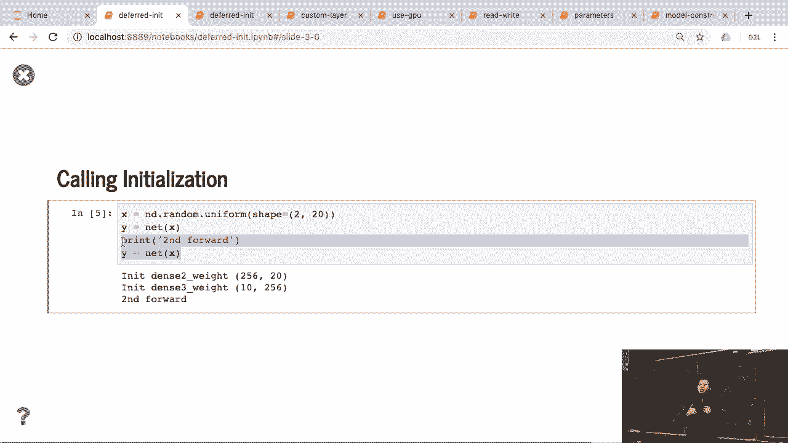
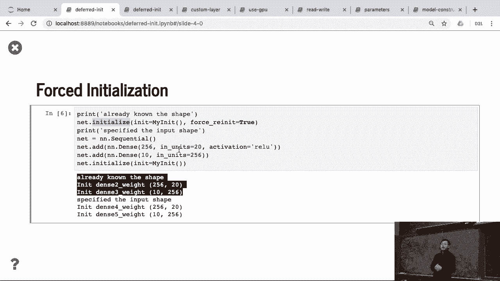
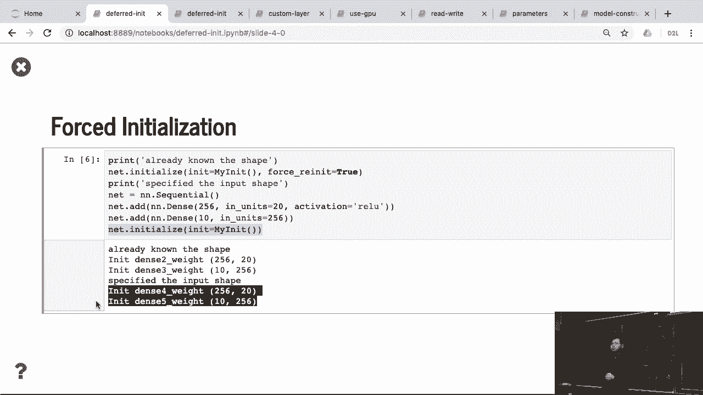

# 53：延迟初始化 🧠

在本节课中，我们将要学习深度学习框架中的一个重要概念——**延迟初始化**。我们将通过一个简单的两层全连接网络示例，来理解为什么以及如何延迟参数的初始化，直到我们获得输入数据的形状信息。



---

## 概述



延迟初始化是指神经网络参数的形状和内存分配，直到模型第一次接收到输入数据时才被确定和初始化。这样做的好处是，在定义网络结构时，我们无需预先指定输入维度，使得模型定义更加灵活。

上一节我们介绍了网络层的定义，本节中我们来看看参数初始化是如何被延迟的。

## 创建网络与参数检查

首先，我们创建一个包含两个全连接层的简单网络。

```python
net = nn.Sequential(nn.Dense(256), nn.Dense(10))
```

创建网络后，我们可以打印其参数。



```python
print(net.collect_params())
```

以下是返回的参数信息示例：
*   `dense0_weight` 的形状为 `(256, 0)`。权重矩阵的列数（输入维度）为0，因为我们尚未指定输入大小。
*   `dense0_bias` 的形状为 `(256,)`。偏置向量的形状是确定的，因为它只与输出维度（256）相关。
*   第二层 `dense1` 的参数情况类似，其权重形状也未知。

此刻，网络仅拥有部分参数信息，无法推断出所有权重矩阵的完整形状。

## 调用初始化函数

接下来，我们尝试调用初始化函数。

```python
net.initialize()
```

这个 `initialize()` 函数本身并不会立刻初始化所有权重。它只是设置了初始化方法（例如高斯分布、常数等）和目标设备。如果我们再次检查参数，会发现形状依然是一堆零，数据也无法访问，因为有效的内存尚未分配。

## 真正的初始化时刻

真正的初始化发生在网络第一次处理输入数据时。



```python
X = nd.random.uniform(shape=(2, 20))
Y = net(X)
```

当我们把形状为 `(2, 20)` 的输入 `X` 传入网络后，框架会进行前向传播。在这个过程中：
1.  第一层 `dense0` 知道了输入特征数是20，因此其权重形状被推断为 `(256, 20)`，并立即按预设方法进行初始化。
2.  接着，第一层的输出（256维）作为第二层的输入，因此第二层 `dense1` 的权重形状被推断为 `(10, 256)`，并完成初始化。

**关键点在于**：如果没有指定输入形状，在首次传入实际数据之前，我们无法访问或使用网络的参数。



## 验证初始化过程

为了更直观地看到初始化发生的时机，我们可以定义一个自定义初始化函数，在其中加入打印语句。

```python
def my_init(weight):
    print('Init', weight.name)
    weight[:] = nd.random.uniform(low=-10, high=10, shape=weight.shape)

net.initialize(init=my_init)
```

此时不会有任何输出，因为初始化函数未被调用。



当我们首次传入数据时：

```python
Y = net(X)
```

在 `net(X)` 执行前向计算之前，框架会调用我们的 `my_init` 函数来初始化每一层的参数。这时，我们会在控制台看到“Init dense0_weight”等打印信息。

需要注意的是，初始化通常只在第一次前向传播前发生。如果之后再次调用 `net.initialize()`，由于网络已经知晓所有参数形状，初始化函数会被立刻调用，这可能会覆盖已训练好的参数。



## 如何避免延迟初始化

如果你希望定义网络时就立即初始化参数，可以在创建层时直接指定输入大小。

```python
net = nn.Sequential()
net.add(nn.Dense(256, in_units=20))
net.add(nn.Dense(10, in_units=256))
net.initialize()
```

通过指定 `in_units`，每一层在创建时就知道其输入维度。此时调用 `initialize()`，所有参数会立刻被初始化。

## 总结



本节课中我们一起学习了**延迟初始化**机制。
*   它的核心优势是**灵活性**，允许我们在不知道输入数据具体形状的情况下定义网络结构。
*   参数的实际形状确定和内存分配，被推迟到网络**第一次执行前向传播**时。
*   这对于层数很多的复杂网络（如卷积神经网络）尤为重要，因为手动计算每一层的输入输出维度非常繁琐。
*   如果需要在定义网络后立即初始化，可以通过在层定义中指定 `in_units` 参数来实现。

理解延迟初始化，有助于我们更好地把握深度学习框架的工作流程，并在调试时明白参数何时才真正变得可用。