# 54：卷积基础 🧠

在本节课中，我们将要学习卷积神经网络（CNN）的核心概念——卷积操作。我们将从为什么需要卷积开始，逐步推导其数学形式，并通过直观的例子理解其工作原理。

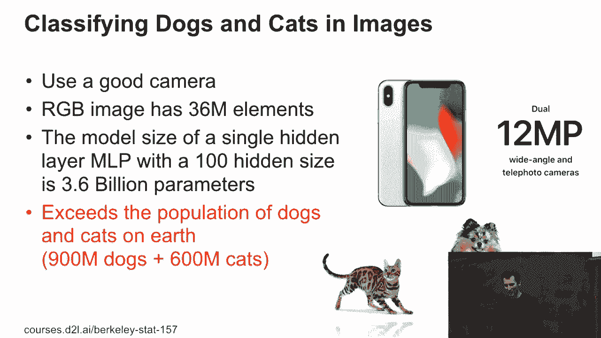

## 为什么需要卷积？🤔

上一节我们介绍了多层感知机在处理图像时面临的参数爆炸问题。本节中我们来看看卷积如何巧妙地解决这个问题。

假设我们有一张1200万像素的彩色图像。每个像素有红、绿、蓝三个通道，总共是3600万个数字。如果构建一个仅含100个隐藏单元的单隐藏层多层感知机，参数数量将达到约36亿个（3600万输入 × 100个隐藏单元）。这需要海量的数据来训练，现实中难以实现。

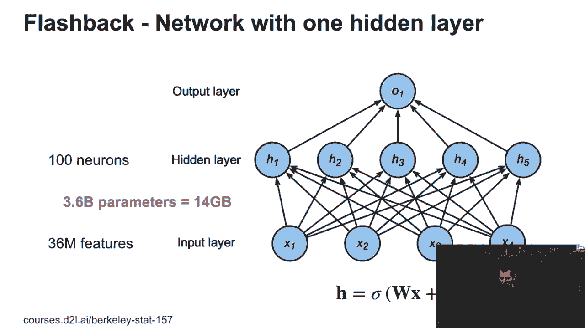

然而，现代图像识别系统效果很好，说明它们使用了不同的方法。卷积神经网络就是关键。

## 从全连接到卷积 🔄

卷积的思想源于图像的两个关键特性：**平移不变性**和**局部性**。

以“寻找瓦尔多”游戏为例。无论瓦尔多出现在图像的哪个位置，他的特征都是相同的。识别他主要依赖局部信息，而非整张图像的全局上下文。

对于一个全连接层，其计算可以表示为：
`h_ij = Σ_k Σ_l W_ijkl * x_kl`
其中 `h_ij` 是隐藏单元，`x_kl` 是输入像素。


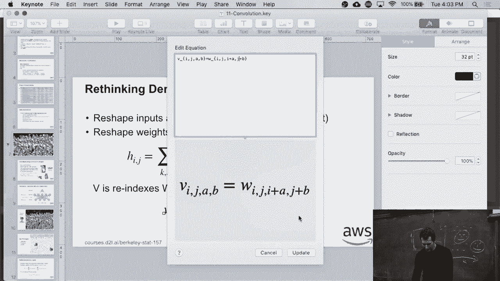

通过数学上的重新索引，我们可以将这个公式改写为：
`h_ij = Σ_a Σ_b v_ab * x_(i+a)(j+b)`
这本质上表达了一个操作：对于输出位置 `(i, j)`，其值由输入图像中以 `(i, j)` 为中心的局部区域加权求和得到。

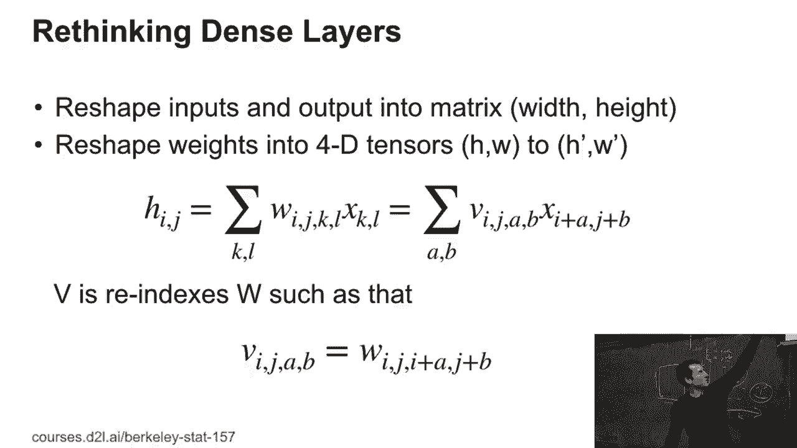

## 卷积的核心思想 🎯

基于平移不变性和局部性的假设，我们可以对上述公式进行两项关键简化：

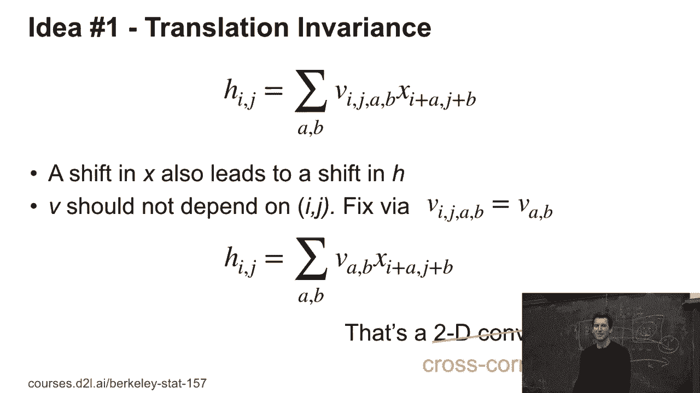

1.  **平移不变性**：滤波器权重 `v` 不应依赖于其在图像中的绝对位置 `(i, j)`，而只应依赖于相对偏移 `(a, b)`。因此，`v_ijab` 简化为 `v_ab`。这极大地减少了参数量。
2.  **局部性**：对于图像中某个点，我们只关心其邻近像素的影响。因此，求和范围 `a, b` 可以从 `-Δ` 到 `+Δ`，其中 `Δ` 是一个较小的数（如3或5）。

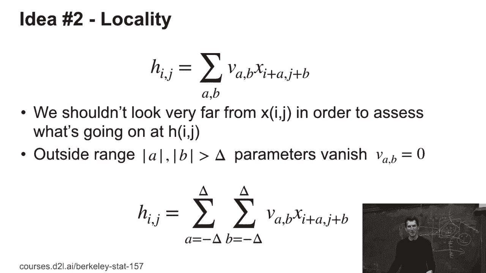

最终，我们得到卷积（更准确说是互相关）的标准公式：
`h_ij = Σ_(a=-Δ)^Δ Σ_(b=-Δ)^Δ v_ab * x_(i+a)(j+b)`

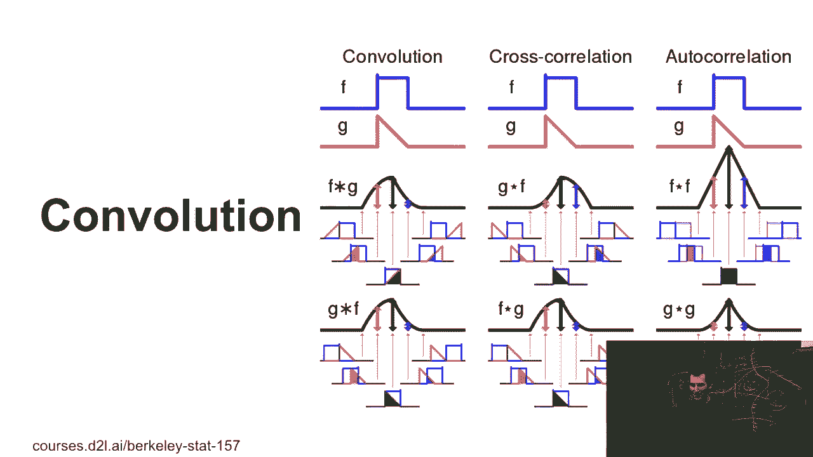

## 卷积操作实例 🧮

以下是卷积操作的一个具体例子：

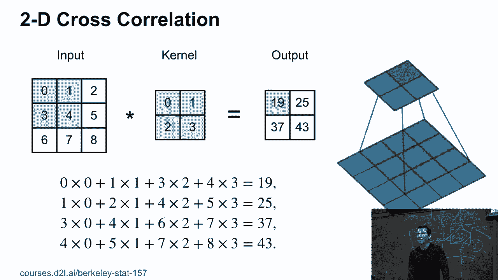

假设我们有一个3x3的输入图像 `X`：
```
[[0, 1, 2],
 [3, 4, 5],
 [6, 7, 8]]
```
以及一个2x2的卷积核 `K`：
```
[[0, 1],
 [2, 3]]
```
计算输出 `H` 的左上角元素 `H[0,0]`：
`H[0,0] = 0*0 + 1*1 + 2*3 + 3*4 = 0 + 1 + 6 + 12 = 19`
然后将卷积核向右滑动，计算 `H[0,1]`：
`H[0,1] = 0*1 + 1*2 + 2*4 + 3*5 = 0 + 2 + 8 + 15 = 25`
依此类推，得到最终的2x2输出：
```
[[19, 25],
 [37, 43]]
```

## 卷积层的公式与维度 📐

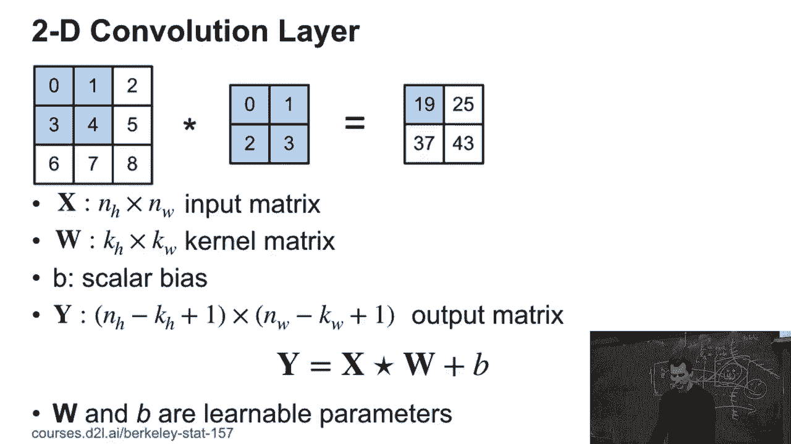

一个基础的卷积层可以形式化定义如下：

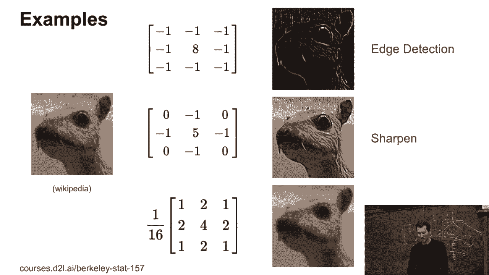

*   **输入**：一个形状为 `(n_h, n_w)` 的二维张量（图像）。
*   **卷积核**：一个形状为 `(k_h, k_w)` 的二维张量（滤波器）。
*   **输出**：一个形状为 `(n_h - k_h + 1, n_w - k_w + 1)` 的二维张量。
*   **计算**：`H[i, j] = Σ_(a=0)^(k_h-1) Σ_(b=0)^(k_w-1) K[a, b] * X[i+a, j+b] + b`
    其中 `b` 是一个可学习的偏置参数。

## 卷积的应用与扩展 🌐

卷积操作非常强大，可以用于实现各种图像处理功能，例如边缘检测、图像锐化或模糊。更重要的是，在深度学习中，卷积核的权重 `K` 是通过数据学习得到的，而非手工设计。

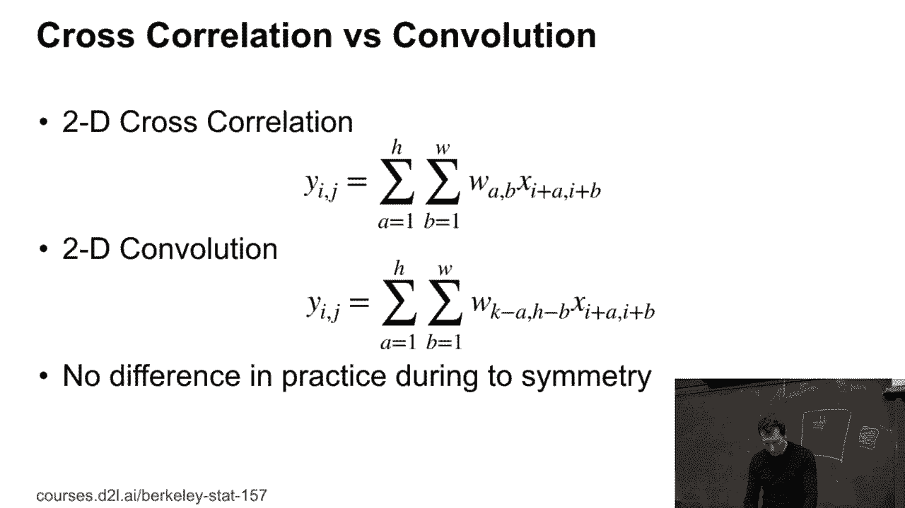

卷积的概念可以扩展到其他维度：
*   **一维卷积**：常用于处理时间序列数据或文本（尽管文本的平移不变性不完全成立）。
*   **三维卷积**：常用于处理视频（空间+时间）或医学体积图像（如CT扫描）。
*   **通道维度**：实际中，彩色图像有多个通道（如RGB），卷积核也会对应有多个通道，在空间和通道维度同时进行卷积。

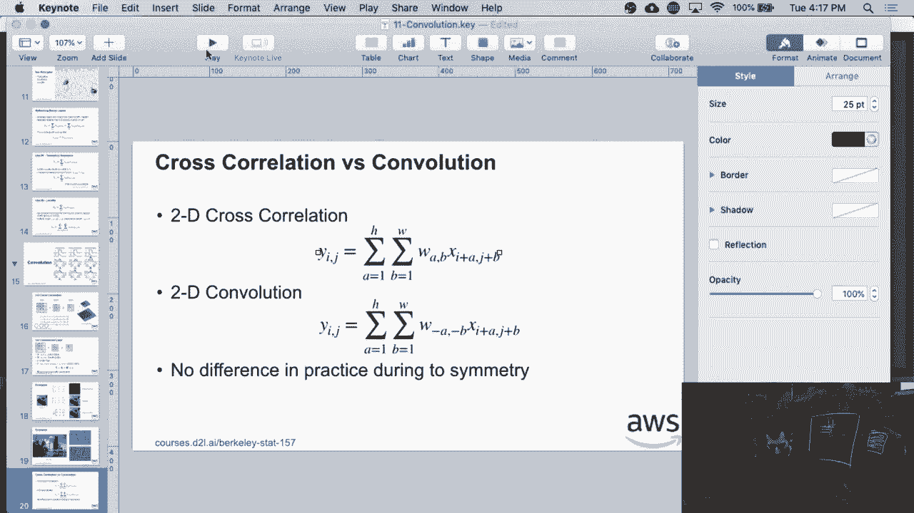

## 互相关 vs. 卷积 ⚙️

在深度学习的语境下，我们通常执行的是**互相关**操作，而非严格的数学**卷积**。两者的区别在于卷积核是否在计算前进行了翻转（旋转180度）。互相关不进行翻转，这更符合计算机内存的顺序访问模式，有利于缓存优化，且不影响模型的学习能力，因为学习算法会自动适应这种形式。

---

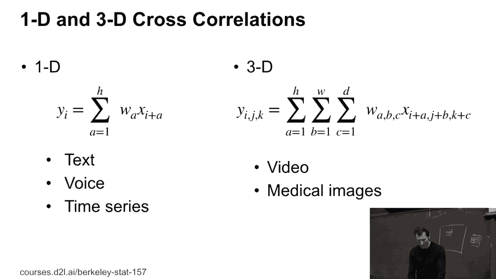

本节课中我们一起学习了卷积神经网络的基础——卷积操作。我们了解了其产生的动机（解决参数过多问题），推导了其数学形式（基于平移不变性和局部性），并通过实例直观理解了其计算过程。卷积是构建现代计算机视觉系统的基石，它通过共享权重和局部连接，极大地提升了网络处理图像的效率和能力。