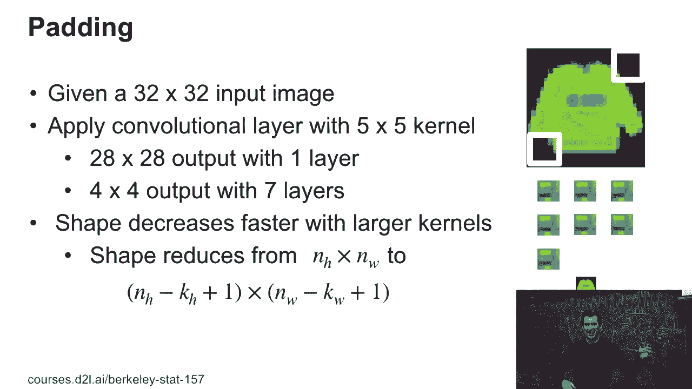
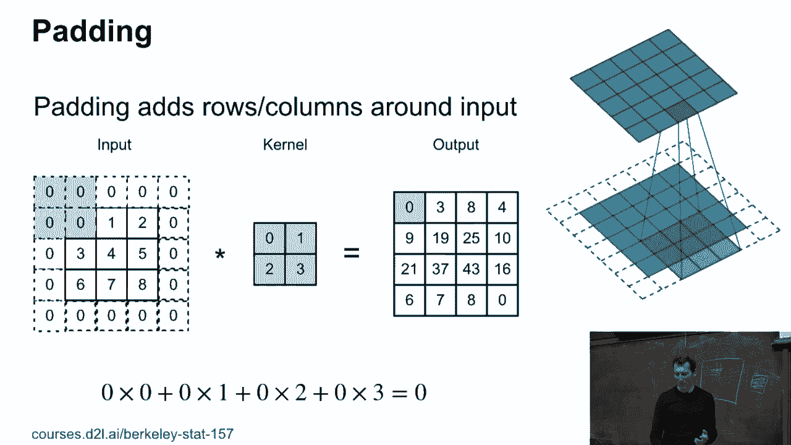
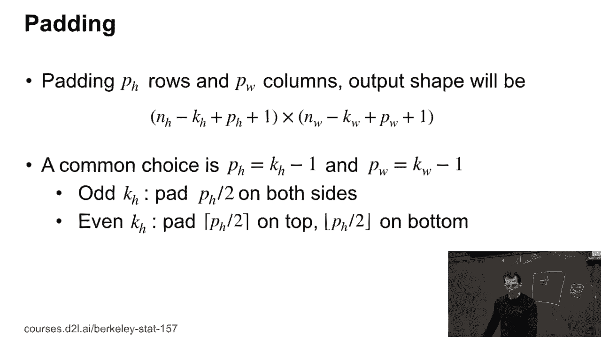
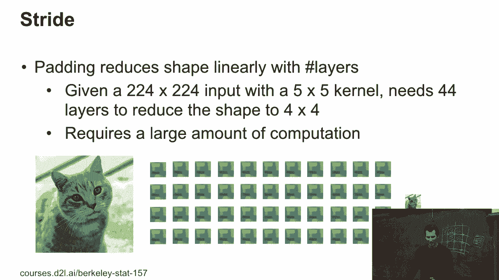
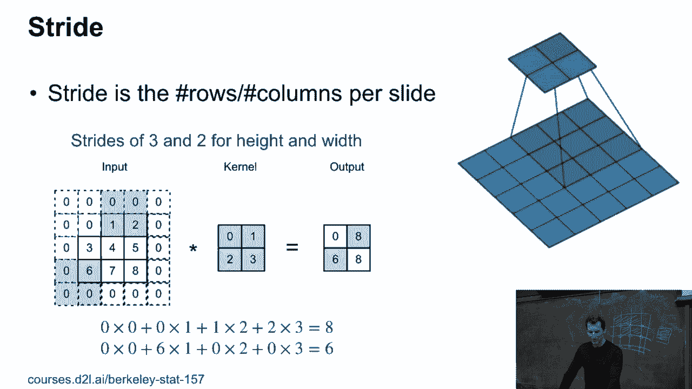
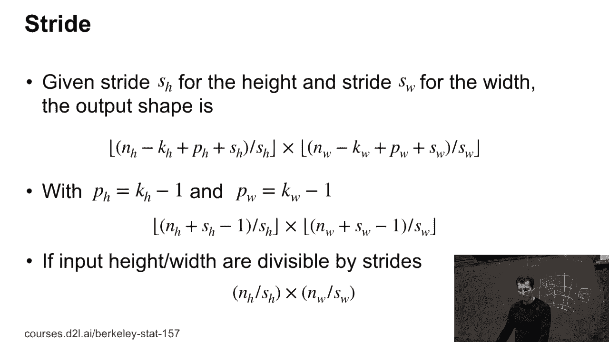

# 55：填充与步幅 🧩

在本节课中，我们将学习卷积神经网络中的两个重要概念：**填充**和**步幅**。它们分别用于控制卷积操作后输出特征图的大小，是构建有效网络结构的关键。

## 概述

当我们对图像应用卷积核时，输出尺寸通常会缩小。经过多层卷积后，图像可能变得非常小，甚至无法继续卷积。此外，有时我们也希望主动降低特征图的尺寸。填充和步幅就是用来解决这些问题的技术。

## 填充：保持输出尺寸

上一节我们提到了卷积会缩小图像尺寸。本节中我们来看看如何通过**填充**来保持输出尺寸与输入尺寸一致。

卷积操作的输出尺寸公式为：
`输出高度 = 输入高度 - 卷积核高度 + 1`
`输出宽度 = 输入宽度 - 卷积核宽度 + 1`

例如，一个32×32的输入图像，经过一个5×5的卷积核后，会得到一个28×28的输出。经过多层卷积后，图像会迅速变小。

为了解决这个问题，我们可以在输入图像的边缘周围添加额外的像素（通常是值为0的像素），这个过程就是**填充**。

通过填充，我们可以使卷积后的输出尺寸与原始输入尺寸相同。例如，一个3×3的图像与2×2的卷积核卷积，如果不填充，会得到2×2的输出。如果在周围填充一圈0，再进行卷积，就可以得到更大的输出。

以下是关于填充的一些常见做法：
*   通常使用**方形卷积核**（高度等于宽度）。
*   通常使用**奇数尺寸**的卷积核（如3×3，5×5）。
*   填充量通常为 `(卷积核尺寸 - 1) / 2`。例如，对于3×3卷积核，在上下左右各填充1个像素；对于5×5卷积核，则各填充2个像素。

这种对称填充的方式在构建复杂的网络架构（如Inception）时至关重要，它能确保不同路径输出的特征图在尺寸上保持一致，以便后续进行合并操作。

## 步幅：主动降低维度

上一节我们学习了如何使用填充来维持尺寸。本节中我们来看看如何使用**步幅**来主动、快速地降低特征图的维度。

步幅指的是卷积核在输入图像上每次移动的间隔。默认步幅为1，即卷积核每次移动一个像素。如果我们将步幅设置为2，卷积核就会每次跳过1个像素，这样输出的特征图尺寸就会减半。

以下是步幅操作的核心思想：
*   通过跳过一些位置，实现对输入特征的**子采样**。
*   可以非常高效地减少数据尺寸和计算量。
*   常与池化（如最大池化、平均池化）结合使用，共同实现下采样。

当引入步幅后，输出尺寸的计算公式变为：
`输出高度 = floor((输入高度 + 2*填充高度 - 卷积核高度) / 步幅高度 + 1)`
`输出宽度 = floor((输入宽度 + 2*填充宽度 - 卷积核宽度) / 步幅宽度 + 1)`

其中 `floor()` 表示向下取整，这是因为当剩余空间不足以进行一次完整的卷积核滑动时，操作就会停止。

*（图示展示了步幅为2和3时的卷积核移动方式）*

幸运的是，在现代深度学习框架（如PyTorch、TensorFlow）中，这些尺寸计算都是自动完成的。框架具备自动的形状推断功能，开发者无需手动计算每一层的输出尺寸，这极大地简化了构建深层网络的复杂度。

## 总结

本节课中我们一起学习了卷积神经网络中的两个基础概念：
1.  **填充**：通过在输入边缘添加像素（通常是0），可以**控制**卷积后输出特征图的尺寸，常用方式是保持输入输出尺寸相同。
2.  **步幅**：通过增大卷积核的移动间隔，可以**主动降低**输出特征图的尺寸，实现下采样并减少计算量。

理解并合理运用填充与步幅，是设计高效、有效卷积神经网络结构的重要一步。

