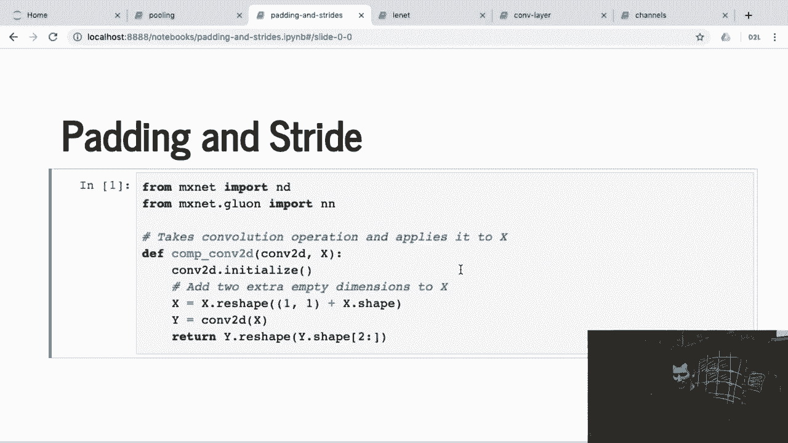
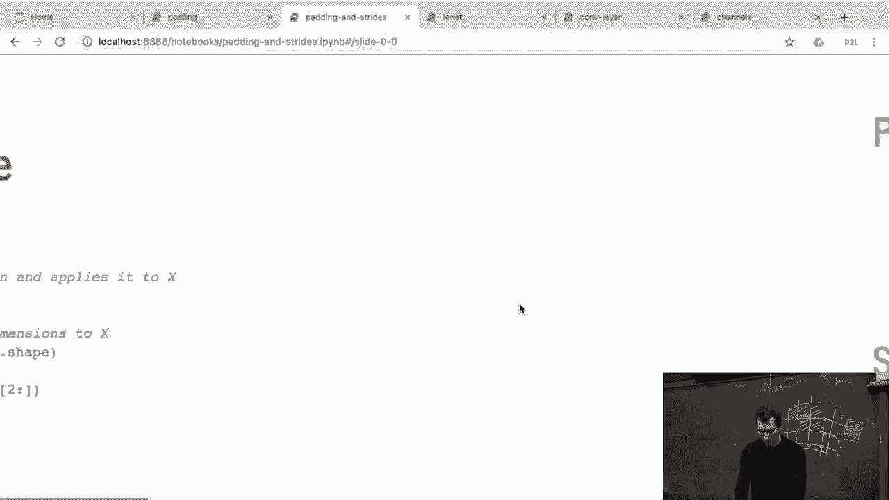
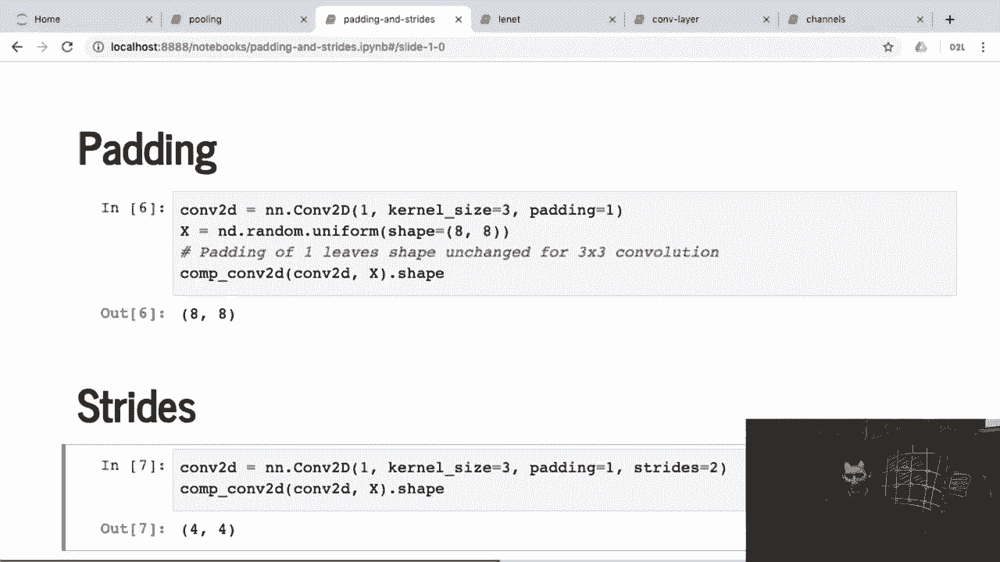
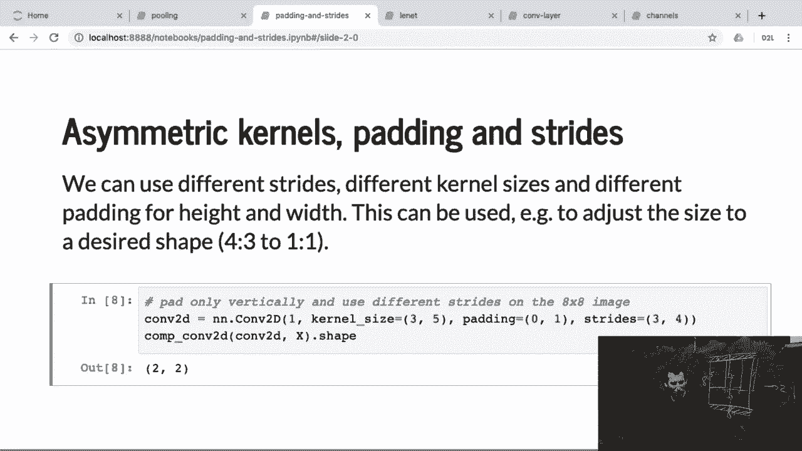

# 56：填充与步长在Python中的实现 🐍

在本节课中，我们将学习如何在Python中实现卷积操作中的填充（Padding）和步长（Stride）参数。我们将通过具体的代码示例，直观地理解这些参数如何影响卷积输出的尺寸。

## 概述

卷积神经网络（CNN）是深度学习的核心组件。在卷积操作中，除了卷积核本身，填充和步长是两个至关重要的超参数。它们直接决定了输出特征图的大小。本节我们将通过Python代码，手动实现一个简单的卷积过程，以验证不同填充和步长设置下的输出尺寸变化规律。

## 填充与步长的作用



上一节我们介绍了填充和步长的基本概念。本节中我们来看看如何在代码中应用它们。

填充是指在输入数据周围添加额外的像素（通常为0），以控制输出尺寸的缩小程度。步长则是指卷积核在输入数据上每次滑动的距离，它决定了采样的密度。



## 在Python中实现卷积

我们将实现一个简单的函数来模拟卷积操作，重点关注输入尺寸、卷积核尺寸、填充和步长如何共同决定输出尺寸。

以下是核心的计算输出尺寸的公式：
`输出高度 = floor((输入高度 + 2*填充高度 - 卷积核高度) / 步长高度) + 1`
`输出宽度 = floor((输入宽度 + 2*填充宽度 - 卷积核宽度) / 步长宽度) + 1`

让我们通过代码来验证这个公式。

```python
import numpy as np



def conv2d_output_size(input_size, kernel_size, padding=0, stride=1):
    """
    计算二维卷积后的输出尺寸。
    参数:
        input_size: 输入数据的尺寸 (高度, 宽度)
        kernel_size: 卷积核尺寸 (高度, 宽度)
        padding: 填充，可以是整数（等高宽）或元组 (高度填充, 宽度填充)
        stride: 步长，可以是整数（等高宽）或元组 (高度步长, 宽度步长)
    返回:
        输出数据的尺寸 (高度, 宽度)
    """
    # 处理参数，使其统一为 (高度, 宽度) 格式的元组
    if isinstance(padding, int):
        padding = (padding, padding)
    if isinstance(stride, int):
        stride = (stride, stride)
    
    # 应用公式计算
    output_height = (input_size[0] + 2*padding[0] - kernel_size[0]) // stride[0] + 1
    output_width = (input_size[1] + 2*padding[1] - kernel_size[1]) // stride[1] + 1
    
    return (output_height, output_width)
```

## 验证示例

现在，我们使用上面的函数来验证几个具体的例子，观察输出尺寸的变化。

### 示例1：对称卷积核与填充

假设输入是 `8x8` 的矩阵，使用 `3x3` 的卷积核，填充为 `1`，步长为 `1`。

```python
# 示例1
input_size = (8, 8)
kernel_size = (3, 3)
padding = 1
stride = 1

output_size = conv2d_output_size(input_size, kernel_size, padding, stride)
print(f"输入尺寸: {input_size}, 卷积核: {kernel_size}, 填充: {padding}, 步长: {stride}")
print(f"输出尺寸: {output_size}")
```
运行结果将是 `(8, 8)`。填充为1抵消了3x3卷积核带来的尺寸缩减，因此输入和输出尺寸保持一致。

### 示例2：引入步长

现在，保持其他参数不变，将步长改为 `2`。

```python
# 示例2
stride = 2
output_size = conv2d_output_size(input_size, kernel_size, padding, stride)
print(f"\n输入尺寸: {input_size}, 卷积核: {kernel_size}, 填充: {padding}, 步长: {stride}")
print(f"输出尺寸: {output_size}")
```
运行结果将是 `(4, 4)`。因为步长为2，卷积核每次跳过两个像素，所以输出尺寸减半。

### 示例3：非对称参数

以下是一个更复杂的例子，使用非对称的卷积核、填充和步长。

假设输入是 `8x8`，卷积核为 `3x5`（高3宽5）。我们在高度上不填充（`padding_height=0`），在宽度上填充1（`padding_width=1`）。步长在高度方向为3，宽度方向为4。

```python
# 示例3
input_size = (8, 8)
kernel_size = (3, 5) # 高度3，宽度5
padding = (0, 1)     # 高度填充0，宽度填充1
stride = (3, 4)      # 高度步长3，宽度步长4

output_size = conv2d_output_size(input_size, kernel_size, padding, stride)
print(f"\n输入尺寸: {input_size}, 卷积核: {kernel_size}, 填充: {padding}, 步长: {stride}")
print(f"输出尺寸: {output_size}")
```

我们来手动验证一下宽度方向的计算：
*   输入宽度：8
*   宽度填充：1（两边），所以有效宽度为 8 + 1*2 = 10
*   卷积核宽度：5
*   宽度步长：4
*   输出宽度 = floor((10 - 5) / 4) + 1 = floor(5/4) + 1 = 1 + 1 = 2

高度方向的计算：
*   输入高度：8
*   高度填充：0，所以有效高度为 8
*   卷积核高度：3
*   高度步长：3
*   输出高度 = floor((8 - 3) / 3) + 1 = floor(5/3) + 1 = 1 + 1 = 2

因此，最终输出尺寸为 `(2, 2)`，与代码计算结果一致。这个例子清晰地展示了非对称参数如何影响最终的输出形状。

## 总结



本节课中我们一起学习了填充和步长在卷积操作中的具体实现。我们通过Python代码定义了一个计算卷积输出尺寸的函数，并用三个例子进行了验证：
1.  对称的填充可以保持输出尺寸不变。
2.  步长大于1会减小输出尺寸，实现下采样。
3.  卷积核尺寸、填充和步长都可以是非对称的，需要分别计算高度和宽度方向的结果。

理解一次这个计算过程非常重要，之后在实际应用中，我们就可以依赖框架（如PyTorch、TensorFlow）或写好的函数来自动处理这些计算，而将重点放在网络结构的设计上。