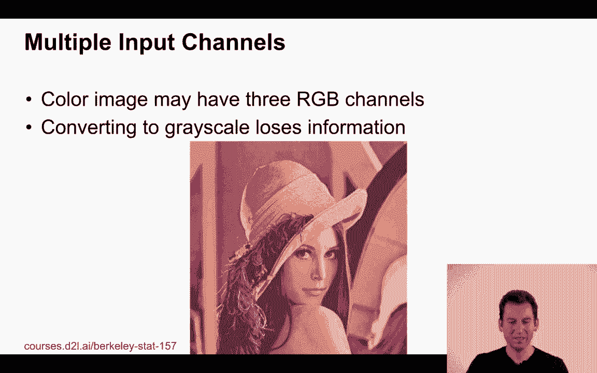
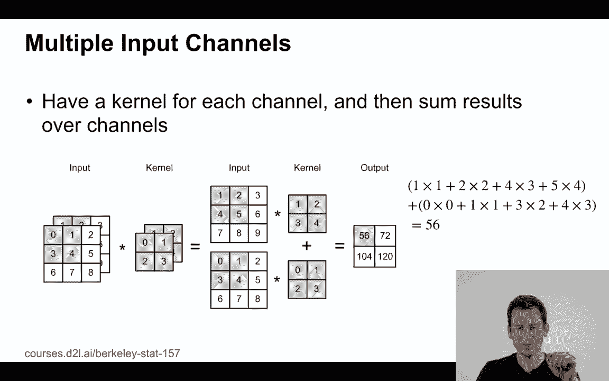
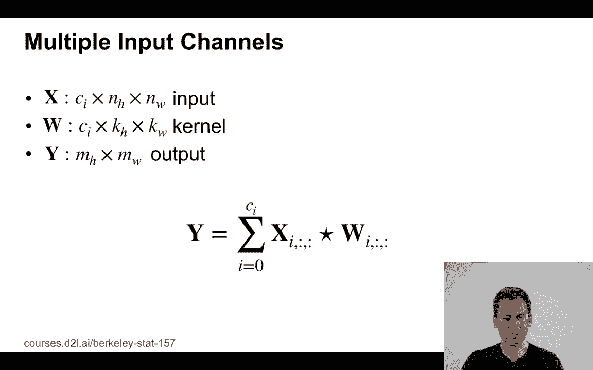
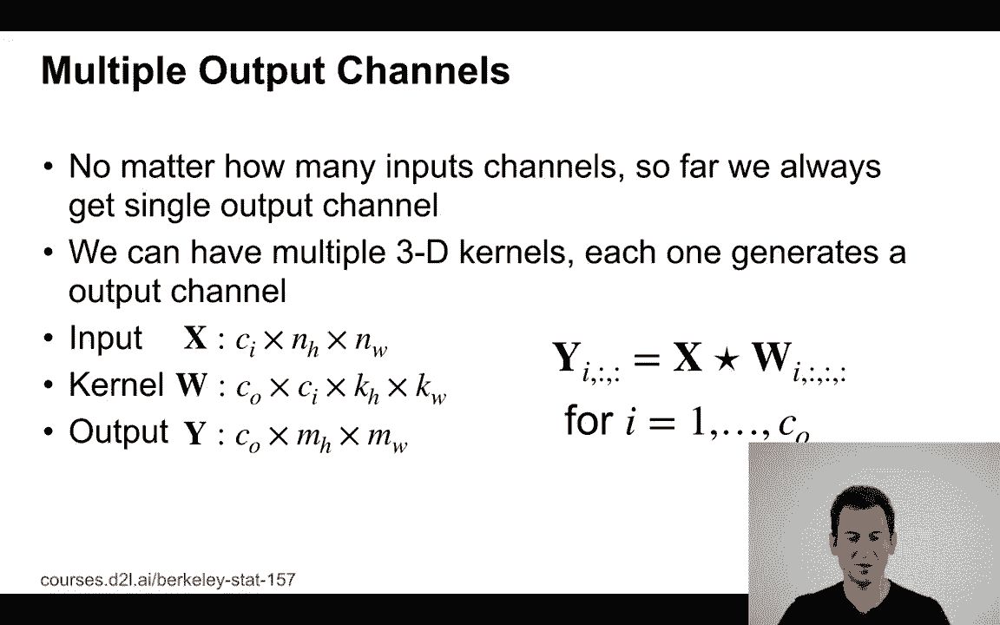
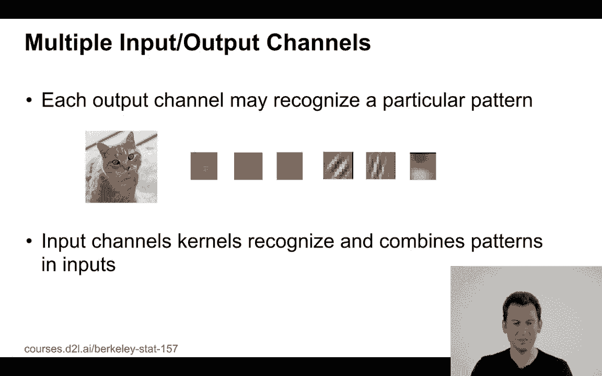
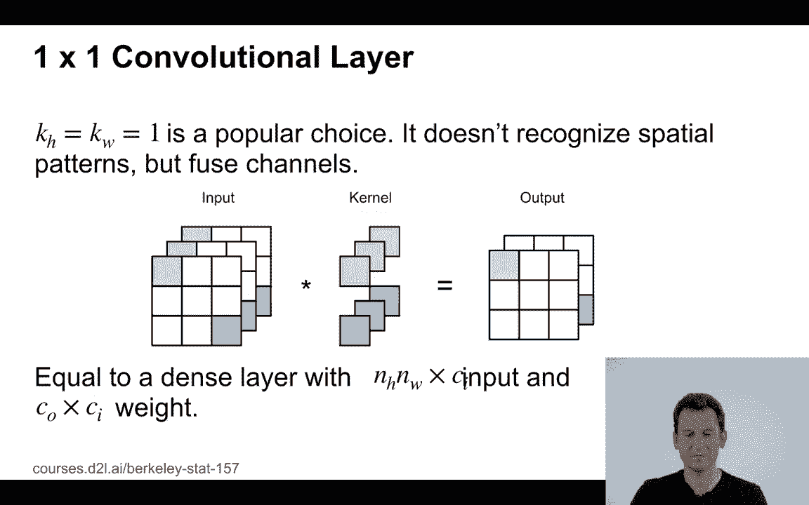
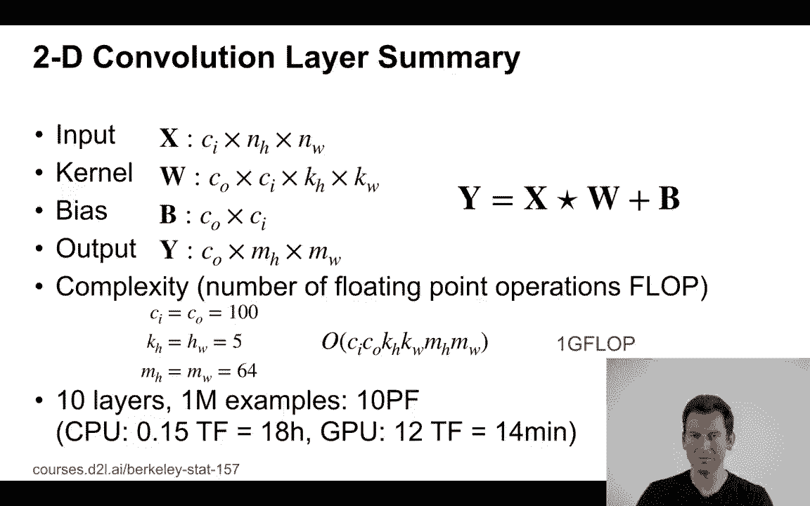

# 57：L11_6 通道 🧠

在本节课中，我们将要学习卷积神经网络中的一个核心概念：**通道**。我们将从灰度图像开始，逐步理解如何处理彩色图像中的多个通道，以及如何通过卷积操作生成多个输出通道。最后，我们会探讨计算成本，并理解为何GPU对深度学习如此重要。

---

## 从灰度图像到彩色图像 🖼️

到目前为止，我们主要处理的是灰度图像。这类图像只有亮度信息，像素值通常在0到255之间，用于表示从黑到白的亮度级别。例如，在Fashion MNIST数据集中，我们使用的就是这种单通道图像。

然而，灰度图像无法完全展现真实世界的丰富细节。请看下面这张著名的“Lena”测试图。它之所以在图像处理领域广为人知，是因为它包含了光滑的皮肤、纹理丰富的羽毛、模糊的背景和锐利的边缘等多种复杂细节，是测试算法的绝佳样本。

如果仅将其视为灰度图像，我们会丢失大量信息。为了处理彩色图像，我们需要理解**通道**的概念。

---

## 理解输入通道 🔴🟢🔵

一张彩色图像通常由红、绿、蓝三个颜色通道叠加而成。下图展示了“Lena”图被拆分为三个独立通道后的样子，每个通道都承载了不同类型的信息。

在卷积神经网络中，处理多通道输入的方法非常直观。我们不再使用单一的卷积核，而是为**每个输入通道配备一个卷积核**。网络会分别对每个通道进行卷积运算，然后将所有通道的卷积结果**相加**，最终得到一个二维的输出特征图。

这个过程可以用以下公式描述：

`输出[y, x] = 求和(输入通道c * 卷积核c[y, x]) + 偏置`

其中，输入数据的维度是 `[通道数, 高度, 宽度]`，卷积核的维度也相应地变为 `[输入通道数, 高度, 宽度]`。

---

## 引入输出通道 🎯

上一节我们介绍了如何处理多个输入通道，本节中我们来看看为什么以及如何生成多个输出通道。

单一的输出通道可能不足以捕捉图像中所有有用的特征。例如，我们可能希望同时检测垂直边缘、对角线、圆形区域或特定颜色区域。因此，我们需要多个输出通道，每个通道可能负责识别一种特定的模式。

实现方法很简单：我们不再只使用一组卷积核，而是使用**多组卷积核**。每组核都会与所有输入通道进行卷积，并生成一个独立的输出通道。最后，我们将这些输出通道在深度方向上**堆叠**起来，形成一个三维的输出张量。

此时，卷积核的维度变为 `[输出通道数, 输入通道数, 高度, 宽度]`。

---

## 特殊的1x1卷积层 ⚙️

在众多卷积操作中，**1x1卷积**是一个特殊且重要的存在。它听起来有些奇怪，因为1x1的核似乎只与单个像素进行运算。

实际上，1x1卷积的作用并非进行空间上的特征提取，而是**跨通道的信息整合**。它对所有输入通道的像素值进行线性组合（相当于一个全连接层），然后可能加上非线性激活函数。这等同于在**每个像素位置**应用了一个小型的前馈神经网络。

因此，1x1卷积常被用来升维、降维（减少计算量）或增加非线性，是构建高效网络（如GoogLeNet中的Inception模块）的关键组件。

---

## 计算成本与硬件选择 💻

一个标准的二维卷积层，其计算成本主要取决于以下几个因素：

以下是影响计算量的主要参数：
*   **输入通道数 (Ci)**：需要处理的通道数量。
*   **输出通道数 (Co)**：需要生成的通道数量。
*   **卷积核尺寸 (Kh, Kw)**：决定了每次卷积操作的浮点运算次数。
*   **输出特征图尺寸 (Ho, Wo)**：需要计算的位置数量。

总计算量可以粗略估算为：`Ci * Co * Kh * Kw * Ho * Wo` 次浮点运算。

让我们看一个例子：假设输入输出通道均为100，使用5x5卷积核，处理64x64的图像。单次卷积的计算量约为1 GFLOP（十亿次浮点运算）。对于一个10层的网络，在100万张图像上训练，总计算量将达到10 PFLOP（千万亿次）。

*   在每秒150 GFLOP的CPU上，这可能需要约18小时。
*   在每秒12 TFLOP（万亿次）的现代GPU上，相同任务可能只需14分钟。

这就是为什么在深度学习，尤其是处理图像等大数据时，使用GPU进行加速变得至关重要。

---

## 总结 📝

本节课中我们一起学习了卷积神经网络中“通道”的核心概念。

1.  **输入通道**：彩色图像包含多个通道（如RGB），卷积核需要与之匹配，分别卷积后相加。
2.  **输出通道**：使用多组卷积核可以生成多个输出通道，以捕捉不同类型的特征。
3.  **1x1卷积**：这是一种特殊的卷积，用于跨通道的信息融合与维度变换。
4.  **计算考量**：卷积网络的计算量巨大，其成本与通道数、核尺寸等线性相关，这解释了GPU在深度学习训练中的必要性。

理解通道是如何在卷积层中流动和变换的，是构建和理解复杂卷积神经网络的基础。