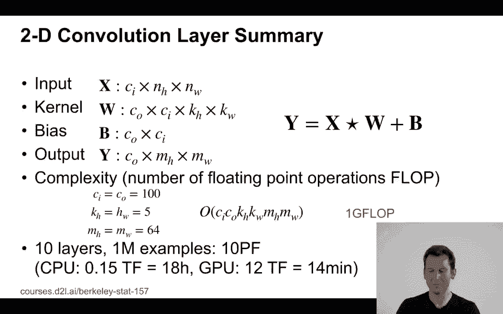
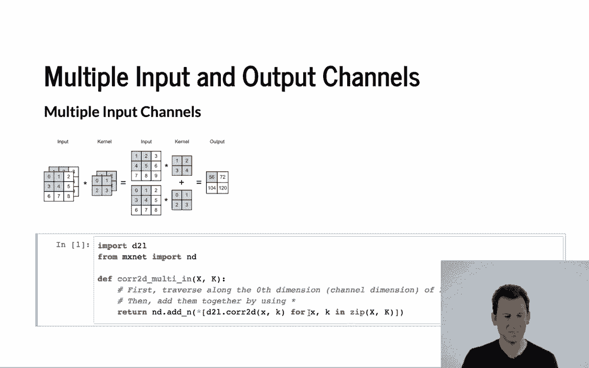
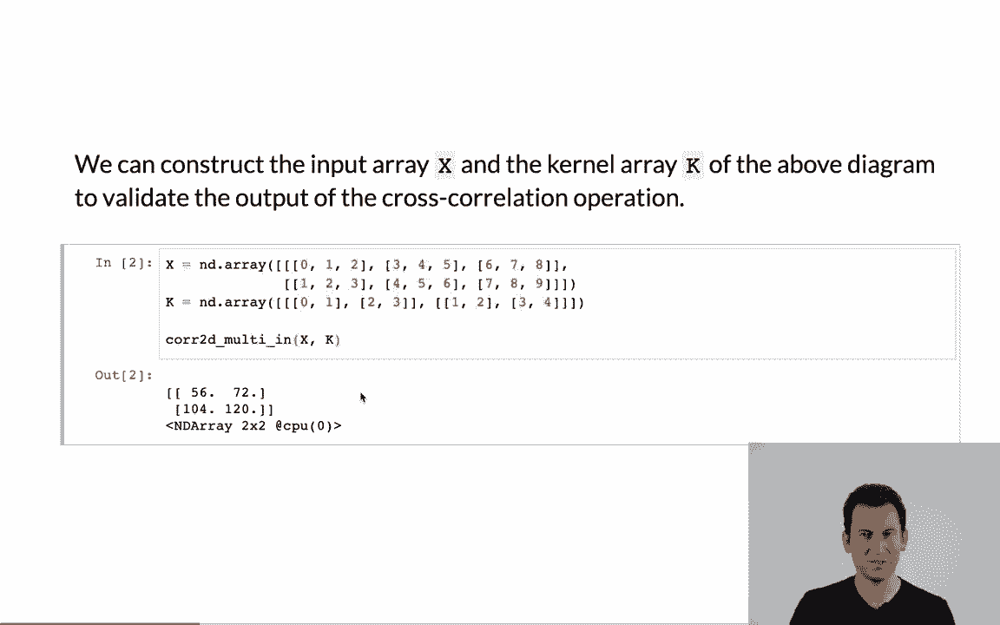
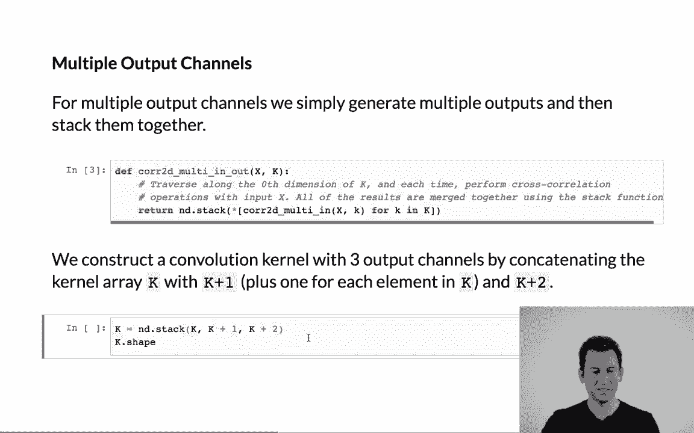
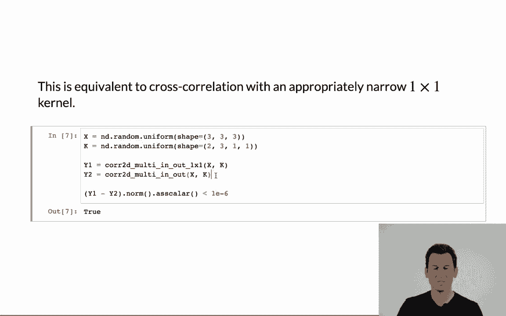

# 58：Python中的通道 🐍

在本节课中，我们将学习如何在Python中处理卷积神经网络中的多输入通道与多输出通道。我们将通过具体的代码示例，理解如何对多通道输入应用卷积核，以及如何生成多通道输出。



---

## 概述

卷积神经网络在处理图像等数据时，常常需要处理多个输入通道（例如RGB图像的三个颜色通道）并生成多个输出通道（即多个特征图）。本节将介绍如何用Python实现这些操作，并解释其背后的核心概念。

---

## 多输入通道

上一节我们介绍了单通道的卷积操作。本节中我们来看看如何处理具有多个输入通道的情况。

当输入数据有多个通道时，我们需要为每个输入通道配备一个独立的卷积核。计算时，分别对每个通道进行卷积操作，然后将所有通道的结果相加，得到最终的输出特征图。

以下是实现多输入通道卷积的关键步骤：



1.  为每个输入通道定义对应的卷积核。
2.  对每个通道的输入应用其对应的卷积核进行卷积运算。
3.  将所有通道的卷积结果相加，得到单通道的输出。

让我们通过代码来具体实现。首先，我们导入必要的库并定义一个基础的二维互相关运算函数。

```python
import torch
from torch import nn

def corr2d(X, K):
    """计算二维互相关运算。"""
    h, w = K.shape
    Y = torch.zeros((X.shape[0] - h + 1, X.shape[1] - w + 1))
    for i in range(Y.shape[0]):
        for j in range(Y.shape[1]):
            Y[i, j] = (X[i:i + h, j:j + w] * K).sum()
    return Y
```

接下来，我们实现处理多输入通道的函数。该函数接受一个多通道输入张量 `X` 和一个多通道卷积核张量 `K`，并返回卷积结果。

```python
def corr2d_multi_in(X, K):
    # 对每个输入通道进行互相关计算，然后求和
    return sum(corr2d(x, k) for x, k in zip(X, K))
```



现在，我们构造一个具有两个通道的输入张量 `X` 和一个对应的两通道卷积核 `K`，并应用上述函数。

```python
# 构造一个2通道的3x3输入
X = torch.tensor([[[0.0, 1.0, 2.0], [3.0, 4.0, 5.0], [6.0, 7.0, 8.0]],
                  [[1.0, 2.0, 3.0], [4.0, 5.0, 6.0], [7.0, 8.0, 9.0]]])
# 构造一个2通道的2x2卷积核
K = torch.tensor([[[0.0, 1.0], [2.0, 3.0]],
                  [[1.0, 2.0], [3.0, 4.0]]])

output = corr2d_multi_in(X, K)
print(output)
```

运行上述代码，我们将得到一个2x2的输出矩阵，这正是分别对两个通道卷积后相加的结果。

---

## 多输出通道



理解了多输入通道后，我们进一步探讨如何生成多个输出通道。每个输出通道可以捕捉输入数据中不同类型或不同抽象层次的特征。

为了实现多输出通道，我们只需为**每个输出通道**准备一组独立的卷积核。每组卷积核的通道数需要与输入数据的通道数相匹配。计算时，每组核独立地与输入进行卷积，生成一个输出通道。

以下是实现多输出通道卷积的步骤：

1.  定义卷积核张量，其形状为 `(输出通道数, 输入通道数, 核高度, 核宽度)`。
2.  对每个输出通道，使用其对应的那组卷积核与输入进行多通道卷积。
3.  将所有输出通道的结果堆叠起来，形成最终的多通道输出。

我们扩展之前的函数，使其支持多输出通道。

```python
def corr2d_multi_in_out(X, K):
    # K的形状: (输出通道数, 输入通道数, 核高度, 核宽度)
    # 对每个输出通道，计算其与输入X的互相关结果
    return torch.stack([corr2d_multi_in(X, k) for k in K], 0)
```

现在，我们构造一个具有3个输出通道的卷积核 `K`。我们可以通过简单地在现有核 `K` 的基础上加一个常数来生成新的核，以模拟不同的滤波器。

```python
# 在原始卷积核K的基础上，通过加常数构造3个输出通道的核
K = torch.stack((K, K + 1, K + 2), 0)
# 此时K的形状为 torch.Size([3, 2, 2, 2])
# 含义：3个输出通道，2个输入通道，2x2的卷积核

output_multi = corr2d_multi_in_out(X, K)
print(output_multi.shape)  # 输出 torch.Size([3, 2, 2])
print(output_multi)
```

运行代码后，我们得到一个形状为 `(3, 2, 2)` 的张量，表示有3个输出通道，每个通道是一个2x2的特征图。

---

## 1x1卷积层

最后，我们来看一个特殊的卷积操作：1x1卷积。它不进行空间维度（高和宽）上的特征提取，其核心作用是在通道维度上进行信息整合与变换。

1x1卷积可以理解为在每个像素位置上，对所有的输入通道值进行的一次全连接层计算。假设输入有 `c_i` 个通道，输出需要 `c_o` 个通道，那么1x1卷积核实际上是一个 `c_o x c_i` 的权重矩阵。

以下是1x1卷积的实现方式。我们首先将输入和核调整形状，然后利用矩阵乘法高效计算。

```python
def corr2d_1x1(X, K):
    """1x1卷积，通过矩阵乘法实现。"""
    c_i, h, w = X.shape
    c_o = K.shape[0]
    # 将X的形状转换为 (c_i, h*w)，将K的形状转换为 (c_o, c_i)
    X_reshaped = X.reshape((c_i, h * w))
    K_reshaped = K.reshape((c_o, c_i))
    # 全连接层中的矩阵乘法
    Y = torch.matmul(K_reshaped, X_reshaped)
    # 将输出形状转换回 (c_o, h, w)
    return Y.reshape((c_o, h, w))
```

为了验证其正确性，我们将其与使用标准卷积函数 `corr2d_multi_in_out` 计算1x1卷积的结果进行比较。

```python
# 构造一个3通道的3x3输入
X_1x1 = torch.normal(0, 1, (3, 3, 3))
# 构造一个2输出通道的1x1卷积核
K_1x1 = torch.normal(0, 1, (2, 3, 1, 1))

# 方法1：使用我们实现的1x1专用函数
Y1 = corr2d_1x1(X_1x1, K_1x1)
# 方法2：使用通用的多通道卷积函数
Y2 = corr2d_multi_in_out(X_1x1, K_1x1)

print(torch.abs(Y1 - Y2).sum() < 1e-6)  # 输出应为 True，表明结果相同
```

两种方法得到的结果在数值上是相等的，这证实了1x1卷积的本质是在每个像素位置应用一个微型全连接网络，对通道信息进行混合与变换。

---

## 总结

本节课中我们一起学习了Python中处理卷积通道的关键技术。



我们首先介绍了**多输入通道**的卷积，其方法是为每个输入通道配备卷积核，分别计算后求和。接着，我们探讨了**多输出通道**的生成，即为每个输出通道准备独立的卷积核组。最后，我们深入分析了**1x1卷积层**，它不感知空间信息，专门用于融合和变换通道特征，其计算等价于像素位置上的全连接操作。

理解这些通道操作是构建复杂卷积神经网络的基础，它们使得网络能够从输入中提取丰富且层次化的特征。