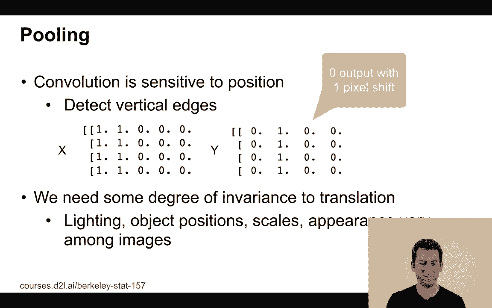
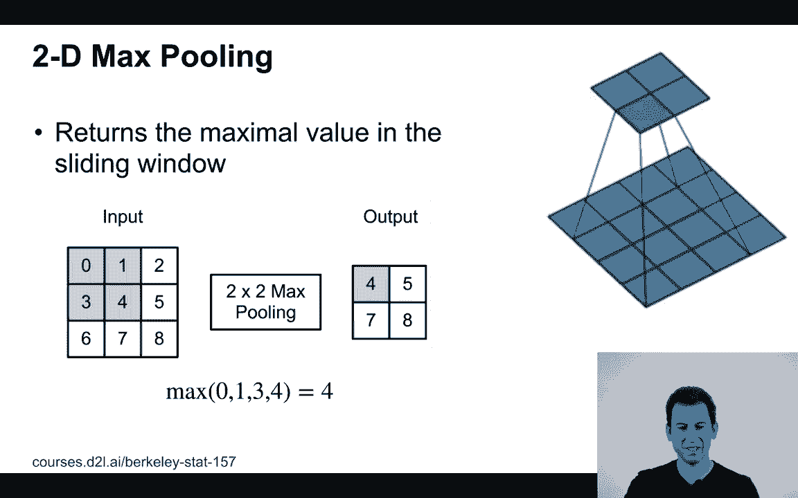
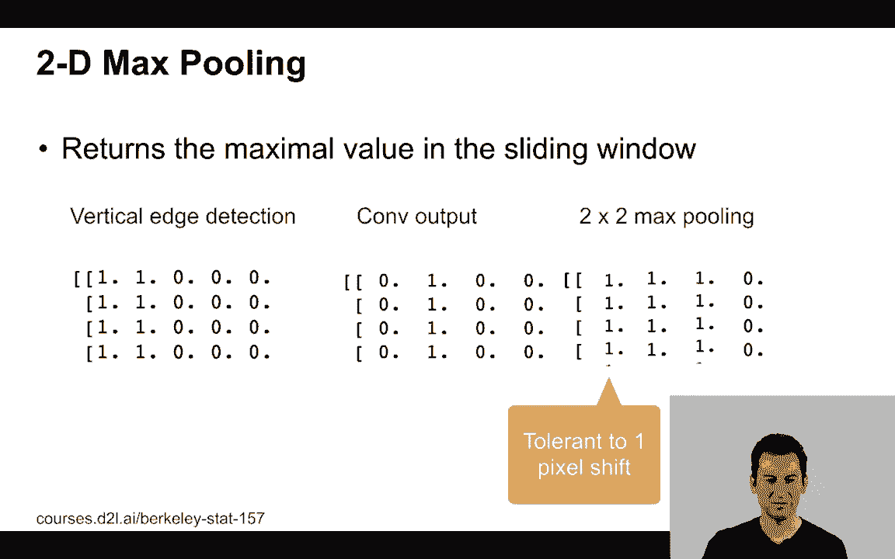
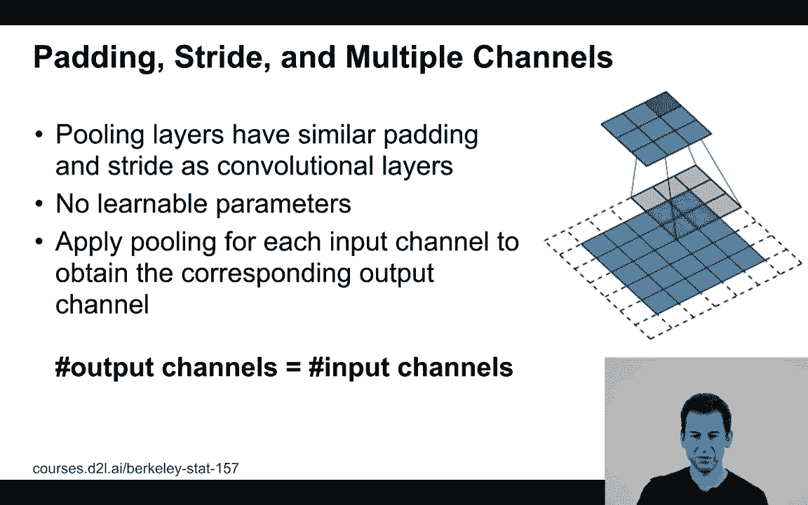
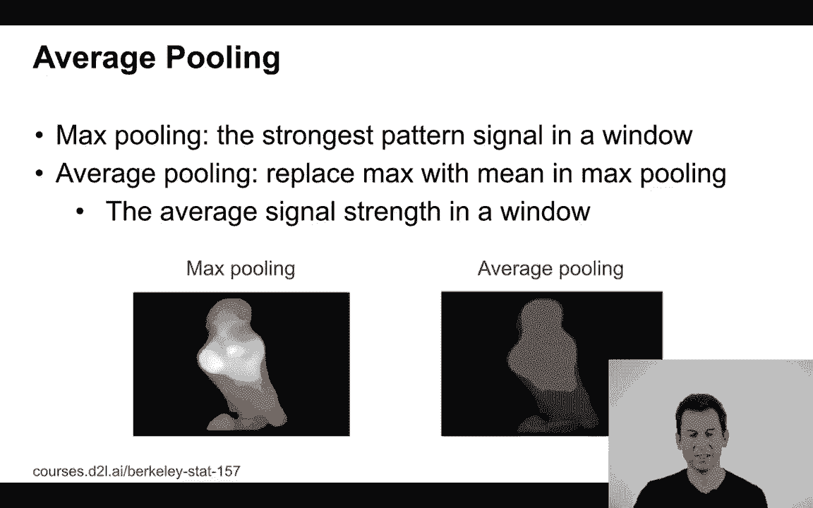

# 59：L11_8 池化 🧊

在本节课中，我们将要学习卷积神经网络中的池化层。池化是一种简单但非常有效的操作，它可以帮助网络获得对平移、尺度等变化的不变性，从而提升模型的鲁棒性。

## 池化的作用与动机

上一节我们介绍了卷积层，本节中我们来看看池化层。池化操作理解起来可能更为直观。让我们从一个简单的例子开始。

假设我们有一张非常原始的5x4像素图像，其左侧两列像素值为1，其余部分全为0。

如果对此图像应用一个边缘检测器，我们会在第二列检测到一个边缘。此时，如果我将图像向左或向右移动1个像素，这个边缘的位置也会随之移动1个像素。

虽然1个像素的位移听起来不多，但如果我们希望网络提取的特征具有平移不变性，即特征不依赖于其在图像中的精确位置，那么这种对位置的敏感性就会成为问题。特征完全依赖于其发生的具体位置。

因此，我们需要一种机制来为特征提供对平移、光照、物体位置、尺度、外观等变化的**不变性**。

这正是池化操作发挥作用的地方。

## 最大池化操作

接下来，我们详细看看最常用的池化操作之一：**2D最大池化**。

最大池化的操作流程如下：它接受一个输入（例如一个特征图），并定义一个滑动窗口（例如2x2大小）。对于窗口覆盖的每个区域，我们只取该区域内所有值的**最大值**作为输出。然后，窗口按照设定的步长（例如向右移动一个单元）滑动，重复此操作。

如果我们对一个3x3的输入进行2x2的最大池化（步长为1），我们会得到一个2x2的输出。在尺寸变化的语义上，这与卷积操作完全相同。不同之处在于，我们不再进行乘法和加法运算，而是执行取最大值的操作。

**公式表示**：对于一个2x2的池化窗口，输出值 `output[i, j]` 的计算方式为：
`output[i, j] = max(input[i:i+2, j:j+2])`

或者，如果我有一张4x4的图像，并在3x3的窗口上执行最大池化（步长为1），那么我将得到一个2x2的输出，正如我们在右侧图中看到的那样。

## 池化如何提供平移不变性

现在，让我们回到最初的例子，看看池化如何帮助实现平移不变性。

假设我们有一个垂直边缘检测器对图像进行卷积，得到了一个特征图。现在，对这个特征图应用2x2的最大池化。你会发现，即使原始图像中的边缘发生了1个像素的位移，经过池化后的输出特征可能保持不变或变化很小。

这正是我们想要的效果：池化使网络对微小的位置变化变得具有**容忍性**。

## 池化的参数：填充与步幅

与卷积层类似，池化层也可以使用填充和步幅来控制输出尺寸。

以下是关于池化参数的关键点：
*   **输入/输出通道**：池化是**按通道独立进行**的，因此输入和输出的通道数相同。
*   **步幅**：决定了滑动窗口每次移动的像素数。
*   **可学习参数**：池化层**没有**需要训练的参数（如权重）。
*   **填充**：如果你想保持输出特征图的空间尺寸（高度和宽度）不变，可以使用填充。例如，对一个输入应用3x3的最大池化，并在四周各填充1个像素，同时设置步长为1，就能得到尺寸不变的输出。

如果我想降低特征图的分辨率（这是一种常见的做法，可以逐步减少计算量并扩大感受野），我可以使用更大的步幅。例如，一个3x3的池化窗口，配合填充为1、步幅为2的设置，就会使输出尺寸减半。

## 平均池化与其他形式

除了最大池化，另一种常见的操作是**平均池化**。

平均池化的做法是：对于滑动窗口覆盖的每个区域，计算该区域内所有像素值的**平均值**，并将这个平均值作为输出。

**公式表示**：对于一个2x2的池化窗口，输出值 `output[i, j]` 的计算方式为：
`output[i, j] = mean(input[i:i+2, j:j+2])`

这是一个非常直观的操作。例如，当你用相机拍摄一张高分辨率照片，然后在软件中缩小图像尺寸时，图像处理软件执行的操作本质上就是一种平均池化，它在更大范围的像素上进行平均来生成新的像素值。

在卷积神经网络的发展早期，平均池化被广泛使用。但随着研究的深入，人们发现从平均池化转向**最大池化**通常能带来更高的识别准确率。因此，最大池化成为了当前的主流选择。

一个重要的例外是在网络的最后一层，有时会使用**全局平均池化**。这种操作会对整个特征图的每个通道计算平均值，得到一个固定长度的向量，常用于分类任务。我们将在后续课程中详细讨论这一点。

## 总结

本节课中我们一起学习了卷积神经网络中的池化层。我们了解了池化的核心目的是为网络特征提供**平移不变性**等鲁棒性。我们重点讲解了**最大池化**的操作方式，即取局部区域的最大值，并介绍了如何通过**填充**和**步幅**来控制输出尺寸。此外，我们还简要对比了**平均池化**，并指出最大池化是目前更常用的选择。池化层没有可学习参数，结构简单，但却是构建高效、鲁棒卷积神经网络的关键组件之一。