# 60：Python中的池化操作 🧮

在本节课中，我们将学习如何在Python中实现池化操作。池化是卷积神经网络中的一种重要技术，用于降低特征图的空间维度，同时保留最重要的信息。我们将从定义池化函数开始，逐步探讨最大池化和平均池化，并了解如何通过填充和步幅来控制输出尺寸。

## 概述

池化操作的核心目的是对输入数据的局部区域进行下采样，以减少计算量并增强特征的鲁棒性。本节将手动实现一个基础的池化函数，并使用MXNet的Gluon API进行更复杂的操作演示。

## 定义池化函数

首先，我们需要导入必要的库并定义一个基础的池化函数。这个函数将接收输入张量 `X` 和池化窗口大小作为参数。

```python
import mxnet as mx
from mxnet import nd

def pool2d(X, pool_size, mode='max'):
    """
    基础的2D池化函数实现。
    参数:
        X: 输入张量，形状为 (height, width)
        pool_size: 池化窗口大小，例如 (2, 2)
        mode: 池化模式，'max' 或 'avg'
    """
    p_h, p_w = pool_size
    # 计算输出形状（无填充，步幅为1）
    Y_h = X.shape[0] - p_h + 1
    Y_w = X.shape[1] - p_w + 1
    # 初始化输出张量
    Y = nd.zeros((Y_h, Y_w))
    
    # 遍历输出张量的每个位置
    for i in range(Y_h):
        for j in range(Y_w):
            # 提取当前池化窗口区域
            region = X[i: i + p_h, j: j + p_w]
            if mode == 'max':
                Y[i, j] = region.max()
            elif mode == 'avg':
                Y[i, j] = region.mean()
    return Y
```

这个实现非常简单，它忽略了通道维度、填充和步幅，仅用于说明池化的基本原理。接下来，我们将通过一个具体例子来观察其效果。

## 池化操作示例

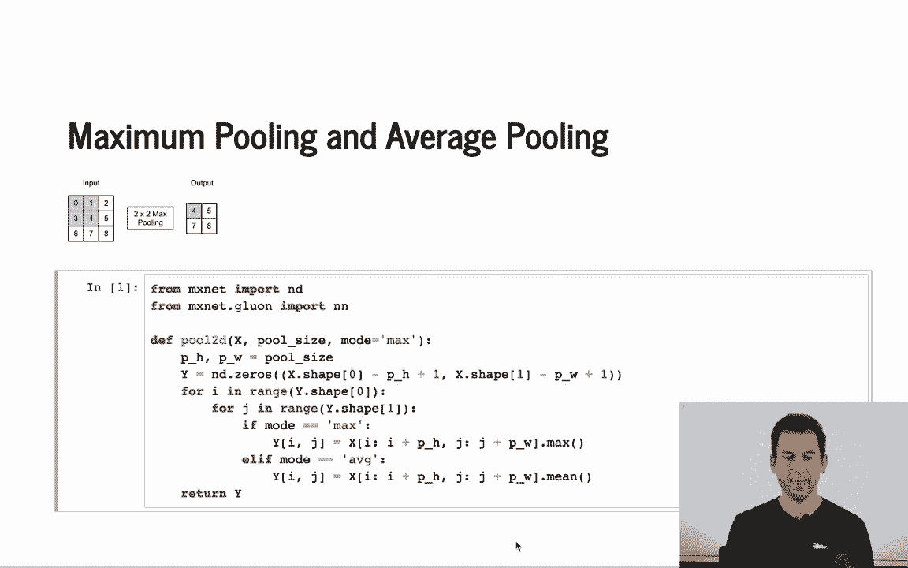

让我们对一个简单的矩阵应用池化操作，以直观理解其工作原理。

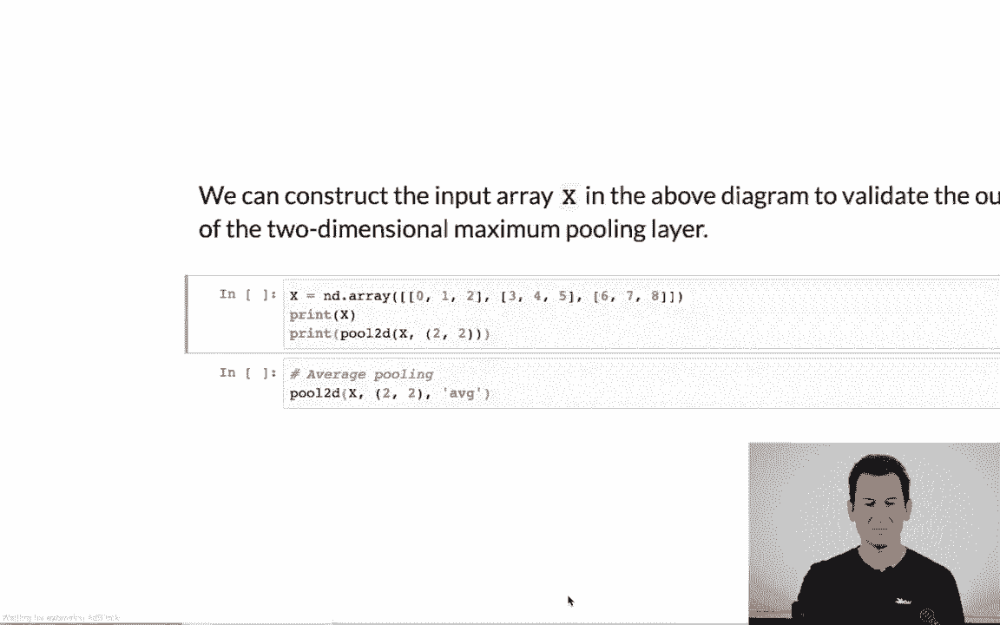

假设我们有一个包含数字0到8的3x3矩阵：

```python
X = nd.array([[0, 1, 2],
              [3, 4, 5],
              [6, 7, 8]])
```

### 最大池化

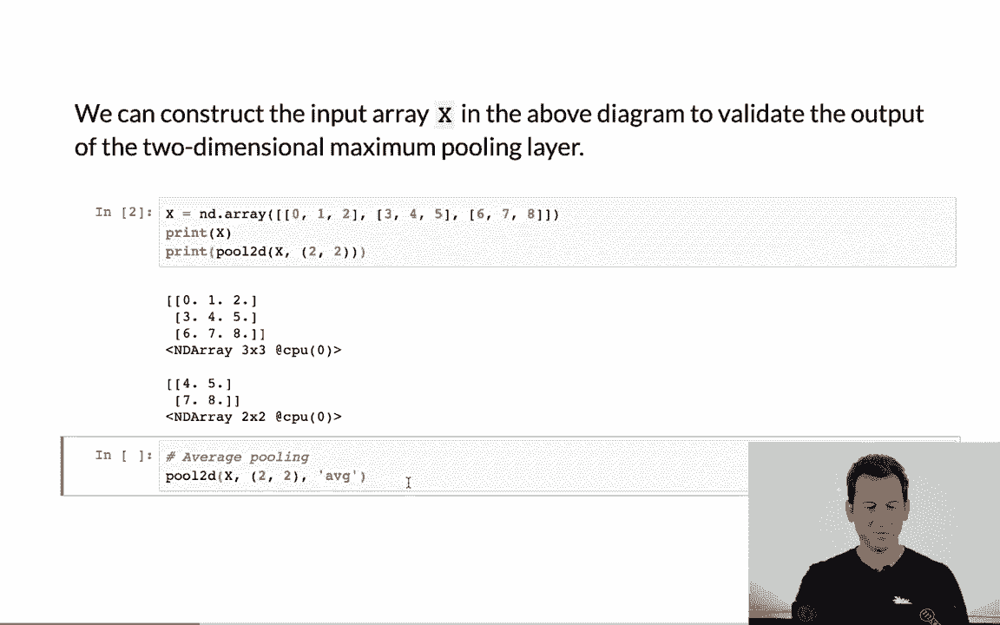

应用2x2的最大池化：

```python
Y_max = pool2d(X, pool_size=(2, 2), mode='max')
# 输出: [[4., 5.],
#        [7., 8.]]
```

对于第一个2x2窗口 `[[0,1],[3,4]]`，最大值是4。依此类推，得到最终结果。

### 平均池化

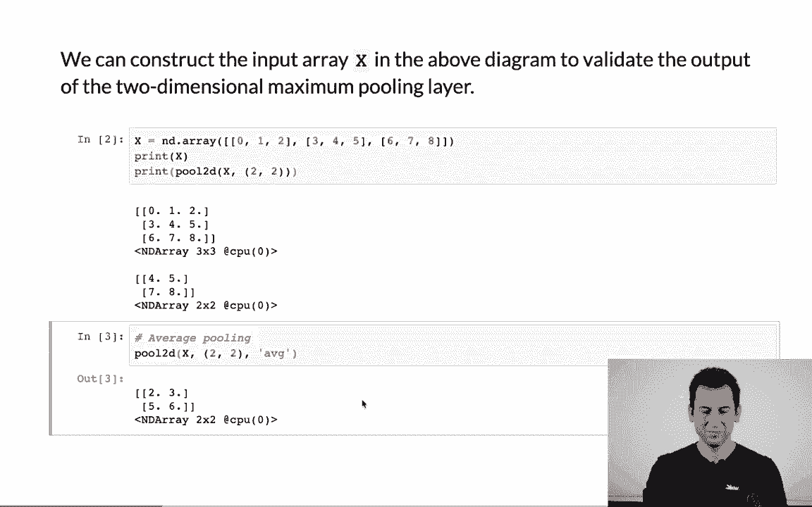

应用2x2的平均池化：

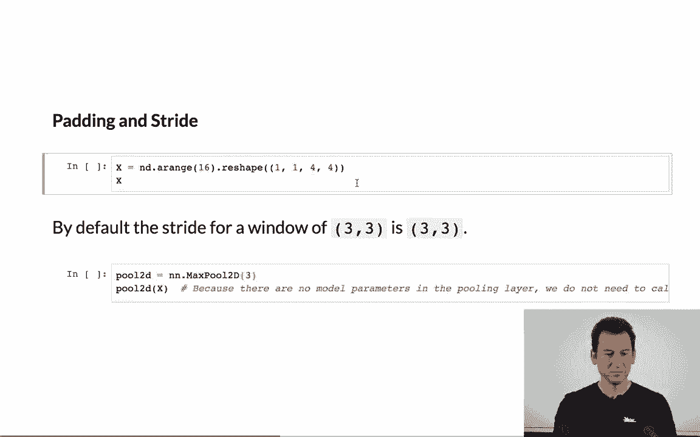

```python
Y_avg = pool2d(X, pool_size=(2, 2), mode='avg')
# 输出: [[2., 3.],
#        [5., 6.]]
```

对于第一个窗口，平均值是 `(0+1+3+4)/4 = 2`。第二个窗口 `[[1,2],[4,5]]` 的平均值是 `(1+2+4+5)/4 = 3`。

通过以上示例，我们看到了池化如何压缩数据。然而，实际应用中我们还需要考虑填充和步幅。

## 使用Gluon进行池化

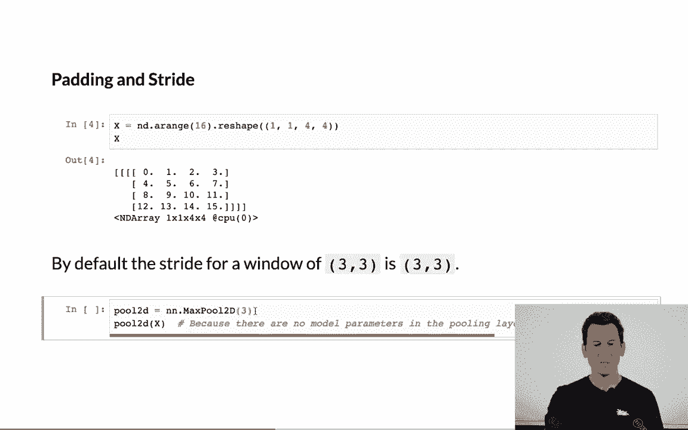

上一节我们手动实现了基础的池化。在实际深度学习中，我们使用框架提供的高效API。本节中我们来看看如何使用MXNet的Gluon模块进行更灵活的池化操作。

Gluon的 `nn` 模块提供了 `MaxPool2D` 和 `AvgPool2D` 层，它们支持填充、步幅和多通道输入。

首先，我们创建一个4x4的输入张量：

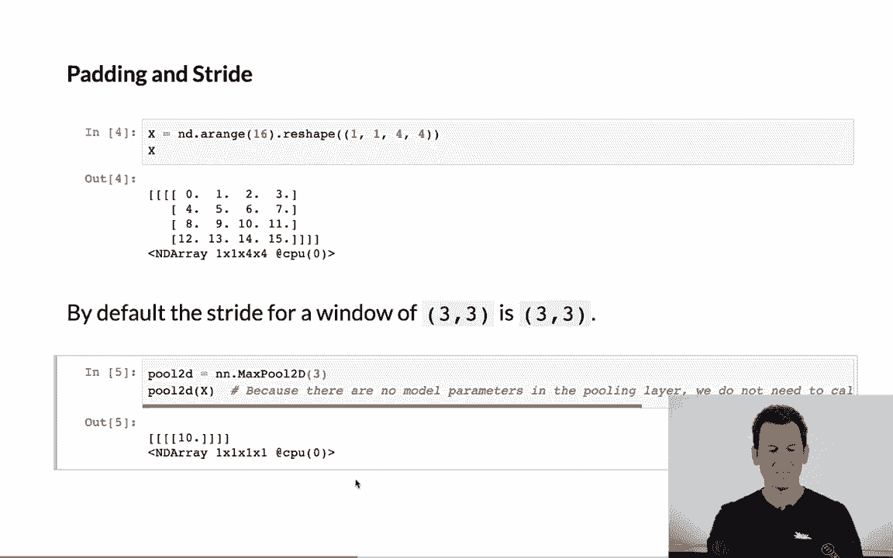

```python
X = nd.arange(16).reshape((1, 1, 4, 4))  # 形状：(批量大小, 通道数, 高, 宽)
```

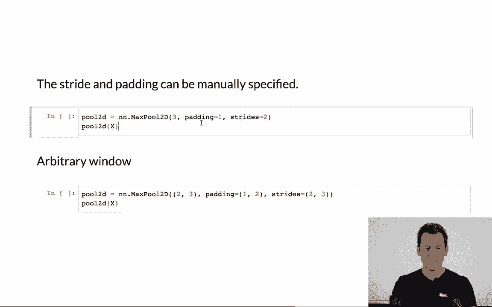

### 默认池化

创建一个3x3的最大池化层，默认步幅与池化窗口大小相同（即3）：

```python
from mxnet.gluon import nn
pool = nn.MaxPool2D(pool_size=3)
Y = pool(X)
# 输出形状: (1, 1, 1, 1)
# 输出值: [[[[10.]]]]
```

由于4x4的输入在应用3x3池化且步幅为3后，只有一个完整的窗口，其最大值为10。

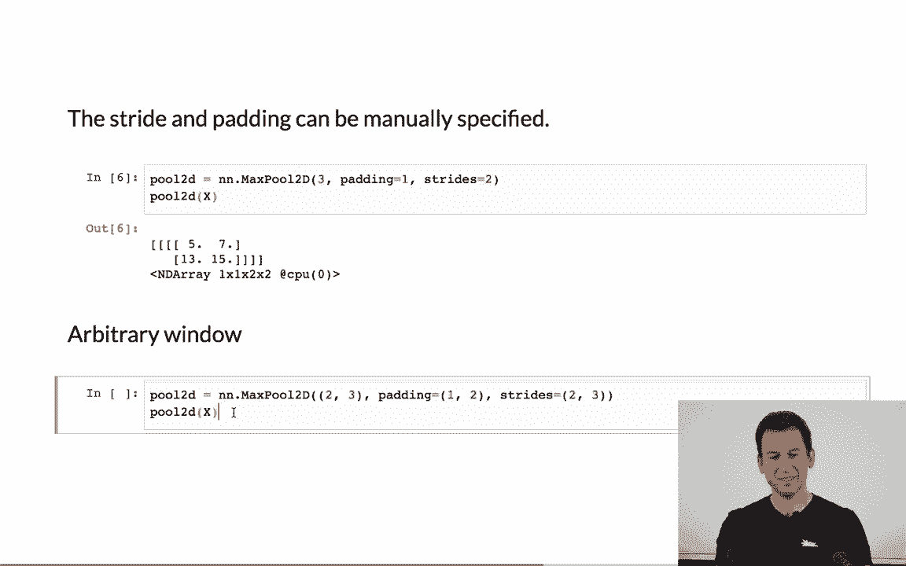

### 自定义填充和步幅

我们可以通过指定 `padding` 和 `strides` 参数来改变输出尺寸。

以下是使用填充为1、步幅为2的3x3最大池化示例：

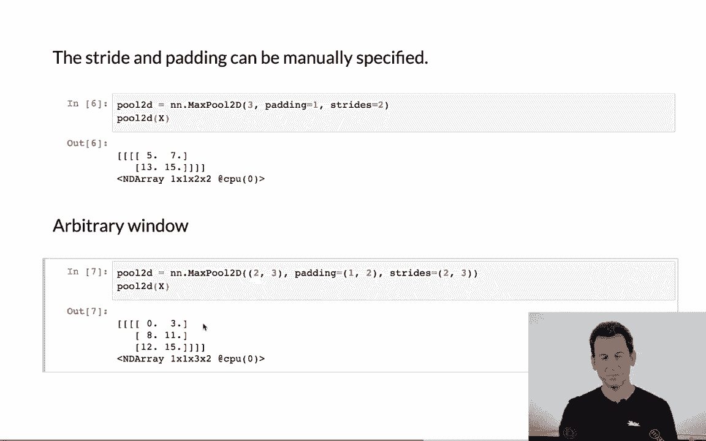

```python
pool = nn.MaxPool2D(pool_size=3, padding=1, strides=2)
Y = pool(X)
# 输出形状: (1, 1, 2, 2)
```

填充将输入“扩大”到6x6，然后步幅为2的3x3池化产生了2x2的输出。

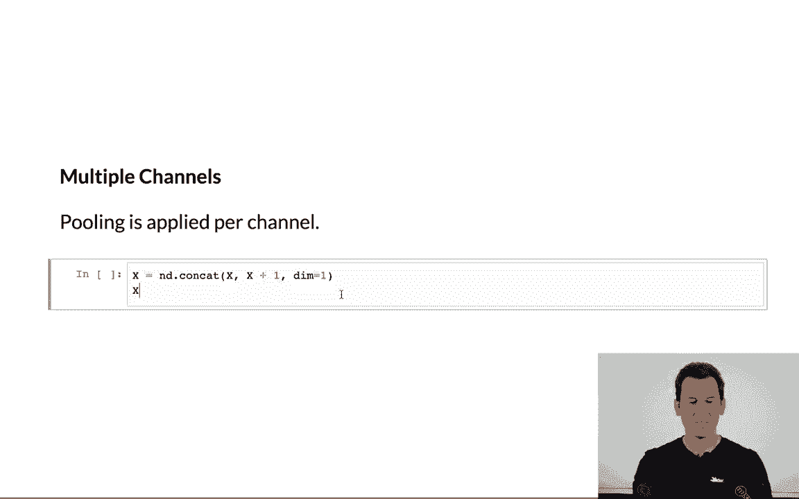

我们也可以使用非对称的窗口、填充和步幅：

```python
pool = nn.MaxPool2D(pool_size=(2, 3), padding=(1, 2), strides=(2, 3))
Y = pool(X)
# 输出形状: (1, 1, 3, 2)  # 3行，2列
```

### 多通道输入

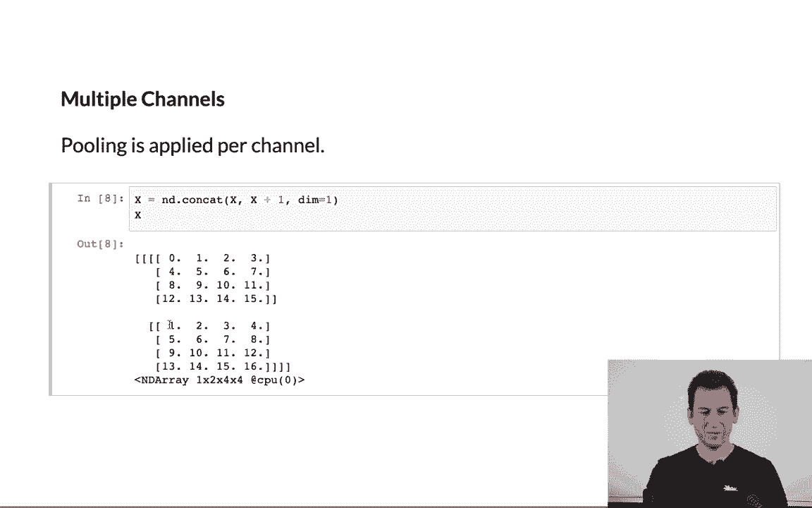

池化操作的一个重要特性是它独立应用于每个输入通道，因此输出通道数与输入通道数保持一致。

让我们创建一个具有两个通道的输入：

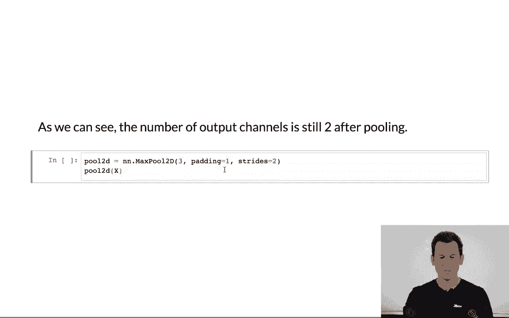

```python
X_multi = nd.stack(nd.arange(16).reshape(4,4),
                   nd.arange(1,17).reshape(4,4))
X_multi = X_multi.reshape((1, 2, 4, 4))  # 形状: (1, 2, 4, 4)
```

应用相同的池化层：

```python
pool = nn.MaxPool2D(pool_size=3, padding=1, strides=2)
Y_multi = pool(X_multi)
# 输出形状: (1, 2, 2, 2)
```

第一个输出通道的结果与之前单通道示例一致。第二个通道独立进行池化，结果基于其自身的数值。

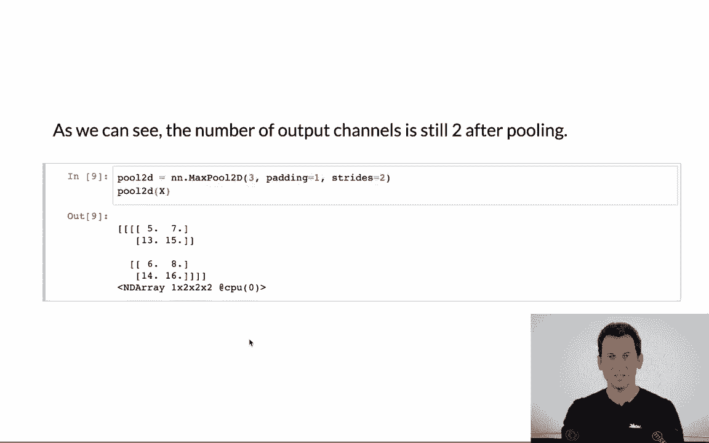

## 总结

本节课中我们一起学习了Python中的池化操作。我们从手动实现一个基础的池化函数开始，理解了最大池化和平均池化的核心计算过程，其公式可以概括为对局部区域取最大值或平均值。随后，我们探讨了如何使用MXNet Gluon API进行更实际、更灵活的池化操作，包括如何通过填充和步幅来控制输出特征图的空间尺寸。重要的是，池化操作独立作用于每个输入通道，因此不改变通道数量。池化是一种简单而强大的下采样工具，在卷积神经网络中用于逐步减少数据的空间维度，同时保留关键特征。