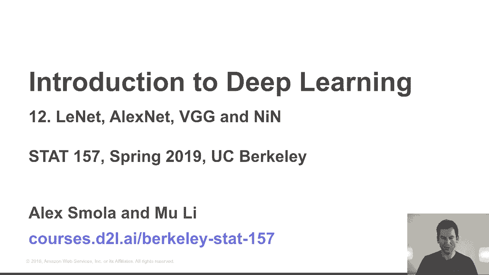
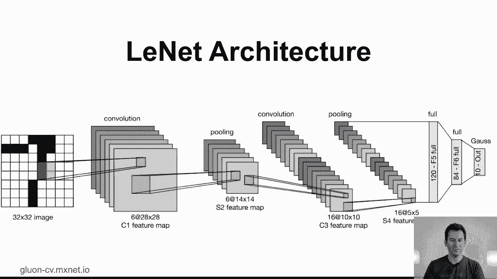
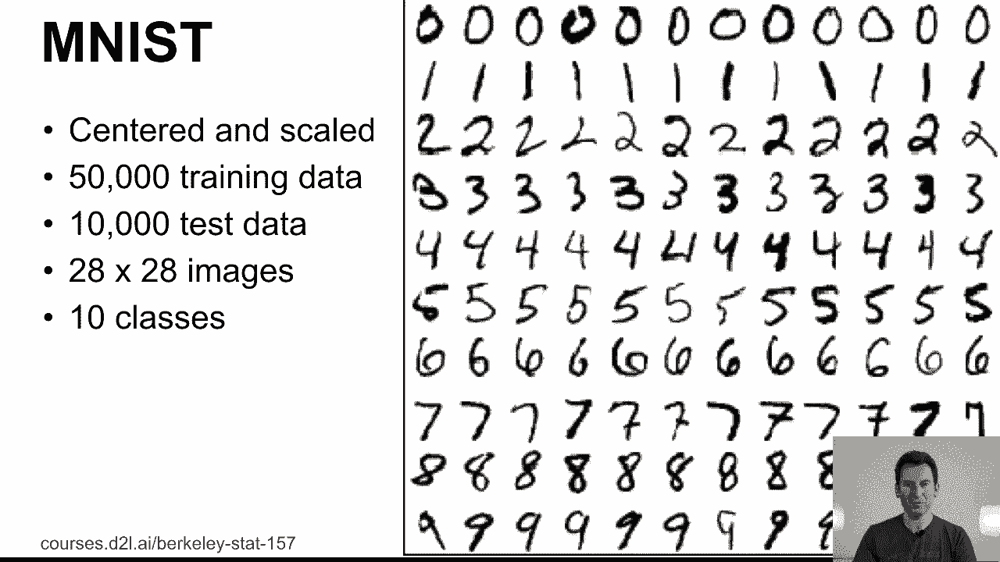
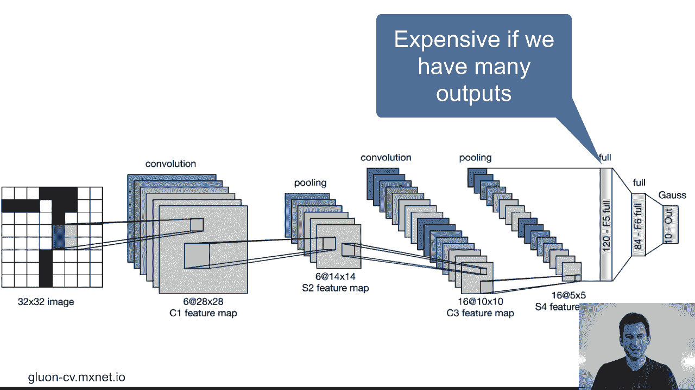
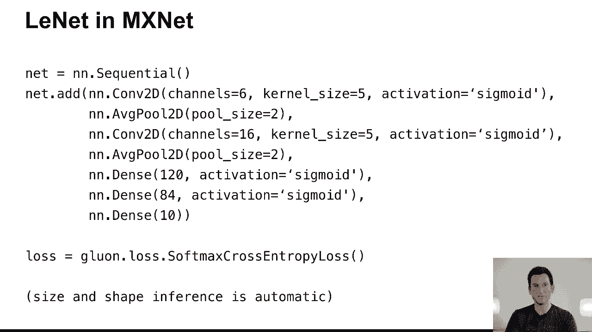
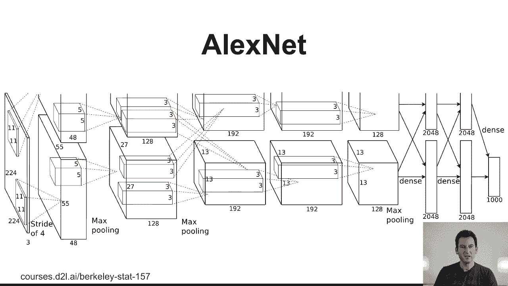

# 61：L12_1 LeNet 👨‍🏫

在本节课中，我们将学习卷积神经网络（CNN）的经典架构之一——LeNet。我们将回顾其历史背景、网络结构，并理解它是如何应用于手写数字识别任务的。通过本节课，你将掌握LeNet的基本构成及其在现代深度学习中的意义。



---

## 历史背景与动机 📜

上一节我们介绍了卷积神经网络的基本组件。本节中，我们来看看这些组件如何被整合成一个具体的网络——LeNet。

LeNet是上世纪90年代提出的网络，其最著名的版本LeNet-5大约在1995年由Yann LeCun及其团队提出。该网络最初是为低分辨率的黑白物体识别任务设计的，特别是手写数字识别。

当时，AT&T有一个实际项目，需要识别信件上的邮政编码以及支票上的金额。因此，开发能够自动、准确识别手写数字的算法具有重要的商业价值。虽然这对人类来说相对简单，但对机器而言却是一个不小的挑战。



为了服务于这一目的，MNIST数据集被创建出来。该数据集包含了居中和缩放后的手写数字图像，共有60,000个训练样本和10,000个测试样本，每张图像的分辨率为28x28像素，对应10个数字类别（0-9）。

## LeNet网络架构 🏗️

了解了历史背景后，我们深入探讨LeNet的具体网络结构。LeNet-5是一个相对简单的卷积神经网络，但其设计思想影响深远。

以下是LeNet-5的典型结构流程：

1.  **输入层**：接收32x32像素的灰度图像。
2.  **第一卷积层**：使用6个5x5的卷积核，生成6个28x28的特征图。
    *   **公式**：`输出尺寸 = (输入尺寸 - 卷积核尺寸 + 2*填充) / 步幅 + 1`。此处为 `(32 - 5 + 0) / 1 + 1 = 28`。
3.  **第一池化层**：进行2x2的平均池化，将特征图下采样至14x14。
4.  **第二卷积层**：使用16个5x5的卷积核，生成16个10x10的特征图。
5.  **第二池化层**：再次进行2x2的平均池化，将特征图下采样至5x5。
6.  **第一个全连接层**：将上一层的输出展平，连接120个神经元。
7.  **第二个全连接层**：连接84个神经元。
8.  **输出层**：最初使用高斯RBF单元，现代实现中通常替换为包含10个神经元的全连接层（对应10个数字类别）和Softmax激活函数。



值得注意的是，池化操作不改变通道数，而全连接层参数量巨大，这在处理更多类别（如ImageNet的1000类）时会成为瓶颈，后来的网络设计都致力于解决这个问题。

## LeNet的实现与效果 ⚙️

理解了理论架构后，我们来看看如何用现代深度学习框架简洁地实现LeNet，并观察其效果。

使用如PyTorch或TensorFlow等框架，实现LeNet变得非常直观。以下是核心思路：

```python
# 伪代码示例，展示层序结构
model = Sequential([
    Conv2D(filters=6, kernel_size=5, activation='sigmoid'),
    AvgPool2D(pool_size=2, strides=2),
    Conv2D(filters=16, kernel_size=5, activation='sigmoid'),
    AvgPool2D(pool_size=2, strides=2),
    Flatten(),
    Dense(units=120, activation='sigmoid'),
    Dense(units=84, activation='sigmoid'),
    Dense(units=10, activation='softmax')
])
```

在实际运行中，网络能够有效识别手写数字。通过可视化，我们可以观察到：

*   第一层卷积后，激活图主要对应边缘、角点等基础特征检测器。
*   更深层的特征图则对应更复杂、更抽象的组合特征。
*   网络对数字的平移具有一定的不变性，识别效果稳定。



LeCun等人1998年发表的论文是里程碑式的著作，其中详细介绍了网络设计、训练技巧以及图形转换器等概念，为后续研究奠定了坚实基础。

---

## 总结 📝

本节课中，我们一起学习了卷积神经网络的经典开山之作——LeNet。



我们首先回顾了其诞生的历史背景和要解决的实际问题（支票手写数字识别）。接着，我们详细剖析了LeNet-5的网络架构，从输入到输出，逐步理解了卷积层、池化层和全连接层的组合方式。最后，我们了解了其现代实现方式以及展现出的有效识别能力。



LeNet虽然结构相对简单，但它成功验证了卷积神经网络在视觉任务上的潜力，其设计思想至今仍在影响着深度学习模型的发展。在下一节课中，我们将继续学习更复杂、更强大的网络，如AlexNet和VGG。