# 62：使用 Python 实现 LeNet 🐍

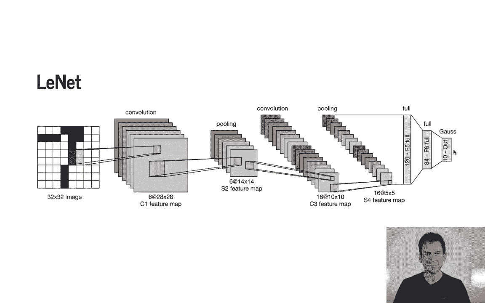

在本节课中，我们将学习如何使用 Python 和 MXNet 深度学习框架来实现经典的 LeNet-5 卷积神经网络。我们将从网络架构的定义开始，逐步完成数据加载、模型训练和评估的完整流程。

## 1. 网络架构回顾与定义 🏗️

首先，我们来回顾一下 LeNet-5 的网络架构。它由以下层顺序组成：输入图像、卷积层、池化层、第二个卷积层、第二个池化层，以及几个全连接层。

以下是使用 MXNet 的 `gluon` 模块定义该网络的具体代码：

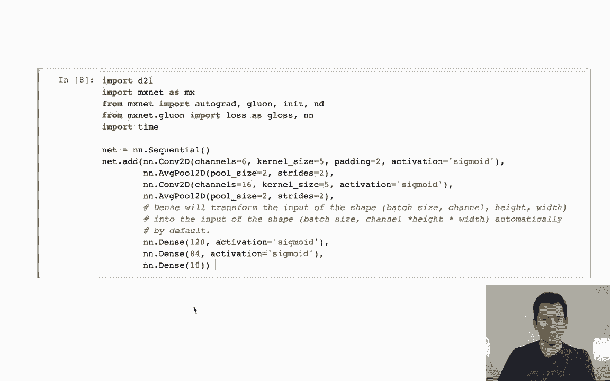

```python
from mxnet.gluon import nn

net = nn.Sequential()
net.add(
    nn.Conv2D(channels=6, kernel_size=5, padding=2, activation='sigmoid'),
    nn.AvgPool2D(pool_size=2, strides=2),
    nn.Conv2D(channels=16, kernel_size=5, activation='sigmoid'),
    nn.AvgPool2D(pool_size=2, strides=2),
    nn.Dense(120, activation='sigmoid'),
    nn.Dense(84, activation='sigmoid'),
    nn.Dense(10)
)
```

在上述代码中，我们定义了一个顺序模型。第一个卷积层使用 6 个 5x5 的卷积核，并添加了填充（padding）以保持特征图尺寸。接着是一个平均池化层。第二个卷积层使用 16 个 5x5 的卷积核。最后是三个全连接层，其中最后一个输出 10 个类别。全连接层会自动处理输入数据的展平（flatten）操作。

## 2. 数据流验证 🔍

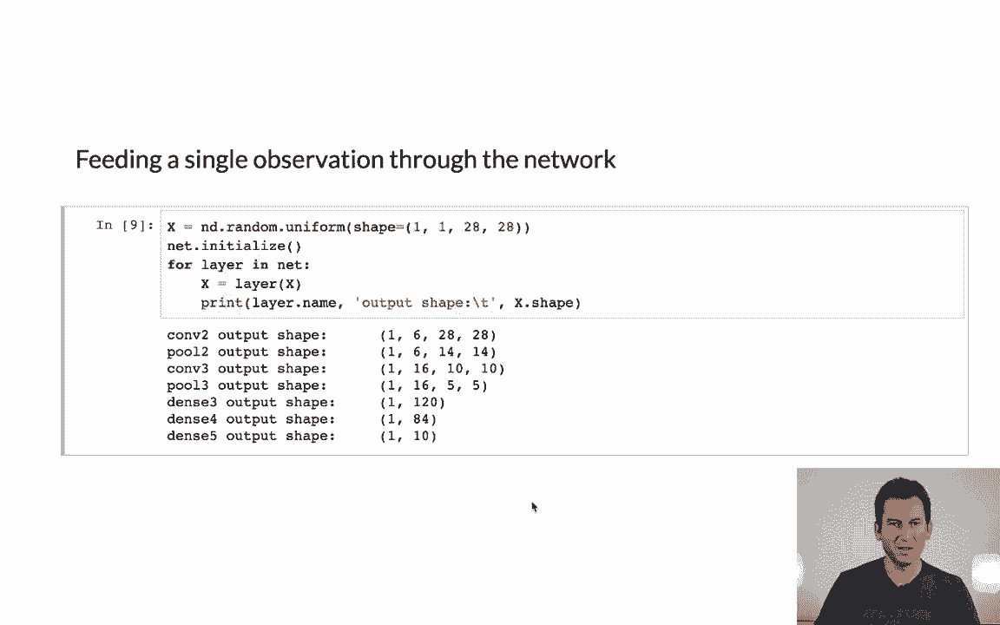

上一节我们定义了网络结构，本节中我们来看看数据在网络中的流动过程，以验证架构是否正确。

当我们输入一个 28x28 的单通道图像时，数据流如下：
1.  经过第一个卷积层（含填充）后，得到 6 个 28x28 的特征图。
2.  经过第一个池化层（步幅为 2）后，特征图尺寸减半，变为 6 个 14x14。
3.  经过第二个卷积层（无填充）后，根据公式 `输出尺寸 = (输入尺寸 - 卷积核尺寸 + 1)`，得到 16 个 10x10 的特征图。
4.  经过第二个池化层后，尺寸再次减半，变为 16 个 5x5 的特征图。
5.  数据被自动展平为 16 * 5 * 5 = 400 个特征，并输入到后续的全连接层。

这个过程与我们的预期完全一致。需要注意的是，在 MXNet 中，网络参数的实际初始化是在第一次将数据传入网络时完成的。

## 3. 准备训练工具 🛠️

定义好网络后，我们需要准备训练所需的工具，包括数据加载器和设备上下文。

以下是准备工作的代码：

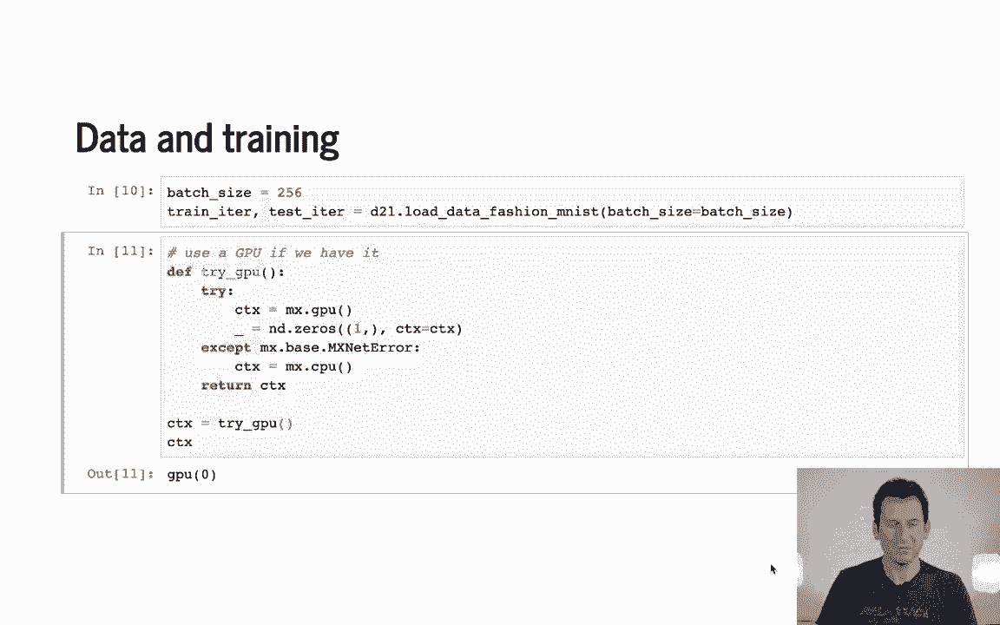

```python
from mxnet import autograd, gluon, init, nd
from mxnet.gluon import loss as gloss, nn
import d2lzh as d2l
import time

# 1. 加载数据
batch_size = 256
train_iter, test_iter = d2l.load_data_fashion_mnist(batch_size=batch_size)

# 2. 初始化模型参数（延迟初始化，此处可指定初始化方式）
net.initialize(init=init.Xavier())

# 3. 定义损失函数
loss = gloss.SoftmaxCrossEntropyLoss()

# 4. 定义优化器
trainer = gluon.Trainer(net.collect_params(), 'sgd', {'learning_rate': 0.9})
```

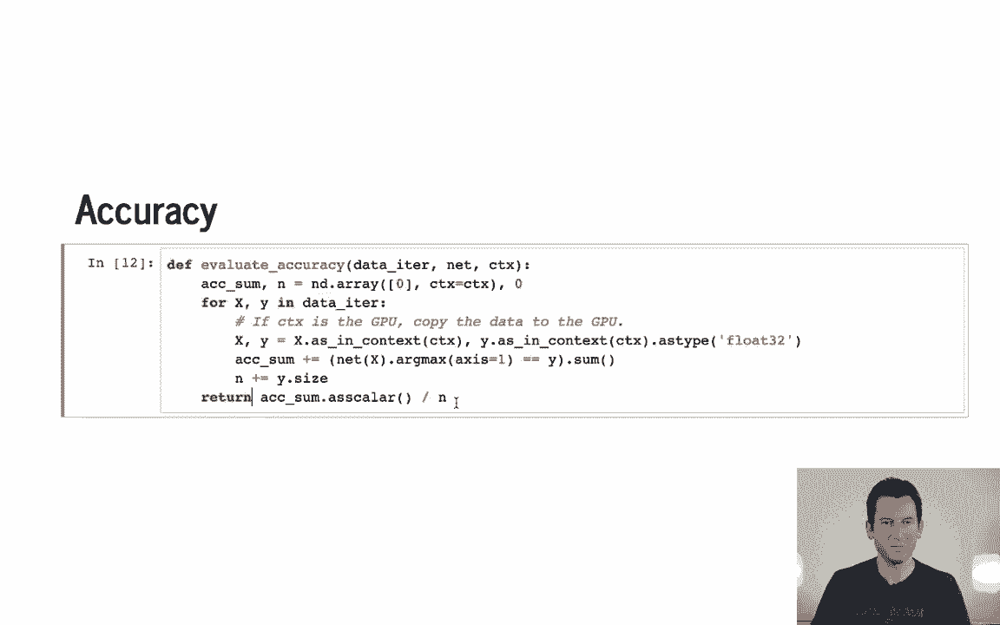

## 4. 评估精度函数 📊

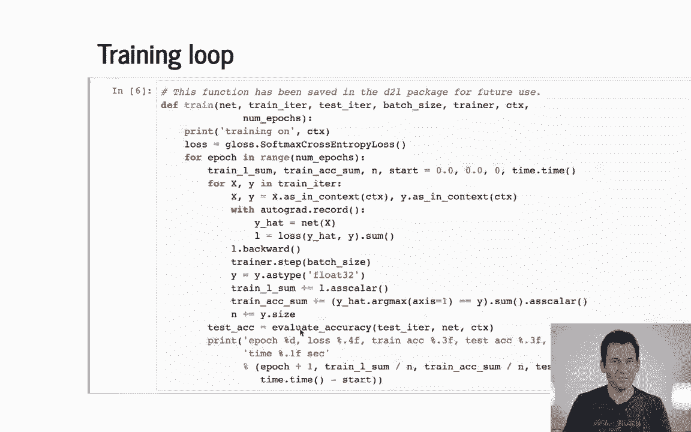

在训练过程中，我们需要评估模型在测试集上的精度。以下是评估精度的函数实现：

```python
def evaluate_accuracy(data_iter, net, ctx):
    acc_sum, n = 0.0, 0
    for X, y in data_iter:
        # 如果 ctx 是 GPU 上下文，则将数据复制到 GPU
        X, y = X.as_in_context(ctx), y.as_in_context(ctx)
        y = y.astype('float32')
        acc_sum += (net(X).argmax(axis=1) == y).sum().asscalar()
        n += y.size
    return acc_sum / n
```

该函数遍历数据迭代器，将数据和标签移动到指定的计算设备（CPU 或 GPU），计算模型预测正确的样本数，最后返回平均精度。

## 5. 训练循环 🔄

核心的训练循环负责在多个周期（epoch）内迭代数据、计算损失、反向传播和更新参数。

以下是训练循环的代码：

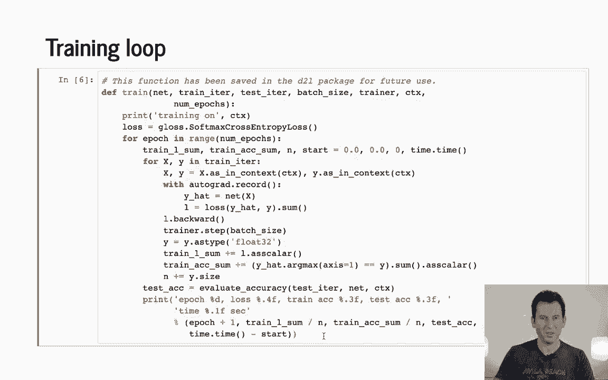

```python
def train_ch5(net, train_iter, test_iter, batch_size, trainer, ctx, num_epochs):
    print('training on', ctx)
    for epoch in range(num_epochs):
        train_l_sum, train_acc_sum, n, start = 0.0, 0.0, 0, time.time()
        for X, y in train_iter:
            # 将数据移动到指定设备
            X, y = X.as_in_context(ctx), y.as_in_context(ctx)
            with autograd.record():
                y_hat = net(X)
                l = loss(y_hat, y).sum()
            l.backward()
            trainer.step(batch_size)
            y = y.astype('float32')
            train_l_sum += l.asscalar()
            train_acc_sum += (y_hat.argmax(axis=1) == y).sum().asscalar()
            n += y.size
        # 计算并打印每个周期后的指标
        test_acc = evaluate_accuracy(test_iter, net, ctx)
        print('epoch %d, loss %.4f, train acc %.3f, test acc %.3f, '
              'time %.1f sec'
              % (epoch + 1, train_l_sum / n, train_acc_sum / n, test_acc,
                 time.time() - start))
```

该函数在每个训练周期内，计算训练损失和训练精度，并在周期结束后评估模型在测试集上的精度，同时记录耗时。

## 6. 选择计算设备 ⚙️

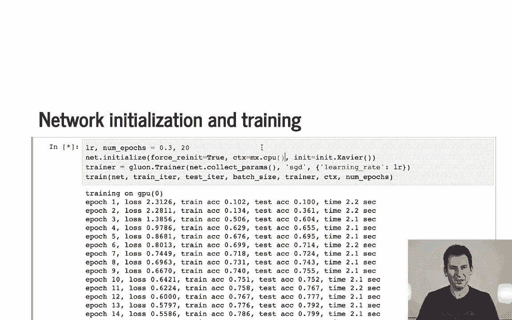

深度学习训练对计算资源要求较高。以下代码帮助我们自动检测并使用可用的 GPU，如果不可用则回退到 CPU。

```python
def try_gpu():
    try:
        ctx = nd.gpu()
        _ = nd.zeros((1,), ctx=ctx)
        return ctx
    except:
        return nd.cpu()

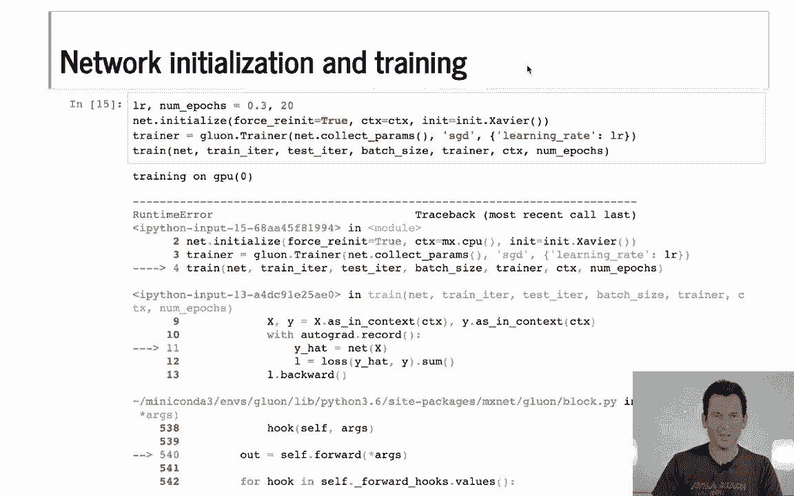

ctx = try_gpu() # 获取设备上下文
```

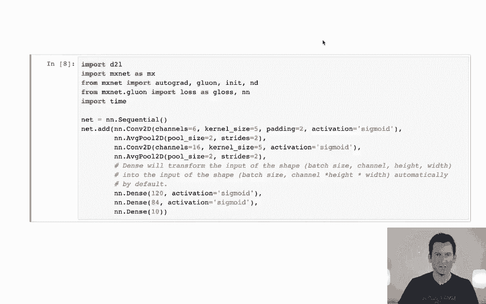

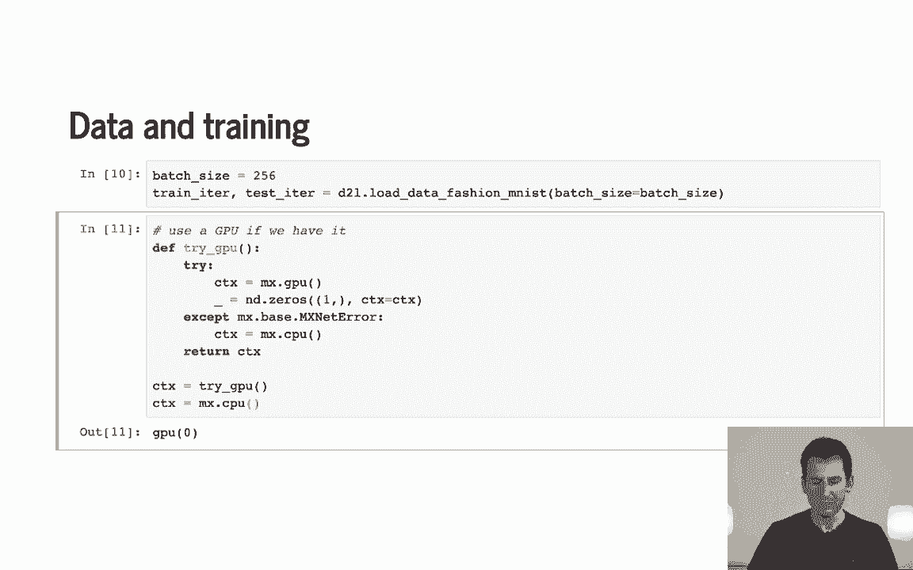

使用 GPU 可以极大加速训练过程。例如，在本例的 Fashion-MNIST 数据集上，GPU 训练一个周期仅需约 2.3 秒，而 CPU 则需要约 23 秒，有近 10 倍的差距。对于更复杂的网络（如后续将学的 AlexNet），GPU 的优势将更加明显。

## 7. 开始训练 🚀

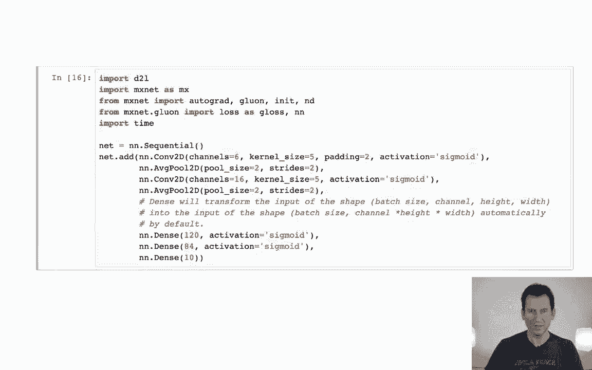

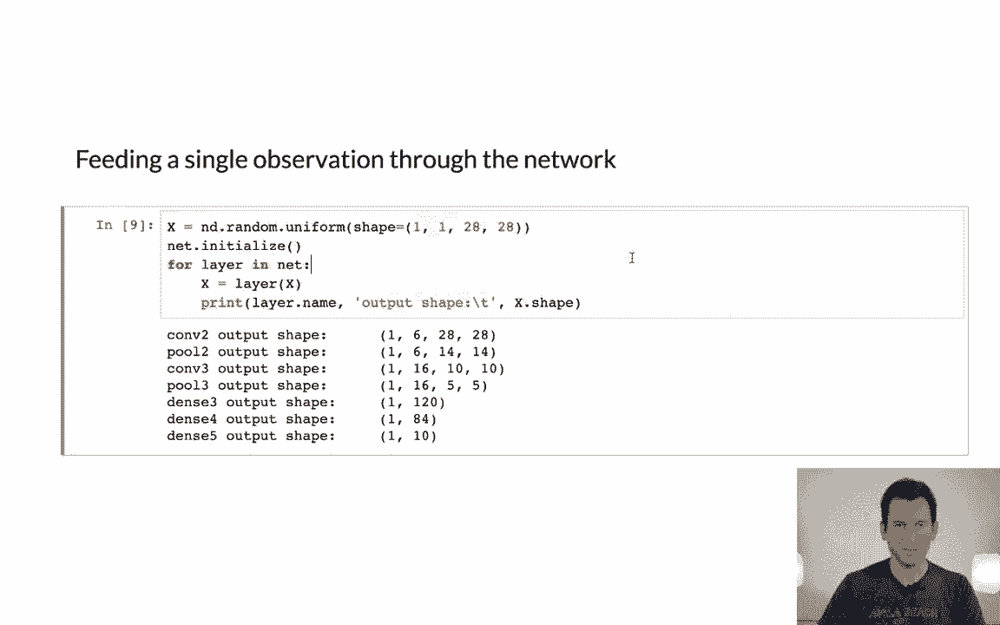

现在，我们将所有部分组合起来，开始训练 LeNet 模型。

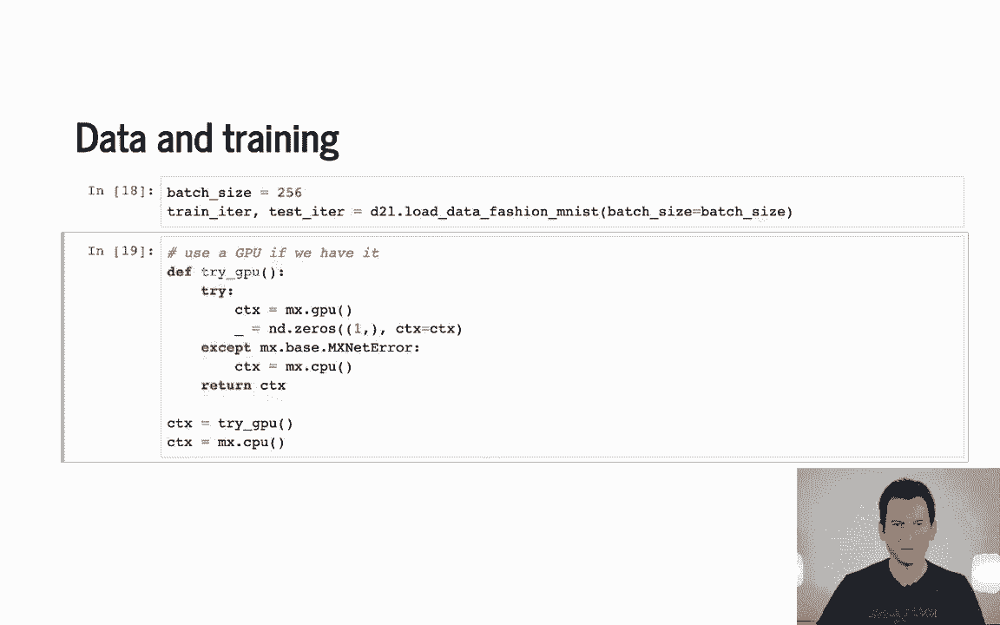

```python
num_epochs = 5
train_ch5(net, train_iter, test_iter, batch_size, trainer, ctx, num_epochs)
```

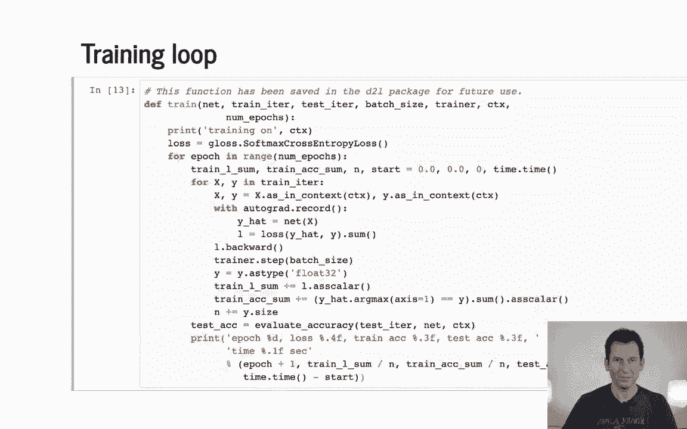

运行上述代码，模型在 Fashion-MNIST 测试集上的精度大约可以达到 82%-83%。

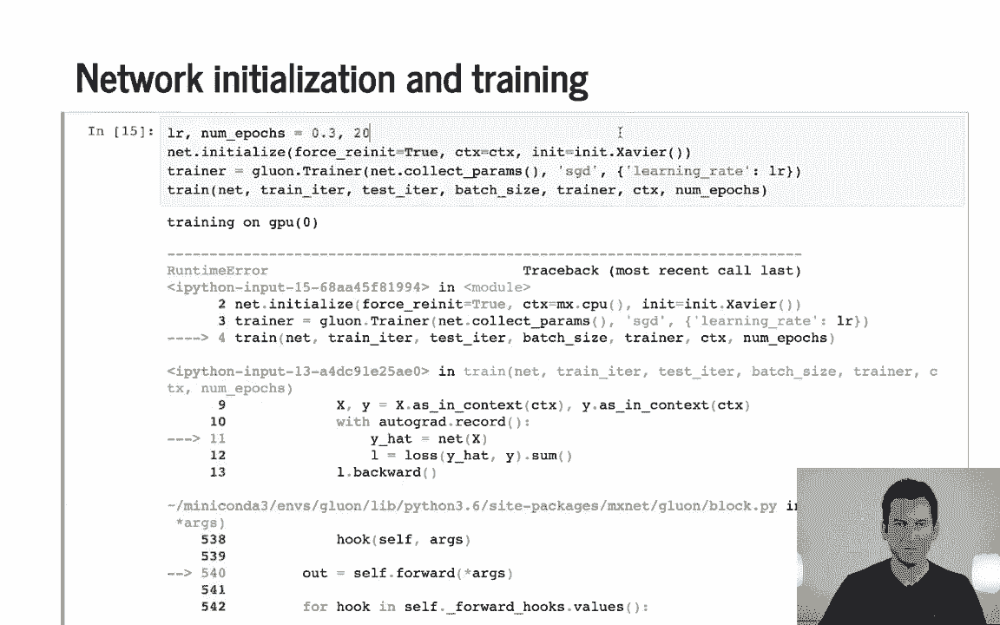

---

**本节课总结**

在本节课中，我们一起学习了如何使用 MXNet 实现 LeNet-5 卷积神经网络。我们完成了以下步骤：
1.  使用 `nn.Sequential()` 定义了网络架构。
2.  理解了数据在网络中的流动过程。
3.  准备了数据迭代器、损失函数和优化器。
4.  编写了评估精度和训练循环的函数。
5.  学会了自动检测并使用 GPU 设备来加速训练。
6.  成功训练模型并达到了预期的精度。

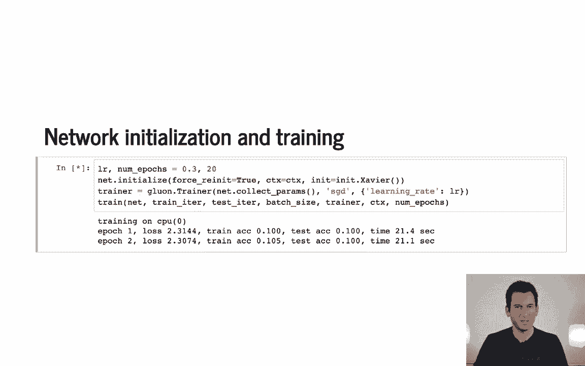

通过这个完整的流程，你不仅实现了经典的 LeNet，也掌握了使用现代深度学习框架进行模型开发、训练和评估的基本模式。