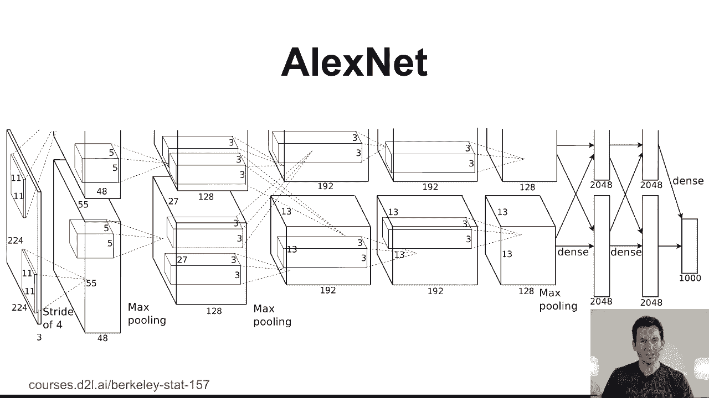
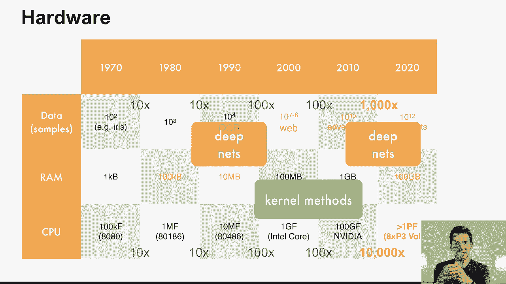
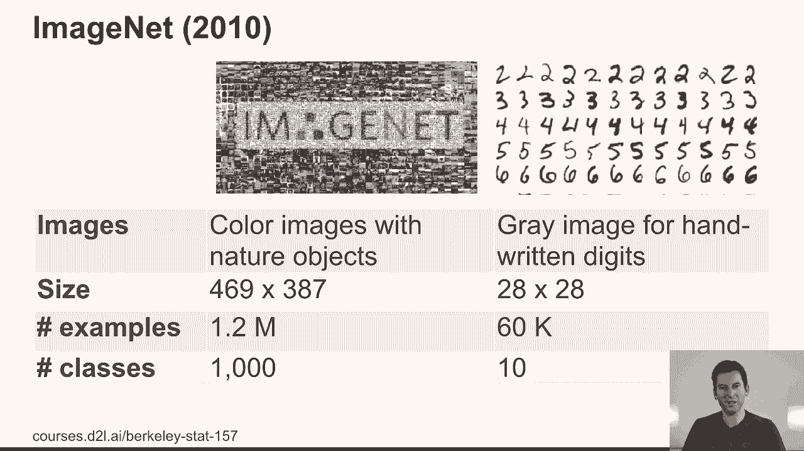
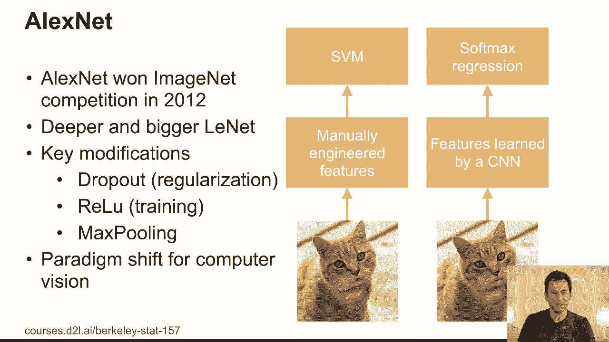
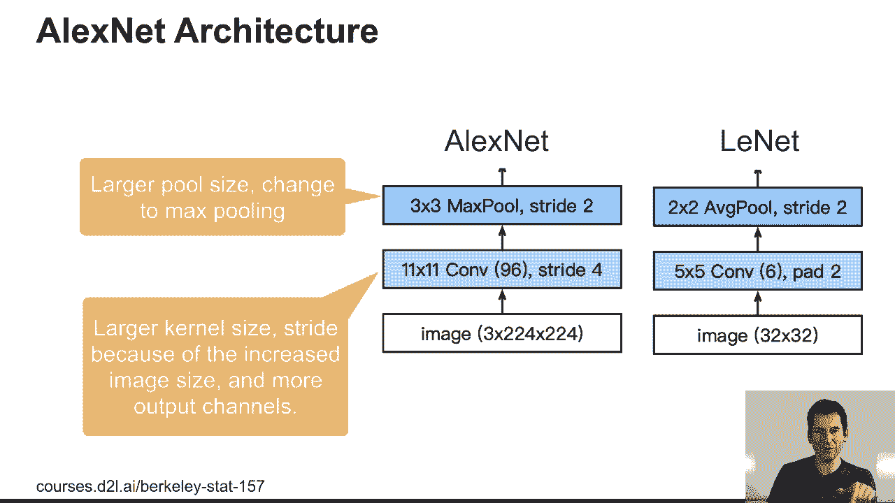
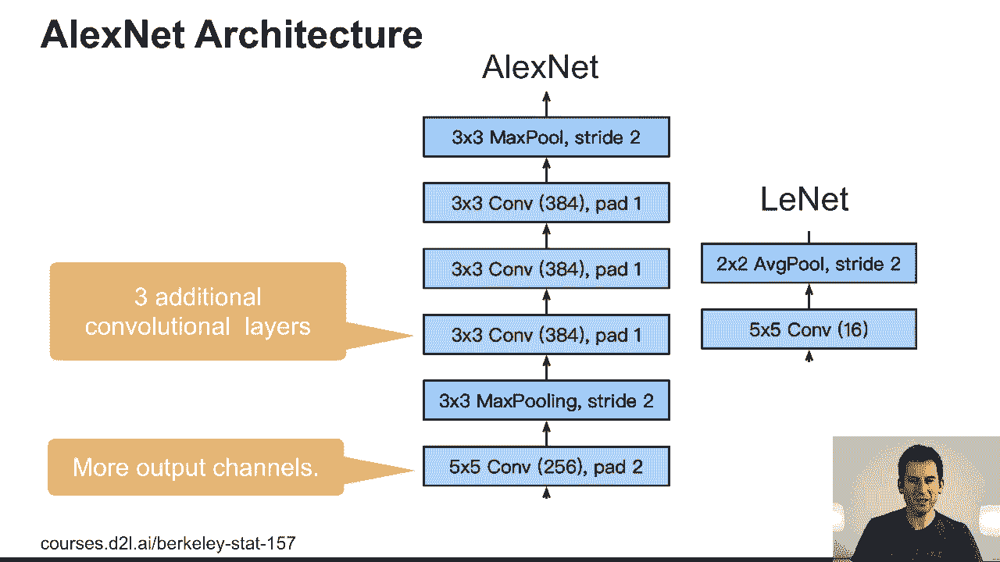
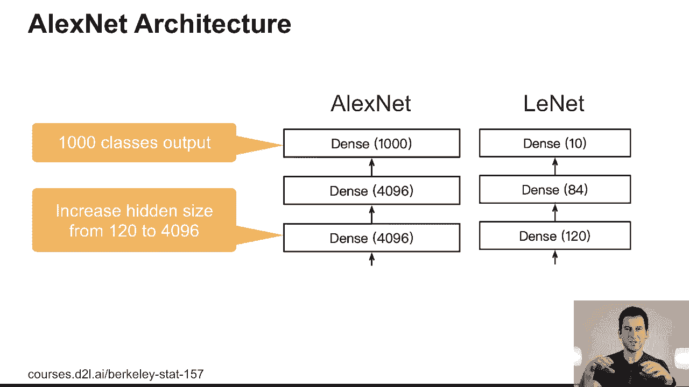
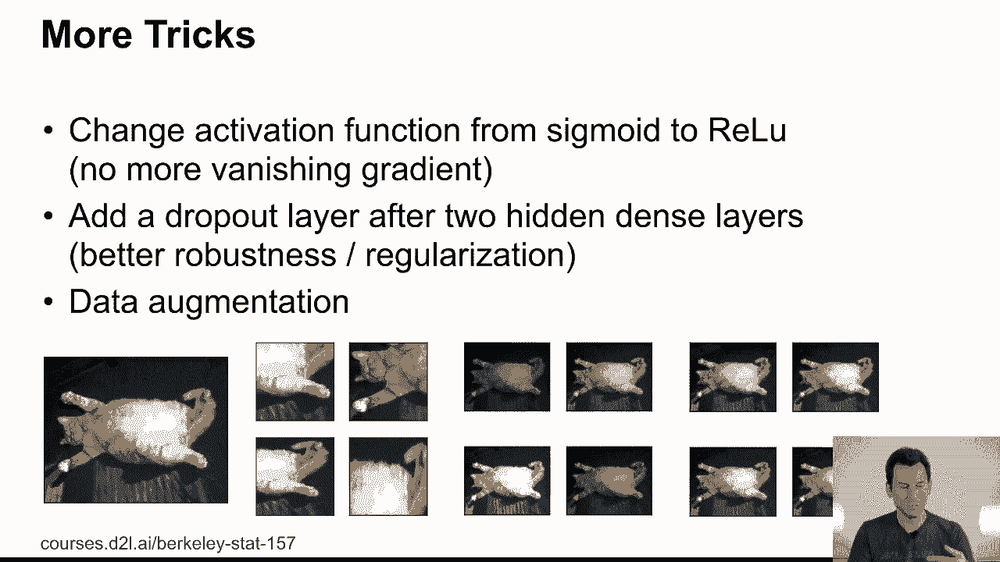
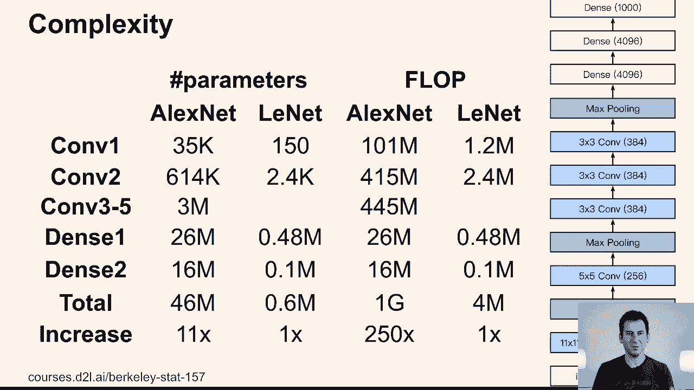

# 63：AlexNet 详解 🧠

在本节课中，我们将学习深度学习发展史上的一个里程碑模型——AlexNet。我们将回顾其诞生的背景、核心创新点、网络架构细节，并理解它如何引领了计算机视觉乃至整个深度学习领域的范式转变。

## 历史背景与范式转变 🔄

上一节我们介绍了LeNet等早期卷积神经网络。本节中，我们来看看AlexNet出现时的技术环境。

在2001年左右，核方法是机器学习的主流。人们通过精心设计特征提取器和核函数来解决非线性问题，然后求解凸优化问题。计算机视觉领域同样如此，其核心是特征工程。例如，设计出SIFT或SURF特征提取器被视为重大成就。之后，只需提取图像特征点，进行聚类等处理，再应用支持向量机（SVM）即可解决问题。

这种方法的局限性在于，每当遇到新问题，都需要重新进行特征工程，可扩展性不强。这种状况的根源在于当时可用的数据、内存和计算能力。

以下是不同年代关键资源的大致规模：

*   **数据量**：2000年前后数据集规模很小。随着互联网和云计算的普及，数据量在2000-2010年间增长了约100倍，在2010-2020年间又增长了约1000倍。
*   **内存**：改进相对平缓。
*   **计算能力**：2010年左右出现重大突破，从单核/少核CPU转向大规模多核架构（如GPU），计算性能得到飞跃。

在这种背景下：
*   **1990年代**：深度网络曾流行，但受限于小内存和小数据集。
*   **2000-2010年**：核方法因能较好处理当时规模的数据而成为合适选择。
*   **2010年后**：计算资源的飞跃使得训练大规模、非凸、计算密集的深度网络成为可能。同时，**ImageNet**数据集（2010年发布）的出现提供了必要的“燃料”。它包含120万张图片、1000个类别，分辨率远高于之前的基准数据集（如MNIST）。

因此，当AlexNet在2012年ImageNet竞赛中取得压倒性胜利时，它标志着一个转折点：计算机视觉的默认策略从“手动设计特征 + SVM”转变为“自动学习特征 + Softmax分类”。

## AlexNet的核心创新 ✨

AlexNet并非仅仅是更大、更深的LeNet。它引入了多项关键创新，解决了训练深层网络的核心难题。

以下是AlexNet相比前代模型的三个主要改进：

1.  **ReLU激活函数**：用修正线性单元（ReLU）替换了Sigmoid等饱和激活函数。
    *   **公式**：`ReLU(x) = max(0, x)`
    *   **作用**：有效缓解了深层网络中的梯度消失问题，因为至少在正半轴，梯度恒为1，使得训练更深网络成为可能。

2.  **Dropout正则化**：在训练过程中，随机“丢弃”（即暂时屏蔽）网络中的一部分神经元。
    *   **作用**：这是一种强大的正则化技术，防止网络对特定神经元过度依赖，增强了模型的泛化能力，使得设计更深的网络而不过拟合成为可能。

3.  **最大池化**：使用最大池化替代了平均池化。
    *   **作用**：最大池化对特征的位置微小变化（平移）具有更好的不变性，能更鲁棒地提取关键特征。

此外，**数据增强**也被广泛且系统地应用。通过对训练图像进行随机裁剪、水平翻转、颜色扰动等操作，可以显著增加训练数据的多样性，提升模型的鲁棒性和泛化能力。

## 网络架构剖析 🏗️

了解了核心创新后，我们具体看看AlexNet的网络结构设计。

AlexNet的输入是224x224像素的三通道（RGB）图像。整个网络包含8个学习层：5个卷积层和3个全连接层。其架构比LeNet复杂得多。

以下是架构的一些关键特点：

*   **更大的卷积层**：第一卷积层使用96个大小为11x11的滤波器，通道数远超LeNet。
*   **更深的网络**：通过堆叠多个卷积层来增强非线性表达能力。
*   **更大的全连接层**：最后两个全连接层各有4096个神经元，为最终的1000类分类提供足够的信息容量。
*   **双GPU训练**：由于当时单个GPU内存有限，原始AlexNet的设计被拆分到两个GPU上并行训练，这在工程上是一大挑战。

从计算复杂度和参数量来看，AlexNet的计算量约为LeNet的250倍，而参数量约为10倍。这体现了从“参数效率”到“计算效率”的权衡转变，充分利用了当时新出现的强大计算资源。

## 总结与展望 📈

本节课中，我们一起学习了深度学习历史上的标志性模型AlexNet。

我们回顾了其出现前以特征工程和核方法为主导的技术背景，理解了计算能力（GPU）和大规模数据集（ImageNet）的突破是其成功的关键前提。我们详细分析了AlexNet的核心创新：**ReLU激活函数**、**Dropout正则化**和**最大池化**，这些技术至今仍是深度学习的基础组件。最后，我们剖析了其更复杂、更深的网络架构。

AlexNet的胜利不仅证明了深度卷积神经网络在视觉任务上的强大能力，更彻底改变了计算机视觉的研究范式，并推动了深度学习在语音识别、自然语言处理等领域的广泛应用。在接下来的课程中，我们将看到研究者们如何在此基础上，进一步解决网络加深带来的挑战，构建更强大、更高效的模型。