# 64：使用 Python 实现 AlexNet 🚀

在本节课中，我们将学习如何使用 Python 和 MXNet 框架来实现经典的 AlexNet 网络，并将其应用于 Fashion-MNIST 数据集。我们将从网络结构定义开始，逐步讲解数据加载、模型训练和评估的完整流程。

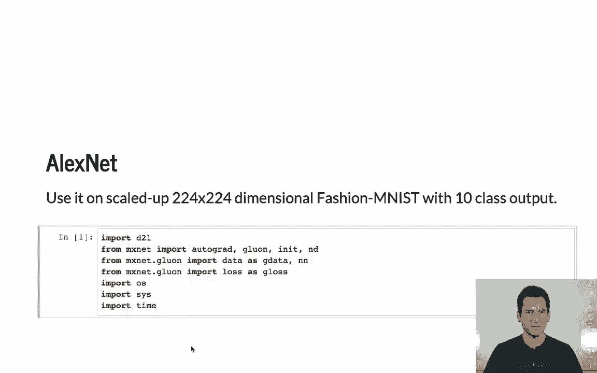

---

## 导入必要的库

首先，我们需要导入构建和训练网络所需的所有工具。这包括 MXNet 的核心组件、神经网络层、损失函数以及数据迭代器。

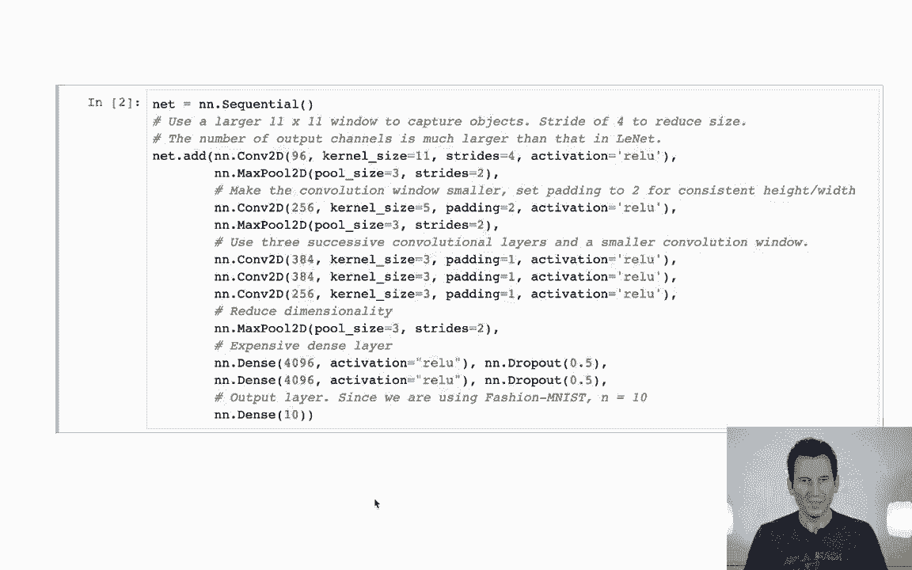

```python
import mxnet as mx
from mxnet import gluon, autograd, nd
from mxnet.gluon import nn
from mxnet.gluon.data.vision import transforms
```

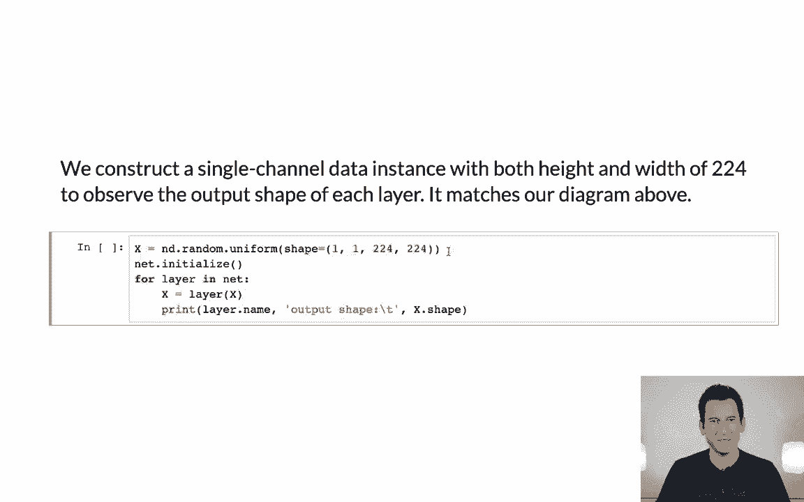

---

## 定义 AlexNet 网络结构 🏗️

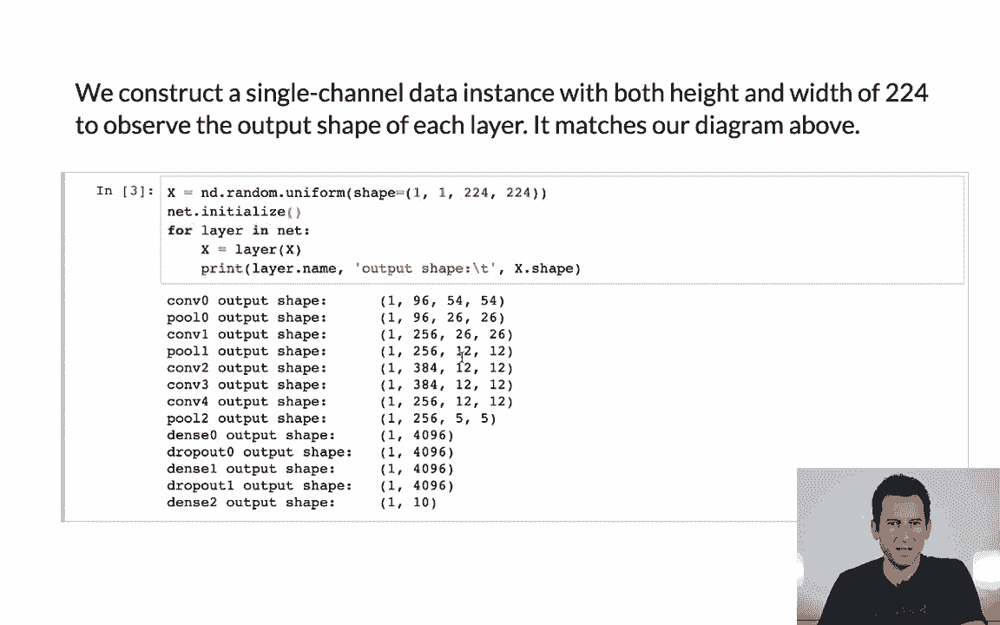

上一节我们介绍了必要的库，本节中我们来看看如何定义 AlexNet 的网络结构。AlexNet 是一个顺序网络，包含多个卷积层、池化层和全连接层。

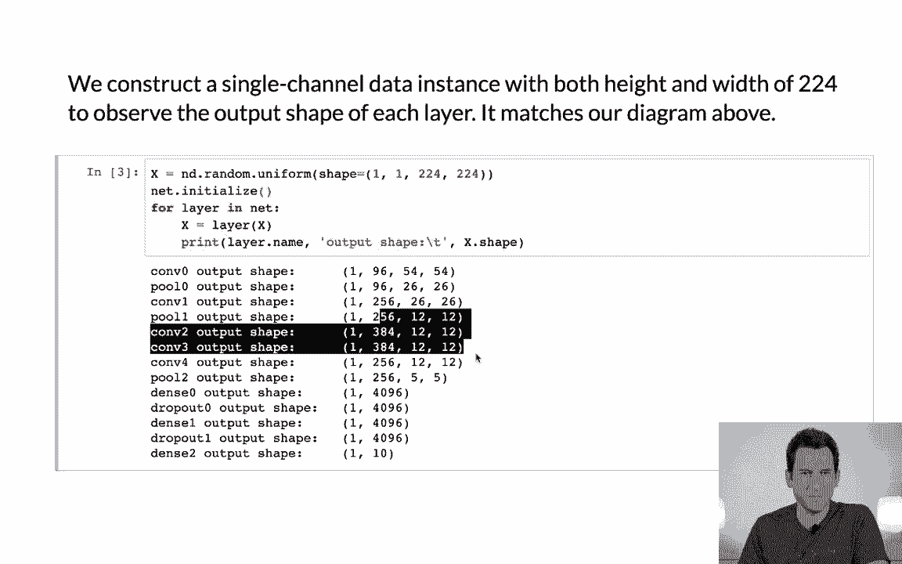

以下是网络的具体构建步骤：

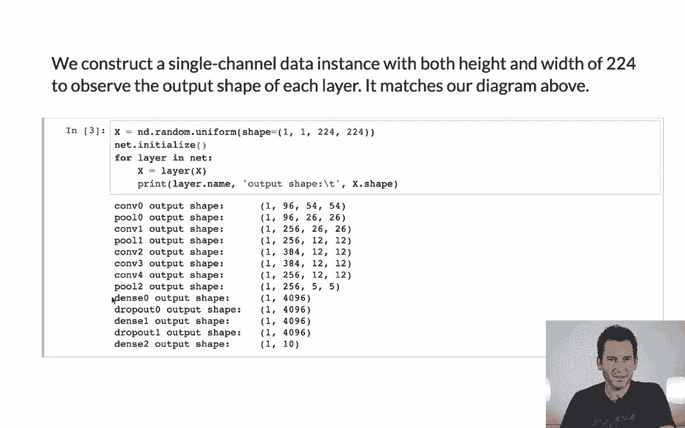

1.  第一层：卷积层，使用 96 个 11x11 的卷积核，步幅为 4。
2.  第二层：最大池化层，窗口大小为 3x3，步幅为 2。
3.  第三层：卷积层，使用 256 个 5x5 的卷积核，并填充 2。
4.  第四层：最大池化层，窗口大小为 3x3，步幅为 2。
5.  第五至七层：三个连续的卷积层，分别使用 384、384 和 256 个 3x3 的卷积核，并填充 1。
6.  第八层：最大池化层，窗口大小为 3x3，步幅为 2。
7.  第九至十层：两个全连接层，分别有 4096 个神经元。
8.  第十一层：输出层，将特征映射到 10 个类别（对应 Fashion-MNIST）。

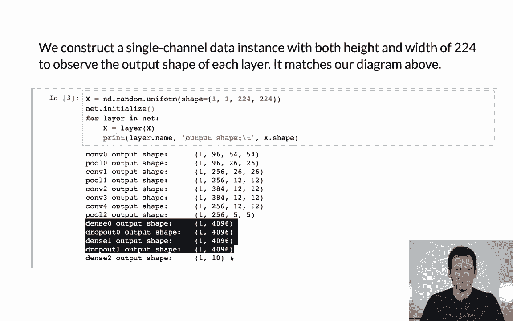

```python
net = nn.Sequential()
# 第一层卷积和池化
net.add(nn.Conv2D(96, kernel_size=11, strides=4, activation='relu'),
        nn.MaxPool2D(pool_size=3, strides=2))
# 第二层卷积和池化
net.add(nn.Conv2D(256, kernel_size=5, padding=2, activation='relu'),
        nn.MaxPool2D(pool_size=3, strides=2))
# 连续三个卷积层
net.add(nn.Conv2D(384, kernel_size=3, padding=1, activation='relu'),
        nn.Conv2D(384, kernel_size=3, padding=1, activation='relu'),
        nn.Conv2D(256, kernel_size=3, padding=1, activation='relu'),
        nn.MaxPool2D(pool_size=3, strides=2))
# 展平操作，为全连接层准备
net.add(nn.Flatten())
# 全连接层
net.add(nn.Dense(4096, activation='relu'),
        nn.Dropout(0.5),
        nn.Dense(4096, activation='relu'),
        nn.Dropout(0.5),
        # 输出层，10个类别
        nn.Dense(10))
```

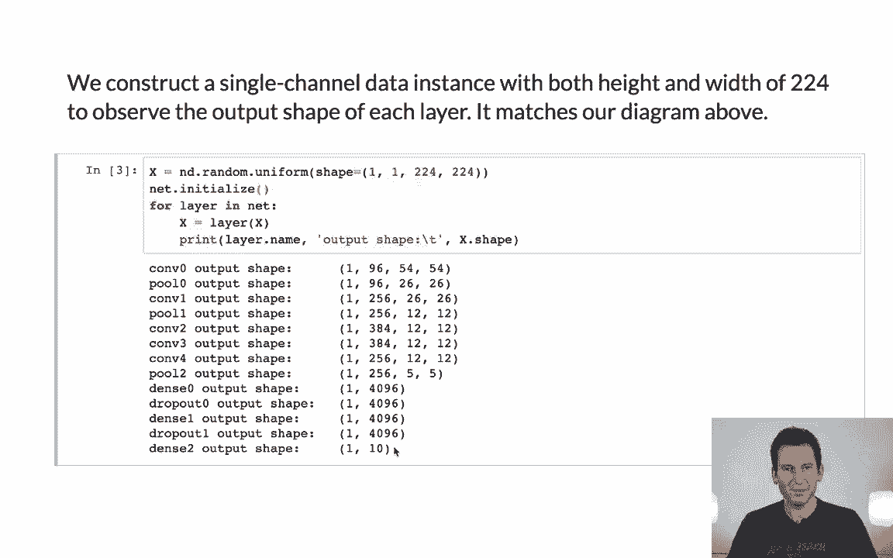

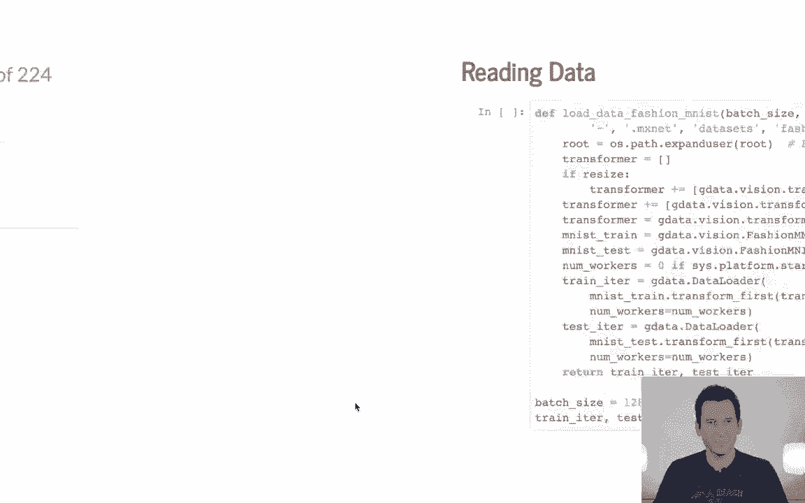

输入一个 `224x224` 的图像，网络会依次输出各层的尺寸，最终得到 10 个类别的预测值。

---

## 准备数据迭代器 📊

定义好网络后，我们需要准备数据。由于 AlexNet 的输入尺寸是 `224x224`，而 Fashion-MNIST 原始图像是 `28x28`，因此需要进行调整。

以下是创建数据迭代器的步骤：

1.  定义数据转换流程：将图像调整为 `224x224`，然后转换为张量。
2.  加载 Fashion-MNIST 数据集。
3.  创建数据加载器，指定批量大小并进行数据打乱。

```python
def get_data_iterators(batch_size=128):
    # 定义图像变换：调整大小并转为张量
    transformer = transforms.Compose([
        transforms.Resize(224),
        transforms.ToTensor()
    ])
    
    # 加载训练和测试数据集，并应用变换
    train_data = gluon.data.vision.FashionMNIST(train=True).transform_first(transformer)
    test_data = gluon.data.vision.FashionMNIST(train=False).transform_first(transformer)
    
    # 根据操作系统设置工作线程数
    num_workers = 0 if sys.platform.startswith('win32') else 4
    
    # 创建数据迭代器
    train_iter = gluon.data.DataLoader(train_data, batch_size, shuffle=True, num_workers=num_workers)
    test_iter = gluon.data.DataLoader(test_data, batch_size, shuffle=False, num_workers=num_workers)
    
    return train_iter, test_iter
```

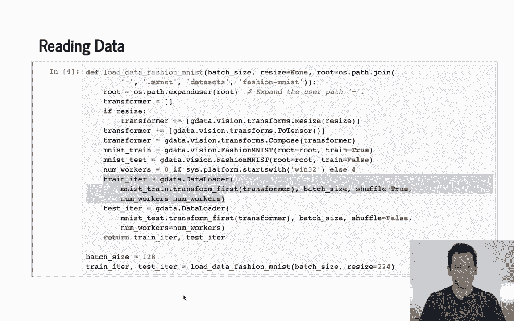

---

## 模型训练与评估 ⚙️

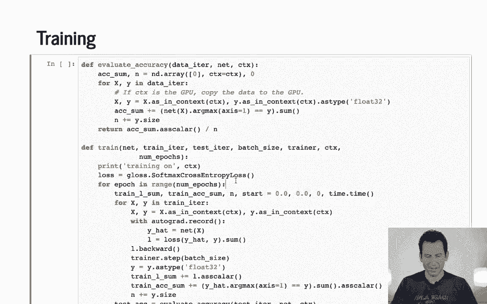

有了网络和数据，接下来我们进入训练环节。训练脚本的逻辑与之前介绍过的简单网络类似，但需要注意学习率的设置。

以下是训练和评估模型的核心步骤：

1.  **初始化**：初始化网络参数，定义损失函数（交叉熵）和优化器（SGD），并将模型和数据移动到 GPU（如果可用）。
2.  **准确度计算**：编写一个函数，用于计算模型在给定数据迭代器上的分类准确度。
3.  **训练循环**：
    *   遍历数据集多个周期（epoch）。
    *   在每个批次（batch）中，执行前向传播计算损失。
    *   执行反向传播计算梯度。
    *   使用优化器更新模型参数。
    *   定期计算并输出训练和测试准确度。

```python
def train(net, train_iter, test_iter, num_epochs, lr=0.01, ctx=mx.gpu()):
    # 初始化网络参数
    net.initialize(force_reinit=True, ctx=ctx, init=init.Xavier())
    # 定义损失函数和优化器
    loss_fn = gluon.loss.SoftmaxCrossEntropyLoss()
    trainer = gluon.Trainer(net.collect_params(), 'sgd', {'learning_rate': lr})
    
    for epoch in range(num_epochs):
        train_l_sum, train_acc_sum, n = 0.0, 0.0, 0
        # 遍历训练数据
        for X, y in train_iter:
            X, y = X.as_in_context(ctx), y.as_in_context(ctx)
            with autograd.record():
                y_hat = net(X)
                l = loss_fn(y_hat, y)
            l.backward()
            trainer.step(X.shape[0])
            
            # 计算训练准确度
            train_l_sum += l.sum().asscalar()
            train_acc_sum += (y_hat.argmax(axis=1) == y.astype('float32')).sum().asscalar()
            n += y.size
        
        # 计算测试准确度
        test_acc = evaluate_accuracy(test_iter, net, ctx)
        print(f'Epoch {epoch + 1}, Train loss {train_l_sum / n:.4f}, '
              f'Train acc {train_acc_sum / n:.3f}, Test acc {test_acc:.3f}')

def evaluate_accuracy(data_iter, net, ctx):
    acc_sum, n = 0.0, 0
    for X, y in data_iter:
        X, y = X.as_in_context(ctx), y.as_in_context(ctx)
        y_hat = net(X)
        acc_sum += (y_hat.argmax(axis=1) == y.astype('float32')).sum().asscalar()
        n += y.size
    return acc_sum / n
```

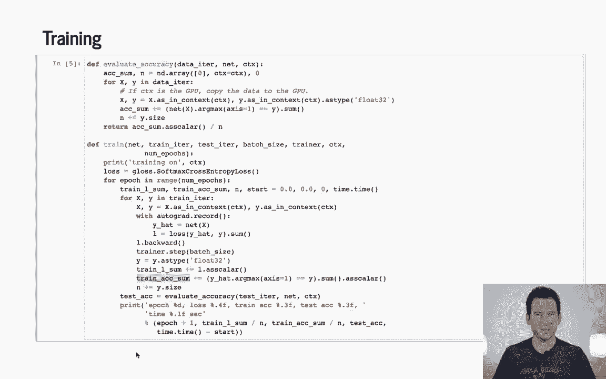

**关键细节**：
*   **学习率**：设置为 `0.01`，比浅层网络更小。这是因为网络越复杂，需要更小的学习率来稳定训练。
*   **训练 vs 测试准确度**：在训练过程中计算的训练准确度可能低于周期结束后的测试准确度。这是因为训练准确度是在每个批次后即时计算的移动平均值，而测试准确度是在一个完整周期后计算的，更能反映模型当前的真实性能。

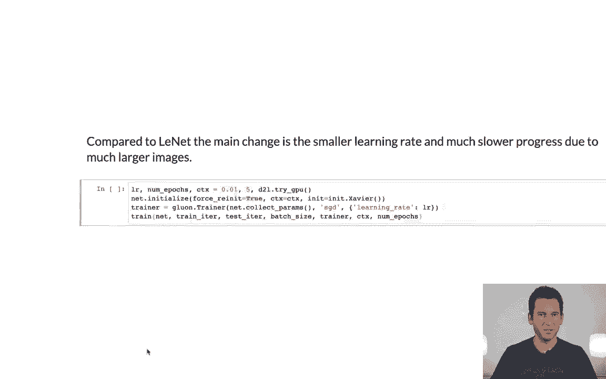

---

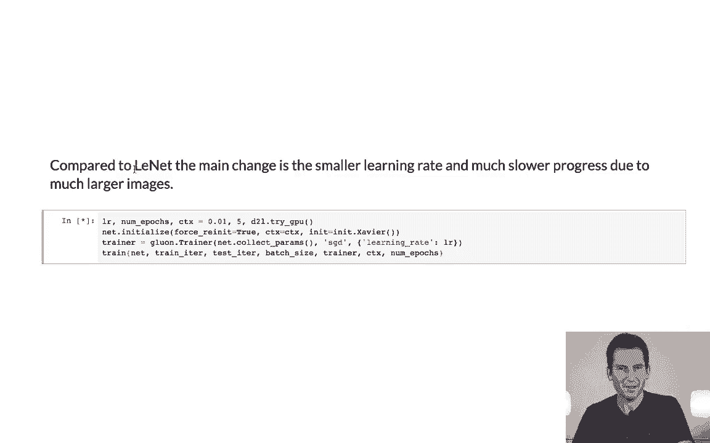

## 运行与结果 📈

现在，让我们运行完整的训练流程。由于 AlexNet 参数较多，在 CPU 上训练会非常慢，因此建议在 GPU 环境下运行。

```python
# 获取数据迭代器
train_iter, test_iter = get_data_iterators(batch_size=128)
# 开始训练（假设使用GPU）
ctx = mx.gpu() if mx.context.num_gpus() > 0 else mx.cpu()
train(net, train_iter, test_iter, num_epochs=5, lr=0.01, ctx=ctx)
```

经过 5 个周期的训练，模型在测试集上的准确率大约可以达到 **70%** 左右。要获得更好的性能，需要更先进的网络架构、数据增强技术和更精细的超参数调优。

---

## 总结 🎯

本节课中我们一起学习了如何使用 Python 实现 AlexNet。我们从网络结构的逐层构建开始，接着准备了符合网络输入要求的数据迭代器，然后详细讲解了包含前向传播、反向传播和参数更新的训练循环，最后对模型进行了评估。

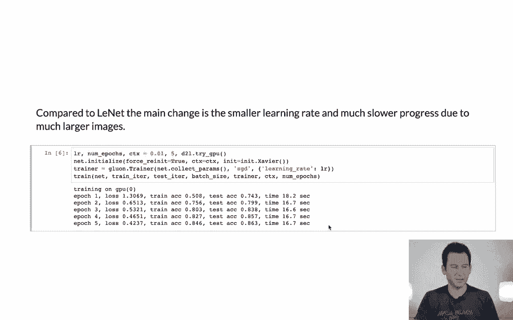

通过本教程，你掌握了实现一个经典卷积神经网络的关键步骤，并理解了在训练更深网络时需要注意的细节，如学习率调整和性能评估方式。这为学习更复杂的现代网络架构奠定了坚实的基础。