# 65：L12_6 VGG 在 Python 中 🧠

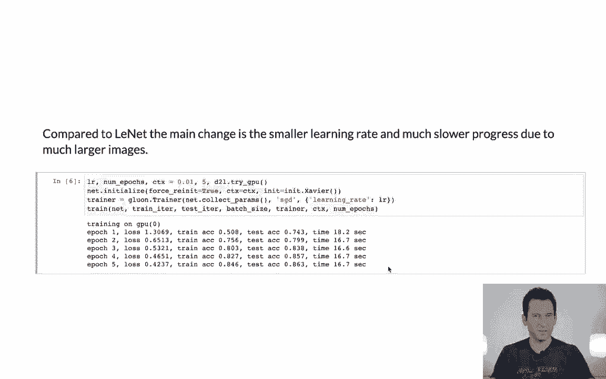

在本节课中，我们将学习如何使用“块”的概念来构建VGG网络。我们将了解VGG网络的设计思想，并通过Python代码实现一个简化的VGG模型，最后进行训练和评估。

---

## 概述：网络设计的“块”思想

上一节我们介绍了基础的网络层。本节中我们来看看VGG网络的核心创新：**使用块进行网络设计**。

VGG网络在设计上的一个显著区别是，它不再仅仅思考单个网络层，而是开始思考如何设计**块**，然后通过组合这些块来构建整个网络。这极大地简化了网络架构的设计和实现。


---

## 构建VGG块

首先，我们需要定义一个VGG块。这个块本身并不复杂，它接受一系列卷积层和通道数量作为参数。

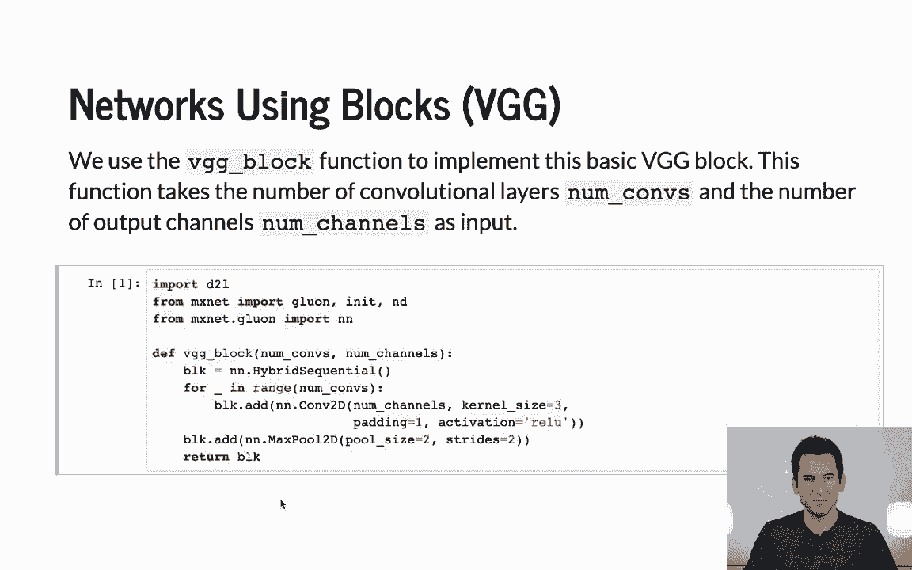

以下是VGG块的核心实现思路：

```python
def vgg_block(num_convs, out_channels):
    # 创建一个顺序容器
    layers = []
    for _ in range(num_convs):
        # 添加卷积层
        layers.append(nn.Conv2d(...))
        # 添加激活函数，如ReLU
        layers.append(nn.ReLU())
    # 在块的最后添加一个最大池化层
    layers.append(nn.MaxPool2d(kernel_size=2, stride=2))
    # 返回一个顺序块
    return nn.Sequential(*layers)
```

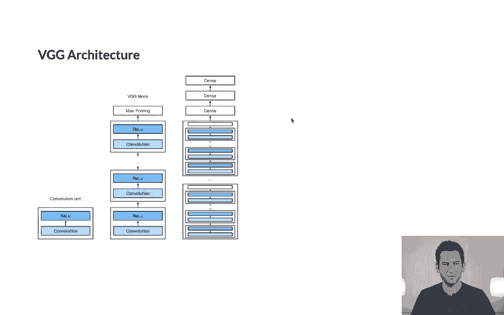

为了让代码运行得更快，我们使用了混合顺序模式（例如PyTorch的`torch.jit.script`），这可以激活即时编译，优化执行速度。最终，这个函数返回一个完整的网络块。


---

## 回顾VGG架构

在定义了基础块之后，我们来回顾完整的VGG架构。一个典型的VGG网络由多个卷积块和最后的几个全连接层组成。

以下是VGG网络的经典结构：
1.  两个卷积层，64通道。
2.  两个卷积层，128通道。
3.  三个卷积层，256通道。
4.  三个卷积层，512通道。
5.  三个全连接层。


---

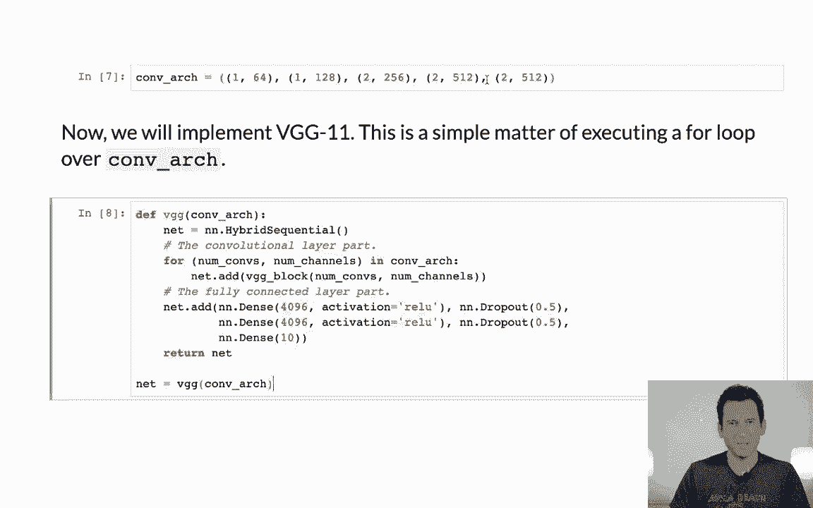

## 用块组装VGG网络

有了VGG块的定义，组装整个网络就变得非常简单明了，就像使用一个for循环一样。

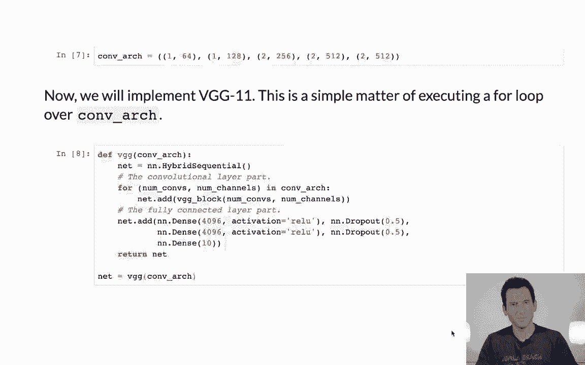

以下是组装网络的核心代码逻辑：

```python
def make_vgg(conv_arch):
    conv_blks = []
    # 遍历架构定义，添加每个VGG块
    for (num_convs, out_channels) in conv_arch:
        conv_blks.append(vgg_block(num_convs, out_channels))
    # 添加全连接层
    net = nn.Sequential(
        *conv_blks,
        nn.Flatten(),
        nn.Linear(...), # 第一个全连接层
        nn.ReLU(),
        nn.Dropout(0.5),
        nn.Linear(...), # 第二个全连接层
        nn.ReLU(),
        nn.Dropout(0.5),
        nn.Linear(...)  # 输出层
    )
    return net
```

我们使用的具体架构`conv_arch`定义了每个块中的卷积层数量和通道数。这种设计使得修改网络深度（例如添加或删除一个块）变得非常容易。

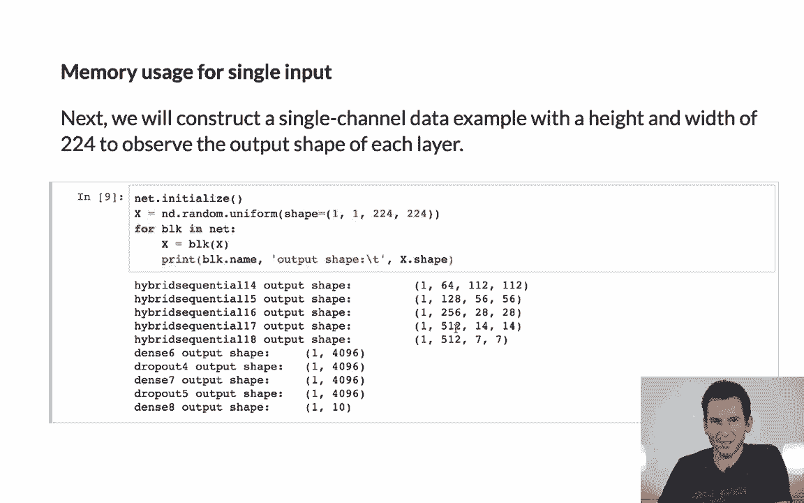


---

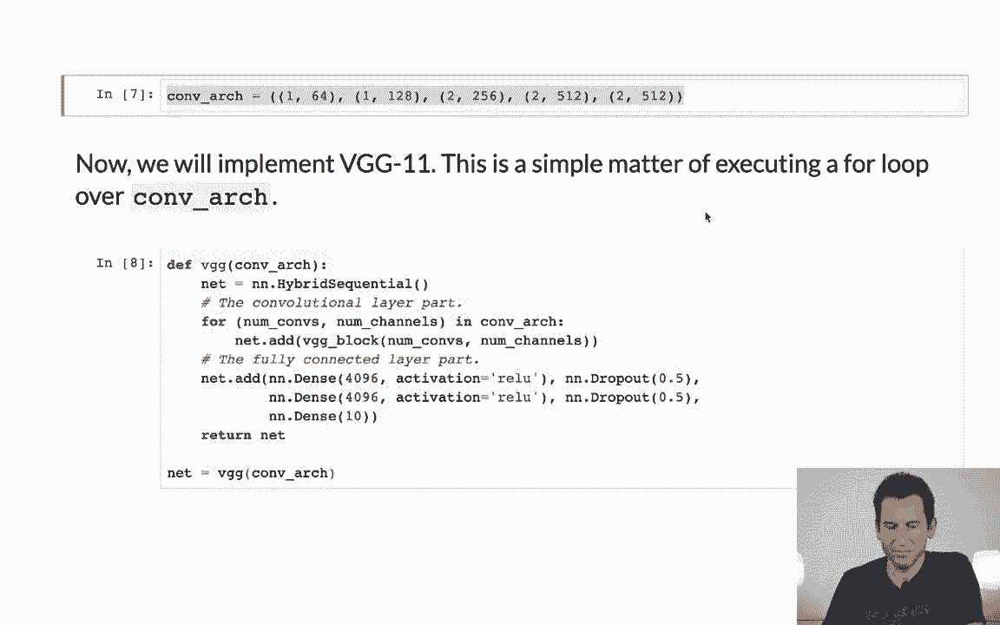

## 网络参数与内存使用

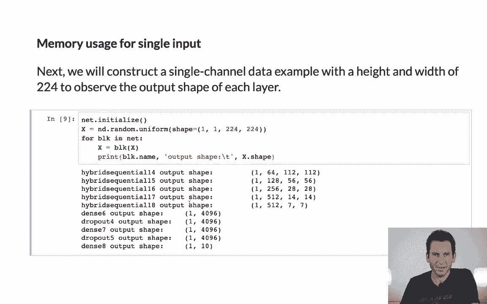

让我们查看一下网络的具体参数。根据`conv_arch`的定义，我们可以看到各层的通道数依次为64、128、256、512，这与VGG的经典设计一致。

网络的第一行输出就清晰地展示了`conv_arch`所定义的架构。

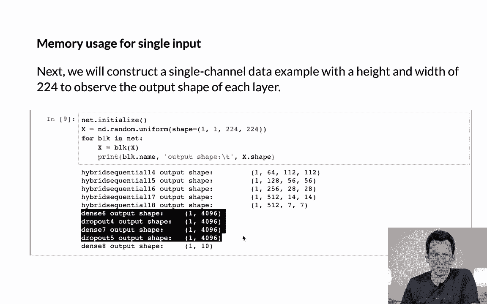


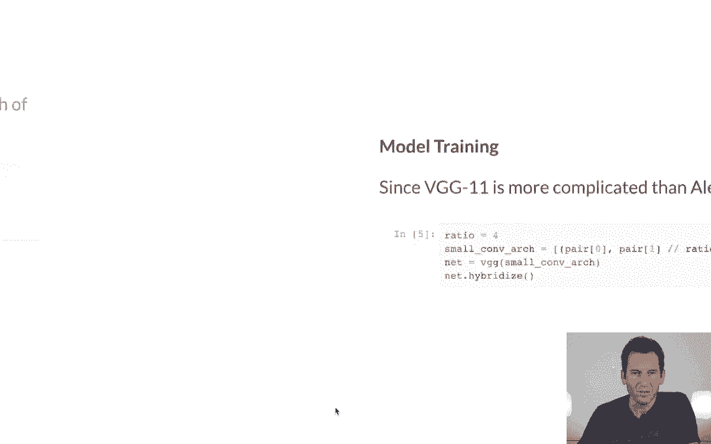

最终，网络末端是参数量庞大的全连接层。


---

## 训练简化版VGG网络

为了能在合理的时间内完成训练，我们通常会对原始VGG网络进行简化。一个常见的方法是将所有通道数按比例缩小（例如除以4）。

以下是训练准备步骤：
1.  使用简化后的架构生成网络。
2.  对网络进行混合（编译），这样在第一次执行后，框架可以直接使用优化后的代码进行计算，无需再经过Python解释器，从而提升效率。

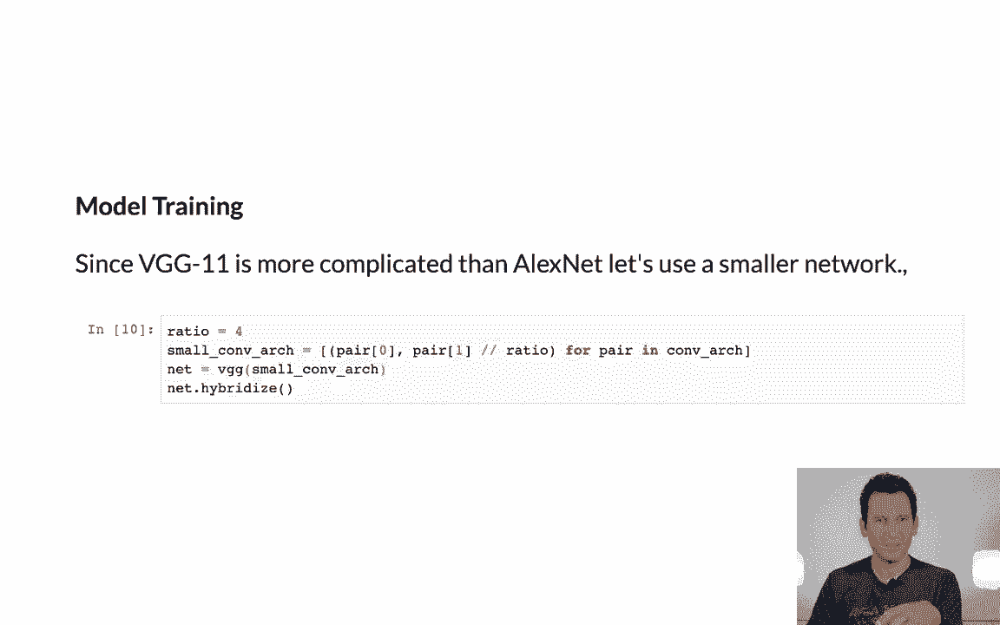

```python
# 简化架构：将通道数除以4
small_conv_arch = [(pair[0], pair[1] // 4) for pair in conv_arch]
# 生成网络
net = make_vgg(small_conv_arch)
# 进行混合/编译（以PyTorch JIT为例）
net = torch.jit.script(net)
```


---

## 执行训练

训练过程与之前学习过的标准流程完全相同。

以下是训练循环的关键参数和步骤：
*   **优化器**：使用SGD或Adam。
*   **学习率**：设置一个较小的值。
*   **批量大小**：例如128。
*   **迭代周期**：根据需求设置，例如5个周期。

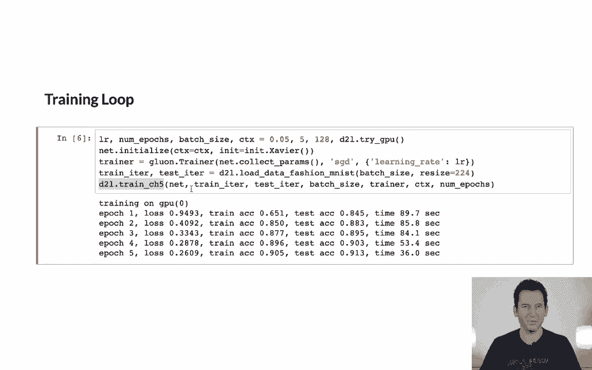

代码会遍历训练数据，计算损失，并反向传播更新权重。在Fashion-MNIST数据集上，经过几个周期的训练后，误差率大约可以降至8.5%到9%。


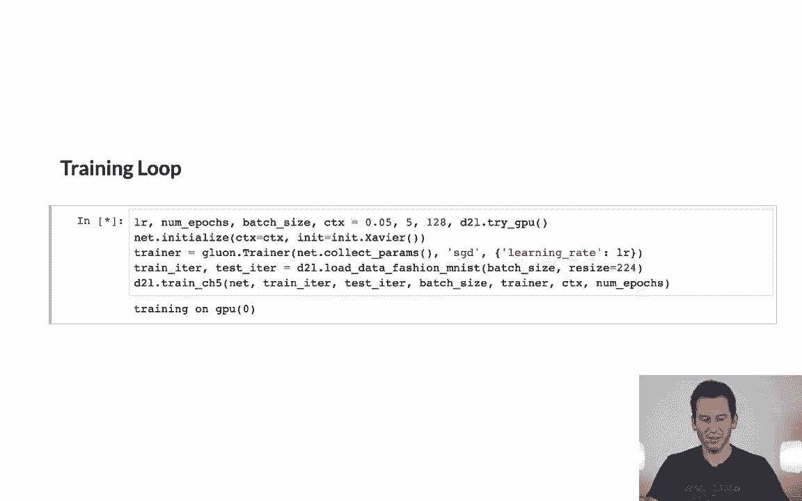

---

## 总结


本节课中我们一起学习了VGG网络的核心思想与实现。

我们首先介绍了VGG采用**块**进行网络设计的概念，这比设计单个层更高效。接着，我们定义了VGG块的结构，并用它像搭积木一样组装出完整的VGG网络。为了实际训练，我们学会了如何简化网络架构以加快训练速度，并回顾了标准的训练流程。通过本课，你掌握了使用模块化思想构建和训练经典卷积神经网络的基本方法。