# 66：网络中的网络 (NiN) 🧠

在本节课中，我们将学习一种名为“网络中的网络”（NiN）的神经网络设计策略。这种策略旨在解决传统卷积神经网络（CNN）中全连接层参数过多、计算量庞大的问题。我们将了解其核心思想、具体实现方式以及它在深度学习发展中的重要意义。

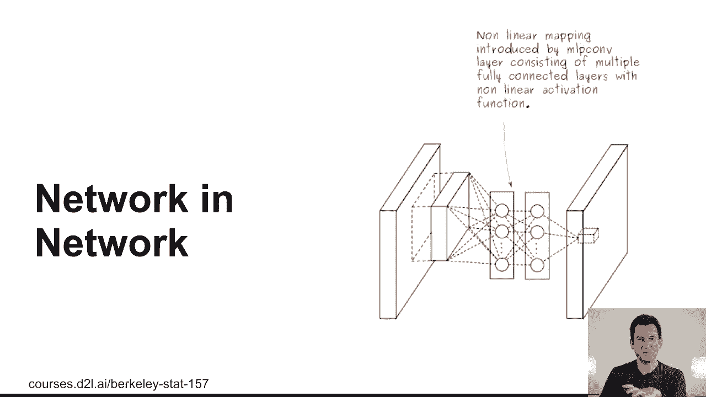

---

## 传统CNN的瓶颈：庞大的全连接层

上一节我们回顾了LeNet、AlexNet和VGG等经典CNN架构。本节中我们来看看这些网络面临的一个共同挑战。

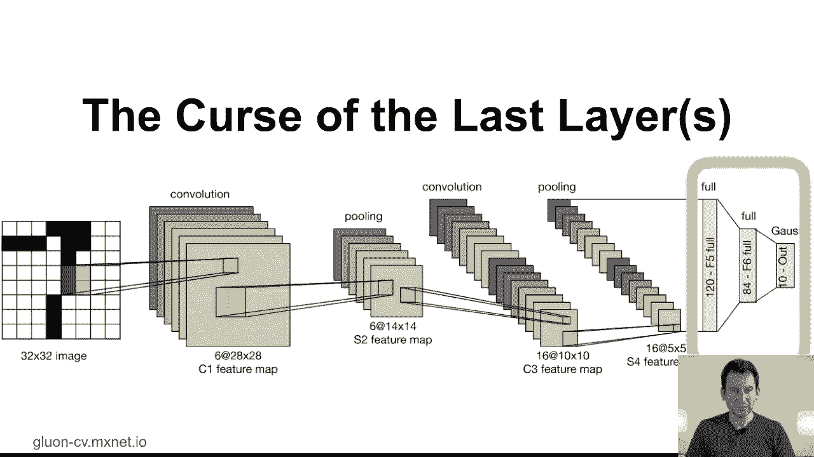

在LeNet等早期网络中，最后的全连接层参数规模相对较小。然而，在AlexNet或VGG等更深的网络中，问题变得突出。

以下是VGG网络中一个全连接层的参数规模示例：
```python
# 从最后一个卷积层（512通道，7x7分辨率）到第一个全连接层（4096维）
参数数量 = 512 * 7 * 7 * 4096 ≈ 102,760,448
```
这个数量级的参数占据了模型总参数的绝大部分，使得模型变得臃肿，难以训练和部署。卷积层本身通过共享权重（卷积核）已经相当高效，但最后的全连接层成为了主要瓶颈。

问题的根源在于，网络最终需要将二维的、多通道的特征图转换成一个与类别数量匹配的一维向量。挑战在于如何高效、优雅地完成这个转换。

---

## NiN的解决方案：用“网络块”替代全连接层

为了解决上述问题，NiN提出了一种创新的思路：用一系列特殊的“网络块”来逐步压缩特征，最终避免使用庞大的全连接层。

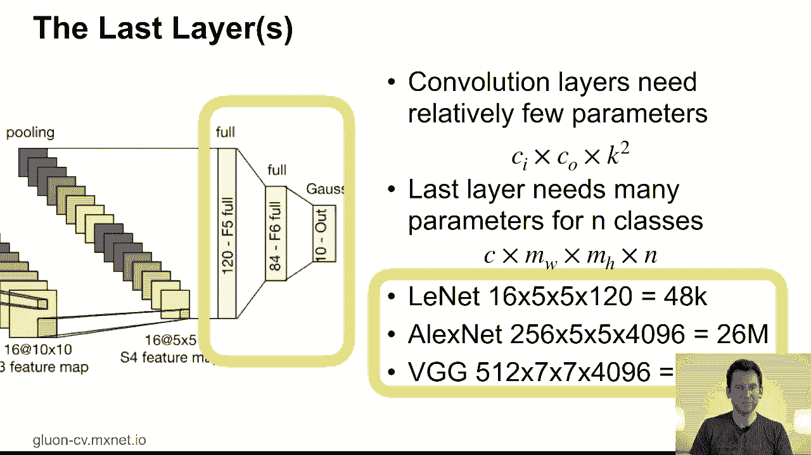

### 核心组件：1x1卷积（逐点卷积）

NiN策略的核心是**1x1卷积**，也称为逐点卷积。它的作用相当于在每个像素位置上应用一个小型的多层感知机（MLP）。

其操作可以表示为以下公式：
`输出[x, y, :] = MLP(输入[x, y, :])`
其中，`输入[x, y, :]` 是位置 `(x, y)` 上所有通道的值构成的向量。

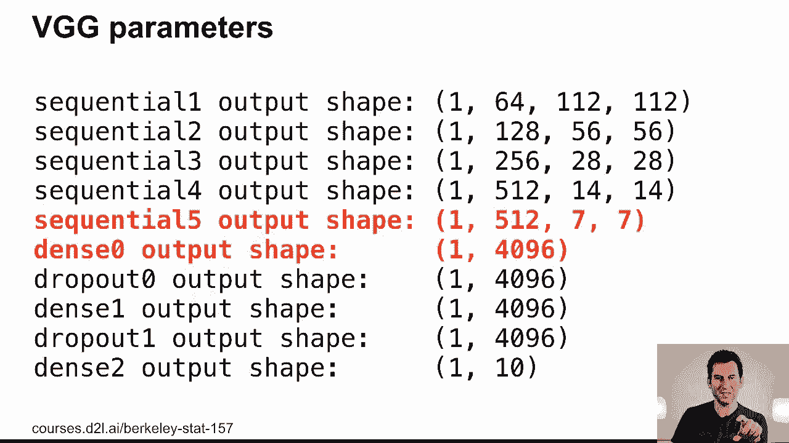

1x1卷积可以在不改变空间分辨率（宽和高）的情况下，灵活地混合和压缩不同通道的信息。这为实现通道间的复杂交互提供了一种轻量级的方法。

### 构建NiN块

一个标准的NiN块由以下层顺序堆叠而成：
1.  一个常规卷积层（例如使用3x3或5x5的卷积核）。
2.  两个连续的1x1卷积层，充当微型多层感知机。

通过堆叠多个这样的NiN块，并在块之间使用最大池化层来降低空间分辨率，网络可以逐步提取和压缩特征。

---

## NiN网络架构与工作流程

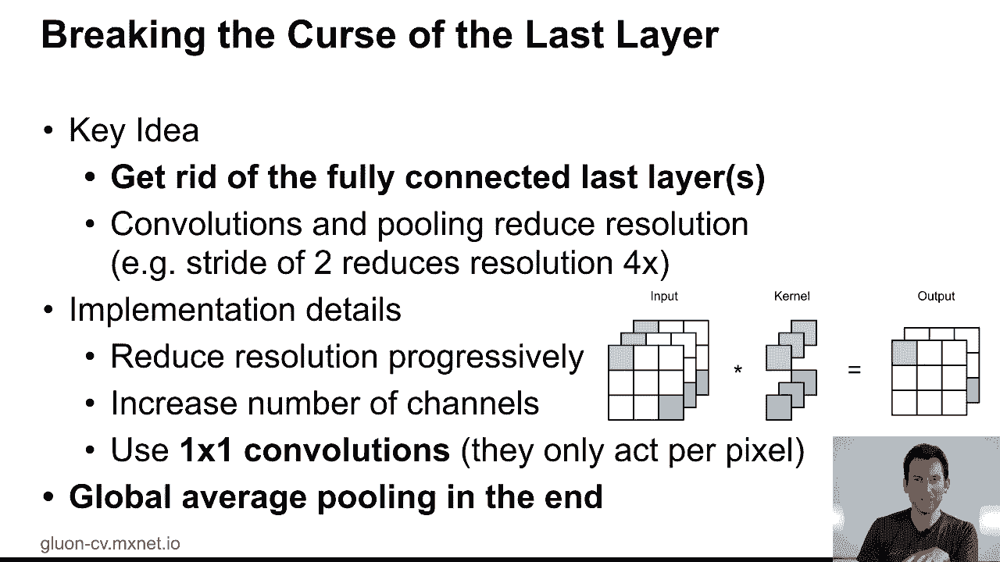

现在，让我们看看如何将这些NiN块组合成一个完整的网络。

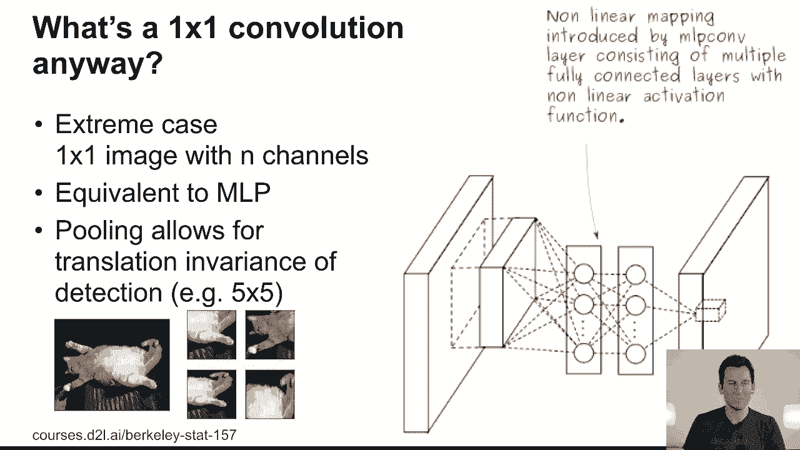

NiN网络的典型架构是重复堆叠“NiN块 + 最大池化”的组合。例如，一个网络可能包含三个这样的阶段，每个阶段逐步增加通道数并降低空间分辨率。

以下是NiN处理图像的一个简化流程描述：
1.  输入图像经过第一个NiN块和池化层。
2.  特征图经过第二个NiN块和池化层，通道数增加，尺寸减小。
3.  特征图经过第三个NiN块和池化层，得到最终的高维特征图（例如尺寸为5x5）。
4.  在最后一个NiN块后，网络不再使用全连接层，而是直接使用**全局平均池化**。

### 最终输出：全局平均池化

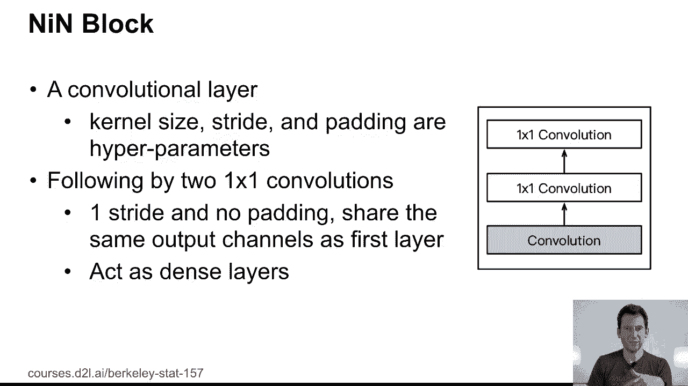

全局平均池化是NiN的另一个关键创新。它对最后一个特征图的每个通道计算其所有空间位置（整个宽和高）的平均值。

对于一个形状为 `(C, H, W)` 的特征图，全局平均池化的输出是一个长度为 `C` 的向量：
`输出[c] = 平均值(特征图[c, :, :]) for c in 1...C`

如果我们将最后一个NiN块的输出通道数 `C` 直接设置为目标类别数（例如10），那么经过全局平均池化后，我们就能直接得到一个10维的向量，无需任何全连接层。这个向量可以直接送入Softmax函数进行分类。

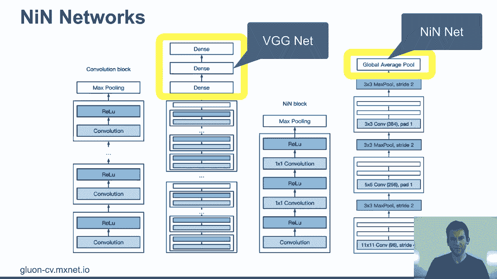

---

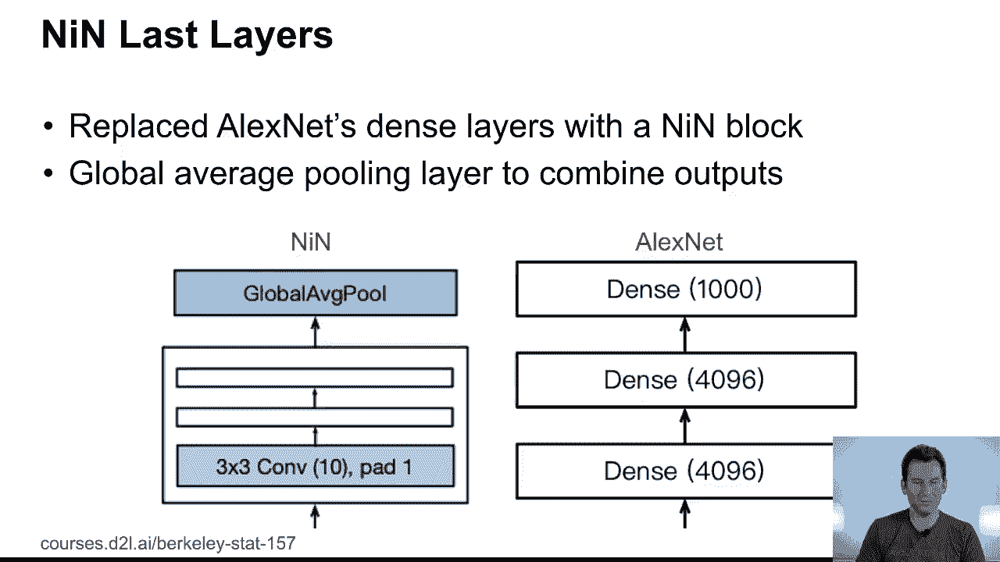

## NiN的意义与影响

尽管NiN模型在当时的图像分类竞赛中表现不如VGG等网络突出，这导致其最初被部分研究者忽视，但它的设计思想极具前瞻性，为后续更强大的网络架构铺平了道路。

NiN的主要贡献在于：
*   **参数效率**：通过用1x1卷积和全局平均池化替代全连接层，大幅减少了模型参数。
*   **概念创新**：引入了“在网络中嵌入微型网络（MLP）”的思想，以及全局平均池化这一简洁的最终层设计。

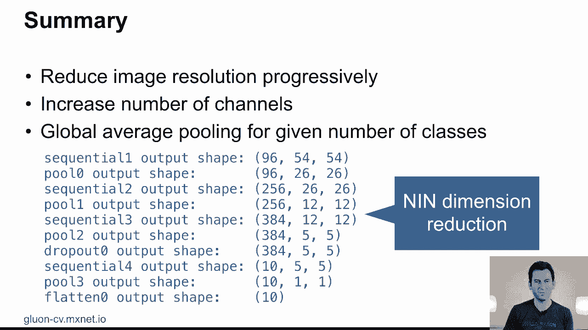

这些思想直接影响了GoogleNet（Inception）系列网络，其中1x1卷积被广泛用于降维和增加非线性。ResNet等更现代的架构也从中受益。可以说，NiN是连接经典CNN与当代高效网络设计的重要桥梁。

---

## 总结

本节课中我们一起学习了“网络中的网络”（NiN）。我们首先分析了传统卷积神经网络中全连接层参数庞大的问题。接着，我们深入探讨了NiN的解决方案：利用**1x1卷积**构成的NiN块作为基本构建单元，并在网络末端使用**全局平均池化**来替代全连接层。这种设计显著提升了模型的参数效率。最后，我们认识到NiN虽然在其诞生时未达性能巅峰，但其核心思想对后续的Inception、ResNet等里程碑式网络产生了深远影响。

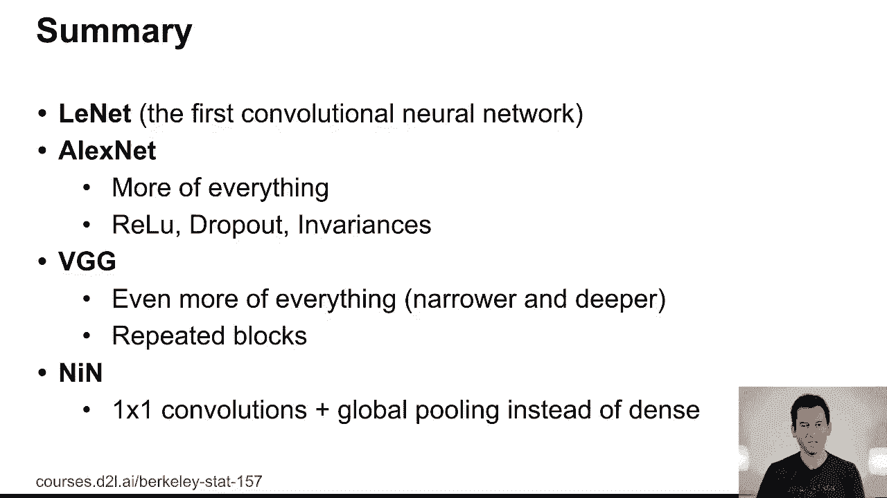

下节课，我们将看到如何将这些思想进一步结合与发展，引出强大的Inception网络架构。