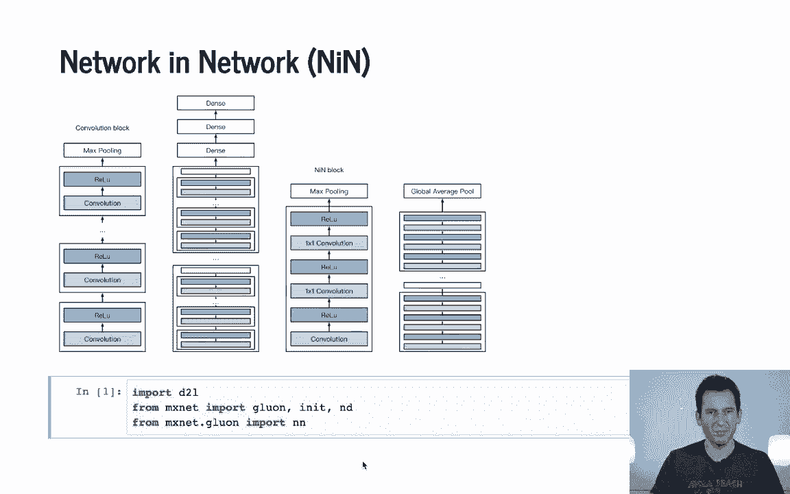
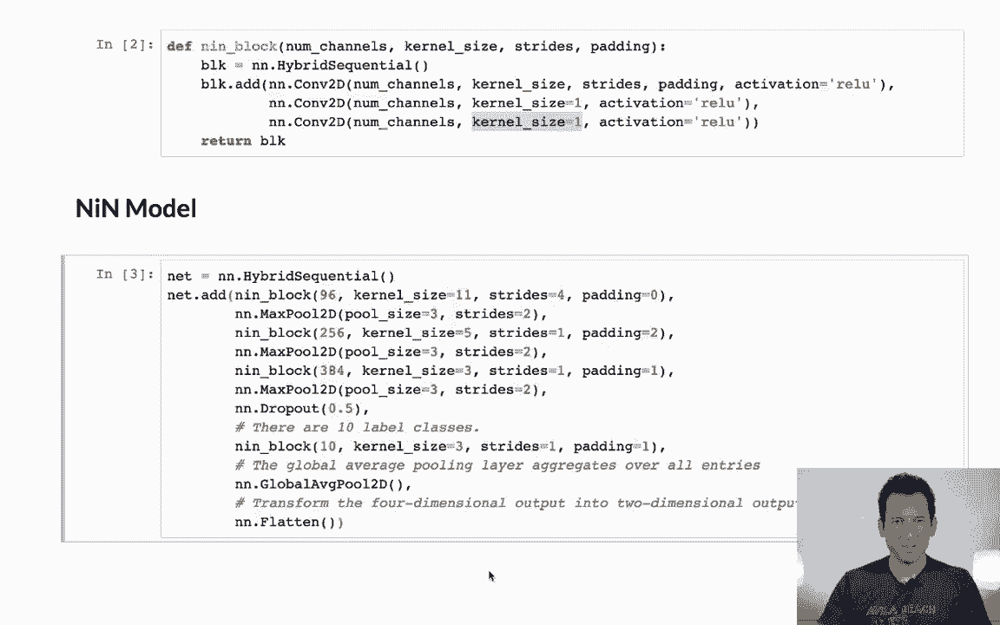
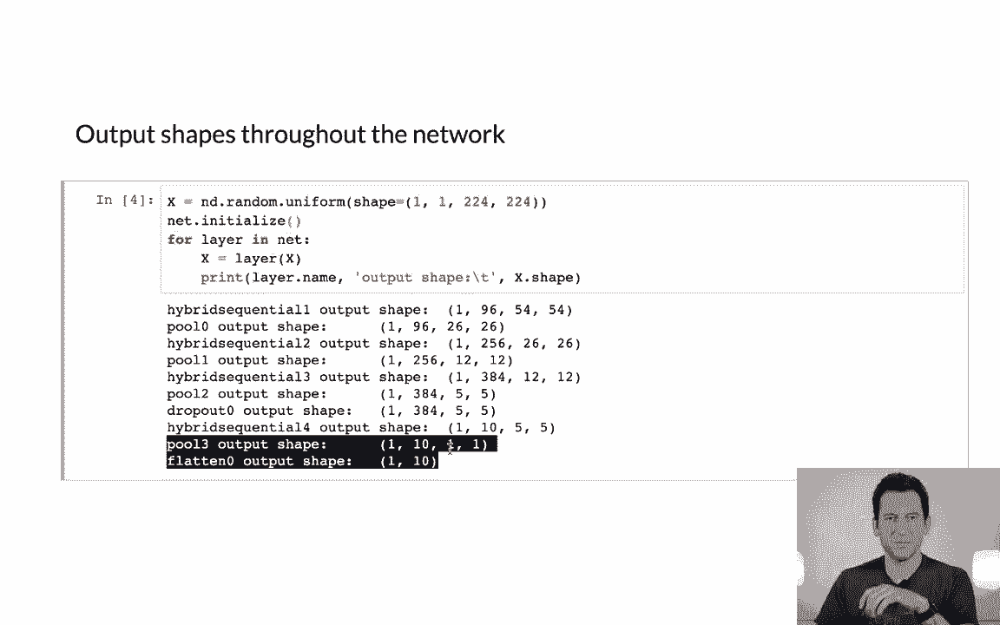
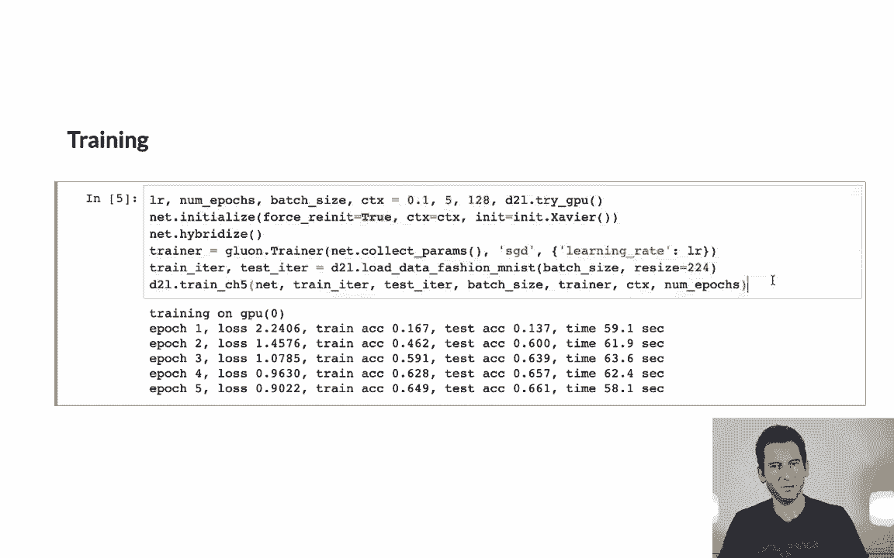

# 67：网络中的网络（NiN）在Python中的实现 🧠

在本节课中，我们将学习网络中的网络（NiN）架构，并了解如何在Python中实现它。NiN的核心思想是使用1×1卷积层来替代传统的全连接层，从而减少模型参数并提升效率。

---

## 回顾：NiN与VGG的区别

上一节我们介绍了经典的卷积网络结构。为了回顾，左边是VGG网络，它主要由带有ReLU激活函数的卷积块构成。而右边的NiN块则不同，它基本上是一个卷积层，后接两个1×1的卷积层，然后是最大池化层，最后是全局平均池化层。



---

## 开始实现NiN

让我们从导入必要的库开始。这里我们使用MXNet和`gluon`。

```python
import mxnet as mx
from mxnet import gluon, nd
from mxnet.gluon import nn
```

接下来，我们需要定义一个NiN块。这个块的结构相当简单。

以下是NiN块的定义，其参数包括通道数、卷积核大小、步幅和填充：

```python
class NiNBlock(nn.Block):
    def __init__(self, channels, kernel_size, strides, padding, **kwargs):
        super(NiNBlock, self).__init__(**kwargs)
        self.net = nn.Sequential()
        self.net.add(
            nn.Conv2D(channels, kernel_size, strides, padding, activation='relu'),
            nn.Conv2D(channels, kernel_size=1, activation='relu'),
            nn.Conv2D(channels, kernel_size=1, activation='relu')
        )

    def forward(self, x):
        return self.net(x)
```

在NiN块中，我们首先进行一个常规卷积，然后是两个1×1的卷积。1×1卷积不需要定义填充，因为其尺寸不会发生变化。

---

## 构建完整的NiN模型

现在，我们来构建完整的NiN模型。这个模型并不复杂。

以下是模型的结构，它使用了三个NiN块，每个块后接最大池化层，最后应用Dropout和全局平均池化：

```python
class NiN(nn.Block):
    def __init__(self, num_classes, **kwargs):
        super(NiN, self).__init__(**kwargs)
        self.net = nn.Sequential()
        # 第一个NiN块序列
        self.net.add(
            NiNBlock(96, kernel_size=11, strides=4, padding=0),
            nn.MaxPool2D(pool_size=3, strides=2)
        )
        # 第二个NiN块序列
        self.net.add(
            NiNBlock(256, kernel_size=5, strides=1, padding=2),
            nn.MaxPool2D(pool_size=3, strides=2)
        )
        # 第三个NiN块序列
        self.net.add(
            NiNBlock(384, kernel_size=3, strides=1, padding=1),
            nn.MaxPool2D(pool_size=3, strides=2),
            nn.Dropout(0.5)
        )
        # 最后一个NiN块，后接全局平均池化
        self.net.add(
            NiNBlock(num_classes, kernel_size=3, strides=1, padding=1),
            nn.GlobalAvgPool2D(),
            nn.Flatten()
        )

    def forward(self, x):
        return self.net(x)
```



模型的关键区别在于，这里我们不再需要任何密集层（全连接层）。因为在NiN块中，1×1的卷积层起到了类似多层感知机的作用，并且是应用在每个通道上的。

---

## 网络结构与数据流

让我们看看这个网络在实际应用中的数据流是什么样的。

假设我们将一个224×224的图像输入网络：
1.  经过第一个NiN块和池化后，特征图尺寸变为54×54。
2.  经过第二个块和池化后，尺寸变为26×26。
3.  经过第三个块和池化后，尺寸变为12×12。
4.  在应用Dropout后，我们得到一个5×5的输出，其通道数等于最终需要的类别数量（例如10类）。
5.  最后，经过全局平均池化层，我们直接得到每个类别的预测分数。

这样，我们就完全避免了使用任何密集层。

---



## 训练与观察

在实际训练时，我们可以使用稍大的学习率，因为NiN架构相对简单，并且我们使用了大小为128的小批量数据。

以下是训练循环的简化示例：

```python
# 假设已定义好数据迭代器(train_data)和损失函数(loss)
net = NiN(num_classes=10)
net.initialize()
trainer = gluon.Trainer(net.collect_params(), 'sgd', {'learning_rate': 0.1})

for epoch in range(num_epochs):
    for X, y in train_data:
        with autograd.record():
            output = net(X)
            l = loss(output, y)
        l.backward()
        trainer.step(batch_size)
```

有一点值得注意：NiN网络在最初提出时表现并不突出，这也是它当时未受重视的原因之一。它当时被视为另一个“奇怪”的网络架构，并且人们普遍认为无法摆脱密集层。

然而，NiN中“用卷积替代全连接”的思想非常重要，它为后来的Inception和ResNet等先进架构铺平了道路。这些架构充分利用了去除密集层的优势，显著减少了参数量。

---

## 总结

本节课中，我们一起学习了网络中的网络（NiN）架构。我们了解了NiN与VGG的核心区别，即使用1×1卷积块替代全连接层。我们逐步实现了NiN块和完整的NiN模型，并分析了其数据流。虽然NiN本身在当时并非突破性模型，但其设计理念对后续深度学习架构的发展产生了深远影响。



下周，我们将讲解更为先进的、代表技术前沿的网络架构。

感谢您的关注。